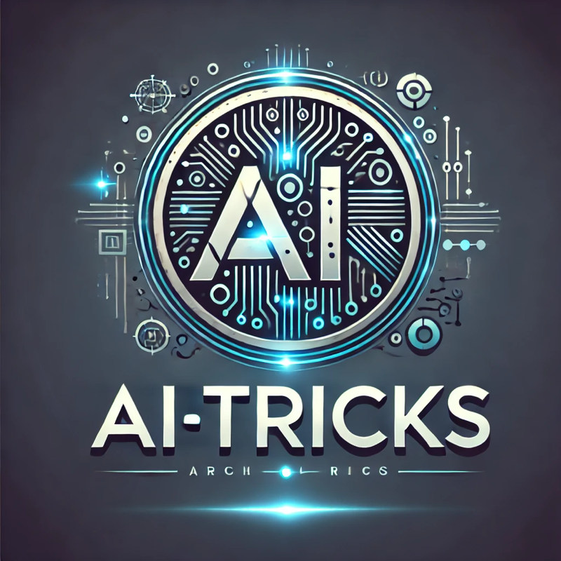

# AI TRICKS 

AI Tricks logos and motion design by @chatgpt.

Welcome to **AI Tricks**, your one-stop repository for practical techniques and strategies in **AI**, **Data Science**, **Machine Learning**, **Natural Language Processing (NLP)**, **Deep Learning**, **Statistics**, and much more.

This wiki aims to provide **bite-sized tricks**, **frameworks**, and **examples** for a deep understanding of complex topics in these domains. Whether you're a beginner or a seasoned professional, you'll find tools, tips, and workflows to optimize data-driven solutions.

---

## **For Latest Events**
For all latest Events and Talks check them [here](TALKS.md) 

## 🌟 **Getting Started**

1. **Follow the Flow**:
   Explore the typical steps to be followed when performing any AI or Machine Learning projects with our [Machine Learning Lifecycle](Machine%20Learning/Generic-Methodology.md) guide.

2. **Browse Sections**:
   Dive into dedicated sections for different AI topics and techniques where you can find detailed guides, tricks, and ready-to-use workflows.

3. **Hands-On Examples**:
   Each section is enriched with simple code snippets and examples to explain concepts clearly.

4. **AI Applications**:
   Learn tricks for applying AI in various industries, from healthcare to finance.

---

## 📖 **What You’ll Find on This Wiki**

This wiki is organized into several sections for easy navigation. Here is a general overview of the topics you'll find:

### 🧠 **Machine Learning (ML)**
- Learn the generic flow of the **Machine Learning Lifecycle**.
- Explore practical tricks for common ML tasks like **data preprocessing**, **feature engineering**, **model selection**, and **hyperparameter tuning**.
- Dive into different ML algorithms (e.g., Linear Regression, Random Forest, Gradient Boosting, etc.).
  - [Explore More](Machine%20Learning/Generic-Methodology.md)

---

### 🌐 **Natural Language Processing (NLP)**
- Uncover state-of-the-art NLP tricks like **text preprocessing**, **word embeddings**, and **transformers**.
- Key topics include **sentiment analysis**, **named entity recognition (NER)**, and **text summarization**.
- Reference real-world workflows for building AI-powered conversational apps.

---

### 🤖 **Deep Learning**
- Discover tricks to train deep neural networks efficiently, from **model initialization** to avoiding **overfitting**.
- Learn about cutting-edge architectures like **CNNs**, **RNNs**, **transformers**, and **GANs**.
- Find pre-trained models and hands-on tricks for **transfer learning**.
  - [Discover Deep Learning Tricks](Deep%20Learning/Introduction.md)

---

### 📊 **Statistics**
- Master **descriptive statistics**, **inferential statistics**, and **probability** with practical examples.
- Explore common distributions like **Binomial**, **Normal**, and **Poisson** distributions.
- Learn hypothesis testing, correlation analysis, and regression modeling tricks.
  - [Browse Statistics Section](Core%20Foundations/Statistics.md)

---

### 🕵️ **AI for Optimization**
- Dive into **metaheuristic algorithms** like **Genetic Algorithms**, **Particle Swarm Optimization**, **Simulated Annealing**, etc., to solve complex optimization problems.
- Learn how to combine search and optimization functions efficiently.
  - [Tricks for Optimization](Search%20And%20Optimization/General.md)

---

### 📚 **Data Science**
- From conducting **Exploratory Data Analysis (EDA)** to creating insightful visualizations, get your hands on powerful tools and techniques.
- Tricks for building data pipelines and leveraging distributed computing systems.
  - [Learn More about EDA](DataScience/EDA-Tips.md)

---

### ⚙️ **Additional Tools and Utilities**
- Tools, libraries, and tricks for popular programming languages like **Python**, **R**, **SQL**, along with tools like **TensorFlow**, **PyTorch**, and **Scikit-learn**.
- Learn how to optimize performance, handle edge cases, and debug issues intelligently.

---

## 🆕 **New Topics**

---

### 🎯 **Prompt Engineering**
- Master the art of designing prompts that get the best out of LLMs.
- Covers zero-shot, few-shot, Chain-of-Thought, ReAct, meta-prompting, and prompt injection defenses.
- Practical Python examples with Claude, OpenAI, and open-source models.
  - [Explore Prompt Engineering](Prompt-Engineering/README.md)

---

### 🔍 **RAG — Retrieval-Augmented Generation**
- Build knowledge-grounded AI systems that retrieve relevant documents before generating answers.
- Full pipeline: document ingestion, chunking, embedding, vector search, and generation.
- Advanced patterns: HyDE, multi-query, contextual compression, hybrid search.
  - [Build RAG Pipelines](RAG/README.md)

---

### 🔥 **Fine-Tuning LLMs**
- Customize large language models for specific tasks and domains.
- Covers LoRA, QLoRA, full fine-tuning, dataset preparation, and serving fine-tuned models.
- GPU-efficient training with bitsandbytes, PEFT, and TRL.
  - [Fine-Tune LLMs](Fine-Tuning/README.md)

---

### 🗄️ **Vector Databases & Embeddings**
- Store and search high-dimensional embeddings at scale for semantic search and RAG.
- Hands-on guides for Pinecone, ChromaDB, Weaviate, and pgvector.
- Includes CLIP for cross-modal (image+text) search and similarity metrics deep dive.
  - [Master Vector Databases](Vector-Databases/README.md)

---

### 🚀 **MLOps & Model Deployment**
- Take ML models from notebooks to production with experiment tracking, CI/CD, and monitoring.
- MLflow, Docker, FastAPI serving, BentoML, GitHub Actions pipelines.
- Drift detection, feature stores, and prediction monitoring.
  - [Deploy ML Models](MLOps/README.md)

---

### 🛡️ **AI Security & Red Teaming**
- Understand and defend against adversarial attacks, prompt injection, model extraction, and data poisoning.
- Practical implementations of FGSM, PGD attacks, differential privacy, and adversarial training.
- Red teaming frameworks for LLM applications.
  - [Secure AI Systems](AI-Security/README.md)

---

### 🎨 **Generative AI & Diffusion Models**
- From theory to practice: diffusion models, GANs, VAEs, and text-to-audio.
- Stable Diffusion, ControlNet, image-to-image, inpainting — all with code.
- FID evaluation, sampling strategies, and classifier-free guidance.
  - [Generate with AI](Generative-AI/README.md)

---

### 👁️ **Multimodal AI**
- Build systems that reason across text, images, audio, and video simultaneously.
- Vision-language models with Claude, CLIP for cross-modal search, document understanding.
- Video frame analysis, speech-to-text pipelines, and multimodal RAG.
  - [Build Multimodal Apps](Multimodal-AI/README.md)

---

### 🤖 **AI Agents & Tool Use**
- Design autonomous agents that plan, use tools, and complete multi-step tasks.
- ReAct loop, multi-agent orchestration, memory systems, and production hardening.
- Full implementation with Claude's tool use API, LangGraph, and rate limiting.
  - [Build AI Agents](AI-Agents/README.md)

---

### 🔒 **AI for Cybersecurity**
- Apply ML to detect threats, classify malware, analyze logs, and automate threat intelligence.
- UEBA, network intrusion detection, LLM-powered SIEM, and vulnerability triage.
- Bridges the gap between AI/ML and traditional security operations.
  - [AI-Powered Security](AI-for-Cybersecurity/README.md)

---

## 🛠 **Tips and Tricks for Success**

1. **Follow Frameworks**:
   - Stick to proven methodologies for AI and ML projects. You’ll save time and prevent common pitfalls.

2. **Focus on Preprocessing**:
   - Data is king in AI. Start with high-quality data, and leverage **cleaning tricks** and **augmentation techniques** to improve performance.

3. **Experiment and Tune**:
   - Experiment with multiple models and continually refine hyperparameters. Use tools like `GridSearchCV` and `Optuna`.

4. **Visualize Everything**:
   - Use libraries like `Matplotlib`, `Seaborn`, or `Plotly` to visualize relationships, performance metrics, and trends.

5. **Stay Modular**:
   - Build modular codebases for reusability across similar AI and ML workflows.

6. **Always Monitor Performance**:
   - Performance drops? Remember to **log metrics**, compare predictions, and check for **data drift**!

---

## 💼 **Applications of AI Tricks**

AI Tricks equips you with tools to dive head-first into areas such as:
- **Finance**: Fraud detection and risk assessment.
- **Healthcare**: Diagnosis, drug discovery, and medical imaging.
- **E-commerce**: Recommendation systems and marketing insights.
- **Gaming**: AI-driven bots and player analytics.
- **Customer Service**: Chatbots and intelligent ticketing systems.

---

## 🔗 **Quick Access Links**

Here are some quick links to dive into specific sections:
- [Machine Learning Lifecycle](Machine%20Learning/Generic-Methodology.md)
- [Deep Learning Techniques](Deep%20Learning/Introduction.md)
- [Understand Statistics](Core%20Foundations/Statistics.md)
- [NLP Tricks](Natural%20Language%20Processing/Text-Preprocessing.md)
- [Optimization Techniques](Search%20And%20Optimization/General.md)
- [Prompt Engineering](Prompt-Engineering/README.md)
- [RAG Pipelines](RAG/README.md)
- [Fine-Tuning LLMs](Fine-Tuning/README.md)
- [Vector Databases](Vector-Databases/README.md)
- [MLOps & Deployment](MLOps/README.md)
- [AI Security](AI-Security/README.md)
- [Generative AI](Generative-AI/README.md)
- [Multimodal AI](Multimodal-AI/README.md)
- [AI Agents](AI-Agents/README.md)
- [AI for Cybersecurity](AI-for-Cybersecurity/README.md)

---

## 🎓 **How to Contribute**

We’re always learning and growing! If you have a trick or resource to share, feel free to contribute or suggest updates.

1. Fork this repository.
2. Add or edit relevant content.
3. Submit a pull request for review.

Together, we can build the ultimate AI Tricks repository!

---

## 📋 **Coming Soon**

Stay tuned as we expand AI Tricks with:
- Real-world project templates.
- Advanced NLP workflows with transformers.
- LLMOps — monitoring and maintaining LLM-powered applications.
- Responsible AI — bias detection, fairness, and model cards.
- AI in Healthcare, Finance, and Legal — domain-specific deep dives.

---

## 📢 **Contact and Credits**

- **AI Tricks Logos and Motion Design** by @chatgpt.
- **Developed and Maintained By**: AI Enthusiasts Community.
- **Contact**: [Contact Us](mailto:ai.tricks@example.com)

Happy Learning! 🚀