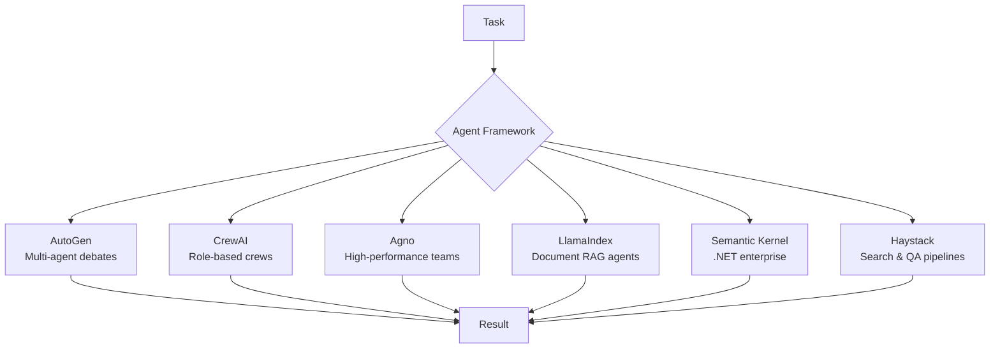
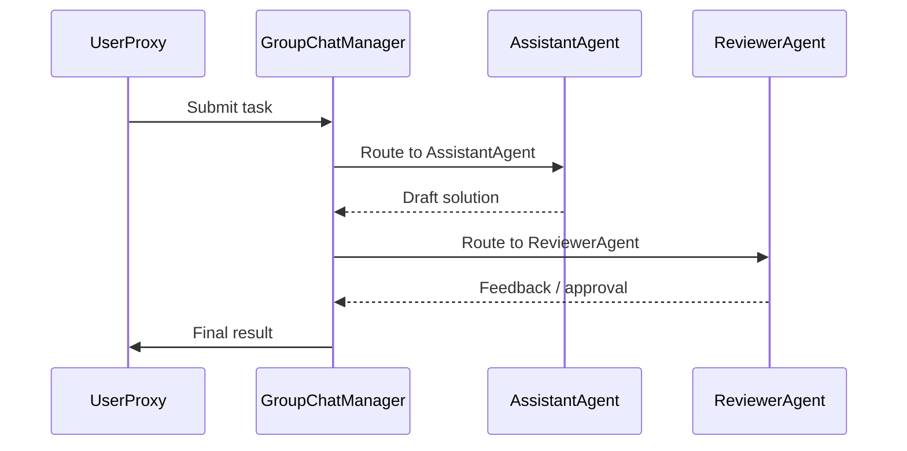
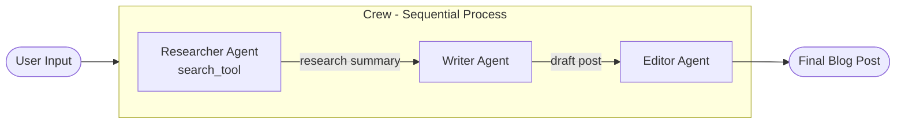
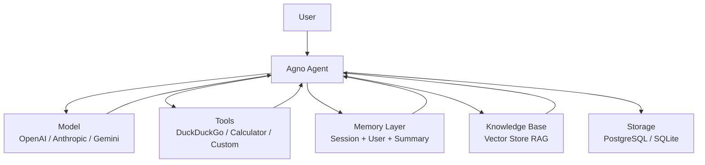
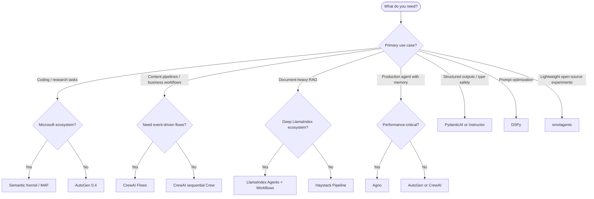

# Agent Frameworks


Agent frameworks give you a structured way to build, orchestrate, and deploy AI agents without reinventing every primitive from scratch. They handle the plumbing — tool calling loops, memory, multi-agent routing, human-in-the-loop checkpoints — so you can focus on the logic that makes your application unique.

## Why Use a Framework?

Building an agent from scratch means implementing: the ReAct loop, tool schema validation, conversation history management, retry logic, streaming, observability hooks, and multi-agent coordination. Frameworks package these as battle-tested, composable abstractions. The tradeoff is added dependency weight and opinionated structure, but for almost every production use case the productivity gain is worth it.



---

## AutoGen (Microsoft)

> **GitHub:** [microsoft/autogen](https://github.com/microsoft/autogen) — **~54k stars** | **Latest:** AutoGen 0.4 (stable)


AutoGen is Microsoft's flagship agent framework, designed for building multi-agent conversational systems where agents collaborate, debate, and delegate tasks. With AutoGen 0.4 (the current stable line), the API was substantially redesigned around an async-first `AgentChat` high-level interface built on a lower-level `Core` layer.

> **Note (2025):** Microsoft is merging AutoGen and Semantic Kernel into the **Microsoft Agent Framework (MAF)**, the next-generation enterprise successor. AutoGen 0.4 continues to receive bug fixes and security patches while MAF matures.

### Core Abstractions

| Class | Role |
|---|---|
| `ConversableAgent` | Base class — any agent that can send/receive messages |
| `AssistantAgent` | LLM-backed assistant that responds to user requests |
| `UserProxyAgent` | Represents a human or runs code on their behalf |
| `GroupChatManager` | Routes messages in a group chat among multiple agents |

### Two-Agent Conversation

```python
import asyncio
from autogen_agentchat.agents import AssistantAgent, UserProxyAgent
from autogen_agentchat.teams import RoundRobinGroupChat
from autogen_ext.models.openai import OpenAIChatCompletionClient

async def main():
    model_client = OpenAIChatCompletionClient(model="gpt-4o")

    assistant = AssistantAgent(
        name="assistant",
        model_client=model_client,
        system_message="You are a helpful coding assistant. Write clean, documented Python.",
    )
    user_proxy = UserProxyAgent(name="user_proxy")

    team = RoundRobinGroupChat([assistant, user_proxy], max_turns=4)
    result = await team.run(
        task="Write a Python function that checks if a number is prime."
    )
    print(result.messages[-1].content)

asyncio.run(main())
```

### Multi-Agent Group Chat Flow



### AutoGen Studio

AutoGen Studio is a no-code/low-code web UI for building and testing multi-agent workflows visually. Install with `pip install autogenstudio` and launch with `autogenstudio ui`. It lets non-engineers prototype agent teams and export them as Python code.

### Best For
- Autonomous coding tasks with iterative refinement
- Multi-agent debates and ensemble reasoning
- Research automation with human-in-the-loop checkpoints
- Teams migrating toward the Microsoft Agent Framework ecosystem

---

## CrewAI

> **GitHub:** [crewAIInc/crewAI](https://github.com/crewaiinc/crewai) — **~48k stars** | **Latest:** v1.x (GA since 2025)

CrewAI is a lean, fast, pure-Python framework (no LangChain dependency) for orchestrating role-playing, autonomous AI agents. Agents are given personas, goals, and backstories, then assigned structured `Task` objects. A `Crew` ties everything together with a configurable execution `Process`.

### Core Concepts

| Concept | Description |
|---|---|
| `Agent` | An autonomous unit with a role, goal, backstory, and tools |
| `Task` | A discrete unit of work assigned to an agent, with expected output |
| `Crew` | The team of agents + tasks, with an orchestrated process |
| `Process` | `sequential` (one after another) or `hierarchical` (manager delegates) |
| `Flow` | Event-driven orchestration layer introduced in 2024 for complex pipelines |

### 3-Agent Research Crew

```python
from crewai import Agent, Task, Crew, Process
from crewai_tools import SerperDevTool

search_tool = SerperDevTool()

researcher = Agent(
    role="Senior Research Analyst",
    goal="Find cutting-edge AI developments on {topic}",
    backstory="Expert at synthesizing complex technical information.",
    tools=[search_tool],
    verbose=True,
)
writer = Agent(
    role="Tech Content Writer",
    goal="Write a compelling blog post about {topic}",
    backstory="Turns dry research into engaging narratives.",
    verbose=True,
)
editor = Agent(
    role="Senior Editor",
    goal="Polish the blog post for clarity and accuracy",
    backstory="20 years editing technical publications.",
    verbose=True,
)

research_task = Task(
    description="Research the latest developments in {topic}. Summarize key findings.",
    expected_output="A 500-word research summary with citations.",
    agent=researcher,
)
write_task = Task(
    description="Write a blog post based on the research summary.",
    expected_output="A 800-word blog post with intro, body, and conclusion.",
    agent=writer,
)
edit_task = Task(
    description="Edit and fact-check the blog post. Return the final version.",
    expected_output="A polished, publication-ready blog post.",
    agent=editor,
)

crew = Crew(
    agents=[researcher, writer, editor],
    tasks=[research_task, write_task, edit_task],
    process=Process.sequential,
)
result = crew.kickoff(inputs={"topic": "agentic AI in 2025"})
print(result.raw)
```

### Crew Orchestration Flow



### CrewAI Flows (2024)

Flows provide event-driven orchestration above Crews, letting you wire multiple crews, conditional branches, and state management into enterprise pipelines. Flows are the recommended architecture for production deployments.

### Best For
- Content creation pipelines (research → write → edit)
- Sales and marketing automation
- Structured multi-role business workflows
- Teams wanting independence from LangChain

---

## Agno (formerly Phidata)

> **GitHub:** [agno-agi/agno](https://github.com/agno-agi/agno) — **~39k stars** | Rebranded from Phidata in January 2025

Agno is a high-performance Python framework for building production-ready agents and agent teams. Its headline claim is **5,000x faster agent instantiation** and **50x less memory** than LangGraph, achieved by a compiled runtime that creates agents in ~2 microseconds using 3.75 KiB of memory.

### Key Features

| Feature | Details |
|---|---|
| **Agent Teams** | Native multi-agent orchestration with role-based routing |
| **Memory** | Session memory, user memory, and summary memory built-in |
| **Knowledge (RAG)** | Vector store integration (pgvector, LanceDB, Weaviate) out of the box |
| **Storage** | PostgreSQL/SQLite session persistence, no extra config |
| **Multimodal** | Images, audio, video natively supported |
| **Structured Outputs** | Pydantic model responses enforced at the framework level |

### Agno Agent with Tools and Memory

```python
from agno.agent import Agent
from agno.models.openai import OpenAIChat
from agno.tools.duckduckgo import DuckDuckGoTools
from agno.memory.v2.db.sqlite import SqliteMemoryDb
from agno.memory.v2.memory import Memory
from agno.storage.sqlite import SqliteStorage

memory = Memory(db=SqliteMemoryDb(table_name="memory", db_file="agent.db"))
storage = SqliteStorage(table_name="sessions", db_file="agent.db")

agent = Agent(
    model=OpenAIChat(id="gpt-4o"),
    tools=[DuckDuckGoTools()],
    memory=memory,
    storage=storage,
    add_history_to_messages=True,
    num_history_runs=5,
    markdown=True,
)
agent.print_response("What are the top AI breakthroughs in 2025?", stream=True)
```

### Agno Agent Architecture



### Best For
- Production deployments requiring low latency and low memory overhead
- Agents that need persistent memory across sessions
- RAG-heavy applications without a separate retrieval stack
- Teams building on PostgreSQL infrastructure

---

## LlamaIndex Agents

> **GitHub:** [run-llama/llama_index](https://github.com/run-llama/llama_index) — **~48k stars**

LlamaIndex began as the leading data framework for RAG (Retrieval-Augmented Generation) and has grown into a full agent platform. Its agents are native to its data layer — query engines, vector stores, and document indexes all plug in as tools with zero friction.

### Agent Types

| Class | Description |
|---|---|
| `FunctionCallingAgent` | Uses native function-calling APIs (OpenAI, Anthropic) |
| `ReActAgent` | Implements the ReAct (Reason + Act) loop for any LLM |
| `AgentRunner` | High-level runner supporting both synchronous and async execution |

### LlamaIndex Workflows (2024)

**Workflows 1.0** is an event-driven, async-first, step-based execution system for complex multi-step agents. Each step is a Python function decorated with `@step`, and steps communicate via typed `Event` objects. LlamaIndex ships a **Workflow Debugger** with real-time event log visualization. Workflows can be deployed as microservices via **llama-deploy**.

### ReActAgent over Multiple Data Sources

```python
from llama_index.core import VectorStoreIndex, SimpleDirectoryReader
from llama_index.core.tools import QueryEngineTool
from llama_index.core.agent import ReActAgent
from llama_index.llms.openai import OpenAI

# Build two document indexes
docs_a = SimpleDirectoryReader("./data/product_docs").load_data()
docs_b = SimpleDirectoryReader("./data/support_tickets").load_data()
index_a = VectorStoreIndex.from_documents(docs_a)
index_b = VectorStoreIndex.from_documents(docs_b)

tools = [
    QueryEngineTool.from_defaults(index_a.as_query_engine(),
        name="product_docs", description="Official product documentation"),
    QueryEngineTool.from_defaults(index_b.as_query_engine(),
        name="support_tickets", description="Historical support cases"),
]

agent = ReActAgent.from_tools(tools, llm=OpenAI(model="gpt-4o"), verbose=True)
response = agent.chat("What causes Error 502 in the authentication flow?")
print(response)
```

### Best For
- Document-heavy RAG agents over large knowledge bases
- Agents that need to query multiple heterogeneous data sources
- Teams already invested in the LlamaIndex data ecosystem
- Event-driven agentic workflows with `llama-deploy`

---

## Semantic Kernel (Microsoft)

> **GitHub:** [microsoft/semantic-kernel](https://github.com/microsoft/semantic-kernel) — **~27k stars**

Semantic Kernel (SK) is Microsoft's enterprise-grade AI SDK, supporting **C#, Python, and Java**. It is the foundational layer of the **Microsoft Agent Framework** that merges AutoGen and SK into a unified production platform. SK's design philosophy emphasizes strong typing, enterprise integration patterns, and compatibility with .NET ecosystems.

### Core Concepts

- **Plugins** — named collections of functions (native code or semantic/prompt-based) exposed to the LLM as tools
- **Planners** — automatically generate step-by-step execution plans to fulfill a goal using available plugins
- **Memory / Vector Stores** — connectors to Azure AI Search, Chroma, Qdrant, and more for semantic recall

### Python Plugin Registration

```python
import asyncio
from semantic_kernel import Kernel
from semantic_kernel.connectors.ai.open_ai import OpenAIChatCompletion
from semantic_kernel.functions import kernel_function

kernel = Kernel()
kernel.add_service(OpenAIChatCompletion(ai_model_id="gpt-4o"))

class MathPlugin:
    @kernel_function(name="square", description="Returns the square of a number")
    def square(self, number: float) -> float:
        return number ** 2

kernel.add_plugin(MathPlugin(), plugin_name="math")
result = asyncio.run(kernel.invoke("math", "square", number=7.0))
print(result)  # 49.0
```

### Best For
- .NET / C# enterprise applications integrating AI
- Organizations standardizing on the Microsoft Azure AI stack
- Teams requiring Java or multi-language agent deployments
- Enterprise planners with complex multi-step goal fulfillment

---

## Haystack (deepset)

> **GitHub:** [deepset-ai/haystack](https://github.com/deepset-ai/haystack) — **~24k stars**

Haystack is an open-source AI orchestration framework from [deepset](https://deepset.ai) for building **context-engineered, production-ready LLM applications**. Its core abstraction is the **Pipeline** — a directed graph of components (retrievers, readers, generators, rankers) where data flows through explicitly defined edges.

### Architecture

Haystack 2.x pipelines are:

- **Modular** — each component has typed inputs/outputs validated at connection time
- **Composable** — mix-and-match retrievers, rerankers, LLMs, agents
- **Observable** — Haystack integrates with Langfuse, OpenTelemetry, and deepset Studio
- **Agent-capable** — the `Agent` component enables tool use within pipelines using any supported LLM

### Haystack Agent with Tools

```python
from haystack import Pipeline
from haystack.components.agents import Agent
from haystack.components.generators.chat import OpenAIChatGenerator
from haystack.components.tools import Tool

def search_wikipedia(query: str) -> str:
    """Search Wikipedia for factual information."""
    # simplified — real impl uses wikipedia-api
    return f"Wikipedia result for: {query}"

tool = Tool(name="wikipedia", description="Search Wikipedia", function=search_wikipedia)
agent = Agent(
    chat_generator=OpenAIChatGenerator(model="gpt-4o"),
    tools=[tool],
    max_agent_steps=5,
)
pipeline = Pipeline()
pipeline.add_component("agent", agent)
pipeline.run({"agent": {"messages": [{"role": "user", "content": "When was Python created?"}]}})
```

### Best For
- Enterprise search and question-answering systems
- RAG pipelines requiring fine-grained retrieval control
- Teams using deepset Studio for no-code pipeline management
- Semantic search with reranking, hybrid retrieval, and custom components

---

## Other Frameworks

| Framework | Stars | Key Idea | Best For |
|---|---|---|---|
| **smolagents** (HuggingFace) | ~26k | Minimalist code-first agents in ~1,000 lines; agents write and execute Python | Open-source model agents, research experiments |
| **DSPy** (Stanford) | ~23k | Replaces prompts with optimizable modules; compiles prompts/weights for your dataset | Systematic prompt optimization, NLP pipelines |
| **PydanticAI** | ~11k | Type-safe agents using Pydantic models; built by the Pydantic team | Type-safe agent outputs, Python-native teams |
| **ControlFlow** | ~3k | Declarative task graph orchestration with human-in-the-loop | Workflow automation with approval gates |
| **Instructor** | ~10k | Structured output extraction from LLMs using Pydantic schemas | Reliable structured data extraction |

---

## Framework Comparison Matrix

| Framework | Stars | Language | Multi-Agent | Memory | RAG Built-in | Human-in-Loop | Best For | License |
|---|---|---|---|---|---|---|---|---|
| **AutoGen** | ~54k | Python | Native (GroupChat) | Basic | No | Yes (UserProxy) | Coding agents, debates | MIT |
| **CrewAI** | ~48k | Python | Native (Crew) | Basic | Via tools | Via callbacks | Content pipelines, business automation | MIT |
| **Agno** | ~39k | Python | Native (Teams) | Full (session/user/summary) | Yes (pgvector) | Configurable | Production agents, low-latency | MPL-2.0 |
| **LlamaIndex** | ~48k | Python / TS | Workflows | Via integrations | Yes (native) | Via Workflows | Document RAG agents | MIT |
| **Semantic Kernel** | ~27k | C# / Python / Java | Via MAF | Via connectors | Via connectors | Planners | .NET enterprise | MIT |
| **Haystack** | ~24k | Python | Via Pipeline | Via components | Yes (pipeline) | Via pipeline | Search, QA systems | Apache 2.0 |
| **smolagents** | ~26k | Python | Basic | No | No | No | Lightweight research agents | Apache 2.0 |
| **DSPy** | ~23k | Python | Limited | No | No | No | Prompt optimization | MIT |
| **PydanticAI** | ~11k | Python | Limited | No | No | No | Type-safe outputs | MIT |

---

## Choosing a Framework



---

## References

- [AutoGen GitHub](https://github.com/microsoft/autogen) — Microsoft's agentic AI framework
- [AutoGen 0.4 Docs](https://microsoft.github.io/autogen/stable/) — Official stable documentation
- [Microsoft Agent Framework announcement](https://visualstudiomagazine.com/articles/2025/10/01/semantic-kernel-autogen--open-source-microsoft-agent-framework.aspx)
- [CrewAI GitHub](https://github.com/crewaiinc/crewai) — Role-based multi-agent framework
- [CrewAI OSS 1.0 GA](https://blog.crewai.com/crewai-oss-1-0-we-are-going-ga/) — General availability announcement
- [Agno GitHub](https://github.com/agno-agi/agno) — High-performance agent runtime
- [Agno official site](https://www.agno.com/) — Documentation and benchmarks
- [LlamaIndex GitHub](https://github.com/run-llama/llama_index) — Document agent and OCR platform
- [LlamaIndex Workflows 1.0](https://www.llamaindex.ai/blog/announcing-workflows-1-0-a-lightweight-framework-for-agentic-systems) — Event-driven agent framework
- [Semantic Kernel GitHub](https://github.com/microsoft/semantic-kernel) — Microsoft's enterprise AI SDK
- [Haystack GitHub](https://github.com/deepset-ai/haystack) — Open-source AI orchestration
- [smolagents GitHub](https://github.com/huggingface/smolagents) — HuggingFace minimalist agent library
- [DSPy](https://dspy.ai/) — Stanford's framework for programming LMs
- [PydanticAI](https://ai.pydantic.dev/) — Type-safe agent framework
