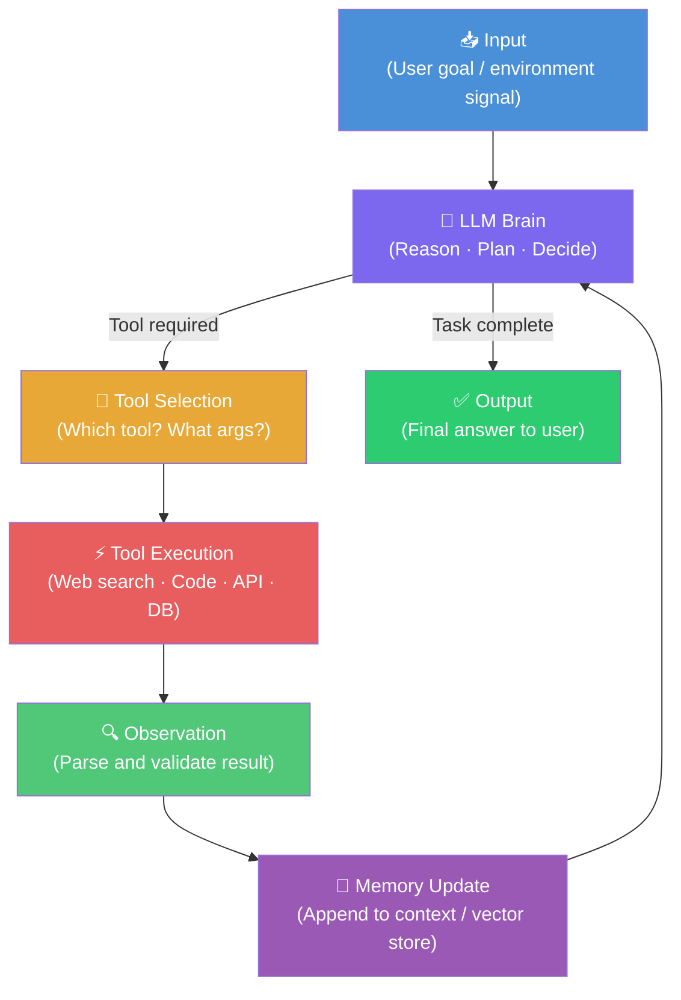
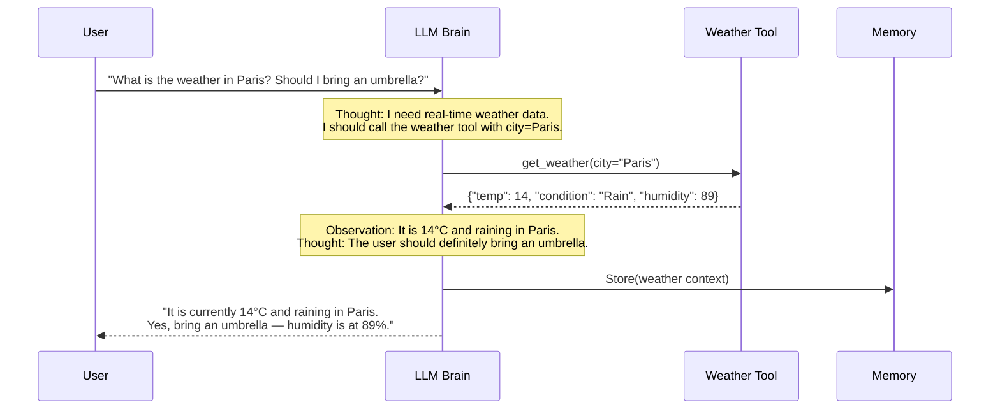
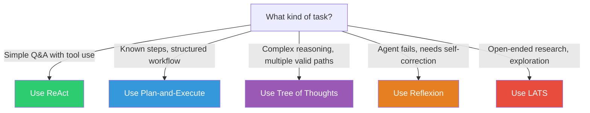
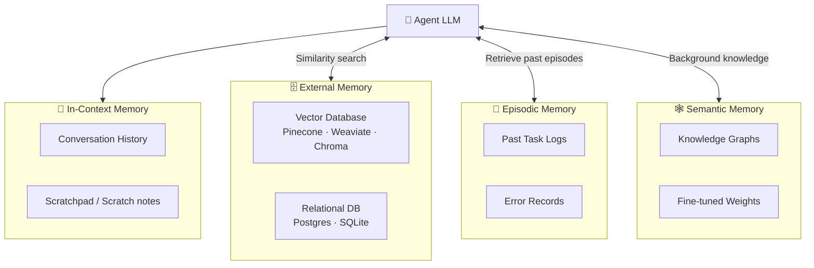
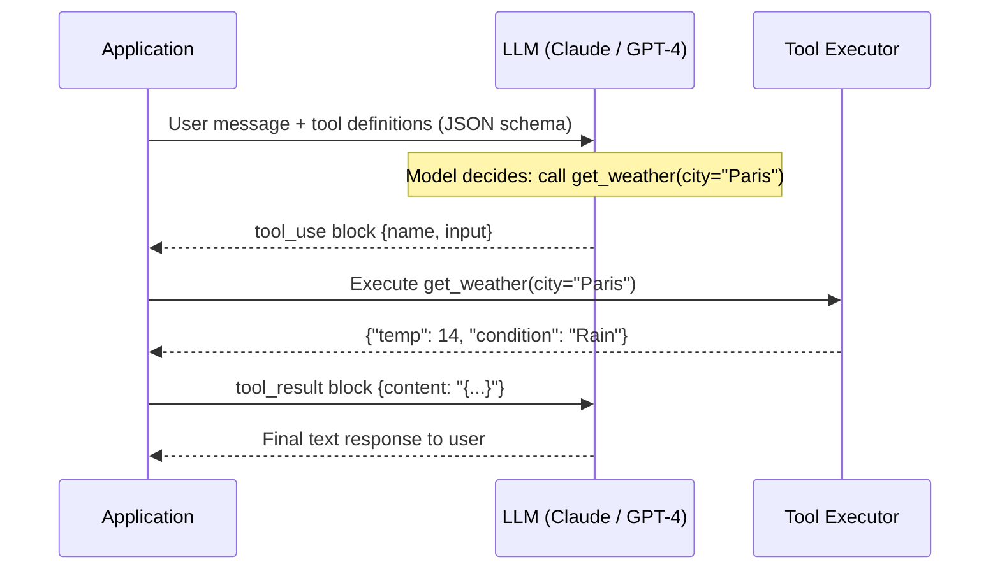

# Agent Fundamentals


> **The internals of an agent.** This page covers the theory and implementation details behind every production agent: the reasoning loop, planning strategies, memory systems, tool use, evaluation, and failure modes.

---

## Agent Architecture

At its core, every agent is a control loop: the LLM observes the world, reasons about it, takes an action, and updates its state based on what happened. This loop repeats until the task is complete or a stopping condition is reached.



**Each component explained:**

| Component | Responsibility | Implementation Examples |
|-----------|---------------|------------------------|
| **Input** | Receives and normalizes goal | User message, webhook payload, sensor data |
| **LLM Brain** | Reasons about next action | GPT-4o, Claude 3.5 Sonnet, Gemini 1.5 Pro |
| **Tool Selection** | Decides which tool and arguments | Function calling, JSON mode |
| **Tool Execution** | Runs the tool in a sandbox | Python subprocess, HTTP client, DB cursor |
| **Observation** | Parses and validates tool result | JSON parsing, error handling, truncation |
| **Memory Update** | Persists relevant context | Append to history, upsert to vector DB |
| **Output** | Returns final answer | Streamed text, structured JSON, action taken |

---

## ReAct Pattern

**ReAct** (Reasoning + Acting) is the most widely adopted pattern for building agents. Introduced by Yao et al. at ICLR 2023 (arXiv:2210.03629), it interleaves reasoning traces with tool-use actions, preventing hallucination through grounded feedback.

### Think → Act → Observe Cycle

**Example task:** *"What is the current weather in Paris, and should I bring an umbrella?"*



### ReAct Prompt Structure

The ReAct pattern is implemented by formatting the LLM's system prompt to produce structured `Thought / Action / Observation` blocks:

```python
REACT_SYSTEM_PROMPT = """You are a helpful assistant with access to tools.
At each step, you MUST follow this exact format:

Thought: <reason about what you know and what you need to find out>
Action: <tool_name>
Action Input: <json arguments for the tool>

After a tool result is returned, you will see:
Observation: <tool result>

Repeat Thought/Action/Observation until you can give a final answer.
When you have enough information, respond with:

Thought: I now know the final answer.
Final Answer: <your complete response to the user>

Available tools:
{tool_descriptions}
"""

# Example turn in context window
EXAMPLE_TRACE = """
Thought: The user wants the weather in Paris. I need to call get_weather.
Action: get_weather
Action Input: {"city": "Paris", "units": "celsius"}
Observation: {"temp": 14, "condition": "Rain", "humidity": 89}
Thought: It is raining in Paris. The user should bring an umbrella.
Final Answer: It is currently 14°C and raining in Paris (humidity 89%). 
              Definitely bring an umbrella.
"""
```

---

## Planning Strategies

Different tasks call for different planning approaches. The right strategy trades off between speed, token cost, and solution quality.

| Strategy | Core Idea | Best For | Weakness | Paper |
|----------|-----------|----------|----------|-------|
| **ReAct** | Interleave reasoning and acting in a single loop | General-purpose, tool-use tasks | Can get stuck in loops | Yao et al. 2022 (arXiv:2210.03629) |
| **Plan-and-Execute** | Generate full plan upfront, then execute each step | Predictable, structured tasks | Plan can go stale mid-execution | Wang et al. 2023 |
| **Tree of Thoughts (ToT)** | Branch multiple reasoning paths, evaluate, prune | Complex reasoning, puzzles | Very high token cost | Yao et al. 2023 (arXiv:2305.10601) |
| **Reflexion** | Agent self-critiques and retries with verbal feedback | Tasks with clear success signals | Requires multiple LLM calls | Shinn et al. 2023 (arXiv:2303.11366) |
| **LATS** | Monte Carlo Tree Search over reasoning + acting space | Research tasks, open-ended goals | Computationally expensive | Zhou et al. 2023 (arXiv:2310.04406) |

### Strategy Selection Guide



---

## Memory Systems

Memory determines what the agent knows about the current task, its history, and the world. Four distinct memory types serve different purposes:



| Memory Type | Scope | Persistence | Capacity | Use Case |
|-------------|-------|-------------|----------|----------|
| **In-Context** | Current session only | Lost on session end | Limited by context window | Short conversations, scratchpad |
| **External (Vector DB)** | Cross-session | Persistent | Unlimited (indexed) | Long-term knowledge, RAG |
| **Episodic** | Cross-session | Persistent | Grows over time | Learning from past tasks |
| **Semantic** | Global / baked in | Persistent (model weights) | Fixed at training | Domain knowledge, facts |

### Implementing Memory with LangChain

```python
from langchain.memory import ConversationBufferMemory
from langchain_openai import ChatOpenAI
from langchain.chains import ConversationChain

# Simple in-context memory — stores full conversation history
memory = ConversationBufferMemory(
    memory_key="history",       # key injected into prompt
    return_messages=True,       # return as message objects (not string)
    human_prefix="User",
    ai_prefix="Assistant"
)

llm = ChatOpenAI(model="gpt-4o", temperature=0)

agent_chain = ConversationChain(
    llm=llm,
    memory=memory,
    verbose=True   # print Thought/Action trace to stdout
)

# Turn 1
response = agent_chain.predict(input="My name is Alice.")
# Turn 2 — agent remembers "Alice" from memory
response = agent_chain.predict(input="What is my name?")
print(response)  # → "Your name is Alice."

# Inspect stored history
print(memory.load_memory_variables({}))
```

> **Note:** `ConversationBufferMemory` stores everything verbatim. For long sessions, prefer `ConversationSummaryMemory` (which compresses history) or integrate a vector store via `VectorStoreRetrieverMemory` (Pinecone / Chroma) for semantic retrieval across sessions.

---

## Tool Use & Function Calling

Tool use is what transforms an LLM into an agent. The model emits a structured JSON object specifying the tool name and arguments; the framework executes it and returns the result.

### How Function Calling Works



### Anthropic Tool Schema

Tool definitions follow a JSON Schema format. Here is a complete weather lookup tool defined for Claude's API:

```python
import anthropic

client = anthropic.Anthropic()

# Define the tool schema
tools = [
    {
        "name": "get_weather",
        "description": "Returns current weather for a given city.",
        "input_schema": {
            "type": "object",
            "properties": {
                "city": {
                    "type": "string",
                    "description": "City name, e.g. 'Paris' or 'Tokyo'"
                },
                "units": {
                    "type": "string",
                    "enum": ["celsius", "fahrenheit"],
                    "description": "Temperature unit. Defaults to celsius."
                }
            },
            "required": ["city"]
        }
    }
]

# Send message with tools
response = client.messages.create(
    model="claude-opus-4-5",
    max_tokens=1024,
    tools=tools,
    messages=[
        {"role": "user", "content": "What's the weather in Paris?"}
    ]
)

# Handle tool use response
if response.stop_reason == "tool_use":
    tool_block = next(b for b in response.content if b.type == "tool_use")
    print(f"Tool: {tool_block.name}")       # → get_weather
    print(f"Args: {tool_block.input}")      # → {"city": "Paris"}
```

### OpenAI vs Anthropic Tool Schema Comparison

| Feature | OpenAI | Anthropic |
|---------|--------|-----------|
| Schema format | `functions` / `tools` array | `tools` array |
| Parameter spec | JSON Schema under `parameters` | JSON Schema under `input_schema` |
| Tool result return | `arguments` as JSON string | `input` as parsed object |
| Parallel tool calls | Yes (`parallel_tool_calls=True`) | Yes (multiple `tool_use` blocks) |
| Forced tool use | `tool_choice: {"type": "function"}` | `tool_choice: {"type": "tool"}` |

---

## Agent Evaluation

Measuring agent performance is harder than evaluating single-turn outputs. Agents must be evaluated across full trajectories — every decision, tool call, and final answer.

### Key Metrics

| Metric | Definition | How to Measure |
|--------|-----------|---------------|
| **Task Completion Rate** | % of tasks fully resolved without human intervention | Pass/fail grader on final state |
| **Tool Call Accuracy** | % of tool calls with correct name and arguments | Compare to ground-truth trajectory |
| **Trajectory Correctness** | Whether the agent took the right sequence of steps | Step-level matching vs. reference path |
| **Cost per Task** | Average LLM token spend per completed task | Token counter × price per token |
| **Latency** | Time from goal submission to final answer | Wall-clock timer |
| **Hallucination Rate** | % of tool calls with fabricated arguments | Schema validation + fact check |

### Evaluation Frameworks & Benchmarks

| Eval Framework | What it Measures | Tasks | Open Source? |
|---------------|-----------------|-------|-------------|
| **AgentBench** | LLM agents in 8 environments (OS, DB, games, web) | Multi-domain | Yes (MIT) |
| **WebArena** | Autonomous web navigation on real-like sites | 812 web tasks | Yes (Apache 2.0) |
| **GAIA** | General AI assistant — reasoning, multimodality, tool use | 466 real-world Q&A | Yes |
| **τ-bench (tau-bench)** | Multi-turn customer service with dynamic user simulation | Retail + airline domains | Yes (MIT) |
| **AgentEval** | LLM-as-judge for open-ended agent tasks | Custom tasks | Yes |
| **SWE-bench** | Software engineering: resolve real GitHub issues | 2,294 issues | Yes (MIT) |

### AgentBench vs GAIA vs WebArena

```mermaid
radar
    title Benchmark Coverage
    "Tool Use" : AgentBench, GAIA, WebArena, tau-bench
    "Multi-turn" : AgentBench, GAIA, WebArena, tau-bench
    "Web Tasks" : AgentBench, GAIA, WebArena, tau-bench
    "Code Tasks" : AgentBench, GAIA, WebArena, tau-bench
    "Reliability" : AgentBench, GAIA, WebArena, tau-bench
```

> **Practical advice:** Start with **GAIA** for general capability benchmarking, **SWE-bench** for coding agents, and **τ-bench** for customer-facing conversational agents. Run all evals on both the happy path and adversarial inputs.

---

## Common Failure Modes

Understanding how agents fail is as important as knowing how they succeed.

| Failure Mode | Root Cause | Detection | Prevention |
|-------------|-----------|-----------|-----------|
| **Hallucinated Tool Calls** | LLM invents tool names or arguments not in the schema | JSON schema validation before execution | Strict output parsing; use constrained decoding |
| **Infinite Loops** | Agent keeps calling tools without making progress | Step counter / loop detector | Max-steps limit; progress check heuristic |
| **Context Overflow** | Conversation history exceeds model's context window | Token counter warning | Sliding window; summarization; external memory |
| **Prompt Injection** | Malicious content in tool results hijacks agent | Monitor for unexpected instructions in observations | Sanitize tool outputs; separate system/user/tool roles |
| **Tool Execution Errors** | API downtime, bad arguments, rate limits | Non-2xx HTTP status; exception catching | Retry with exponential backoff; fallback tools |
| **Goal Drift** | Agent pursues a sub-goal and forgets the original task | Periodic goal-alignment check | Re-inject original goal at each step |
| **Cost Explosion** | Agent loops excessively, burning tokens | Real-time token counter alert | Hard budget cap; kill switch |
| **Stale Memory** | Vector DB returns outdated information | Timestamp check on retrieved documents | TTL on embeddings; re-indexing pipeline |

---

## Production Checklist

Before shipping an agent to production, verify each of the following:

### Observability

- [ ] **Structured logging** — every tool call logged with inputs, outputs, latency, cost
- [ ] **Trace IDs** — each agent run has a unique ID (use LangSmith, Langfuse, or Helicone)
- [ ] **Alert on anomalies** — token spike, loop detection, error rate > threshold
- [ ] **Full replay** — ability to replay any run from stored trace for debugging

### Reliability

- [ ] **Max steps limit** — hard cap on tool call iterations (e.g. 25 steps max)
- [ ] **Rate limit handling** — exponential backoff on 429 errors from LLM and tool APIs
- [ ] **Fallback tools** — if primary tool fails, secondary fallback exists
- [ ] **Timeout per step** — each tool call has a deadline (e.g. 30 seconds)
- [ ] **Input validation** — sanitize and validate user input before injecting into prompts

### Safety & Control

- [ ] **Human-in-the-loop** — high-stakes actions (send email, execute code, charge payment) require human approval
- [ ] **Prompt injection defense** — tool outputs are treated as untrusted data, not system instructions
- [ ] **Output filtering** — PII redaction, content policy enforcement on final responses
- [ ] **Sandboxed execution** — code execution runs in isolated containers (e.g. Docker, E2B)
- [ ] **Scope limiting** — agent has least-privilege access to tools and data

### Cost Control

- [ ] **Budget cap per run** — hard stop when token spend exceeds threshold
- [ ] **Model routing** — use cheaper models (GPT-4o-mini, Claude Haiku) for simple sub-tasks
- [ ] **Caching** — cache deterministic tool calls (same args → same result)
- [ ] **Async batching** — batch parallel tool calls in a single LLM turn

### Testing

- [ ] **Unit tests** — test each tool in isolation
- [ ] **Integration tests** — test full agent run on golden test cases
- [ ] **Adversarial tests** — prompt injection, malformed inputs, API failures
- [ ] **Regression suite** — run benchmarks after every model or prompt update

---

## References

The following papers form the theoretical foundation of modern agentic AI systems:

1. **ReAct: Synergizing Reasoning and Acting in Language Models**
   Yao, S., Zhao, J., Yu, D., Du, N., Shafran, I., Narasimhan, K., & Cao, Y. (2022).
   *ICLR 2023.* arXiv:2210.03629
   [https://arxiv.org/abs/2210.03629](https://arxiv.org/abs/2210.03629)

2. **Reflexion: Language Agents with Verbal Reinforcement Learning**
   Shinn, N., Cassano, F., Berman, E., Gopinath, A., Narasimhan, K., & Yao, S. (2023).
   *NeurIPS 2023.* arXiv:2303.11366
   [https://arxiv.org/abs/2303.11366](https://arxiv.org/abs/2303.11366)

3. **Tree of Thoughts: Deliberate Problem Solving with Large Language Models**
   Yao, S., Yu, D., Zhao, J., Shafran, I., Griffiths, T., Cao, Y., & Narasimhan, K. (2023).
   *NeurIPS 2023.* arXiv:2305.10601
   [https://arxiv.org/abs/2305.10601](https://arxiv.org/abs/2305.10601)

4. **Language Agent Tree Search Unifies Reasoning, Acting, and Planning in Language Models (LATS)**
   Zhou, A., Yan, K., Shlapentokh-Rothman, M., Wang, H., & Wang, Y. (2023).
   *ICML 2024.* arXiv:2310.04406
   [https://arxiv.org/abs/2310.04406](https://arxiv.org/abs/2310.04406)

5. **AgentBench: Evaluating LLMs as Agents**
   Liu, X., Yu, H., Zhang, H., Xu, Y., Lei, X., Lai, H., ... & Tang, J. (2023).
   *ICLR 2024.* arXiv:2308.03688
   [https://arxiv.org/abs/2308.03688](https://arxiv.org/abs/2308.03688)

6. **GAIA: A Benchmark for General AI Assistants**
   Mialon, G., Fourrier, C., Swift, C., Wolf, T., LeCun, Y., & Scialom, T. (2023).
   *ICLR 2024.* arXiv:2311.12983
   [https://arxiv.org/abs/2311.12983](https://arxiv.org/abs/2311.12983)

7. **WebArena: A Realistic Web Environment for Building Autonomous Agents**
   Zhou, S., Xu, F. F., Zhu, H., Zhou, X., Lo, R., Sridhar, S., ... & Neubig, G. (2023).
   *ICLR 2024.* arXiv:2307.13854
   [https://arxiv.org/abs/2307.13854](https://arxiv.org/abs/2307.13854)

8. **τ-bench: A Benchmark for Tool-Agent-User Interaction in Real-World Domains**
   Yao, S., Wan, Y., Hu, E., Yu, T., & Narasimhan, K. (2024).
   Sierra AI. [https://sierra.ai/blog/benchmarking-ai-agents](https://sierra.ai/blog/benchmarking-ai-agents)

9. **Plan-and-Solve Prompting: Improving Zero-Shot Chain-of-Thought Reasoning by Large Language Models**
   Wang, L., Xu, W., Lan, Y., Hu, Z., Lan, Y., Lee, R. K. W., & Lim, E. P. (2023).
   *ACL 2023.* arXiv:2305.04091
   [https://arxiv.org/abs/2305.04091](https://arxiv.org/abs/2305.04091)

10. **Unified Tool Integration for LLMs: A Protocol-Agnostic Approach to Function Calling**
    (2024). arXiv:2508.02979
    [https://arxiv.org/abs/2508.02979](https://arxiv.org/abs/2508.02979)

---

*Last updated: April 2025. The agent research landscape evolves monthly — watch arXiv cs.AI and major ML conference proceedings for the latest.*
