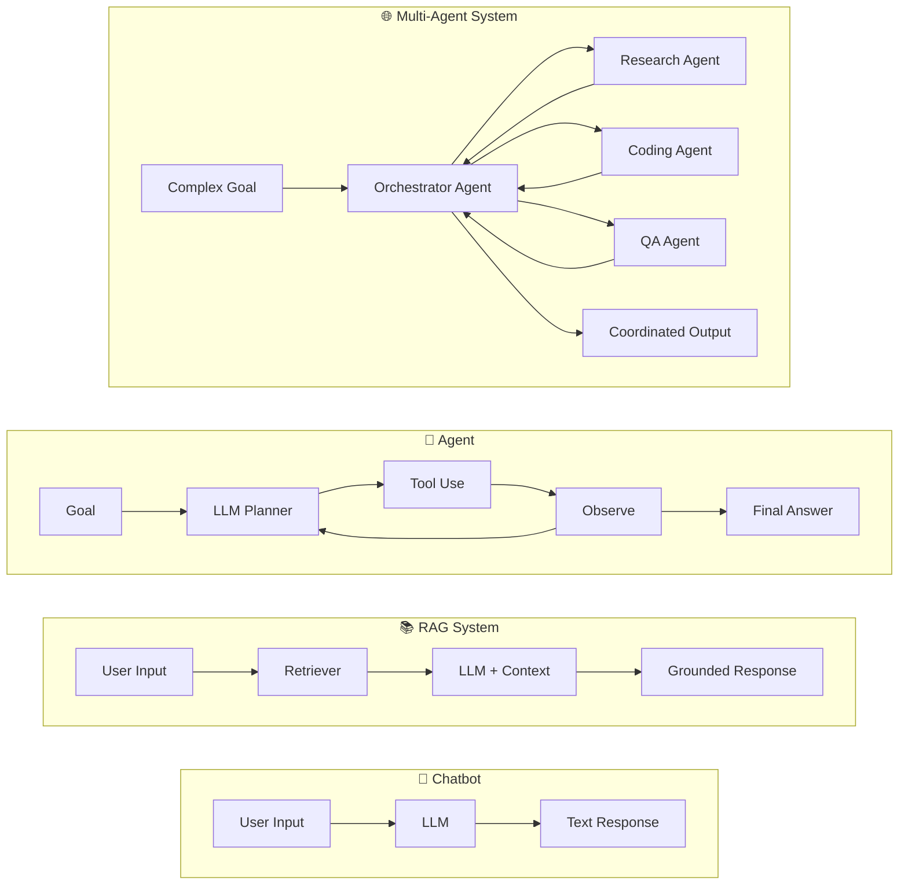
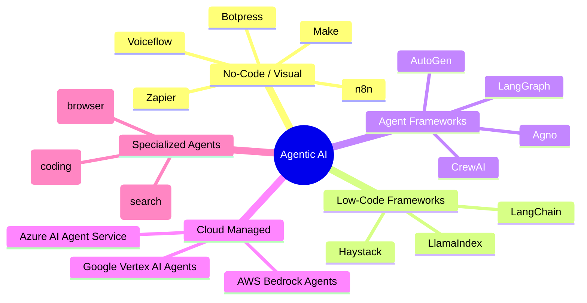
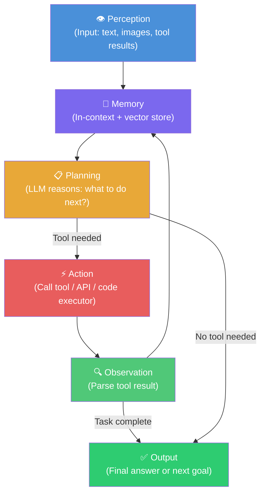
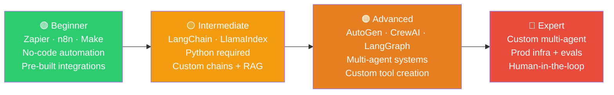

# Agentic AI — Build AI That Acts

> **From chatbots to agents.** Simple LLMs answer questions. Agents set goals, pick tools, take actions, observe results, and keep going until the job is done.

---

## What is Agentic AI?

An **AI agent** is a system that uses a large language model (LLM) as its reasoning engine and pairs it with tools, memory, and a planning loop to autonomously complete multi-step tasks. The LLM is no longer just a text generator — it becomes a decision-maker that chooses *what to do next*.

The four pillars of every agent:

| Pillar | Role | Example |
|--------|------|---------|
| **LLM Brain** | Reasons, plans, and decides | GPT-4o, Claude 3.5, Gemini 1.5 |
| **Tools** | Interface with the world | Web search, code executor, APIs, databases |
| **Memory** | Retain context across steps | Vector DB, conversation history, scratchpad |
| **Planning** | Break goals into sub-tasks | ReAct, Plan-and-Execute, Tree of Thoughts |

### How Agents Differ from Chatbots

**Key differences at a glance:**

- A **chatbot** maps one input to one output — stateless, no tools.
- A **RAG system** augments answers with retrieved documents — still one-shot.
- An **agent** loops: it thinks, acts, observes, and thinks again until the task is complete.
- A **multi-agent system** distributes work across specialized agents with an orchestrator coordinating them.

---

## The Agent Landscape 2025

The tooling ecosystem has exploded. Here is a structured taxonomy:

### Taxonomy of Agentic AI Tools

### Tool-by-Tool Overview

| Tool | Category | Maintained By | Primary Strength |
|------|----------|---------------|-----------------|
| **Zapier AI** | No-Code | Zapier | 6,000+ app integrations, zero code |
| **n8n** | No-Code | n8n GmbH | Self-hostable, visual workflow builder |
| **Make** | No-Code | Make | Visual data routing and scheduling |
| **Voiceflow** | No-Code | Voiceflow | Conversational AI design |
| **Botpress** | No-Code | Botpress | Chatbot + agent hybrid, open-source option |
| **LangChain** | Low-Code | LangChain Inc. | Largest ecosystem, chains and agents |
| **LlamaIndex** | Low-Code | LlamaIndex | Data ingestion and RAG pipelines |
| **Haystack** | Low-Code | deepset | Production NLP pipelines |
| **AutoGen** | Framework | Microsoft | Conversational multi-agent, async execution |
| **CrewAI** | Framework | CrewAI Inc. | Role-based agent teams, intuitive API |
| **Agno** | Framework | Agno | Lightweight, model-agnostic agents |
| **LangGraph** | Framework | LangChain Inc. | Graph-based state machines, lowest latency |
| **AWS Bedrock Agents** | Cloud | Amazon | Managed agents with AWS integrations |
| **Azure AI Agent Service** | Cloud | Microsoft | Enterprise-grade, Azure ecosystem |
| **Google Vertex AI Agents** | Cloud | Google | Gemini-powered, scalable deployment |
| **Devin** | Specialized | Cognition AI | Autonomous software engineering |
| **Perplexity** | Specialized | Perplexity AI | Real-time web search and synthesis |
| **Operator** | Specialized | OpenAI | Browser automation and web tasks |

---

## Core Agent Components

Every agent, regardless of framework, follows the same fundamental loop. This is the **ReAct pattern** (Reasoning + Acting), introduced by Yao et al. (ICLR 2023):

**Loop breakdown:**

1. **Perception** — Agent receives input (user query, tool result, environment signal).
2. **Memory** — Relevant context is loaded from conversation history or a vector database.
3. **Planning** — The LLM reasons about the next step: answer directly, or call a tool?
4. **Action** — If a tool is needed, the LLM emits a structured tool call.
5. **Observation** — The tool result is returned and appended to context.
6. Repeat until the task is complete → **Output**.

---

## Learning Path

Whether you are new to agents or building production multi-agent systems, follow this progression:

| Stage | Tools | Skills Needed | Time to Productivity |
|-------|-------|---------------|---------------------|
| Beginner | Zapier, n8n, Make | None — drag and drop | Days |
| Intermediate | LangChain, LlamaIndex | Python, API basics | 2–4 weeks |
| Advanced | AutoGen, CrewAI, LangGraph | Python, LLM concepts, async | 1–3 months |
| Expert | Custom stack | Distributed systems, eval, DevOps | 3+ months |

---

## Quick Comparison Table

| Tool | Type | Skill Level | Best For | Pricing |
|------|------|-------------|----------|---------|
| Zapier AI | No-Code | Beginner | App automation, non-technical teams | Free tier; from $19.99/mo |
| n8n | No-Code | Beginner | Self-hosted workflows, open source | Free (self-host); cloud from $20/mo |
| Make | No-Code | Beginner | Visual data routing, scheduling | Free tier; from $9/mo |
| Voiceflow | No-Code | Beginner | Conversational agent design | Free tier; from $50/mo |
| Botpress | No-Code | Beginner–Mid | Chatbot + agent hybrid | Free tier; Pro from $89/mo |
| LangChain | Low-Code | Intermediate | Chains, tools, RAG, agent loops | Open source (Apache 2.0) |
| LlamaIndex | Low-Code | Intermediate | Data ingestion, RAG, query engines | Open source (MIT) |
| Haystack | Low-Code | Intermediate | Production NLP pipelines | Open source (Apache 2.0) |
| AutoGen | Framework | Advanced | Conversational multi-agent, async | Open source (MIT) |
| CrewAI | Framework | Advanced | Role-based agent teams | Open source; Enterprise plans |
| LangGraph | Framework | Advanced | Stateful graph-based agents | Open source (MIT) |
| Agno | Framework | Advanced | Lightweight, model-agnostic | Open source (MPL 2.0) |
| AWS Bedrock Agents | Cloud | Intermediate | AWS-native managed agents | Pay-per-use |
| Azure AI Agent Service | Cloud | Intermediate | Enterprise, Azure ecosystem | Consumption-based |
| Vertex AI Agents | Cloud | Intermediate | GCP-native, Gemini-powered | Pay-per-use |
| Devin | Specialized | Beginner | Autonomous code generation | $500/mo (Teams) |
| Perplexity | Specialized | Beginner | Real-time research and search | Free; Pro $20/mo |
| Operator | Specialized | Beginner | Web browser automation | Included with ChatGPT Pro |

---

## 2025 State of Agents

The agentic AI market has moved from research curiosity to enterprise infrastructure:

| Metric | Value | Source |
|--------|-------|--------|
| AI Agents market size (2025) | **$7.84 billion** | MarketsandMarkets |
| Projected market size (2030) | **$52.62 billion** | MarketsandMarkets |
| CAGR (2025–2030) | **46.3%** | MarketsandMarkets |
| Enterprises integrating agents in at least one workflow | **85%** | Index.dev |
| Fortune 500 companies actively piloting agentic systems | **~45%** | Industry reports |
| New enterprise AI deployments including agentic capabilities | **>60%** | Industry reports |
| Early adopters achieving positive ROI | **88%** | Google Cloud Study |
| Top use case (by deployment share) | **Workflow automation — 64%** | Industry reports |
| Predicted autonomous customer service issue resolution by 2029 | **80%** | Gartner |
| Cost reduction predicted from agentic customer service | **30%** | Gartner |

**Top enterprise use cases in 2025:**

1. **Customer service automation** — multi-turn resolution without human handoff
2. **Workflow automation** — CRM updates, email routing, report generation
3. **Software engineering** — code review, test generation, bug fixing (Devin, GitHub Copilot Workspace)
4. **Financial operations** — invoice processing, fraud detection, compliance reporting
5. **Research and analysis** — web research, document synthesis, competitive intelligence

---

## Related Pages

- [Agent Fundamentals](fundamentals.md) — ReAct, planning strategies, memory systems, tool use, evaluation
- [LangChain Guide](../llm/langchain.md) — Chains, agents, and RAG with LangChain
- [LlamaIndex Guide](../llm/llamaindex.md) — Data ingestion and query engines
- [Multi-Agent Systems](multi-agent.md) — AutoGen, CrewAI, LangGraph deep dives
- [Agent Security](../security/index.md) — Prompt injection, sandboxing, human-in-the-loop
- [LLM Foundations](../llm/index.md) — Understanding the models that power agents

---

*Last updated: April 2025. Agent ecosystem evolves rapidly — check framework GitHub releases for the latest changes.*
