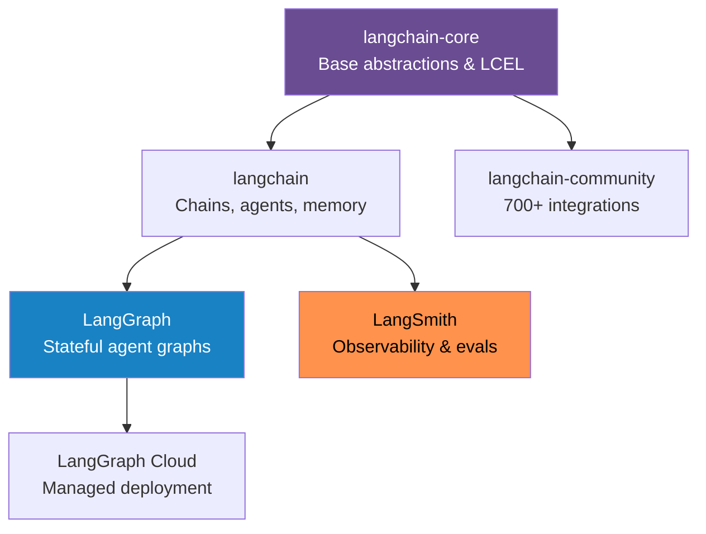
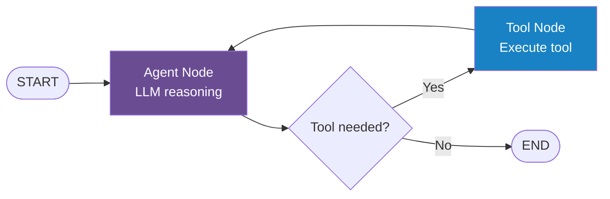

# LangChain & LangGraph

{ width="100%" }

LangChain (~95k ⭐ GitHub) is the most widely used framework for building LLM-powered applications. LangGraph extends it with stateful, cyclic agent workflows. Together they cover everything from simple RAG to complex multi-agent systems.

## Ecosystem Overview



## Core Concepts

### LLMs & Chat Models

```python
from langchain_anthropic import ChatAnthropic
from langchain_openai import ChatOpenAI
from langchain_google_genai import ChatGoogleGenerativeAI

# Pick your model
llm = ChatAnthropic(model="claude-sonnet-4-6", temperature=0)
# llm = ChatOpenAI(model="gpt-4o")
# llm = ChatGoogleGenerativeAI(model="gemini-2.0-flash")

response = llm.invoke("Explain RAG in one sentence.")
print(response.content)
```

### Prompt Templates & LCEL

LangChain Expression Language (LCEL) uses the `|` pipe operator to compose chains:

```python
from langchain_core.prompts import ChatPromptTemplate
from langchain_core.output_parsers import StrOutputParser
from langchain_anthropic import ChatAnthropic

prompt = ChatPromptTemplate.from_messages([
    ("system", "You are a helpful {role}."),
    ("human", "{question}")
])

llm = ChatAnthropic(model="claude-sonnet-4-6")
parser = StrOutputParser()

# Chain: prompt | llm | parser
chain = prompt | llm | parser

result = chain.invoke({"role": "data scientist", "question": "What is SHAP?"})
print(result)
```

### Full RAG Pipeline with LCEL

```python
from langchain_anthropic import ChatAnthropic
from langchain_community.vectorstores import Chroma
from langchain_openai import OpenAIEmbeddings
from langchain_core.prompts import ChatPromptTemplate
from langchain_core.runnables import RunnablePassthrough
from langchain_core.output_parsers import StrOutputParser

# 1. Load vectorstore
vectorstore = Chroma(persist_directory="./db", embedding_function=OpenAIEmbeddings())
retriever = vectorstore.as_retriever(search_kwargs={"k": 4})

# 2. Prompt
prompt = ChatPromptTemplate.from_template("""
Answer based on context only:

Context: {context}
Question: {question}
""")

# 3. Chain (LCEL)
rag_chain = (
    {"context": retriever, "question": RunnablePassthrough()}
    | prompt
    | ChatAnthropic(model="claude-sonnet-4-6")
    | StrOutputParser()
)

answer = rag_chain.invoke("What are transformer attention heads?")
```

## LangChain Agents

### Defining Tools

```python
from langchain_core.tools import tool
import httpx

@tool
def get_weather(city: str) -> str:
    """Get current weather for a given city."""
    r = httpx.get(f"https://wttr.in/{city}?format=3")
    return r.text

@tool
def calculate(expression: str) -> float:
    """Evaluate a mathematical expression."""
    return eval(expression)  # use safer eval in production
```

### Building a ReAct Agent

```python
from langchain.agents import create_react_agent, AgentExecutor
from langchain import hub
from langchain_anthropic import ChatAnthropic

llm = ChatAnthropic(model="claude-sonnet-4-6")
tools = [get_weather, calculate]

# Pull standard ReAct prompt from LangChain Hub
prompt = hub.pull("hwchase17/react")

agent = create_react_agent(llm, tools, prompt)
executor = AgentExecutor(agent=agent, tools=tools, verbose=True, max_iterations=10)

result = executor.invoke({"input": "What's the weather in Berlin and what's 15% of 340?"})
print(result["output"])
```

### Streaming Agent Responses

```python
for chunk in executor.stream({"input": "Research the latest news on LLMs"}):
    if "output" in chunk:
        print(chunk["output"], end="", flush=True)
```

## LangGraph — Stateful Agent Graphs

LangGraph adds **cycles, persistent state, and conditional routing** — things vanilla LangChain can't do.



### Simple LangGraph Agent

```python
from langgraph.graph import StateGraph, END
from langgraph.prebuilt import ToolNode
from langchain_anthropic import ChatAnthropic
from langchain_core.tools import tool
from typing import TypedDict, Annotated
import operator

# 1. Define state
class AgentState(TypedDict):
    messages: Annotated[list, operator.add]

# 2. Bind tools to LLM
llm = ChatAnthropic(model="claude-sonnet-4-6")
tools = [get_weather, calculate]
llm_with_tools = llm.bind_tools(tools)

# 3. Define nodes
def agent_node(state: AgentState):
    response = llm_with_tools.invoke(state["messages"])
    return {"messages": [response]}

def should_continue(state: AgentState):
    last = state["messages"][-1]
    return "tools" if last.tool_calls else END

# 4. Build graph
graph = StateGraph(AgentState)
graph.add_node("agent", agent_node)
graph.add_node("tools", ToolNode(tools))
graph.set_entry_point("agent")
graph.add_conditional_edges("agent", should_continue)
graph.add_edge("tools", "agent")

app = graph.compile()
result = app.invoke({"messages": [{"role": "user", "content": "Weather in Tokyo?"}]})
```

### LangGraph with Memory (Checkpointer)

```python
from langgraph.checkpoint.memory import MemorySaver

checkpointer = MemorySaver()
app = graph.compile(checkpointer=checkpointer)

config = {"configurable": {"thread_id": "user-123"}}

# Turn 1
app.invoke({"messages": [{"role": "user", "content": "My name is Alice"}]}, config)

# Turn 2 — remembers Alice
app.invoke({"messages": [{"role": "user", "content": "What's my name?"}]}, config)
```

### Human-in-the-Loop with LangGraph

```python
from langgraph.checkpoint.memory import MemorySaver

app = graph.compile(
    checkpointer=MemorySaver(),
    interrupt_before=["tools"]  # pause before every tool call
)

# Agent pauses, human reviews, then resumes
state = app.invoke({"messages": [...]}, config)
# ... human reviews tool call ...
app.invoke(None, config)  # resume
```

## LangSmith — Observability

```python
import os
os.environ["LANGCHAIN_TRACING_V2"] = "true"
os.environ["LANGCHAIN_API_KEY"] = "your-key"
os.environ["LANGCHAIN_PROJECT"] = "my-agent"

# All LangChain/LangGraph runs are now traced automatically
```

LangSmith gives you:

- **Trace viewer** — every LLM call, tool use, and latency
- **Evaluation datasets** — run your chain against test cases
- **Prompt Hub** — version-controlled prompts
- **Online evals** — auto-evaluate production runs

## Key Integrations

| Category | Options |
|---|---|
| **LLMs** | Anthropic, OpenAI, Google, Mistral, Ollama, Cohere, Groq |
| **Vector Stores** | Chroma, Pinecone, Weaviate, Qdrant, FAISS, pgvector |
| **Document Loaders** | PDF, Web, Notion, Confluence, S3, YouTube, GitHub |
| **Tools** | Tavily Search, Serper, Wikipedia, Python REPL, Zapier NLA |
| **Memory** | ConversationBuffer, Redis, DynamoDB, PostgreSQL |
| **Embeddings** | OpenAI, Cohere, HuggingFace, Google, Ollama |

## Pros, Cons & When to Use

| | Details |
|---|---|
| ✅ **Pros** | Huge ecosystem, best-in-class integrations, active community, LangSmith observability |
| ❌ **Cons** | Can be over-engineered for simple tasks, abstractions can hide complexity |
| 🎯 **Use when** | Building production RAG, complex agents, need 700+ integrations |
| ⏭️ **Skip when** | Simple single LLM call, or you want minimal dependencies |

## References

1. [LangChain Documentation](https://python.langchain.com/docs/)
2. [LangGraph Documentation](https://langchain-ai.github.io/langgraph/)
3. [LangSmith Documentation](https://docs.smith.langchain.com/)
4. Chase, H. (2022). LangChain GitHub Repository. [github.com/langchain-ai/langchain](https://github.com/langchain-ai/langchain)
5. [LangChain Expression Language (LCEL) Guide](https://python.langchain.com/docs/expression_language/)
6. [LangGraph: Build stateful, multi-actor applications](https://blog.langchain.dev/langgraph/)
7. [LangGraph Human-in-the-Loop](https://langchain-ai.github.io/langgraph/concepts/human_in_the_loop/)
