# Multi-Agent Systems

{ width="100%" }

Single agents break down on complex, long-horizon tasks. Multi-agent systems (MAS) split work across **specialized agents** that collaborate, debate, and check each other — achieving what no single agent can.

## Single Agent vs Multi-Agent

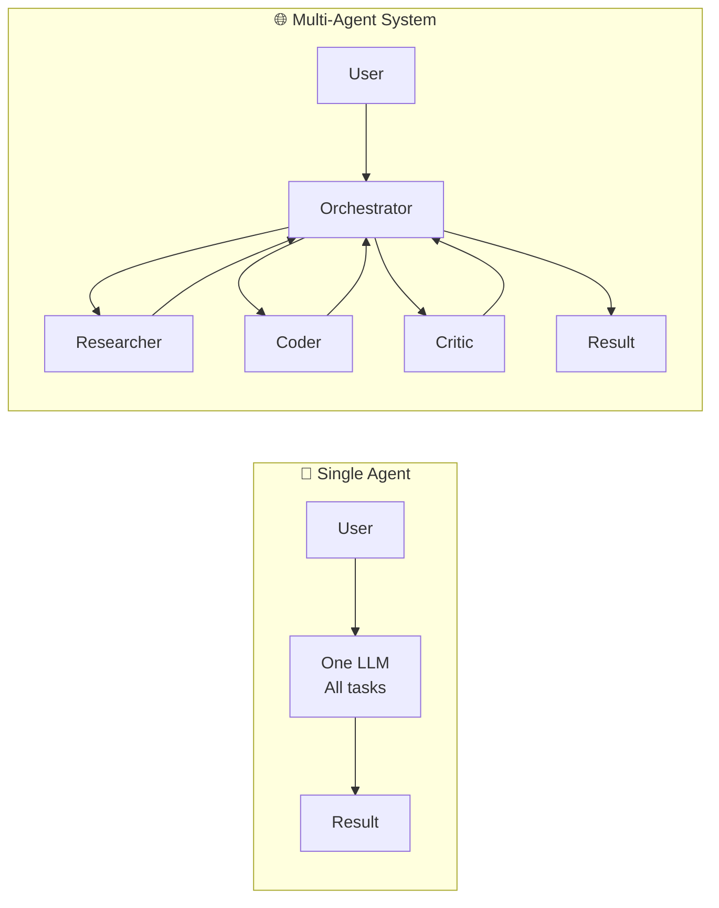

**When to use multi-agent:**

- Tasks requiring parallel execution (research 5 topics at once)
- Tasks needing different expertise (coding + writing + review)
- Long tasks that overflow a single context window
- Tasks requiring cross-checking and validation
- Workflows where one agent's output is another's input

## Multi-Agent Patterns

### 1. Supervisor / Orchestrator

One LLM routes tasks to specialist subagents and aggregates results.

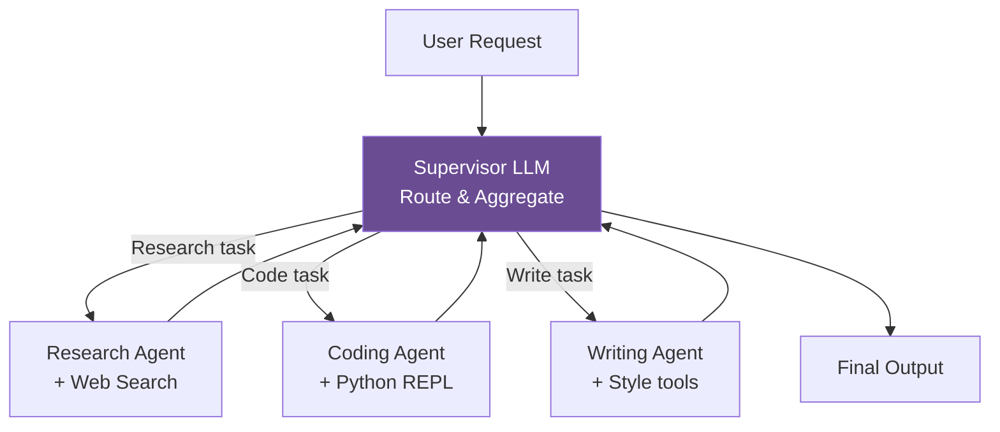

### 2. Hierarchical (Teams of Teams)

Nested agent groups — a top-level supervisor coordinates team supervisors.

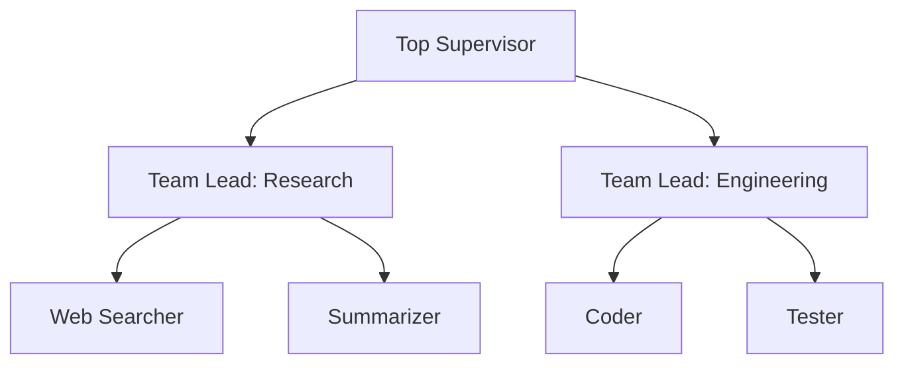

### 3. Peer-to-Peer (Debate / Society)

Agents communicate directly, debate outputs, reach consensus.

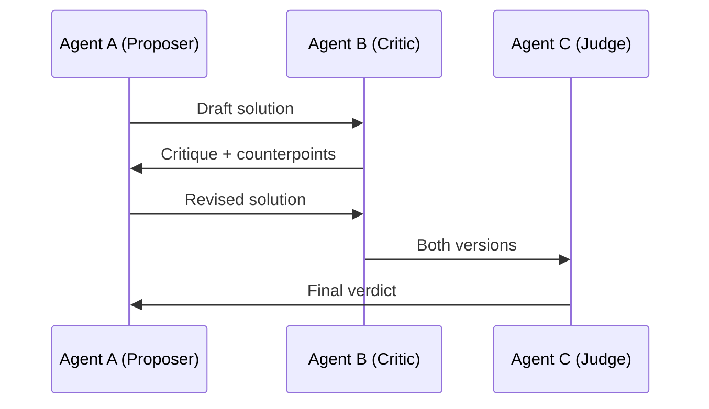

### 4. Pipeline (Assembly Line)

Sequential handoffs — each agent's output is the next agent's input.

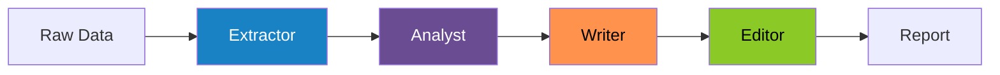

### 5. MapReduce (Parallel + Merge)

Fan out to parallel agents, fan in to merge results.

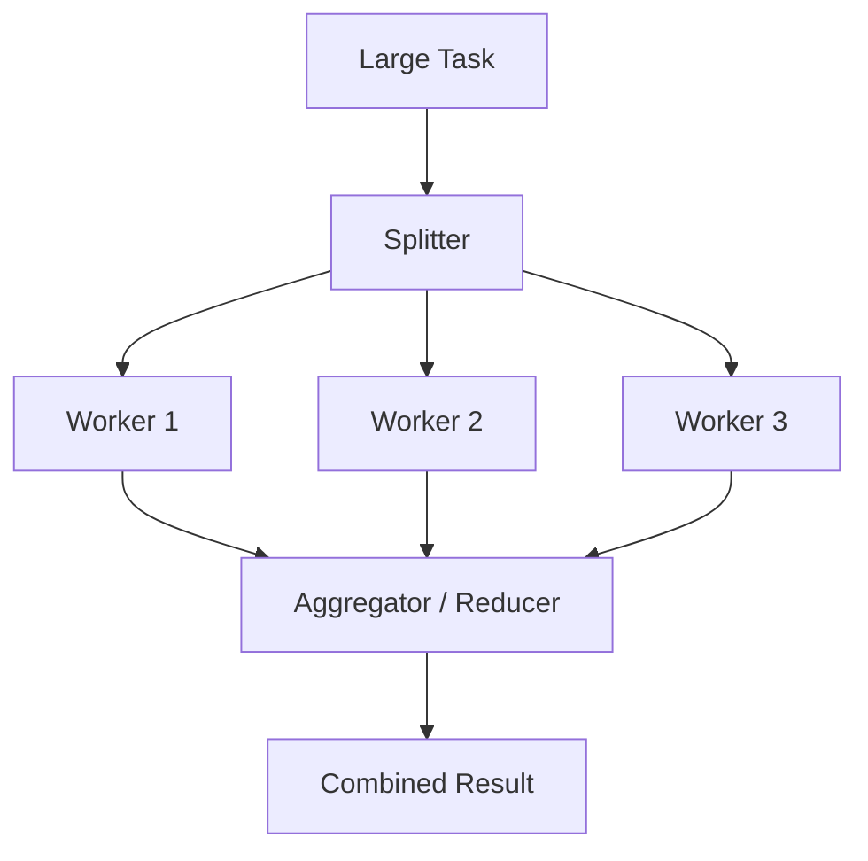

## Model Context Protocol (MCP)

MCP (Anthropic, 2024) is an open standard for connecting AI agents to tools and data sources — like USB-C but for agents.

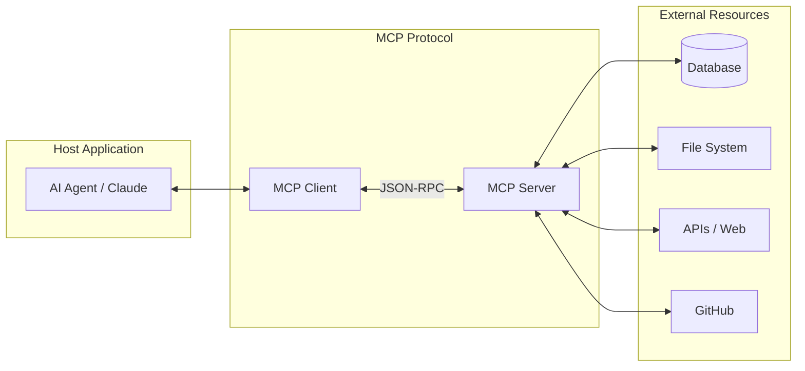

**Why MCP matters:** Instead of every agent framework writing custom tool integrations, MCP provides one universal interface. Major integrations: GitHub, Slack, Postgres, Filesystem, Brave Search, and 1000+ community servers.

## Real-World Multi-Agent Examples

### AI Software Engineering Pipeline

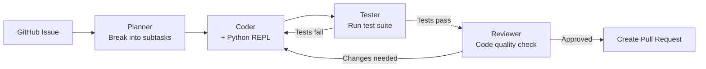

### AI Research Pipeline (Parallel)

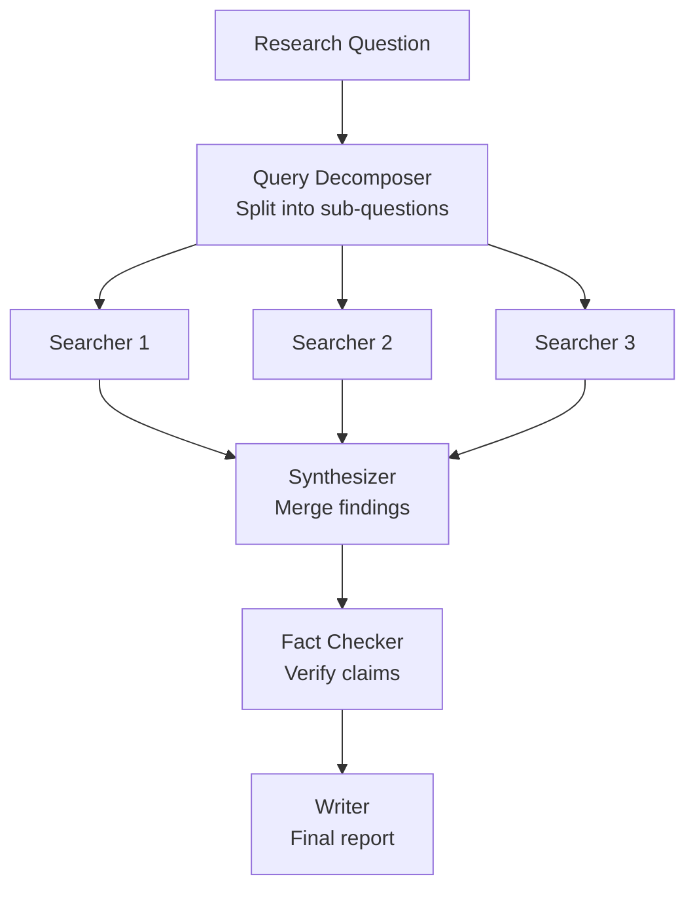

### Customer Service Multi-Agent

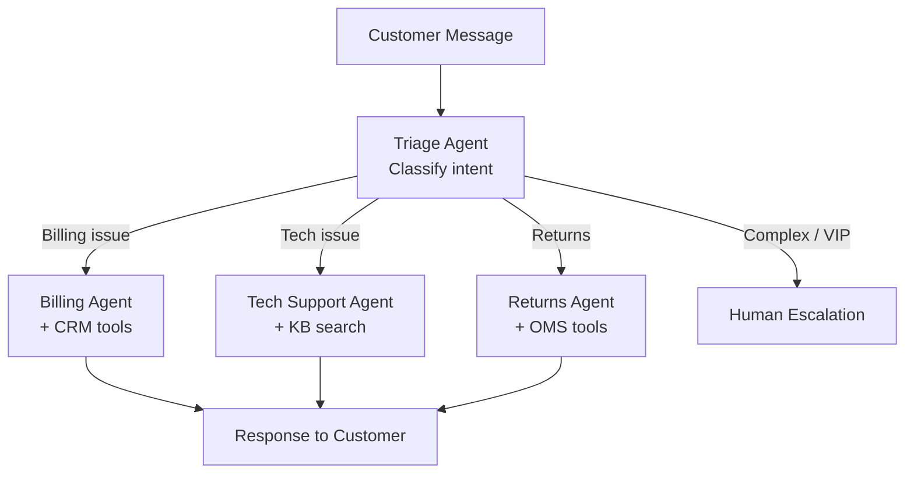

## Shared State with LangGraph

```python
from langgraph.graph import StateGraph, END
from typing import TypedDict, Annotated
import operator

class SharedState(TypedDict):
    messages: Annotated[list, operator.add]
    research: str
    draft: str
    approved: bool

def researcher(state: SharedState):
    # Uses web search tool
    result = search_web(state["messages"][-1].content)
    return {"research": result}

def writer(state: SharedState):
    draft = llm.invoke(f"Write a report based on: {state['research']}")
    return {"draft": draft.content}

def reviewer(state: SharedState):
    verdict = llm.invoke(f"Approve or reject: {state['draft']}")
    approved = "approve" in verdict.content.lower()
    return {"approved": approved}

def route_after_review(state):
    return END if state["approved"] else "writer"  # retry if rejected

graph = StateGraph(SharedState)
graph.add_node("researcher", researcher)
graph.add_node("writer", writer)
graph.add_node("reviewer", reviewer)
graph.set_entry_point("researcher")
graph.add_edge("researcher", "writer")
graph.add_edge("writer", "reviewer")
graph.add_conditional_edges("reviewer", route_after_review)

app = graph.compile()
```

## Human-in-the-Loop (HITL)

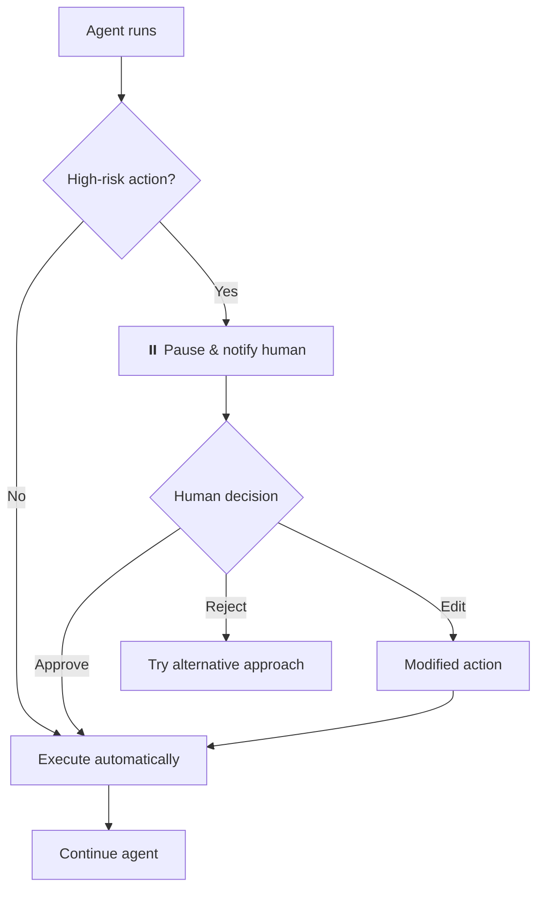

**HITL patterns:**

| Pattern | When to use | Implementation |
|---|---|---|
| **Approve before action** | Irreversible actions (send email, delete file) | `interrupt_before=["action_node"]` |
| **Review at checkpoint** | Every N steps | Conditional edge to human node |
| **Uncertainty interrupt** | Agent confidence < threshold | Agent self-reports uncertainty |
| **Async approval** | Non-blocking workflows | Queue + webhook callback |

## Production Deployment

| Concern | Solution | Tools |
|---|---|---|
| **Observability** | Trace every agent step | LangSmith, Arize Phoenix, AgentOps |
| **Cost control** | Token budgets per agent, per run | LangSmith cost tracking, custom limits |
| **Failure handling** | Retry with backoff, fallback agents | Tenacity library, LangGraph error nodes |
| **Scaling** | Async execution, worker pools | LangGraph Cloud, Celery, Ray |
| **State persistence** | Resume interrupted runs | LangGraph + PostgreSQL checkpointer |
| **Rate limiting** | Per-user and per-tool limits | Redis rate limiter |
| **Caching** | Cache repeated tool calls | LangChain cache, Redis |

## Security

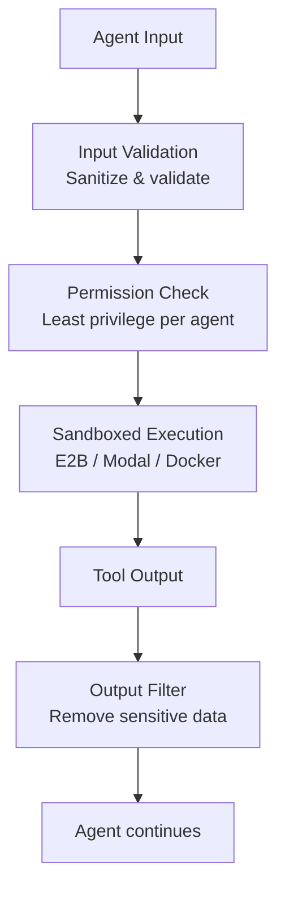

**Key security practices:**

- **Prompt injection**: Sanitize all tool outputs before returning to LLM
- **Sandboxing**: Run code execution in isolated environments (E2B, Modal)
- **Least privilege**: Each agent only has tools it needs
- **Secrets management**: Never pass API keys through agent context
- **Output validation**: Validate tool call arguments against schemas

## Benchmarks & Leaderboards

| Benchmark | Task Type | SOTA Model | Score |
|---|---|---|---|
| **SWE-bench Verified** | Fix real GitHub issues | Claude Opus 4 | 72.5% |
| **GAIA (Level 1)** | General AI assistant tasks | GPT-4o + plugins | 74.4% |
| **WebArena** | Web navigation tasks | GPT-4V | 36.2% |
| **AgentBench Overall** | 8-environment suite | GPT-4 | 4.97/10 |
| **OSWorld** | Desktop computer tasks | Claude | 38.1% |
| **τ-bench Retail** | Tool-use in retail domain | Claude | 60.4% |

## References

1. Park et al. (2023). **Generative Agents: Interactive Simulacra of Human Behavior**. arXiv:2304.03442
2. Wu et al. (2023). **AutoGen: Enabling Next-Gen LLM Applications via Multi-Agent Conversation**. arXiv:2308.08155
3. Anthropic (2024). **Model Context Protocol**. [modelcontextprotocol.io](https://modelcontextprotocol.io)
4. Jimenez et al. (2024). **SWE-bench: Can Language Models Resolve Real-World GitHub Issues?** arXiv:2310.06770
5. Zhou et al. (2023). **WebArena: A Realistic Web Environment**. arXiv:2307.13854
6. Mialon et al. (2023). **GAIA Benchmark**. arXiv:2311.12983
7. Hong et al. (2023). **MetaGPT: Meta Programming for a Multi-Agent Collaborative Framework**. arXiv:2308.00352
8. Qian et al. (2023). **ChatDev: Communicative Agents for Software Development**. arXiv:2307.07924
9. [LangGraph Multi-Agent Docs](https://langchain-ai.github.io/langgraph/concepts/multi_agent/)
10. [E2B Sandboxing for AI Agents](https://e2b.dev/docs)
