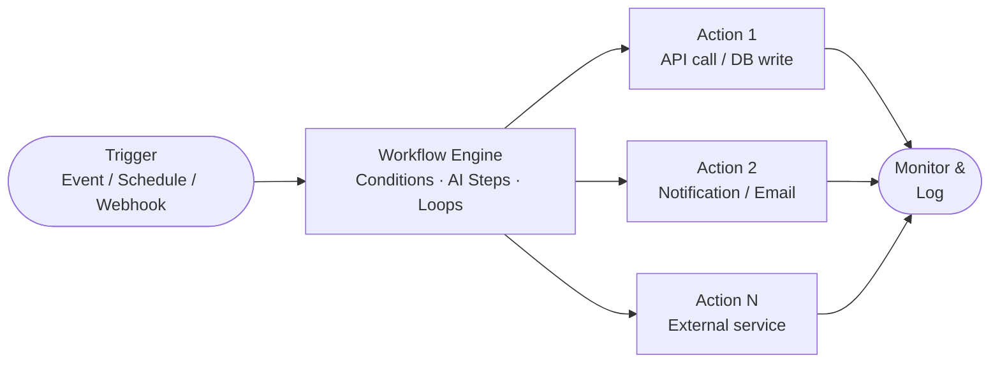
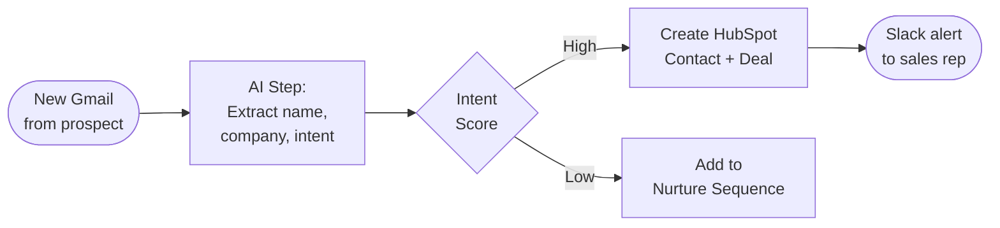
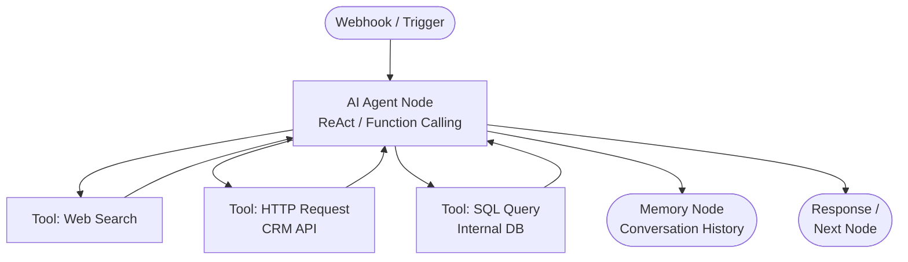
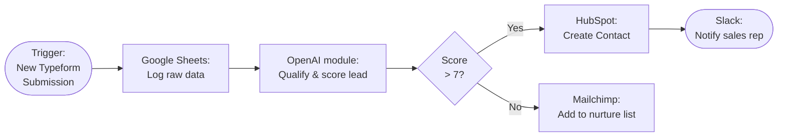
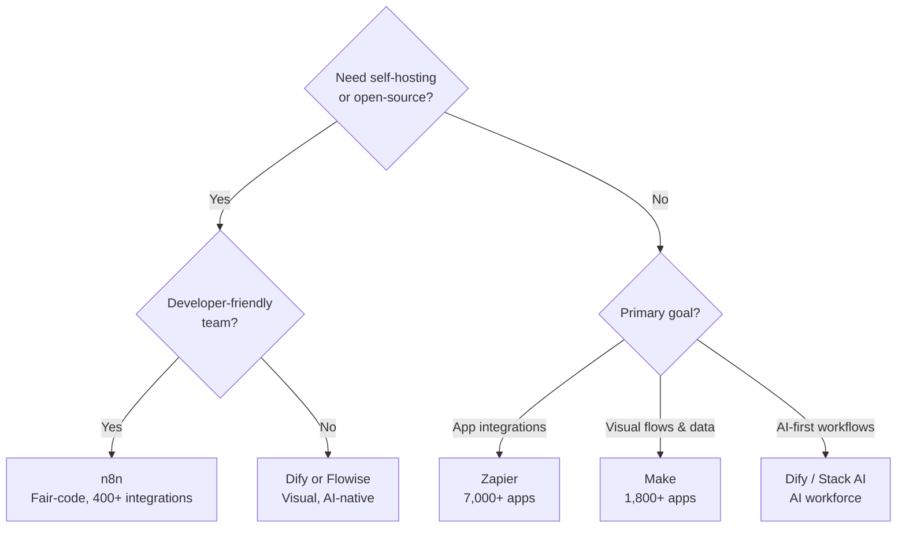

# No-Code & Low-Code Agent Tools

*Visual workflow automation — the backbone of no-code AI agents*

---

## Overview

No-code and low-code agentic AI tools are reshaping how organizations deploy intelligent automation. Rather than requiring Python engineers or ML researchers, these platforms let operations teams, marketers, and small business owners build AI-powered workflows through drag-and-drop interfaces and natural-language instructions.

The workflow automation market was valued at **$23.77 billion in 2025** and is projected to reach **$40.77 billion by 2031** (CAGR ~9.5%). Low-code development platforms add another $34.7 billion to the picture. As hyperautomation becomes a priority for 90% of large enterprises, no-code agents are the fastest path from idea to production.

**Who benefits most:**

- **Ops teams** — automate repetitive data entry, ticket routing, and report generation
- **Marketers** — orchestrate lead nurturing, campaign triggers, and CRM sync
- **SMBs** — access enterprise-grade AI without hiring a data science team
- **Citizen developers** — shrink deployment cycles from months to days

### The Trigger → Workflow → Action Pattern

Every no-code agent follows the same fundamental loop:

---

## Zapier AI & Agents

*Zapier connects 7,000+ apps and powers millions of automated workflows*

Zapier has evolved from a simple IFTTT-style connector into a full **AI orchestration platform**. Two distinct products now sit side by side: classic **Zaps** (rule-based, deterministic) and **Zapier Agents** (AI-powered, reasoning-based).

### Zapier Agents vs. Classic Zaps

| Feature | Classic Zaps | Zapier Agents |
|---|---|---|
| Logic style | Rule-based, linear | Reasoning-based, adaptive |
| When to use | Predictable, repeatable tasks | Variable, research-heavy tasks |
| AI involvement | Optional AI step | AI at the core |
| Human oversight | Minimal | Configurable |
| Launched | 2011 | 2024 |

**Zapier Agents** can browse the web, query attached knowledge bases, and decide autonomously which tools to invoke. Agents support draft vs. published versioning (beta, 2025) so you can update instructions without breaking live automations.

### Canvas — Visual AI Workflow Builder

**Zapier Canvas** is an AI-powered diagramming tool that lets you map entire business processes visually, then convert them into live Zaps or Agent behaviors with one click. Teams can paste screenshots or drag images directly into Canvas to communicate intent without writing a single prompt.

### 7,000+ App Integrations

Zapier connects to virtually every SaaS tool: Gmail, Slack, HubSpot, Salesforce, Notion, Airtable, Shopify, and thousands more — including direct connections to OpenAI, Anthropic Claude, and Google Gemini for inline AI steps.

### Key Use Cases

- **Lead routing** — new form submission → AI qualifies lead → route to correct rep in CRM
- **Email triage** — incoming support email → classify sentiment & priority → create ticket + notify team
- **CRM sync** — deal stage change in Salesforce → update HubSpot + notify account manager in Slack
- **Support ticket automation** — Zendesk ticket created → AI draft response → human review → send

### Example Zap Flow

### Zapier Pricing (2025)

| Plan | Price | Tasks/month | Agents activities | Key features |
|---|---|---|---|---|
| Free | $0 | 100 | 400 | Basic Zaps, 2-step |
| Professional | $19.99/mo | 750 | 1,500 | Multi-step, filters, paths |
| Team | $69/mo | 2,000 | 5,000 | Shared workspace, SSO |
| Enterprise | Custom | Custom | Custom | Advanced security, SLA |

*Tables and Forms included on all plans. Zapier MCP included on all plans.*

### Pros & Cons

| Pros | Cons |
|---|---|
| Largest app ecosystem (7,000+) | Task-based pricing adds up quickly |
| No-code first — accessible to all | Advanced logic requires workarounds |
| AI Agents with reasoning built in | Agents are not deterministic |
| Canvas for visual planning | Limited custom code in lower tiers |
| Generous free tier with AI access | Self-hosting not available |

---

## n8n

*n8n — the open-source workflow engine powering enterprise AI pipelines*

n8n (pronounced "nodemation") is a **fair-code licensed**, open-source workflow automation platform with native AI capabilities. With **184,000 GitHub stars**, it is one of the most starred automation tools in existence. n8n differentiates itself with deep developer extensibility combined with a visual builder — you can drag, drop, and also write custom JavaScript/Python nodes.

### Self-Hosted vs. Cloud

| Mode | Cost | Control | Setup effort |
|---|---|---|---|
| Community (self-hosted) | Free | Full | Medium |
| Cloud Starter | $20/mo | Managed | None |
| Cloud Pro | $50/mo | Managed + features | None |
| Cloud Business | $800/mo | Enterprise | None |

### AI Nodes & LangChain Integration

n8n's AI capabilities are powered by **LangChain under the hood**, surfaced as native drag-and-drop nodes:

- **AI Agent node** — ReAct-style agent with tool use
- **LLM nodes** — OpenAI GPT-4o, Anthropic Claude, Google Gemini, Mistral, Ollama (local)
- **Vector store nodes** — Pinecone, Qdrant, Supabase, in-memory
- **Memory nodes** — Window buffer memory, summary memory
- **Tool nodes** — Web search, code execution, HTTP request, SQL, custom tools
- **Document loader nodes** — PDF, web scraper, GitHub, Google Drive

### n8n AI Agent Node — How It Works

The AI Agent node accepts a **system prompt**, attaches **tools** (any n8n node can be a tool), connects to a **memory** node for conversation history, and connects to an **LLM** node for reasoning. On each run it:

1. Receives the input message
2. Passes it to the LLM with the system prompt and available tool descriptions
3. The LLM decides which tool to call (ReAct or function-calling)
4. n8n executes the tool node and returns the result
5. The cycle repeats until the LLM returns a final answer

### Key Use Cases

- **Data pipelines** — webhook → transform → load to database or data warehouse
- **Webhook automations** — receive GitHub PR events → AI code review → post to Slack
- **AI-enhanced ETL** — scrape web → AI extract structured data → upsert to Postgres
- **Internal chat agents** — Slack bot backed by an n8n agent with company knowledge

### n8n AI Agent Workflow

### n8n Pricing (2025)

| Plan | Price | Executions/mo | Notes |
|---|---|---|---|
| Community | Free | Unlimited (self-hosted) | Open-source, self-managed |
| Starter (Cloud) | $20/mo | 2,500 | 5 concurrent, unlimited steps |
| Pro (Cloud) | $50/mo | 10,000 | RBAC, global variables |
| Business (Cloud) | $800/mo | 40,000 | SSO, version control |

### Pros & Cons

| Pros | Cons |
|---|---|
| 184k GitHub stars — massive community | Self-hosting requires DevOps knowledge |
| Native LangChain AI nodes | Business plan is expensive |
| True self-hosted option | Steeper learning curve than Zapier |
| 400+ integrations, extensible | Fair-code license (not fully open) |
| Code nodes for custom logic | UI less polished than Zapier |
| Execution-based pricing scales well | Cloud executions can be limited |

---

## Make (formerly Integromat)

*Make's visual scenario builder — connecting 1,800+ apps in a flowchart-like canvas*

**Make** (make.com) is a visual automation platform known for its flowchart-like **scenario builder** with a distinctive routers, iterators, and aggregators model. Originally launched as Integromat in 2012 and rebranded as Make in 2022, it sits between Zapier's simplicity and n8n's power.

### Visual Scenario Builder

Make scenarios are built as **bubbles connected by lines**, making data flow visually explicit. Key concepts:

- **Modules** — each app action is a module (bubble)
- **Routers** — branch logic based on conditions
- **Iterators** — loop over arrays/collections
- **Aggregators** — merge multiple bundles back into one
- **Filters** — pass data only when conditions are met

### AI Modules

Make transitioned to a credit-based model in August 2025, and AI modules are now available across all paid plans with your own API key:

- **OpenAI (ChatGPT)** — text generation, image analysis, embeddings
- **Anthropic Claude** — Claude Haiku/Sonnet/Opus via official Make integration
- **Text Parser** — built-in regex, pattern matching, format conversion
- **HTTP module** — connect to any AI API endpoint with custom headers

Custom AI provider connections are available on all paid plans using your own API keys, eliminating Make's credit premium for AI processing.

### 1,800+ App Connections

Make supports over 1,800 apps including Google Workspace, Slack, Notion, Airtable, Salesforce, WooCommerce, Shopify, Typeform, and custom webhook/HTTP endpoints.

### Key Use Cases

- **E-commerce automation** — new Shopify order → update inventory → send personalized confirmation email → create fulfillment task
- **Marketing ops** — new lead in Typeform → AI qualify + enrich → add to Mailchimp sequence → notify sales in Slack
- **Document processing** — email attachment → extract text with AI → parse structured data → insert into Google Sheets
- **Content pipeline** — RSS feed → AI summarize → post to social media platforms

### Make Scenario Flow

### Make Pricing (2025–2026)

| Plan | Price | Credits/mo | Notes |
|---|---|---|---|
| Free | $0 | 1,000 | Basic scenarios |
| Core | $9/mo | 10,000 | Custom AI API keys |
| Pro | $16/mo | 10,000 | Priority execution, advanced tools |
| Teams | $29/mo | 10,000 | Shared team workspace |
| Enterprise | Custom | Custom | SLA, SSO, volume credits |

*Note: Most actions cost 1 credit; native AI modules without own API key incur a credit premium.*

### Pros & Cons

| Pros | Cons |
|---|---|
| Highly visual — easiest to read complex flows | Credit model can be confusing |
| Strong iterator/aggregator model for data | Fewer integrations than Zapier |
| AI modules for OpenAI & Anthropic | AI credit premium without own API key |
| Affordable entry pricing ($9/mo) | Less developer-friendly than n8n |
| 1,800+ app integrations | No self-hosting option |
| Good documentation and templates | Execution speed slower on lower plans |

---

## Other Notable No-Code Tools

The ecosystem extends well beyond the Big Three. Here is a concise comparison of other platforms worth evaluating:

| Tool | Type | Best For | GitHub Stars | Free Tier | AI-Native |
|---|---|---|---|---|---|
| **Voiceflow** | No-code | Voice & chat agent builder for CX teams | Closed-source | Yes (limited) | Yes |
| **Botpress** | Open-source | Conversational AI agents, multi-channel | ~13k | Yes | Yes |
| **Stack AI** | No-code | Enterprise AI workflow platform | Closed-source | Yes (limited) | Yes |
| **Relevance AI** | No-code | AI workforce / multi-agent platform | Closed-source | Yes | Yes |
| **Flowise** | Open-source | Visual LangChain/LangGraph builder | **~52k** | Self-hosted free | Yes |
| **Dify** | Open-source | LLM app dev + RAG + agent platform | **~119k** | Self-hosted / cloud free | Yes |
| **Langflow** | Open-source | Visual LangChain builder with RAG focus | ~50k | Self-hosted free | Yes |
| **ActivePieces** | Open-source | Zapier alternative, MIT licensed | ~14k | Yes (cloud + self-hosted) | Partial |

### Quick Notes

**Voiceflow** — purpose-built for designing and deploying voice & chat agents (IVR, chatbots, voice assistants). Strong collaboration features for CX and product teams.

**Botpress** — open-source conversational AI with a code-friendly extension model. Excellent for multi-channel deployments (WhatsApp, Telegram, web chat). Better for teams needing customization through webhooks and code.

**Stack AI** — enterprise-focused, connects internal data sources (databases, SharePoint, Confluence) to LLM workflows. Strong access controls and compliance features.

**Relevance AI** — bills itself as an "AI workforce" platform, letting you build multi-agent teams where specialized agents hand off tasks to each other.

**Flowise** (~52k stars) — drag-and-drop UI on top of LangChain.js. Supports agents, RAG pipelines, multi-agent systems, and tool calling with a self-hosted Docker deploy in minutes.

**Dify** (~119k stars) — the most starred LLM app platform. Production-ready with visual workflow builder, built-in RAG engine, agent capabilities (Function Calling + ReAct), MCP protocol support, model management, and full observability. Supports 100+ LLM providers.

**Langflow** — Python-based visual builder for LangChain. Particularly strong for RAG pipelines with native Astra DB and MongoDB vector store integrations. One-click microservice deployment.

**ActivePieces** — MIT-licensed open-source Zapier alternative with 150+ connectors. Ships native AI steps (text generation, classification, extraction) and MCP server support. Good for teams wanting open-source workflow automation with AI sprinkled in.

---

## Choosing the Right Tool

Use this decision matrix to select your platform:

| Requirement | Zapier | n8n | Make | Flowise | Dify |
|---|---|---|---|---|---|
| **Self-hosted option** | No | Yes | No | Yes | Yes |
| **AI-native design** | Partial | Yes | Partial | Yes | Yes |
| **App integrations count** | 7,000+ | 400+ | 1,800+ | Minimal | Minimal |
| **Free tier** | Yes (100 tasks) | Yes (self-hosted) | Yes (1,000 credits) | Yes | Yes |
| **Open-source** | No | Fair-code | No | Yes (Apache 2) | Yes (Apache 2) |
| **RAG / vector stores** | Partial | Yes | No | Yes | Yes |
| **Multi-agent support** | Partial | Yes | No | Yes | Yes |
| **Technical skill needed** | Low | Medium | Low–Medium | Medium | Low–Medium |
| **Best for** | SMBs, ops teams | Developers, enterprises | Mid-market ops | AI builders | AI builders |
| **Custom code nodes** | Limited | Yes (JS/Python) | Limited | No | Yes (Python/Node) |

### Quick Decision Guide

---

## Best Practices

### Error Handling
- Always add **error handlers** to critical paths — most platforms support retry logic and error branches
- Use **dead letter queues** or fallback notifications (Slack/email) when automation fails
- Test with **edge-case inputs** (empty strings, null values, unexpected formats) before going live

### Testing Workflows
- Start with **test data** and dry-run modes before enabling production triggers
- Use **staging environments** for complex multi-step flows
- Log intermediate data outputs at each step during development

### Rate Limits
- Respect third-party API rate limits — add **delay/throttle nodes** between bulk operations
- Batch operations where possible (e.g., bulk CRM updates rather than one call per record)
- Monitor rate-limit errors and implement **exponential backoff** in custom HTTP nodes

### Secrets Management
- Never hardcode API keys in workflow steps — use the platform's **credential vault** (Zapier credentials, n8n credential store)
- Rotate API keys regularly and use **scoped credentials** with minimum required permissions
- Audit credential access in team workspaces

### Monitoring & Observability
- Enable **execution history logs** on all production workflows
- Set up **failure alerts** via Slack, PagerDuty, or email
- Track **task/execution consumption** to avoid surprise billing
- For AI steps, log inputs and outputs to detect prompt drift or unexpected behavior

---

## References

- [Zapier AI Agents — Official Product Page](https://zapier.com/agents)
- [Zapier Canvas — Visual Workflow Builder](https://zapier.com/canvas)
- [n8n GitHub Repository (~184k stars)](https://github.com/n8n-io/n8n)
- [n8n AI Agent Node Documentation](https://docs.n8n.io/integrations/builtin/cluster-nodes/root-nodes/n8n-nodes-langchain.agent/)
- [Make.com Anthropic Claude Integration](https://www.make.com/en/integrations/anthropic-claude)
- [Make.com Pricing](https://www.make.com/en/pricing)
- [Flowise GitHub Repository (~52k stars)](https://github.com/FlowiseAI/Flowise)
- [Dify GitHub Repository (~119k stars)](https://github.com/langgenius/dify)
- [Dify Official Site](https://dify.ai/)
- [ActivePieces — Open-Source Zapier Alternative](https://www.activepieces.com/)
- [Workflow Automation Market Report — Mordor Intelligence](https://www.mordorintelligence.com/industry-reports/workflow-automation-market)
