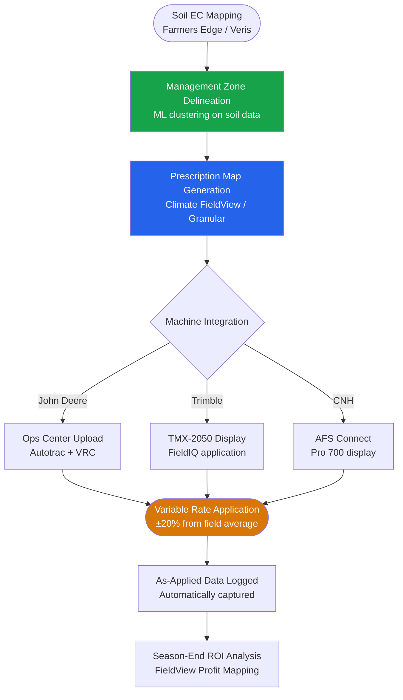
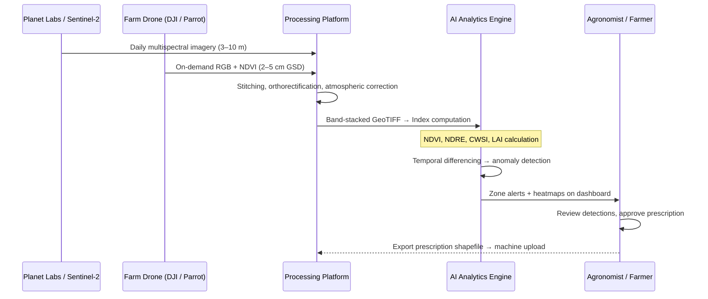
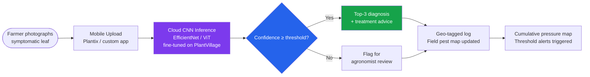
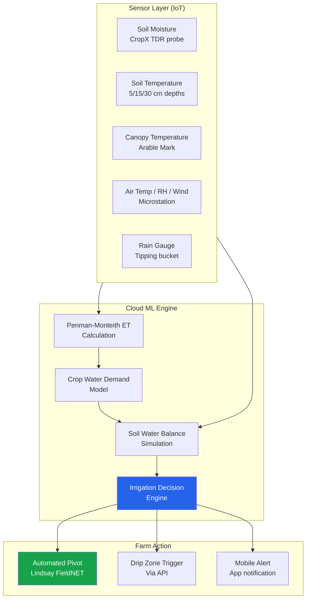
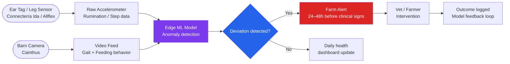
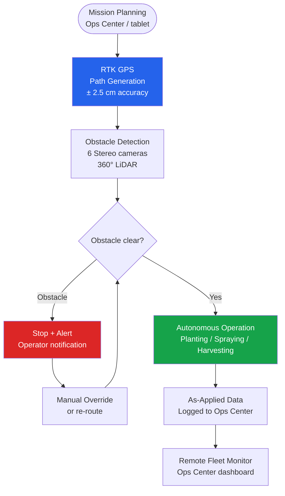
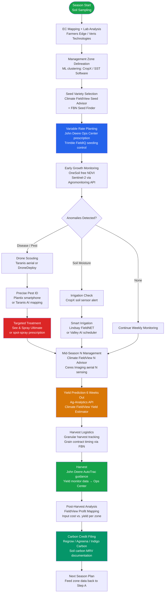
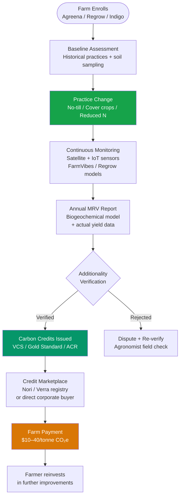

# AI in Agriculture & Precision Farming

{ width="1200" }

Feeding a planet of nearly 8 billion people — rising to 9.7 billion by 2050 — demands a 70% increase in food production on roughly the same land area, with fewer inputs, less water, and a shrinking agricultural workforce. AI is the pivotal technology making this possible: transforming farming from calendar-based intuition to sensor-driven, GPS-guided, computer-vision-enabled precision. From a smartphone app that diagnoses leaf disease in seconds to satellite constellations monitoring crop stress across entire continents, the agricultural AI stack is maturing rapidly — and the ROI is measurable in tonnes per hectare and dollars per acre.

---

## Overview & Market Statistics

| Metric | Value | Source / Year |
|---|---|---|
| Global AI in agriculture market (2024) | $1.7 billion | MarketsandMarkets, 2024 |
| Projected market size (2028) | $4.7 billion | MarketsandMarkets, 2024 |
| CAGR (2024–2028) | ~20% | Multiple analyst firms |
| Yield improvement (precision N management) | +10–20% | McKinsey Global Institute, 2023 |
| Water savings (AI-driven irrigation) | 20–50% reduction | FAO AQUASTAT, 2023 |
| Herbicide reduction (See & Spray / targeted CV) | Up to 77% reduction | John Deere / Blue River, 2024 |
| Pesticide reduction (precision scouting) | 15–30% reduction | Taranis case studies, 2023 |
| Labour savings (autonomous guidance + monitoring) | 20–30% reduction | USDA ERS, 2022 |
| Input cost savings (variable-rate seeding/fert) | $25–65/acre | Climate FieldView customer data |
| Farmers using Plantix globally | 10+ million | PEAT GmbH, 2024 |
| Acres connected to Climate FieldView | 180+ million | Bayer, 2024 |
| Acres managed via John Deere Operations Center | 350+ million | John Deere, 2024 |

Agriculture sits at the intersection of biology, chemistry, meteorology, logistics, and economics — all domains where AI delivers measurable value. The key drivers of adoption are **labour shortages** pushing automation into harvesting and monitoring; **climate volatility** demanding responsive sensor-driven irrigation and pest management; **commodity price pressure** forcing tighter margins; and **data abundance** from cheap IoT sensors, CubeSats, and consumer drones.

The result is a stack of interoperable tools — satellite imagery platforms, IoT soil networks, ML yield forecasters, and LLM-powered advisory systems — that together enable **precision agriculture**: doing the right thing, in the right place, at the right time.

---

## Key AI Use Cases

### 1. Precision Farming & Variable Rate Application

Precision farming replaces uniform field management with **zone-level decisions** calibrated to actual soil variability, crop growth stage, and microclimate. AI processes satellite, drone, and ground sensor data continuously to produce **prescription maps** — files that instruct variable-rate applicators to apply exactly the right amount of fertiliser, seed, or herbicide at each GPS coordinate.

**Key tools:** John Deere Operations Center, Climate FieldView (Bayer), Trimble Ag, Granular (Corteva), CNH AFS Connect, Farmers Edge



---

### 2. Drone & Satellite Imagery Analysis

Drone and satellite imagery form the visual backbone of modern precision agriculture. Two complementary workflows exist — satellite for continuous, wide-area monitoring and drones for on-demand sub-centimetre resolution scouting.

{ width="800" }

**Satellite platforms:** Planet Labs (daily 3 m PlanetScope), Sentinel-2 (free, 10 m, 5-day revisit), Maxar (30 cm), Satellogic (1 m video), Microsoft FarmVibes (Azure-hosted multi-source fusion)

**Drone & processing platforms:** Taranis (0.1 mm GSD aircraft), DroneDeploy (flight planning + NDVI), Pix4Dfields (photogrammetry + index rendering), Hummingbird Technologies (UK, canopy analysis), DJI Agras (spraying drones)



**NDVI calculation:** NDVI = (NIR − Red) / (NIR + Red). Values 0.6–0.9 indicate healthy dense canopy; below 0.4 signals stress; near 0.1 is bare soil.

---

### 3. Crop Disease & Pest Detection

Early, accurate identification of crop pathogens and pest pressure is one of the highest-ROI applications of computer vision in agriculture. A disease covering 5% of a canopy one week can devastate 60% the next — speed of detection matters enormously.

{ width="800" }

**Key tools:** Plantix (PEAT GmbH) — 10M+ users, 18 languages; Trace Genomics (soil pathogen sequencing); Taranis (aerial canopy disease mapping); aWhere (disease risk modelling by weather); John Deere See & Spray Ultimate (real-time CV weed targeting)

The **PlantVillage dataset** (54,306 images, 38 disease classes, 14 crop species) from Penn State University is the foundational open dataset that trained most commercial plant disease classifiers. Available at: [https://github.com/spMohanty/PlantVillage-Dataset](https://github.com/spMohanty/PlantVillage-Dataset) (~2.3k stars).



---

### 4. Soil Health & Irrigation Optimization

Soil is the most heterogeneous input in farming — pH, organic matter, texture, and moisture can vary dramatically within a single field. AI-driven soil platforms address this via wireless IoT sensor networks and ML irrigation schedulers.

**Key tools:** CropX (soil sensors + cloud ML), Arable Mark (in-field microclimate + ET), Lindsay FieldNET Advisor (centre-pivot irrigation AI), Valley Irrigation (AI scheduling), HydroPoint (precision water management), Semios (microclimate + irrigation for specialty crops)



---

### 5. Yield Prediction & Harvest Planning

Accurate yield forecasts 4–8 weeks before harvest enable better decisions across the entire value chain: contract pricing, logistics scheduling, storage allocation, and labour hiring.

**Key tools:** Ag-Analytics (API-first yield forecasting), Climate FieldView Yield Estimator, Ceres Imaging (aerial nitrogen and yield sensing), aWhere (agronomic weather data + crop models), Indigo Ag (field-level yield benchmarking), Farmers Business Network (FBN)

| Input Category | Example Variables | Source |
|---|---|---|
| Soil | Organic matter %, texture, pH, historical productivity | Soil surveys, CropX |
| Weather | GDD accumulation, rainfall, heat stress events | NOAA, IBM EIS, Arable |
| Crop phenology | Planting date, hybrid maturity, canopy NDVI time-series | FieldView, Taranis |
| Historical yields | Prior 5–10 seasons of yield monitor data | John Deere Ops Center |
| Management | Seeding rate, fertiliser applied, irrigation events | Granular, farm records |

**Model types used:** Gradient boosting (XGBoost / LightGBM) for structured tabular data; LSTMs and Transformers for NDVI time-series trajectories. Ensemble methods combining both are common in production.

---

### 6. Livestock Monitoring & Health

AI is transforming livestock management from reactive to predictive — reducing antibiotic use, improving welfare metrics, and increasing reproductive efficiency in dairy, poultry, beef, and swine operations.

**Key tools:** Connecterra Ida (dairy behaviour analytics, leg-worn sensor), Cainthus / Allflex (computer vision gait + feeding analysis), SmaXtec (bolus rumination + temperature sensor), Cowlar (smart collar Pakistan/South Asia), Moocall (calving sensor), Nedap Livestock Management



---

### 7. Supply Chain & Market Price Forecasting

Price volatility is a fundamental risk for farmers and agri-businesses. AI augments traditional commodity market analysis by processing satellite vegetation indices, weather forecasts, and export logistics data.

**Key tools:** Agreena (regenerative carbon + grain traceability), Indigo Carbon (soil carbon payment), Agritask (end-to-end agri supply chain), Farmers Business Network / FBN (collective price intelligence), IBM Environmental Intelligence Suite (EIS), Orbital Insight (satellite-derived crop condition forecasts)

---

### 8. Autonomous Farm Machinery

The autonomous farm is arriving. Computer vision, GPS RTK, and ML path-planning are enabling tractors, sprayers, and harvesters to operate with minimal or zero human in-cab presence.

**Key tools:** John Deere 8R Autonomous Tractor (GPS + 6 stereo cameras, full field operations), Monarch Tractor (electric autonomous tractor), Bear Flag Robotics (acquired by John Deere 2021), Naïo Technologies (Dino, Oz, Ted — vegetable weeding robots), FarmWise (autonomous weeding), Tortuga AgTech (berry picking robot)



---

## Top AI Tools & Platforms

| Tool | Provider | Category | Key Feature | Free Tier? | Website |
|---|---|---|---|---|---|
| Operations Center | John Deere | Farm Management | Machine data, field records, prescription maps | Yes (basic) | operations.deere.com |
| Climate FieldView | Bayer | Precision Agronomy | Satellite NDVI, yield maps, N advisor | Freemium | climate.com |
| Granular | Corteva | Farm Business Mgmt | Profit mapping, agronomic planning | No | granular.ag |
| Taranis | Indigo Ag | Aerial Scouting | Sub-cm aircraft imagery, 200+ pest/disease models | No | taranis.ag |
| See & Spray Ultimate | John Deere | Autonomous Spraying | CV weed targeting, 77% herbicide reduction | No | deere.com |
| CropX | CropX | Soil & Irrigation | Wireless soil sensors, AI irrigation scheduling | No | cropx.com |
| Arable Mark | Arable | IoT Microclimate | In-field weather + canopy ET, NDVI | No | arable.com |
| DroneDeploy | DroneDeploy | Drone Mapping | Flight planning, stitching, NDVI, prescriptions | Freemium | dronedeploy.com |
| Pix4Dfields | Pix4D | Drone Analytics | Photogrammetry, index rendering, zone export | No | pix4d.com/pix4dfields |
| Farmers Edge | Farmers Edge | Full-Stack Precision | Weather stations, satellite, soil, advisory | No | farmersedge.ca |
| Plantix | PEAT GmbH | Disease Detection | CNN leaf disease ID, 10M+ users, 18 languages | Yes (free) | plantix.net |
| IBM EIS | IBM | Weather & Climate Risk | Hyperlocal weather, crop risk scoring, supply chain | No | ibm.com/environmental-intelligence |
| Ag-Analytics | Ag-Analytics | Analytics & API | Yield forecasts, USDA data API, field analytics | Freemium | analytics.ag |
| OneSoil | OneSoil | Satellite Analytics | Free NDVI maps, field boundaries, zone delineation | Yes (free) | onesoil.ai |
| Agromonitoring API | Agromonitoring | Satellite API | NDVI, EVI, NRI via REST API for any polygon | Freemium | agromonitoring.com |
| Trimble Ag | Trimble | Precision Guidance | GPS guidance, field data management, VRA | No | trimble.com/agriculture |
| AFS Connect | CNH Industrial | Fleet & Field Mgmt | Case IH / New Holland machine integration | No | caseih.com/afsconnect |
| Planet Labs | Planet | Satellite Imagery | Daily 3 m PlanetScope, 72 cm SkySat | API pricing | planet.com |
| Microsoft FarmVibes | Microsoft | Multi-source AI | Azure-hosted satellite fusion, open source SDK | Open source | github.com/microsoft/farmvibes-ai |
| Connecterra Ida | Connecterra | Livestock Analytics | Dairy behaviour AI, estrus & health detection | No | connecterra.ai |
| Cainthus / Allflex | MSD Animal Health | Livestock CV | Gait scoring, feeding analysis, barn cameras | No | allflex.com |
| SmaXtec | SmaXtec | Livestock IoT | Internal bolus: rumination, temp, pH, activity | No | smaxtec.com |
| Semios | Semios | Specialty Crops | Microclimate + irrigation + pest forecasting | No | semios.com |
| Hummingbird Technologies | Hummingbird | Canopy Analytics | Hyperspectral aerial imagery, UK/Europe | No | hummingbirdtech.com |
| Cropin | CropIn | Digital Agriculture | Farm management, AI crop advisory, India/EM | No | cropin.com |
| Apollo Agriculture | Apollo Ag | Smallholder AI | ML credit scoring + advisory, Kenya/Zambia | No | apolloagriculture.com |
| Yara Digital Farming | Yara | Fertiliser Optimisation | N-sensor, satellite-guided fert recommendation | No | yara.com/digital |
| Regrow | Regrow | Carbon & Sustainability | Soil carbon MRV, FieldView integration | No | regrow.ag |
| Agreena | Agreena | Carbon Credits | Regenerative agriculture, EU carbon market | No | agreena.com |
| Indigo Carbon | Indigo Ag | Carbon Payments | Practice-based soil carbon payments | No | indigoag.com |
| Naïo Technologies | Naïo | Autonomous Robots | Dino/Oz weeding robots for vegetables | No | naio-technologies.com |
| FarmBot | FarmBot, Inc. | Open-Source Robot | CNC precision farming robot, open hardware | Open source | farm.bot |

---

## Open-Source & Research Ecosystem

### GitHub Repositories

| Repository | Stars | Description | URL |
|---|---|---|---|
| PlantVillage-Dataset | ~2.3k | 54,306 leaf images, 38 diseases, 14 crops — the foundational CV dataset | github.com/spMohanty/PlantVillage-Dataset |
| plant-disease-classifier | ~1.8k | ResNet/VGG fine-tuned on PlantVillage, Keras/TensorFlow | github.com/imskr/Plant_Disease_Detection |
| DeepWeeds | ~600 | 17,509 weed images, 9 Australian weed species, ResNet-50 baseline | github.com/AlexOlsen/DeepWeeds |
| crop-yield-prediction | ~900 | LSTM + satellite NDVI yield forecasting for US counties | github.com/JiaxuanYou/crop_yield_prediction |
| farmbot | ~4.2k | Open-source CNC precision agriculture robot with web UI | github.com/FarmBot/Farmbot-Web-App |
| OpenFarm | ~900 | Crowdsourced crop growing database + API | github.com/openfarm/openfarm |
| FarmVibes.AI | ~1.3k | Microsoft Azure precision agriculture AI toolkit, satellite fusion | github.com/microsoft/farmvibes-ai |
| AgriVision (CVPR workshop) | — | CVPR workshop datasets + baselines for agriculture CV challenges | cvppa.github.io |
| segment-geospatial | ~3.1k | SAM-based segmentation for satellite/aerial agricultural imagery | github.com/opengeos/segment-geospatial |
| Plant Doctor | ~700 | Lightweight MobileNet plant disease app for Android/iOS | github.com/pratikkayal/PlantDoc-Dataset |

### HuggingFace Models

| Model | Architecture | Task | Downloads (est.) | Link |
|---|---|---|---|---|
| linkanjarad/mobilenet_v2_1.0_224-plant-disease-identification | MobileNetV2 | Plant disease classification (38 classes) | 50k+ | hf.co/linkanjarad/mobilenet_v2_1.0_224-plant-disease-identification |
| ozair/plant-disease-classification | ViT-base fine-tuned | 38-class disease classification | 30k+ | hf.co/ozair/plant-disease-classification |
| microsoft/swin-base-patch4-window7-224 | Swin Transformer | Backbone for aerial image segmentation | 200k+ | hf.co/microsoft/swin-base-patch4-window7-224 |
| nielsr/agri-clip | CLIP fine-tuned on AgriVision | Zero-shot crop classification | 15k+ | hf.co/nielsr |
| google/vit-base-patch16-224 | ViT-base | General image classifier (used as agriculture backbone) | 5M+ | hf.co/google/vit-base-patch16-224 |

### Kaggle Datasets & Competitions

| Dataset / Competition | Size | Description | Link |
|---|---|---|---|
| PlantVillage Disease Detection | 54,306 images, 38 classes | Leaf disease classification across 14 crop species | kaggle.com/emmarex/plantdisease |
| Global Wheat Detection (FGVC7) | 3,373 images | CVPR 2020 competition, bounding box wheat head detection | kaggle.com/c/global-wheat-detection |
| iCassava 2019 Fine-Grained Challenge | 9,436 images | Cassava disease classification, 5 classes | kaggle.com/c/cassava-disease |
| Crop Yield Prediction Dataset | 2,200+ records | US county-level yield with weather + soil features | kaggle.com/datasets/patelris/crop-yield-prediction-dataset |
| Weed Detection in Soybean Crops | 15,336 images | Drone imagery, 3 weed species + background | kaggle.com/datasets/fpeccia/weed-detection-in-soybean-crops |
| Soil Classification | 5,000+ images | Sandy, clayey, black, red soil classification | kaggle.com/datasets/ryanholbrook/soil-classification |
| Satellite Images for Crop Mapping | Sentinel-2 tiles | Multi-temporal crop type mapping using satellite bands | kaggle.com/datasets/isaienkov/deforestation-in-ukraine |
| Plant Pathology 2021 (FGVC8) | 18,632 images | Apple foliar disease detection — CVPR workshop | kaggle.com/c/plant-pathology-2021-fgvc8 |

### Code: HuggingFace Plant Disease Classifier

Using a ViT fine-tuned on PlantVillage to diagnose crop disease from a leaf photo — runnable in Google Colab or locally with a GPU.

```python
from transformers import pipeline, AutoFeatureExtractor, AutoModelForImageClassification
from PIL import Image
import requests
import torch

# Load ViT fine-tuned on PlantVillage (38 disease classes, 14 crop species)
MODEL_ID = "ozair/plant-disease-classification"

extractor = AutoFeatureExtractor.from_pretrained(MODEL_ID)
model = AutoModelForImageClassification.from_pretrained(MODEL_ID)
model.eval()

def diagnose_leaf(image_path: str, top_k: int = 3) -> list[dict]:
    """
    Diagnose plant disease from a leaf image.

    Args:
        image_path: Local file path or URL to leaf photograph
        top_k: Number of top predictions to return

    Returns:
        List of {'label': str, 'score': float} dicts, sorted by confidence
    """
    # Load image (file path or URL)
    if image_path.startswith("http"):
        image = Image.open(requests.get(image_path, stream=True).raw).convert("RGB")
    else:
        image = Image.open(image_path).convert("RGB")

    # Preprocess and run inference
    inputs = extractor(images=image, return_tensors="pt")
    with torch.no_grad():
        outputs = model(**inputs)

    # Decode top-k predictions
    logits = outputs.logits
    probs = torch.nn.functional.softmax(logits, dim=-1)[0]
    top_probs, top_ids = probs.topk(top_k)

    results = []
    for prob, idx in zip(top_probs, top_ids):
        label = model.config.id2label[idx.item()]
        # Labels follow "CropName___DiseaseName" format
        crop, disease = label.split("___") if "___" in label else (label, "Healthy")
        results.append({
            "crop": crop.replace("_", " "),
            "disease": disease.replace("_", " "),
            "confidence": round(prob.item(), 4),
            "raw_label": label
        })

    return results


# Example usage
if __name__ == "__main__":
    # Test with a corn leaf image
    test_url = "https://upload.wikimedia.org/wikipedia/commons/thumb/8/8f/Corn_leaf.jpg/640px-Corn_leaf.jpg"
    predictions = diagnose_leaf(test_url)

    print("Plant Disease Diagnosis Results:")
    print("-" * 45)
    for i, pred in enumerate(predictions, 1):
        confidence_pct = pred["confidence"] * 100
        print(f"{i}. {pred['crop']} — {pred['disease']}")
        print(f"   Confidence: {confidence_pct:.1f}%")
    print()

    # If confidence < 50%, flag for agronomist review
    top_confidence = predictions[0]["confidence"]
    if top_confidence < 0.50:
        print("⚠ Low confidence — recommend agronomist field inspection")
    else:
        print("✓ High confidence diagnosis — check treatment recommendations")
```

### Code: NDVI Calculation from Sentinel-2 Bands

```python
import numpy as np
import rasterio
from rasterio.plot import show
import matplotlib.pyplot as plt
import matplotlib.colors as mcolors

def compute_ndvi(red_band_path: str, nir_band_path: str, output_path: str = None):
    """
    Compute NDVI from Sentinel-2 Band 4 (Red) and Band 8 (NIR).

    Download Sentinel-2 L2A data free from:
    - ESA Copernicus Open Access Hub: scihub.copernicus.eu
    - AWS S3 Open Data: sentinel-cogs.s3.us-west-2.amazonaws.com

    Args:
        red_band_path: Path to Band 4 (B04) GeoTIFF (665 nm, 10 m)
        nir_band_path: Path to Band 8 (B08) GeoTIFF (842 nm, 10 m)
        output_path: Optional output path for NDVI GeoTIFF

    Returns:
        ndvi: numpy array, values -1 to +1
    """
    with rasterio.open(red_band_path) as red_src:
        red = red_src.read(1).astype(np.float32)
        profile = red_src.profile.copy()

    with rasterio.open(nir_band_path) as nir_src:
        nir = nir_src.read(1).astype(np.float32)

    # Sentinel-2 reflectance is scaled by 10000 — values are 0–10000
    # Avoid division by zero
    denominator = nir + red
    ndvi = np.where(denominator > 0, (nir - red) / denominator, 0)
    ndvi = np.clip(ndvi, -1.0, 1.0)

    # Classify zones for agronomic interpretation
    print("NDVI Zone Analysis:")
    print(f"  Healthy crop  (>0.6):  {(ndvi > 0.6).sum():,} pixels ({(ndvi > 0.6).mean()*100:.1f}%)")
    print(f"  Moderate stress (0.4–0.6): {((ndvi >= 0.4) & (ndvi <= 0.6)).sum():,} pixels")
    print(f"  Stressed / sparse (<0.4): {(ndvi < 0.4).sum():,} pixels")

    # Save GeoTIFF if output path provided
    if output_path:
        profile.update(dtype=rasterio.float32, count=1, nodata=-9999)
        with rasterio.open(output_path, "w", **profile) as dst:
            dst.write(ndvi, 1)
        print(f"NDVI raster saved to: {output_path}")

    # Quick visualisation
    cmap = plt.cm.RdYlGn
    fig, ax = plt.subplots(figsize=(10, 8))
    im = ax.imshow(ndvi, cmap=cmap, vmin=-0.2, vmax=1.0)
    plt.colorbar(im, ax=ax, label="NDVI Value")
    ax.set_title("NDVI Map — Sentinel-2", fontsize=14)
    plt.tight_layout()
    plt.savefig("ndvi_map.png", dpi=150, bbox_inches="tight")
    print("NDVI map saved to ndvi_map.png")

    return ndvi
```

---

## Best Precision Farming Workflow

The following diagram shows a complete growing-season precision farming workflow with specific tool names at every node.



---

## Platform Deep Dives

### John Deere Operations Center + See & Spray

{ width="700" }

The **Operations Center** (operations.deere.com) is the central data hub for John Deere's connected equipment ecosystem, managing over 350 million acres globally. It functions as the ERP of the modern farm — connecting machines, agronomic software, and management records.

**Key features:**

- **Machine connectivity:** Automatic upload of planting, spraying, and harvest data from JD-compatible equipment via JDLink telematics — no manual data entry
- **Field health maps:** Satellite and drone imagery overlaid with yield history and soil data for comparative field analysis
- **Prescription management:** Receives VRA prescription maps from Climate FieldView, Granular, or third-party agronomists and pushes them directly to machine controllers (Gen 4 displays, CommandCenter)
- **Operations calendar:** Tracks field-level activities for regulatory reporting, crop insurance, and sustainability audits
- **Open MyJohnDeere API:** Allows third-party agronomic software vendors to read/write field data — enables interoperability with non-Deere equipment and external platforms
- **LLM integration (2024+):** Natural language interface lets farmers query operational data conversationally: "Which fields are below 70% field capacity?" or "Show my nitrogen applications this season"

**See & Spray Ultimate (Blue River Technology):**

Blue River Technology, acquired by John Deere in 2017, pioneered real-time computer vision herbicide targeting. The See & Spray Ultimate system mounts on a John Deere 400 series sprayer boom.

- Cameras every 22 inches scan the field at 12 mph
- On-board GPU runs a crop/weed classifier in real-time at 26+ frames per second
- Individual nozzles are triggered in <100 ms only when a weed is detected
- Result: 77% herbicide use reduction in corn and cotton; ~$20–40/acre savings at current herbicide prices

---

### Climate FieldView (Bayer)

{ width="700" }

**Climate FieldView** (climate.com) is the largest precision agriculture data platform in North America with 180+ million connected acres. Acquired by Bayer (via Monsanto) in 2017, it dominates the US Corn Belt.

**Key features:**

- **Digital field maps:** Drag-and-drop field boundary creation; automatic sync with connected planters and combines via FieldView Drive dongle ($99)
- **In-season satellite imagery:** Weekly Sentinel-2 + Planet Labs NDVI imagery overlaid with historical yield maps; anomaly alerts via mobile push notification
- **Nitrogen Advisor:** ML model combining satellite greenness, soil type, weather, and hybrid data to generate variable-rate top-dress N recommendations — typically the highest-ROI feature for corn growers
- **Harvest dashboard:** Real-time combine yield data streamed to mobile; season-long yield map assembled as harvest progresses
- **Profit mapping:** Overlays per-field input costs with yield revenue to identify unprofitable zones, enabling management zone rationalisation
- **Freemium model:** Basic satellite imagery and field maps are free; advanced features (Nitrogen Advisor, profit mapping, advanced scouting) require subscription

---

### Taranis

{ width="700" }

**Taranis** (acquired by Indigo Agriculture, taranis.ag) is the highest-resolution AI scouting platform in agriculture — capturing sub-centimetre imagery from proprietary fixed-wing aircraft to detect crop threats at a precision impossible with standard drones or satellites.

**Key features:**

- **Ultra-high-resolution capture:** Proprietary aircraft with specialised sensors capture imagery at 0.1–1 mm ground sample distance (GSD) — detailed enough to identify individual insect life stages on leaves
- **AI detection engine:** Deep learning models trained on millions of labelled crop images identify 200+ pest species, 150+ disease signatures, and nutrient deficiencies with field-location GPS precision
- **Issue heatmaps:** Detections are georeferenced and displayed as density heatmaps showing infestation spread and severity — enables prioritised scouting routes
- **Prescription integration:** Detected pest zones exported as VRA prescription maps for targeted spray application, connecting directly to Ops Center or FieldView
- **Season trend monitoring:** Multi-visit data tracks whether interventions are working and whether pressure is spreading — enables dynamic spray threshold management
- **Economics:** Service is priced per acre per season as a managed service; most economic on high-value specialty crops and large-scale row crop operations where early intervention ROI is highest

---

## ROI & Impact Metrics

| Use Case | Metric | Improvement | Source |
|---|---|---|---|
| Precision N management | Yield increase | +5–15% | McKinsey, 2023 |
| AI-driven irrigation (CropX / FieldNET) | Water use reduction | 20–50% | FAO AQUASTAT, 2023 |
| See & Spray targeted herbicide | Herbicide reduction | 50–77% | John Deere / Blue River, 2024 |
| Precision scouting (Taranis) | Pesticide reduction | 15–30% | Taranis case studies |
| Autonomous guidance + monitoring | Labour savings | 20–30% | USDA ERS, 2022 |
| Variable-rate seeding / fertiliser | Input cost savings | $25–65/acre | Climate FieldView data |
| Plantix early diagnosis vs. visual | Detection lead time | +2–5 days | PEAT GmbH research |
| ML yield forecast (6 weeks out) | Forecast accuracy | ±8–12% vs. ±20–25% manual | Ag-Analytics, 2023 |
| Carbon credit generation (soil carbon) | Revenue per acre | $10–40/tonne CO₂e | Indigo Carbon / Regrow |
| Cover crop adoption + AI monitoring | Soil organic matter | +0.1–0.3% C/year | Regrow MRV data |
| FBN collective pricing intelligence | Premium over market | +5–8% grain price | Farmers Business Network |
| Estrus detection (Connecterra Ida) | Detection rate vs. visual | 85% vs. 50% visual | Connecterra, 2023 |

---

## Sustainability & Carbon

Agricultural AI is increasingly central to the global carbon conversation. Farms collectively cover 37% of the Earth's land surface and account for approximately 10–12% of global greenhouse gas emissions — but managed correctly, agricultural soils can sequester billions of tonnes of carbon annually.

### Carbon Credit Platforms

| Platform | Approach | Key Feature | Payment Model |
|---|---|---|---|
| **Regrow** (regrow.ag) | Soil carbon + methane modelling | MRV integration with FieldView and Ops Center; IPCC-aligned protocols | SaaS + marketplace |
| **Agreena** (agreena.com) | Regenerative agriculture certification | EU-focused; soil sample verification; Verra VCS protocol | Revenue share on credit sale |
| **Indigo Carbon** (indigoag.com) | Practice-based carbon payment | Cover crops, no-till, reduced N — pay per tonne CO₂e upfront | Upfront payment per tonne |
| **Nori** (nori.com) | Direct farmer-to-buyer marketplace | Simplified regenerative practice verification | Market pricing per NRT |

### Regenerative Agriculture AI Tools

- **Regrow Ag:** Integrates directly with Climate FieldView and Ops Center; uses DNDC biogeochemical model + satellite data to produce MRV (measurement, reporting, verification) reports for carbon protocols without additional farm data entry
- **Agreena:** Focuses on EU farms; tracks soil carbon sequestration via regenerative practice data (no-till, cover crops, reduced synthetic fertiliser) and connects to Verra and Gold Standard carbon markets
- **Microsoft FarmVibes:** Open-source toolkit for soil carbon estimation from satellite time-series and management data; hosted on Azure for enterprise agri-businesses

### Carbon Credit Generation Workflow



### EU Farm to Fork Strategy + AI

The EU Farm to Fork Strategy (part of the European Green Deal) targets a 50% reduction in pesticide use, 20% reduction in fertiliser use, and 25% of farmland under organic farming by 2030. AI is a critical enabler:

- **Precision pesticide reduction:** See & Spray-style targeted CV systems are eligible for EU EIP-AGRI (European Innovation Partnership for Agriculture) innovation grants
- **Fertiliser optimisation:** Variable-rate N platforms (Climate FieldView, Yara Digital Farming) align directly with Farm to Fork N-reduction targets
- **Traceability:** AI-powered supply chain traceability tools (Agritask, Agreena) support Farm to Fork transparency requirements for food labelling and sustainability reporting
- **CSRD reporting:** Large agri-businesses must report Scope 1/2/3 emissions under CSRD from 2025; platforms like Regrow and FBN provide the supply-chain-level emissions data required

---

## Getting Started Guide

A step-by-step adoption path for moving from paper records to AI-assisted precision farming — no coding required, free tools first.

### Step 1 — Free Satellite Monitoring (Week 1, $0)

**Tool: OneSoil (onesoil.ai) — completely free**

1. Create a free account at onesoil.ai
2. Draw field boundaries on the map (or upload a shapefile / KML)
3. View historical NDVI maps going back 3+ seasons
4. Identify fields with persistent low-productivity zones — these are your first precision management targets

**What you learn:** Which fields have spatial variability worth managing zone-by-zone. No hardware required.

---

### Step 2 — Connect Equipment (Weeks 2–4, free or $99)

**Tools: John Deere Operations Center (free basic) or Climate FieldView Drive ($99 dongle)**

- If you run John Deere equipment with JDLink telematics, activate the Operations Center and verify machine data uploads automatically
- For older or mixed equipment, plug a FieldView Drive dongle into the ISO bus on each machine to capture planting and harvest data digitally
- At minimum, capture **one full season of yield monitor data** — this single dataset dramatically improves all downstream AI analysis

---

### Step 3 — Add Soil Sensing on Your Most Variable Field (Month 2, ~$500–2,000/field)

**Tool: CropX or Arable Mark**

- Contact a local CropX dealer or Arable reseller — they handle installation
- Install 3–4 sensor nodes per field (covers 100–200 acres per node cluster)
- Connect sensor platform to Ops Center or FieldView via their OAuth integration
- Collect 2–4 weeks of baseline data before acting on recommendations

**Expected outcome:** Mobile irrigation alerts replacing calendar-based scheduling — typically 20–30% water reduction in Season 1.

---

### Step 4 — Disease Scouting via Smartphone (Ongoing, $0)

**Tool: Plantix (free — iOS and Android)**

- Download Plantix; photograph any symptomatic leaf, stem, or fruit tissue
- Receive AI diagnosis in seconds — top-3 conditions with confidence scores and treatment recommendations
- Log scouting observations in-app to build a field-level pest pressure history over time
- **Upgrade path:** When scouting large acreage or fast-moving threats, evaluate Taranis aerial scouting as a managed service

---

### Step 5 — Generate Your First Variable-Rate Prescription (Month 3–4)

**Tool: Climate FieldView Nitrogen Advisor**

1. After one season of yield data in FieldView, navigate to Nitrogen Advisor
2. Review the variable-rate N recommendation map generated for your top fields
3. Export the prescription to Ops Center or Trimble display (one-click integration)
4. Apply variable-rate N and document the application in FieldView

**Data integration needed:** FieldView ↔ Ops Center OAuth (one-click setup in FieldView Settings → Connections).

---

### Step 6 — Measure ROI and Plan for Carbon Credits (Post-harvest)

**Tools: Climate FieldView Profit Mapping + Regrow**

- Overlay your yield map against input application maps to calculate per-zone profitability
- Identify the bottom 20% of zones by return on inputs — candidates for reduced rates or alternative management
- Enroll in Regrow or Agreena to start earning carbon credits for regenerative practices (cover crops, reduced tillage)
- **Typical first-year carbon payment:** $15–30/acre if implementing cover crops and reduced N

### ROI Calculation Template

| Investment | Annual Cost | Year 1 Return | Payback Period |
|---|---|---|---|
| OneSoil free tier | $0 | Zone identification value | Immediate |
| FieldView Drive dongle | $99 one-time | Yield map data for AI | 1 season |
| CropX sensors (4 nodes) | $2,000 install + $400/yr | 25% water savings (~$30/acre) | 1–2 seasons |
| FieldView subscription | $800/yr (500 acres) | VR N savings ~$20/acre | <1 season |
| Taranis aerial scouting | $8–15/acre/yr | 20% pesticide reduction | 1–2 seasons |
| Regrow carbon enrolment | $0 | $15–30/acre carbon payment | Immediate |

---

## References

1. MarketsandMarkets (2024). *AI in Agriculture Market — Global Forecast to 2028.* Report No. AG 8276. https://www.marketsandmarkets.com/Market-Reports/ai-in-agriculture-market-159957499.html

2. FAO (2023). *The State of Food and Agriculture 2023: Revealing the True Cost of Food.* Food and Agriculture Organization of the United Nations. https://www.fao.org/publications/sofa/2023/en/

3. USDA Economic Research Service (2022). *Precision Agriculture in the Digital Era: Recent Adoption on U.S. Farms.* ERS Economic Information Bulletin No. EIB-231. https://www.ers.usda.gov/webdocs/publications/102025/eib-231.pdf

4. Kamilaris, A. & Prenafeta-Boldú, F.X. (2018). Deep learning in agriculture: A survey. *Computers and Electronics in Agriculture*, 147, 70–90. https://doi.org/10.1016/j.compag.2018.02.016

5. Liakos, K.G., Busato, P., Moshou, D., Pearson, S. & Bochtis, D. (2018). Machine learning in agriculture: A review. *Sensors*, 18(8), 2674. https://doi.org/10.3390/s18082674

6. Wolfert, S., Ge, L., Verdouw, C. & Bogaardt, M.J. (2017). Big data in smart farming — A review. *Agricultural Systems*, 153, 69–80. https://doi.org/10.1016/j.agsy.2017.01.023

7. Mohanty, S.P., Hughes, D.P. & Salathé, M. (2016). Using deep learning for image-based plant disease detection. *Frontiers in Plant Science*, 7, 1419. https://doi.org/10.3389/fpls.2016.01419

8. Lobell, D.B., Thau, D., Seifert, C., Engle, E. & Little, B. (2015). A scalable satellite-based crop yield mapper. *Remote Sensing of Environment*, 164, 324–333. https://doi.org/10.1016/j.rse.2015.04.021

9. You, J., Li, X., Low, M., Lobell, D. & Ermon, S. (2017). Deep Gaussian Process for Crop Yield Prediction Based on Remote Sensing Data. *Proceedings of AAAI*, 31(1). https://ojs.aaai.org/index.php/AAAI/article/view/11172

10. Pantazi, X.E., Moshou, D., Alexandridis, T., Whetton, R.L. & Mouazen, A.M. (2016). Wheat yield prediction using machine learning and advanced sensing techniques. *Computers and Electronics in Agriculture*, 121, 57–65. https://doi.org/10.1016/j.compag.2015.11.018

11. Blue River Technology / John Deere (2024). *See & Spray Ultimate: Computer vision herbicide targeting for corn and cotton.* Official product documentation. https://www.bluerivertechnology.com/see-spray-ultimate/

12. European Commission (2020). *Farm to Fork Strategy: For a fair, healthy and environmentally friendly food system.* COM(2020) 381 final. https://eur-lex.europa.eu/legal-content/EN/TXT/?uri=CELEX:52020DC0381

13. Regrow Ag (2023). *Methodology for Quantifying, Reporting, and Verifying Outcomes of Soil Carbon Sequestration.* Regrow Technical Documentation. https://regrow.ag/methodology

14. McKinsey Global Institute (2023). *Precision farming: Improving crop yields and cutting resource use.* McKinsey & Company. https://www.mckinsey.com/industries/agriculture/our-insights/agriculture-and-climate-change
