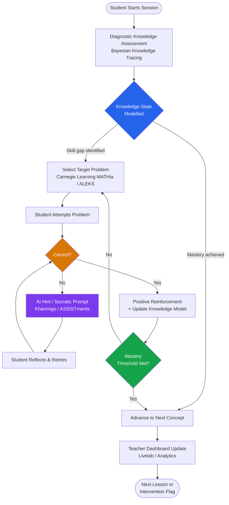
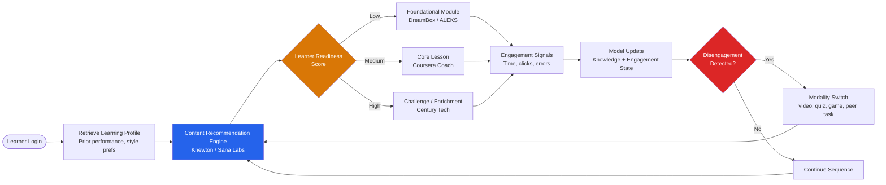
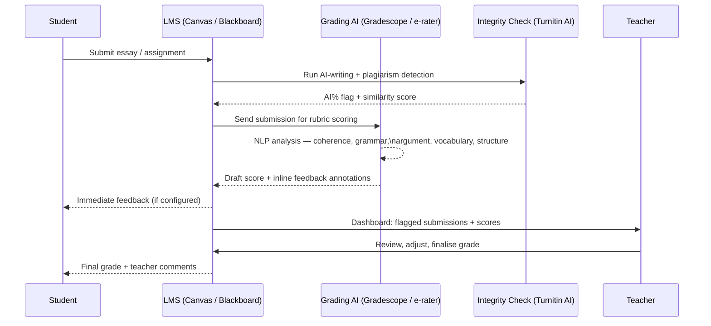
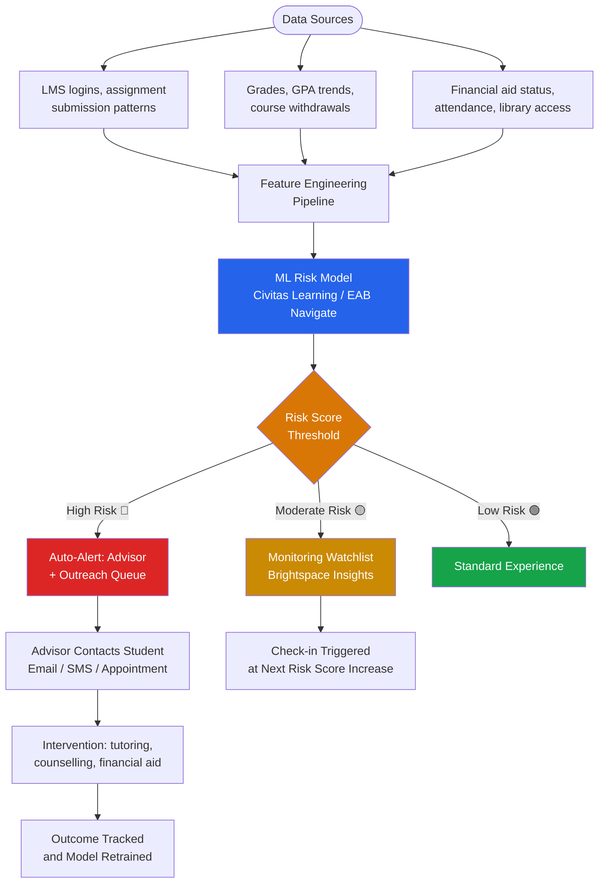
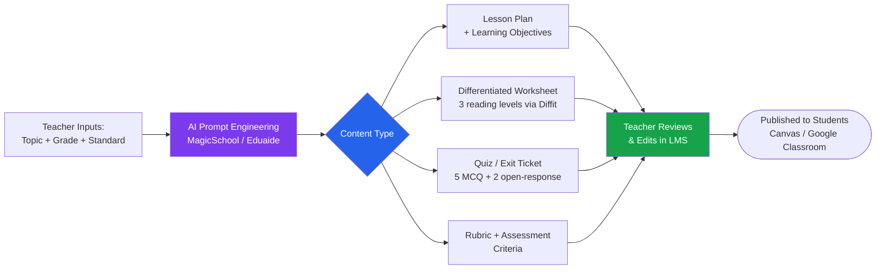
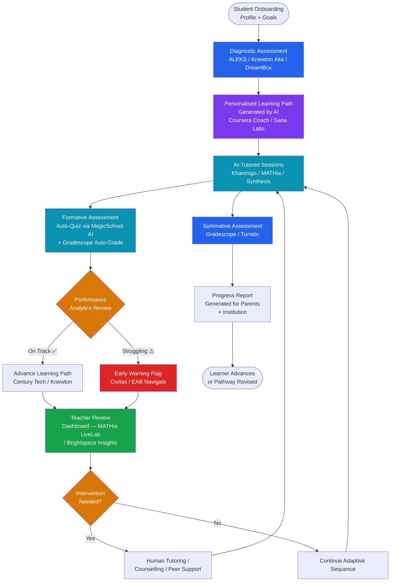
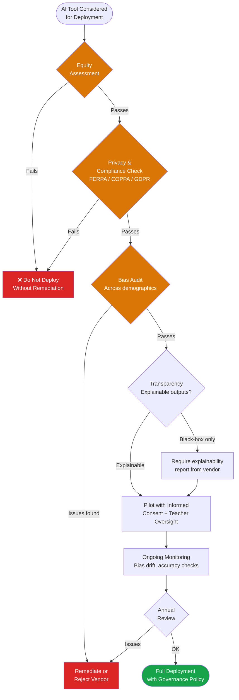
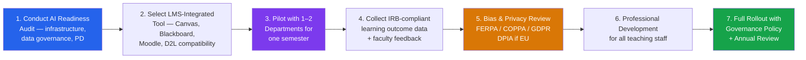

# AI in Education & EdTech

{ width="1200" }

Benjamin Bloom's landmark 1984 study showed that one-to-one tutoring produces learning gains two standard deviations above classroom instruction — the equivalent of moving the average student from the 50th to the 98th percentile. For four decades, that "2-sigma problem" sat unsolved because personalised tutoring at scale was simply too expensive. AI is now closing that gap. Intelligent tutoring systems, adaptive platforms, and large-language-model (LLM) teaching assistants are delivering individualised instruction to hundreds of millions of learners simultaneously, at a cost that approaches zero marginal expense per student. This guide maps the full landscape: use cases, tools, open-source ecosystems, ethics frameworks, and the evidence base behind real-world impact.

---

## Overview & Market Stats

| Metric | Value | Source / Year |
|---|---|---|
| Global AI in education market (2024) | $5.88 billion | Grand View Research, 2024 |
| Projected market size (2030) | $32.27 billion | Grand View Research, 2024 |
| CAGR (2024–2030) | ~31% | Grand View Research |
| Teacher time saved weekly using AI tools | 5.9 hours/week (~6 extra school weeks/year) | Gallup / Walton Family Foundation, 2025 |
| Students reporting improved understanding with generative AI | 50% | Multiple EdTech surveys, 2024 |
| Learning gains with AI tutoring vs. classroom (ASSISTments) | 75% greater gains for marginalised learners | ASSISTments RCT, 2024 |
| Khanmigo user growth (pilot → national rollout) | 68,000 → 700,000+ users (2023–2025) | Khan Academy, 2025 |
| Teachers using AI tools at least weekly (US public schools) | 30% | Gallup, 2025 |
| Riiid Santa TOEIC score improvement (20 hrs study) | +124 points average | Riiid, 2024 |
| Knewton / Arizona State — pass rate improvement | +17% pass rate, −56% course withdrawals | Knewton / ASU study |
| Adaptive learning studies showing positive effects | 86% of 37 recent studies | Navgood meta-analysis, 2024 |
| Digital device learning gain (PISA 2022) | +14 PISA points (up to 1 hr/day digital learning) | OECD PISA 2022 |

---

## Key AI Use Cases

### 1. Intelligent Tutoring Systems (ITS)

Intelligent Tutoring Systems provide personalised, one-to-one instructional interaction at scale by modelling the learner's knowledge state and adapting questions, hints, and explanations in real time. Modern ITS tools combine Bayesian Knowledge Tracing (BKT) with large language models to deliver the Socratic guidance that was once the exclusive province of human tutors.

**Leading tools:** Khan Academy Khanmigo, Carnegie Learning MATHia, Synthesis AI, ALEKS (McGraw-Hill), Squirrel AI (Yixue), ASSISTments (WPI)

**ITS Student Interaction Loop**



**Research highlight:** A 2025 randomised controlled trial published in *Nature Scientific Reports* found that students using AI tutors learned significantly more in less time compared with in-class active learning, revisiting Bloom's 2-sigma result at scale. Squirrel AI research with 1,355 Chinese eighth-graders showed adaptive tutoring outperformed expert teacher-led instruction on mathematics assessments.

---

### 2. Adaptive Learning Platforms

Adaptive platforms go beyond ITS by continuously reshaping the entire learning path — sequencing content, adjusting difficulty curves, switching modalities, and pre-empting disengagement — based on real-time learner signals including time-on-task, error patterns, and clickstream data.

**Leading tools:** Coursera Coach (powered by Google Gemini), Duolingo Max (GPT-4), Smart Sparrow, Knewton Alta (Wiley), DreamBox Learning (Discovery Education), Century Tech, Sana Labs, Pearson AI Tutor

{ width="700" }

**Adaptive Content Selection Flow**



---

### 3. Automated Essay & Assignment Grading

NLP-powered grading tools evaluate writing along multiple dimensions — coherence, argument structure, grammar, originality, and rubric alignment — giving students actionable feedback at a speed and consistency no human marker can match at scale. The ETS e-rater system has graded over 50 million essays since its introduction.

**Leading tools:** Turnitin Feedback Studio + AI writing indicator, Gradescope (Turnitin), ETS e-rater, Grammarly for Education, Writable AI, EssayGrader, CoGrader

**NLP Grading & Feedback Pipeline**



---

### 4. Student Performance Prediction & Early Warning Systems

Machine learning models ingest academic history, LMS engagement signals, financial stress indicators, and demographic data to generate risk scores for individual students — enabling advisors to intervene weeks before a student disengages or drops out.

**Leading tools:** Civitas Learning, EAB Navigate, Brightspace (D2L) Insights, Blackboard Predict, Academic Early Warning System (AEWS), IBM Watson Education

**Early Warning Data-to-Intervention Flow**



---

### 5. AI Teaching Assistants & Chatbots

AI TAs handle the high-volume, low-complexity queries that consume instructor office hours — FAQs, deadline reminders, concept clarifications, code debugging help — freeing human educators for high-value mentoring and discussion facilitation.

**Leading tools:** Jill Watson (Georgia Tech Design Intelligence Lab), Khanmigo, Ivy.ai, AdmitHub, Element451, Deakin University Genie, Carnegie Mellon's OLI platform

**Research highlight:** Georgia Tech's Jill Watson (originally IBM Watson-based, now LLM-powered with RAG) was deployed to 600+ students in Fall 2023. It achieved 75–97% accuracy on student queries depending on content source and consistently outperformed OpenAI Assistant (~30% accuracy) on course-specific questions. Students with access to Jill Watson showed stronger perceptions of teaching presence and higher social presence scores.

---

### 6. Content Generation & Curriculum Design

Generative AI is transforming lesson planning from a 4-hour weekly chore into a 20-minute iteration loop. AI tools generate standards-aligned lesson plans, differentiated worksheets, exit tickets, rubrics, and quiz questions in seconds — with teacher review remaining the essential quality gate.

**Leading tools:** MagicSchool AI (1.5M+ educators), Curipod, SchoolAI, Diffit (text levelling), Eduaide.ai, Microsoft Education Copilot, Google Gemini for Workspace in Education, Canva for Education AI

**Content Generation Workflow**



---

### 7. Language Learning AI

AI language tutors have moved beyond vocabulary drills to full conversational practice with real-time pronunciation correction, grammar explanation, and cultural context — approximating the experience of an immersive language partner at any hour.

**Leading tools:** Duolingo Max (GPT-4 Explain My Answer + Roleplay), Babbel AI, SpeakAI, ELSA Speak (pronunciation coaching), Pimsleur AI, Speeko, Ling App, Rosetta Stone AI

**Duolingo Max GPT-4 Features:**
- **Explain My Answer** — after a translation error, GPT-4 provides a personalised grammatical explanation and can continue the dialogue interactively
- **Roleplay** — practice real-world scenarios (ordering coffee in Paris, negotiating furniture purchase) with an AI conversational partner; post-session feedback covers accuracy, vocabulary complexity, and tips
- Available in Spanish, French, German, Japanese, and expanding

---

### 8. Accessibility & Inclusion

AI is significantly reducing barriers for students with dyslexia, ADHD, hearing impairments, visual impairments, and non-native language backgrounds — enabling genuinely inclusive education at a fraction of traditional assistive technology costs.

**Leading tools:** Microsoft Immersive Reader (embedded in Word, OneNote, Teams, Edge), Otter.ai (real-time lecture transcription), Google Read Along (phonics coaching for early readers), Speechify (text-to-speech), Be My Eyes + AI (visual assistance), Microsoft's Learning Tools, Snap&Read, Co:Writer

**Key capabilities:**
- **Microsoft Immersive Reader:** reads text aloud with word-by-word highlighting; syllable splitter, grammar colour coding, picture dictionary, focus mode; embedded across the Microsoft 365 Education suite
- **Otter.ai at Berkeley, Cornell, MSU:** real-time lecture-to-text; searchable transcripts; Zoom/Teams/Meet integration — widely adopted for Deaf and hard-of-hearing students
- **Google Read Along:** AI reading buddy that listens to children read aloud; supports 180+ languages; research shows 42% fluency improvement in Hindi-language pilots

---

## Top AI Tools & Platforms

| Tool | Provider | Primary Use Case | Free Tier? | Best For | Website |
|---|---|---|---|---|---|
| Khanmigo | Khan Academy | AI tutoring + teacher assist | Free for teachers | K–12, self-paced learners | khanmigo.ai |
| MATHia | Carnegie Learning | Adaptive maths ITS | No (district licence) | Middle/high school maths | carnegielearning.com |
| Synthesis | Synthesis | Problem-solving AI tutor | Freemium | K–8 enrichment | synthesis.com |
| ALEKS | McGraw-Hill | Maths + chemistry adaptive | Free trial | Higher ed, K–12 | aleks.com |
| Squirrel AI | Yixue Group | Adaptive K–12 AI tutor | No | Asia-Pacific markets | squirrelai.com |
| Duolingo Max | Duolingo | Language learning AI | No ($29.99/mo) | Adult language learners | duolingo.com |
| Coursera Coach | Coursera | Interactive course AI (Gemini) | No | University / professional | coursera.org |
| Gradescope | Turnitin | AI-assisted grading | Free tier | STEM, university | gradescope.com |
| Turnitin | Turnitin | Academic integrity + feedback | No | All grade levels | turnitin.com |
| MagicSchool AI | MagicSchool | Lesson planning, content gen | Freemium | K–12 teachers | magicschool.ai |
| Diffit | Diffit | Text levelling / adaptation | Freemium | Differentiated instruction | diffit.me |
| Eduaide.ai | Eduaide | AI lesson + resource gen | Freemium | All teachers | eduaide.ai |
| Curipod | Curipod | Interactive AI lessons | Freemium | Presentation + quizzes | curipod.com |
| Civitas Learning | Civitas | Student success analytics | No | Higher ed institutions | civitaslearning.com |
| EAB Navigate | EAB | Early warning, advising | No | University advising | eab.com |
| Brightspace Insights | D2L | LMS analytics + prediction | Bundled with D2L | LMS-integrated EWS | d2l.com |
| Jill Watson | Georgia Tech | AI teaching assistant | Research / open | Online graduate programmes | dilab.gatech.edu |
| Ivy.ai | Ivy.ai | Student services chatbot | No | University admissions | ivy.ai |
| Element451 | Element451 | Admissions AI CRM | No | University enrolment | element451.com |
| ELSA Speak | ELSA | Pronunciation coaching AI | Freemium | English pronunciation | elsaspeak.com |
| Microsoft Immersive Reader | Microsoft | Accessibility / reading | Free (M365 Education) | Students with dyslexia/ADHD | microsoft.com |
| Otter.ai | Otter | Lecture transcription | Freemium | Hard-of-hearing students | otter.ai |
| Google Read Along | Google | Early reading coach | Free | Early literacy, global | readalong.google.com |
| Socratic | Google | Homework help AI | Free | K–12 students | socratic.org |
| Photomath | Photomath (Google) | Step-by-step maths solver | Freemium | Maths homework | photomath.com |
| Wolfram Alpha | Wolfram | Computational knowledge engine | Freemium | STEM, higher ed | wolframalpha.com |
| Knewton Alta | Wiley | Adaptive courseware | Bundled with textbook | Higher ed courses | wiley.com/alta |
| DreamBox | Discovery Education | Adaptive K–8 maths | No | Elementary maths | dreambox.com |
| Sana Labs | Sana | AI corporate/university LMS | No | Enterprise learning | sanalabs.com |
| Riiid (Santa) | Riiid | Test prep AI (SAT, TOEIC) | Freemium | Standardised test prep | riiid.co |
| Century Tech | Century | Adaptive learning platform | No | UK/EU K–12 | century.tech |
| Age of Learning | Age of Learning | Early childhood AI learning | No | Pre-K – Grade 2 | ageoflearning.com |
| Pearson AI Tutor | Pearson | Embedded textbook AI | Bundled | Higher ed textbook users | pearson.com |
| GPTZero | GPTZero | AI writing detection | Freemium | Academic integrity | gptzero.me |
| Originality.ai | Originality | AI + plagiarism detection | No | Educators, institutions | originality.ai |
| SchoolAI | SchoolAI | Classroom AI assistant | Freemium | K–12 classroom | schoolai.com |
| Writable AI | Writable | Writing feedback + grading | No | K–12 writing instruction | writable.com |

---

## Open-Source & Research Ecosystem

### GitHub Repositories

| Repository | Stars | Description |
|---|---|---|
| [fsrs4anki](https://github.com/open-spaced-repetition/fsrs4anki) | ~3,900 | Free Spaced Repetition Scheduler — ML-optimised memory retention for Anki |
| [GeminiLight/awesome-ai-llm4education](https://github.com/GeminiLight/awesome-ai-llm4education) | ~600 | Curated list of AI/LLM-for-education research papers |
| [CAHLR/OATutor](https://github.com/CAHLR/OATutor) | ~200 | Open Adaptive Tutoring System with Bayesian Knowledge Tracing (ReactJS + Firebase) |
| [HKUDS/DeepTutor](https://github.com/HKUDS/DeepTutor) | ~180 | Agent-native personalised learning assistant (WWW '25) |
| [knowledge-graph (edu-commons)](https://github.com/topics/ai-in-education) | ~124 | Learning Commons data infrastructure for AI-powered educational tools |
| [Clean-CaDET/tutor](https://github.com/Clean-CaDET/tutor) | ~80 | ITS specialised for computing education; AI-powered feedback on clean code |
| [Tutorbot-Spock](https://github.com/topics/intelligent-tutoring-system) | ~55 | Education chatbot leveraging learning science + LLMs for biology tutoring |
| [feedbacksystem](https://github.com/topics/intelligent-tutoring-system) | ~23 | Personalised AI feedback for e-learning students |
| [Academic-Instability-EWS](https://github.com/topics/ai-in-education) | ~18 | Interpretable early warning system modelling academic pressure accumulation |
| [Riiid-Team/AI-Learning](https://github.com/Riiid-Team/AI-Learning) | ~15 | Knowledge state prediction from 100K+ students (Kaggle competition base) |

### HuggingFace Models

| Model | Downloads / month | Use Case |
|---|---|---|
| [potsawee/t5-large-generation-squad-QuestionAnswer](https://huggingface.co/potsawee/t5-large-generation-squad-QuestionAnswer) | ~2,300 | Question + answer generation from passages (SQuAD fine-tune) |
| [potsawee/t5-large-generation-race-QuestionAnswer](https://huggingface.co/potsawee/t5-large-generation-race-QuestionAnswer) | ~2,130 | Reading comprehension question generation (RACE fine-tune) |
| [mrm8488/t5-base-finetuned-question-generation-ap](https://huggingface.co/mrm8488/t5-base-finetuned-question-generation-ap) | ~1,680 | Lightweight T5 question generation — quiz auto-generation |
| [DanielHafezi/essayevaluator](https://huggingface.co/DanielHafezi/essayevaluator) | ~500 | Automated essay scoring — numerical score 1–6 |
| [tifa-benchmark/llama2_tifa_question_generation](https://huggingface.co/tifa-benchmark/llama2_tifa_question_generation) | ~112 | LLaMA 2 fine-tuned for faithful question generation with image grounding |

### Kaggle Datasets & Competitions

| Dataset / Competition | Records | Description | Link |
|---|---|---|---|
| Student Performance (UCI / Kaggle) | 10,000 rows | Hours studied, scores, extracurricular activities, performance index | [Kaggle](https://www.kaggle.com/datasets/haseebindata/student-performance-predictions) |
| Predict Students' Dropout & Academic Success | 4,424 students | Enrolment-time features → dropout / enrolled / graduate classification (3-class) | [UCI / Kaggle](https://www.kaggle.com/datasets/thedevastator/higher-education-predictors-of-student-retention) |
| MOOC Dropout Prediction | 100K+ students | Early-stage dropout probability in MOOCs | [Kaggle](https://www.kaggle.com/c/mooc-dropout-prediction) |
| OULAD (Open University Learning Analytics) | 32,593 students | Full anonymised interaction data from VLE across 22 courses | [OU](https://analyse.kmi.open.ac.uk/open_dataset) |
| Automated Essay Scoring (ASAP-AES) | 17,450 essays | 8 essay sets with human scores — the benchmark AES dataset | [Kaggle](https://www.kaggle.com/c/asap-aes) |
| PISA 2022 Student Microdata | 690,000 students | International student performance — reading, maths, science + student questionnaire | [OECD](https://www.oecd.org/pisa/data/) |

### Code Snippet: Auto-Generate Quiz Questions from a Textbook Passage

```python
from transformers import T5ForConditionalGeneration, T5Tokenizer

model_name = "mrm8488/t5-base-finetuned-question-generation-ap"
tokenizer  = T5Tokenizer.from_pretrained(model_name)
model      = T5ForConditionalGeneration.from_pretrained(model_name)

def generate_questions(passage: str, answer_hint: str, n: int = 3) -> list[str]:
    """Generate quiz questions from a passage + answer hint."""
    input_text = f"answer: {answer_hint}  context: {passage}"
    inputs = tokenizer(input_text, return_tensors="pt",
                       max_length=512, truncation=True)
    outputs = model.generate(
        **inputs,
        num_beams=4,
        num_return_sequences=n,
        max_new_tokens=64,
    )
    return [tokenizer.decode(o, skip_special_tokens=True) for o in outputs]

# Example usage
passage = (
    "Photosynthesis is the process by which plants use sunlight, water, "
    "and carbon dioxide to produce oxygen and energy in the form of glucose."
)
questions = generate_questions(passage, answer_hint="glucose")
for q in questions:
    print(q)
# → "What do plants produce through photosynthesis?"
# → "What form of energy do plants produce using sunlight?"
# → "What molecule is created as a product of photosynthesis?"
```

---

## Best End-to-End AI Learning Workflow



---

## Platform Deep Dives

### Khan Academy Khanmigo

{ width="700" }

**Provider:** Khan Academy | **Powered by:** GPT-4 | **Cost:** Free for teachers; student access via school/district

**What makes it unique:**

Khanmigo is deliberately non-answer-giving. When a student asks "what is the answer to problem 12?", Khanmigo responds with a guiding question, not the solution — modelling the Socratic method at LLM speed. Its tight integration with Khan Academy's content library (covering K–12 maths, sciences, history, coding, SAT prep) means it can reference exact exercises, videos, and articles rather than generating generic explanations.

**Key features:**
- **Socratic Tutoring** — guides students to solutions through prompts, never provides direct answers
- **Writing Coach** — helps students understand prompts, build outlines, and review drafts; flags any 15+ word pasted external text for teacher review
- **Lesson Planner for Teachers** — standards-aligned lesson plans, rubrics, exit tickets, on-demand student progress summaries
- **Debate Partner & Historical Character Chat** — students practice argumentation and discuss events "with" historical figures
- **Text-to-speech / Speech-to-text** — full audio interaction mode
- **Safety monitoring** — alerts teachers if it detects potential safety issues with minor users
- **Scale:** Grew from 68,000 pilot users (2023–24) to 700,000+ active users across hundreds of US districts and internationally in India, Brazil, and the Philippines by 2025

---

### Duolingo Max

{ width="700" }

**Provider:** Duolingo | **Powered by:** GPT-4 | **Cost:** $29.99/month or $167.99/year (above Super Duolingo)

**What makes it unique:**

Duolingo Max's two GPT-4 features directly address the deepest learning gaps in traditional language apps: understanding *why* an answer was wrong, and practising *real conversation* without the anxiety of speaking with a human.

**Key features:**
- **Explain My Answer** — after any exercise error, GPT-4 provides a personalised grammatical breakdown in the learner's native language; the learner can ask follow-up questions and GPT-4 dynamically updates. This solves the fundamental limitation of static error messages.
- **Roleplay (Video Call)** — scenario-based AI conversations: order coffee at a Parisian café, plan a vacation, go furniture shopping. No two conversations are identical. Post-session AI feedback covers accuracy, vocabulary complexity, and improvement tips.
- **Why GPT-4 specifically:** Duolingo tested GPT-3 for conversational features but found accuracy insufficient for safe deployment with language learners. GPT-4's accuracy enabled production launch.
- **Current languages:** Spanish, French, German, Japanese, Italian (expanding)
- **Broader AI use:** Duolingo also uses GPT-4 for internal content generation — creating new exercises 100× faster than human course builders

---

### Coursera Coach / AI Features

{ width="700" }

**Provider:** Coursera | **Powered by:** Google Gemini | **Cost:** Bundled with Coursera subscriptions

**What makes it unique:**

Coursera Coach is the first LMS-embedded AI teaching assistant powered by a frontier model (Google Gemini) that allows *instructors* to customise the AI's persona, teaching style, learning objectives, and reference documents — effectively letting every course have its own AI tutor with deep course context.

**Key features:**
- **Instructor customisation** — specify learning objectives, preferred pedagogy, assessment criteria, and upload additional course files for enhanced context
- **Interactive instruction** — Coach engages learners in Socratic dialogue, answering questions about lecture content, guiding through assignments, and providing career guidance
- **Microsoft 365 integration** — Coursera has released a learning agent within Microsoft 365 Copilot, surfacing course content directly in workplace tools as learners complete real tasks
- **World-class instructor adoption** — early adopters include Andrew Ng (DeepLearning.AI), Barbara Oakley (Oakland University), Jules White (Vanderbilt), and Vic Strecher (University of Michigan)
- **Content breadth:** 300+ AI courses; coverage across Google, Microsoft, IBM, and top universities

---

## ROI & Learning Impact

| Application | Key Metric | Improvement | Study / Source |
|---|---|---|---|
| AI tutoring vs. classroom (RCT) | Time to equivalent learning | Significantly less time with AI tutor | Nature Scientific Reports, 2025 |
| Bloom's 2-sigma one-to-one tutoring | Percentile gain | +2 SD (50th → 98th percentile) | Bloom, Educational Researcher, 1984 |
| ASSISTments adaptive maths (marginalised learners) | Learning gains | 75% greater gains vs. control | ASSISTments / WPI RCT, 2024 |
| MATHia (Carnegie Learning) — middle school | Algebra 1 outcomes | Greater gains vs. traditional; largest for under-performing students | Student Achievement Partners, 2021 |
| Squirrel AI vs. expert teachers (China RCT) | Maths test scores | Statistically greater gains for AI group | arXiv:1901.10268 |
| Squirrel AI reasoning accuracy | Accuracy rate | +16.8% reasoning, +11.6% application | Squirrel AI internal study, 2024 |
| Knewton / Arizona State University | Pass rate / withdrawals | +17% pass rate; −56% withdrawals | Knewton / ASU study |
| Duolingo engagement (AI personalisation) | Daily active users | 2× engagement growth 2023–2024 | Duolingo earnings, 2024 |
| Riiid Santa (TOEIC) | Score improvement (20 hrs) | +124 points average | Riiid, 2024 |
| Teacher content creation (AI-assisted) | Weekly time saved | 5.9 hrs/week (~6 school weeks/year) | Gallup / Walton, 2025 |
| AI grading tools — feedback turnaround | Turnaround time | Minutes vs. 1–2 week human grading cycle | Gradescope / Turnitin case studies |
| Google Read Along (Hindi phonics) | Reading fluency improvement | +42% in Hindi pilot | Google / ResearchGate, 2024 |
| Adaptive learning (meta-analysis of 37 studies) | Studies showing positive effects | 86% of studies | Navgood meta-analysis, 2024 |
| Adaptive vs. non-adaptive courses (6,400 courses) | Student performance | Adaptive outperformed non-adaptive | Knewton large-scale analysis |

---

## Ethics, Safety & Equity

### Academic Integrity & AI Detection

The proliferation of LLM-generated student work has produced a counter-industry of AI detection tools. The landscape is complex: Turnitin claims 98% accuracy and GPTZero claims 99%, but independent testing has found false positive rates of 1–2% even on clearly human-written essays — and higher rates for non-native English speakers, neurodiverse writers, and students from non-Western academic traditions.

**Key tools:** Turnitin AI Writing Indicator, GPTZero (FERPA/COPPA-aligned, SOC 2 Type II audited), Originality.ai, Copyleaks, ZeroGPT

**Responsible approach:** Most leading institutions now recommend combining detection tools with process-based assessment (in-class writing, oral defence, portfolio evidence) rather than relying solely on AI detectors.

### Data Privacy for Minors (COPPA, FERPA, GDPR)

- **FERPA (US):** Student education records are protected; EdTech vendors processing student data must have a signed agreement with institutions and cannot use data for advertising.
- **COPPA (US):** Strict rules apply for services collecting data from children under 13 — parental consent, data minimisation, and deletion on request.
- **GDPR (EU):** Schools acting as data controllers must conduct DPIAs for AI tools; student data cannot be used to train vendor models without explicit consent.
- **Emerging practice:** Most universities now purge raw AI-detection logs after one year, retaining only aggregated summaries for accreditation reporting.

### Algorithmic Bias in Grading & Admissions

Automated grading systems can encode historical inequities. Research shows that AES models trained predominantly on essays from high-SES, native-English-speaking students may systematically undervalue code-switching, culturally specific argumentation styles, and non-standard grammatical constructions that are valid in many dialects. Bias auditing — testing model performance across demographic groups — is now a standard requirement in responsible AI procurement.

### Digital Divide & Equitable Access

AI EdTech is currently concentrated in high-bandwidth, device-rich environments. Globally, 2.2 billion children and youth lack internet access at home (UNESCO). Bridging this gap requires:
- Offline-capable AI applications (Google Read Along works offline; DreamBox has low-bandwidth mode)
- Device lending programmes and LTE-based connectivity for rural schools
- Open-source ITS alternatives (OATutor, ASSISTments free tier) for under-resourced districts

### Responsible AI in Education Framework



---

## Getting Started Guide

### For Teachers — First Steps (Free Tools)

1. **Start with MagicSchool AI** (free tier) to generate your first AI lesson plan. Upload your learning standard and grade level; review and edit the output — this builds intuition for what AI gets right and wrong.
2. **Try Khanmigo** (100% free for US teachers) — assign it to 3–5 students for one week on a topic where they need extra practice. Review the teacher dashboard to see engagement data.
3. **Use Diffit** to take a grade-level text and auto-generate a version at two reading levels below — immediately useful for differentiated instruction without extra preparation time.
4. **Pilot Gradescope** (free tier) for one assignment — photograph handwritten work or upload PDFs; let AI group similar responses. Grade one group, apply to all.
5. **Explore Google Read Along** for early-literacy students — it requires no teacher setup per student and works offline.

### For Institutions — Integration Checklist



**LMS Integration notes:**
- **Canvas** — integrates natively with Gradescope, Turnitin, MagicSchool AI (via LTI), and Khanmigo (in pilot)
- **Blackboard / Anthology** — Blackboard Predict built-in; Civitas Learning and EAB Navigate integrate via API
- **Moodle** — open-source plugins available for AI quiz generation (Moodle AI Quiz), H5P interactive content, and Otter.ai transcript import
- **Google Classroom** — native integration with Google Read Along, Gemini for Education (Workspace), and Socratic by Google

**Data requirements before piloting:**
- Define which student data the tool accesses (LMS logs, grades, demographic data)
- Confirm vendor's FERPA / COPPA / GDPR agreement is signed
- Establish a data retention and deletion schedule
- Document the opt-out process for students and parents

---

## References

1. Bloom, B. S. (1984). The 2 sigma problem: The search for methods of group instruction as effective as one-to-one tutoring. *Educational Researcher, 13*(6), 4–16. [https://doi.org/10.3102/0013189X013006004](https://doi.org/10.3102/0013189X013006004)

2. Vanlehn, K. (2011). The relative effectiveness of human tutoring, intelligent tutoring systems, and other tutoring systems. *Educational Psychologist, 46*(4), 197–221. [https://doi.org/10.1080/00461520.2011.611369](https://doi.org/10.1080/00461520.2011.611369)

3. Mousavinasab, E., Zarifsanaiey, N., Niakan Kalhori, S. R., Rakhshan, M., Keikha, L., & Ghazi Saeedi, M. (2021). Intelligent tutoring systems: A systematic review of characteristics, applications, and evaluation methods. *Interactive Learning Environments, 29*(1), 142–163. [https://doi.org/10.1080/10494820.2018.1558257](https://doi.org/10.1080/10494820.2018.1558257)

4. Crompton, H., & Burke, D. (2024). AI and English language teaching: Affordances and challenges. *British Journal of Educational Technology, 55*, 2503–2529. [https://doi.org/10.1111/bjet.13460](https://doi.org/10.1111/bjet.13460)

5. Zawacki-Richter, O., Marín, V. I., Bond, M., & Gouverneur, F. (2019). Systematic review of research on artificial intelligence applications in higher education. *International Journal of Educational Technology in Higher Education, 16*, 39. [https://doi.org/10.1186/s41239-019-0171-0](https://doi.org/10.1186/s41239-019-0171-0)

6. Kulik, J. A., & Fletcher, J. D. (2016). Effectiveness of intelligent tutoring systems: A meta-analytic review. *Review of Educational Research, 86*(1), 42–78. [https://doi.org/10.3102/0034654315581420](https://doi.org/10.3102/0034654315581420)

7. UNESCO. (2023). *Guidance for Generative AI in Education and Research*. UNESCO Publishing. [https://unesdoc.unesco.org/ark:/48223/pf0000386693](https://unesdoc.unesco.org/ark:/48223/pf0000386693)

8. OECD. (2023). *OECD Digital Education Outlook 2023: Towards an Effective Digital Education Ecosystem*. OECD Publishing. [https://doi.org/10.1787/c74f03de-en](https://doi.org/10.1787/c74f03de-en)

9. Goel, A. K., & Polepeddi, L. (2016). Jill Watson: A virtual teaching assistant for online education. In *Proceedings of the International Workshop on Domain Modeling for Adaptive Educational Systems*. Georgia Tech Design Intelligence Lab. [https://dilab.gatech.edu/test/wp-content/uploads/2022/06/GoelPolepeddi-DedeRichardsSaxberg-JillWatson-2018.pdf](https://dilab.gatech.edu/test/wp-content/uploads/2022/06/GoelPolepeddi-DedeRichardsSaxberg-JillWatson-2018.pdf)

10. Ai, Y., Yang, Y., Song, Y., & Ma, S. (2019). Performance comparison of an AI-based adaptive learning system in China. *arXiv preprint arXiv:1901.10268*. [https://arxiv.org/abs/1901.10268](https://arxiv.org/abs/1901.10268)

11. Ludwig, S., & Lorenz, P. (2021). Automated essay scoring using transformer models. *Psych, 3*(4), 897–915. [https://doi.org/10.3390/psych3040056](https://doi.org/10.3390/psych3040056)

12. Grand View Research. (2024). *AI in Education Market Size & Share Report, 2030*. Grand View Research. [https://www.grandviewresearch.com/industry-analysis/artificial-intelligence-ai-education-market-report](https://www.grandviewresearch.com/industry-analysis/artificial-intelligence-ai-education-market-report)

13. Gallup / Walton Family Foundation. (2025). *AI Use Among US Public School Teachers Survey*. Gallup. [https://www.waltonk12.org/](https://www.waltonk12.org/)

14. Orr, D., & Simmons, W. K. (2025). AI tutoring outperforms in-class active learning: An RCT introducing a novel research-based design in an authentic educational setting. *Scientific Reports, 15*, 13042. [https://doi.org/10.1038/s41598-025-97652-6](https://doi.org/10.1038/s41598-025-97652-6)
