# AI in Energy & Utilities

{ width="1200" }

The energy sector is undergoing its most profound transformation in a century. Artificial intelligence is now central to that transformation — optimising every megawatt of generation, predicting demand hours before it arrives, extending the life of assets worth hundreds of millions of dollars, and helping grid operators balance an increasingly complex, decentralised system in real time. From offshore wind farms in the North Sea to smart meters in suburban homes, AI is accelerating the energy transition at every scale.

This guide covers the full landscape: market data, use-case workflows with Mermaid diagrams, open-source tools with star counts, commercial platforms with deployment data, business ROI, regulatory context, and a curated reference list drawn from Nature Energy, IEA, IRENA, and IEEE.

---

## Overview & Market Statistics

| Metric | Value | Source / Year |
|---|---|---|
| Global AI in energy market (2024) | $8.91 billion | MarketsandMarkets, 2024 |
| Projected market size (2030) | $58.66 billion | MarketsandMarkets, 2024 |
| CAGR (2024–2030) | 36.9% | GlobeNewswire, 2024 |
| AI-unlocked additional transmission capacity | Up to 175 GW | IEA Energy and AI Report, 2025 |
| DeepMind cooling energy reduction | 40% cooling energy | Google DeepMind, 2016–2024 |
| Renewable curtailment reduction (AI forecasting) | 9–21% | Multiple grid operators |
| AI fault detection — outage duration reduction | 30–50% | IEA / industry studies |
| Demand forecasting accuracy (AI vs. statistical) | 90–95%+ | Applied Energy reviews |
| Grid balancing cost reduction (Terna, Italy) | EUR 87M/year | Terna TSO, 2024 |
| Renewable energy management — largest AI segment | 33% market share | Grand View Research, 2025 |
| E.ON cumulative AI operational value (2022–2025) | EUR 180 million | E.ON annual reports |

AI is not simply an efficiency tool for energy — it is an enabler of the energy transition itself. Variable renewables (solar, wind) create new forecasting and balancing challenges that only machine learning can handle at the scale and speed required. The IEA's 2025 "Energy and AI" report identifies AI as a critical lever for unlocking grid capacity, reducing curtailment, and integrating distributed energy resources (DERs), all without building new wires.

---

## Key AI Use Cases

### 1. Energy Demand Forecasting

Accurate load forecasting is the foundation of grid operations. AI models — from gradient-boosted trees to transformer-based foundation models — now routinely outperform traditional econometric methods by 15–30% on MAPE metrics. Short-term (1–48 hour) forecasts drive dispatch decisions; medium-term (1–12 week) forecasts inform fuel procurement and reserve scheduling; long-term (year+) forecasts drive capacity planning.

**Leading tools:** AutoGrid (now Uplight) Flex, Oracle Utilities AI, Itron Riva, Bidgee, SparkCognition PowerPredict, C3.ai for Energy, IBM Maximo, Palantir Foundry for Energy.

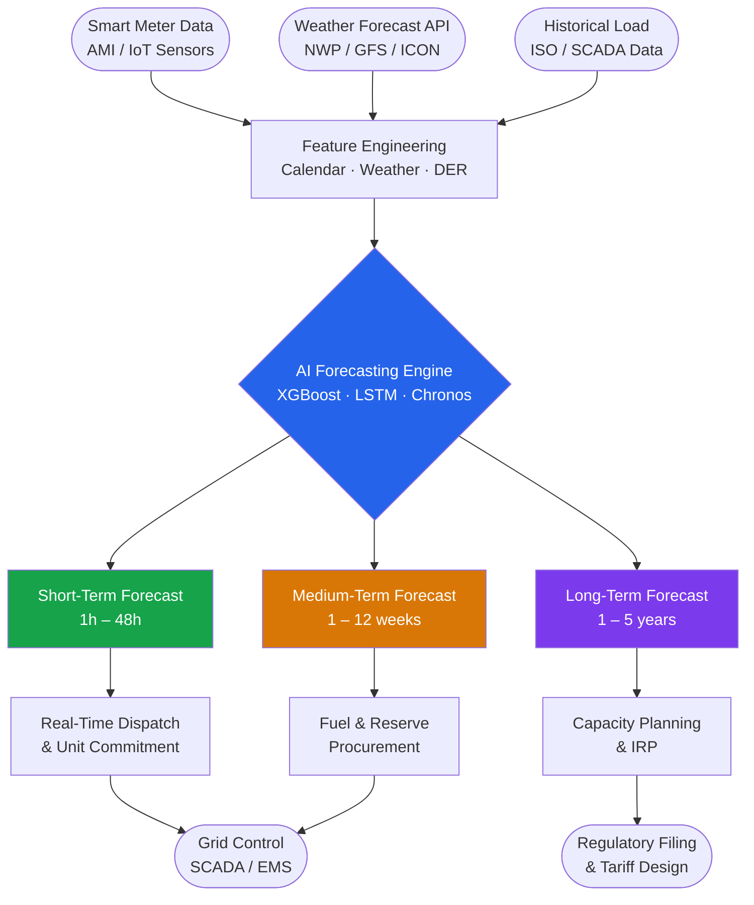

---

### 2. Renewable Energy Optimization

Solar and wind generation are inherently variable. AI models trained on numerical weather prediction (NWP) outputs, satellite imagery, LIDAR data, and historical generation patterns can predict output with sufficient accuracy to reduce balancing costs and curtailment. For wind, AI also controls individual turbine pitch angles in real time to maximise yield and reduce mechanical stress.

{ width="800" }

**Leading tools:** GE Vernova Renewable Grid Solutions / GridOS, Siemens Gamesa Digital Twin, Vestas PowerBI Analytics, DNV Beacon, HOMER Energy (NREL), WindESCo Wake Steering, Greenbyte (Ormant), Openwind.

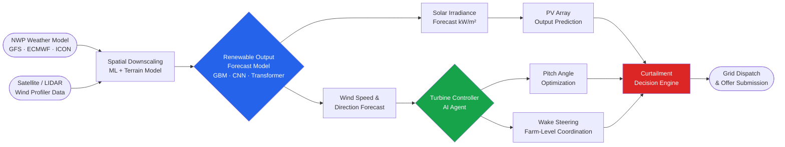

---

### 3. Smart Grid & Demand Response

Modern distribution grids must balance millions of distributed assets — rooftop solar, EVs, battery storage, heat pumps — in near real time. AI-powered DERMS (Distributed Energy Resource Management Systems) and demand response platforms orchestrate these assets to flatten peaks, avoid costly grid reinforcement, and earn revenue in wholesale markets (enabled by FERC Order 2222).

**Leading tools:** AutoGrid Flex (Uplight), Enbala (now Uplight), Virtual Peaker, OhmConnect, Enel X, Voltus, Schneider EcoStruxure Grid, Honeywell Forge Energy, GridPoint.

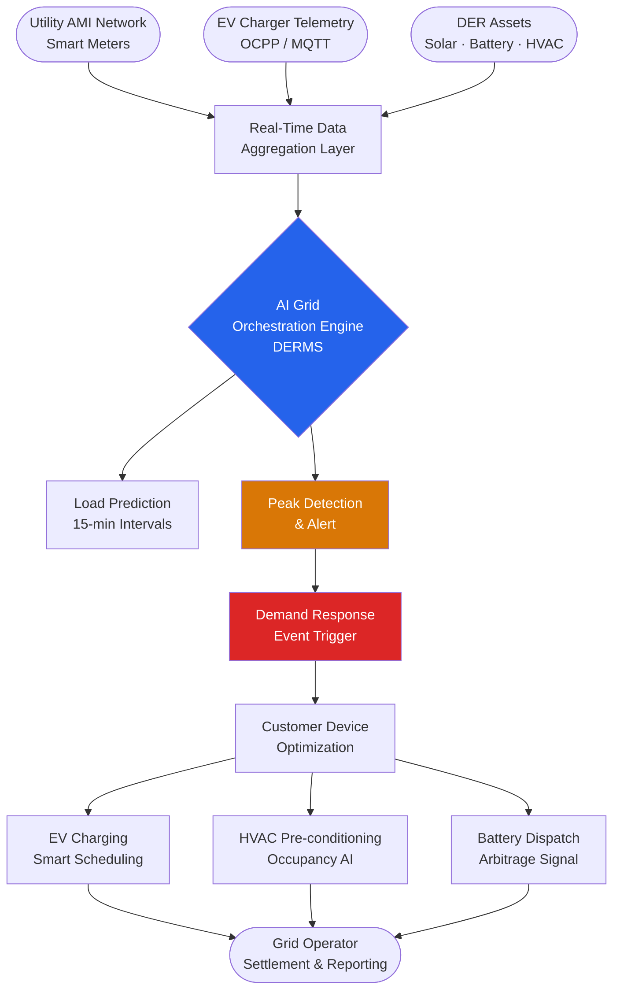

---

### 4. Predictive Maintenance for Energy Assets

Unplanned failures in wind turbines, transformers, and substations cost operators millions in downtime and emergency repair. AI-driven predictive maintenance analyses vibration signals, temperature, current harmonics, and oil chemistry to detect degradation weeks or months before failure.

**Leading tools:** GE Vernova APM (Asset Performance Management), ABB Ability Ellipse / Genix, SparkCognition Darwin AI, Uptake Energy, Azima DLI, Aclima, IBM Maximo for Utilities, Aspentech APM.

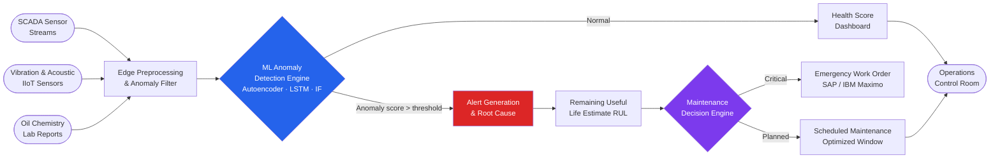

---

### 5. Energy Trading & Market Analytics

Electricity markets operate on millisecond to day-ahead timescales, with prices driven by weather, fuel costs, grid constraints, and participant behaviour. AI provides a decisive edge: probabilistic price forecasting, optimal bidding strategies, portfolio risk management, and automated trading.

**Leading tools:** Axpo Digital, Statkraft Originator AI, Montel Analytics, EPEX SPOT AI tools, Benchmark Mineral Intelligence, Aucerna (IFS), Openlink Findur, Brady EnergyTech.

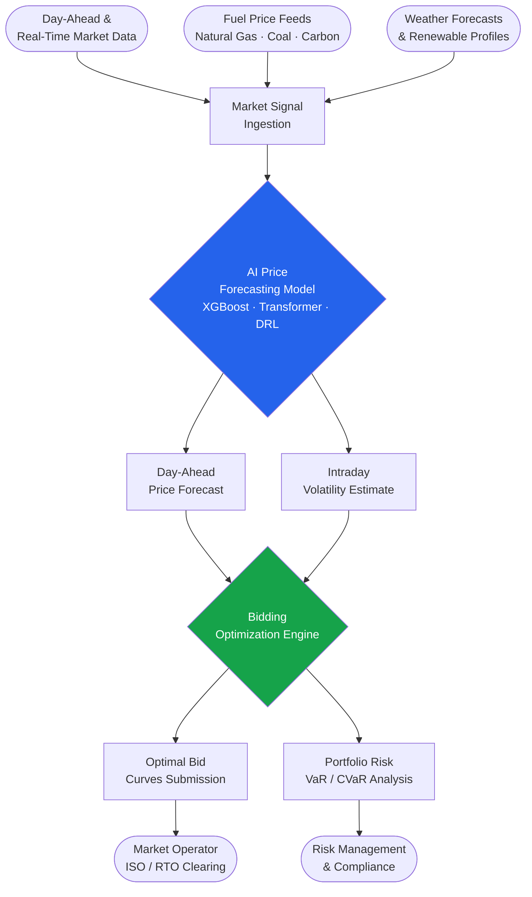

---

### 6. Carbon Tracking & Emissions Management

Grid-connected operations have a carbon footprint that varies by hour and by region, depending on the generation mix. AI tools now provide real-time marginal emissions signals, enabling smart shifting of loads to low-carbon windows and automated Scope 2 carbon accounting.

**Leading tools:** Electricity Maps (Tomorrow.io), WattTime (RMI), Persefoni, Watershed, South Pole Carbon, Arcadia (Urjanet), Greenpixie, Climatiq.

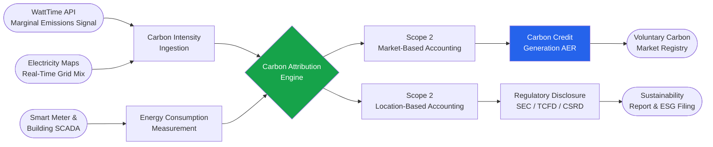

WattTime's Automated Emissions Reduction (AER) signal, updated every 5 minutes, now covers 99% of global electricity consumption across 21 new countries as of 2024, including Japan, India, Brazil, and South Korea.

---

### 7. Nuclear & Industrial Plant Operations

Nuclear and large thermal plants generate enormous volumes of sensor data. AI detects subtle anomalies in coolant temperatures, neutron flux patterns, pump vibration, and valve positions that would be invisible to traditional threshold alarms.

**Leading tools:** Exelon AI analytics suite, EDF Flamanville Digital Twin, NuScale Digital Instrumentation & Control (I&C), Curtiss-Wright Plex, Enercon Services, Framatome TELEPERM.

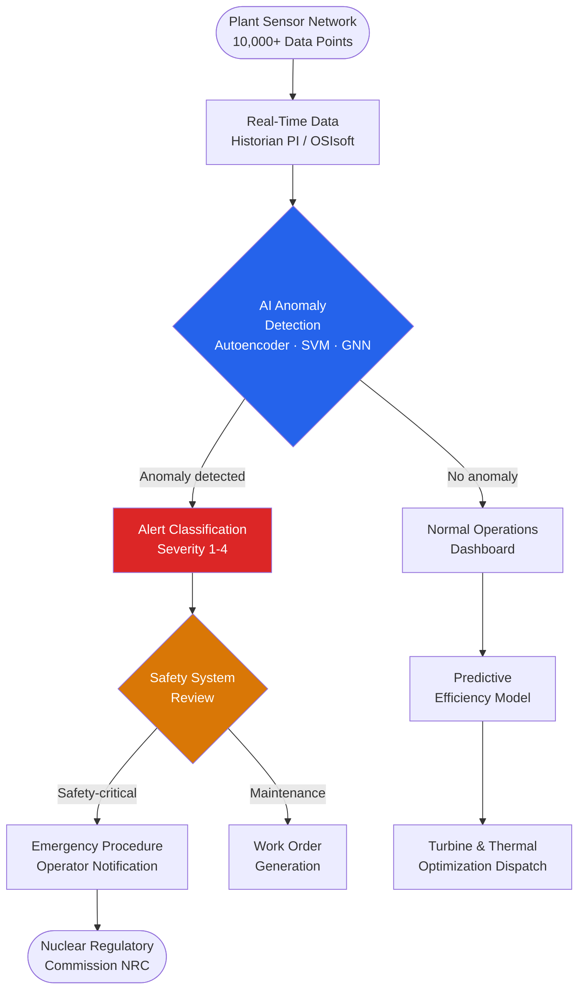

---

### 8. Building Energy Management (BEMS)

Buildings account for approximately 40% of global energy use. AI-driven BEMS systems integrate occupancy sensing, weather forecasts, utility rate signals, and equipment telemetry to reduce HVAC energy consumption by 20–40% while maintaining comfort.

{ width="800" }

**Leading tools:** Google DeepMind (datacenter cooling), BrainBox AI (commercial HVAC), Verdigris (real-time circuit monitoring), Turntide Technologies (switched reluctance motor drives), PassiveLogic (autonomous digital twins), Johnson Controls OpenBlue, Siemens Desigo CC, Schneider EcoStruxure Building.

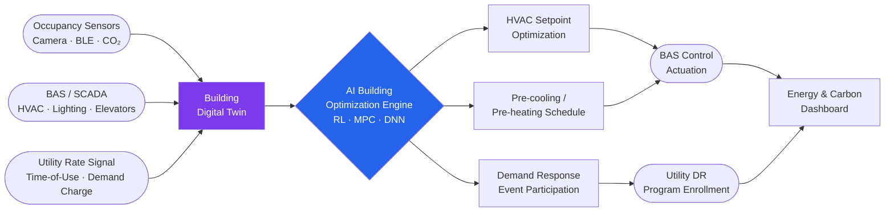

Google DeepMind's reinforcement learning agent, deployed across Google's global data centre fleet, reduced cooling energy by 40% and overall PUE by 15%, one of the most cited real-world AI energy results.

---

## Top AI Tools & Platforms

| Tool / Platform | Provider | Category | Key Feature | Open Source? | Website |
|---|---|---|---|---|---|
| AutoGrid Flex | Uplight (formerly AutoGrid) | DERMS / Demand Response | AI-driven DER orchestration for utilities | No | uplight.com |
| GridOS | GE Vernova | Grid Software | Grid orchestration platform with AI/ML automation | No | gevernova.com |
| GridBeats | GE Vernova | Grid Automation | Software-defined substation automation with AI | No | gevernova.com |
| APM (Asset Performance Mgmt) | GE Vernova | Predictive Maintenance | ML-based RUL estimation for turbines/transformers | No | gevernova.com |
| Ability Ellipse APM | ABB | Asset Management | Digital twin + AI for utility asset health | No | new.abb.com |
| Ability Genix | ABB | Industrial IoT / AI | IIoT analytics suite, 40% O&M cost reduction | No | new.abb.com |
| Spectrum Power | Siemens Energy | EMS / SCADA | AI-driven demand forecasting and DER coordination | No | siemens-energy.com |
| Darwin AI | SparkCognition | Predictive Maintenance | Automated ML for industrial equipment | No | sparkcognition.com |
| C3.ai for Energy | C3.ai | Enterprise AI | Unified AI applications for utilities and O&G | No | c3.ai |
| IBM Maximo | IBM | Asset Management | AI-enhanced CMMS for utility assets | No | ibm.com/maximo |
| Palantir Foundry | Palantir | Data Platform | Operational AI for energy asset management | No | palantir.com |
| Microsoft Energy Data Services | Microsoft | Data Platform | Open energy data platform (OSDU) on Azure | No | azure.microsoft.com |
| AWS Energy | Amazon Web Services | Cloud / AI | SageMaker-based energy ML workflows | No | aws.amazon.com |
| EcoStruxure Grid | Schneider Electric | Smart Grid | AI grid management and analytics | No | se.com |
| Forge Energy | Honeywell | Building/Industrial | Connected building and plant energy AI | No | honeywell.com |
| WattTime | RMI (non-profit) | Carbon Tracking | Marginal emissions API, AER signal | API (free tier) | watttime.org |
| Electricity Maps | Tomorrow.io | Carbon Tracking | Real-time grid carbon intensity, 60+ countries | Open (GitHub) | electricitymaps.com |
| BrainBox AI | BrainBox AI | BEMS | Autonomous HVAC AI for commercial buildings | No | brainboxai.com |
| Virtual Peaker | Virtual Peaker | Demand Response | Cloud-native DR platform for utilities | No | virtualpeaker.com |
| OhmConnect | OhmConnect | Demand Response | Consumer-facing demand response aggregation | No | ohmconnect.com |
| Voltus | Voltus | Demand Response | Industrial & commercial demand response | No | voltus.com |
| HOMER Energy | NREL / UL | Microgrid Optimization | Hybrid energy system sizing and dispatch | Commercial | homerenergy.com |
| Persefoni | Persefoni | Carbon Accounting | AI-powered Scope 1/2/3 carbon tracking | No | persefoni.com |
| Watershed | Watershed | Carbon Management | Enterprise carbon data platform | No | watershedclimate.com |
| GridPoint | GridPoint | BEMS | Commercial building energy intelligence | No | gridpoint.com |
| Arcadia (Urjanet) | Arcadia | Energy Data | Utility bill data aggregation and carbon | No | arcadia.com |
| PassiveLogic | PassiveLogic | BEMS | Autonomous digital twin building control | No | passivelogic.com |

---

## Open-Source & Research Ecosystem

### GitHub Repositories

| Repository | Stars | Category | Description |
|---|---|---|---|
| [amazon-science/chronos-forecasting](https://github.com/amazon-science/chronos-forecasting) | 5.1k | Time-Series Foundation Model | Pretrained language model architecture for zero-shot time series forecasting |
| [Nixtla/neuralforecast](https://github.com/Nixtla/neuralforecast) | 4.1k | Neural Forecasting | 30+ neural forecasting models — LSTM, NBEATS, PatchTST, TimesNet |
| [PyPSA/PyPSA](https://github.com/PyPSA/PyPSA) | 1.9k | Power System Analysis | Python for Power System Analysis — full AC/DC network optimisation |
| [pvlib/pvlib-python](https://github.com/pvlib/pvlib-python) | 1.5k | Solar Simulation | PV system performance modelling from Sandia National Laboratories |
| [wind-python/windpowerlib](https://github.com/wind-python/windpowerlib) | 381 | Wind Modelling | Wind turbine and farm output modelling library |
| [openclimatefix/open-source-quartz-solar-forecast](https://github.com/openclimatefix/open-source-quartz-solar-forecast) | ~400 | Solar Forecasting | GBT solar forecast trained on 25k PV sites, 5+ years of history |
| [NREL/SAM](https://github.com/NREL/SAM) | 395 | Renewable Simulation | NREL System Advisor Model — techno-economic analysis of RE projects |
| [OpenEnergyPlatform/awesome-sustainable-technology](https://github.com/OpenEnergyPlatform/awesome-sustainable-technology) | 1.5k+ | Curated List | Comprehensive list of open energy modelling tools and data |
| [samy101/awesome-energy-forecasting](https://github.com/samy101/awesome-energy-forecasting) | ~300 | Curated List | Curated energy forecasting resources, datasets, and competitions |

### HuggingFace Models

| Model | Provider | Downloads | Use Case |
|---|---|---|---|
| [amazon/chronos-2](https://huggingface.co/amazon/chronos-2) | Amazon | 15.7M | Zero-shot univariate and multivariate time series forecasting |
| [autogluon/chronos-bolt-small](https://huggingface.co/autogluon/chronos-bolt-small) | Amazon / AutoGluon | 10M | Fast, memory-efficient energy load forecasting |
| [amazon/chronos-bolt-base](https://huggingface.co/amazon/chronos-bolt-base) | Amazon | 6.45M | Balanced accuracy/speed for grid forecasting pipelines |
| [Salesforce/moirai-1.1-R-large](https://huggingface.co/Salesforce/moirai-1.1-R-large) | Salesforce | 1.32M | Universal time series — probabilistic, multivariate, any frequency |
| [google/timesfm-2.5-200m](https://huggingface.co/google/timesfm-2.5-200m) | Google | ~120k | Decoder-only foundation model for long-horizon forecasting |

### Kaggle Datasets & Competitions

| Dataset / Competition | Platform | Description |
|---|---|---|
| [Global Energy Forecasting Competition 2012 (GEFCom2012)](https://www.kaggle.com/c/global-energy-forecasting-competition-2012-load-forecasting) | Kaggle | Hierarchical load and wind forecasting; landmark benchmark |
| [GEFCom2014 Dataset](https://www.kaggle.com/datasets/cthngon/gefcom2014-dataset) | Kaggle | 7-year New England ISO hourly load + temperature; 581 participants, 61 countries |
| [AMS Solar Energy Prediction Contest](https://www.kaggle.com/c/ams-2014-solar-energy-prediction-contest) | Kaggle | Oklahoma Mesonet solar irradiance from NOAA NWP ensembles |
| [Wind Power Forecasting](https://www.kaggle.com/datasets/theforcecoder/wind-power-forecasting) | Kaggle | 5-min resolution SCADA data from multiple wind turbines |
| [Electricity Load Diagrams 2011–2014](https://www.kaggle.com/datasets/uciml/electric-power-consumption-data-set) | Kaggle | 370 Portuguese clients hourly; used for LSTM load benchmarking |
| [Household Electric Power Consumption](https://www.kaggle.com/datasets/uciml/electric-power-consumption-data-set) | Kaggle | 2M minutes of household sub-metered power consumption |

### Code Snippet: Zero-Shot Energy Demand Forecasting with Amazon Chronos

```python
import pandas as pd
import torch
from chronos import ChronosPipeline

# Load the Chronos-Bolt model (250x faster than original Chronos)
pipeline = ChronosPipeline.from_pretrained(
    "amazon/chronos-bolt-base",
    device_map="auto",           # GPU if available, else CPU
    torch_dtype=torch.bfloat16,
)

# Load your hourly electricity load data (e.g., from ISO SCADA export)
df = pd.read_csv("grid_load_mwh.csv", parse_dates=["timestamp"])
context = torch.tensor(df["load_mwh"].values[-168:])  # 1 week of context

# Zero-shot 48-hour ahead probabilistic forecast
forecast = pipeline.predict(
    context=context.unsqueeze(0),   # shape: [1, context_length]
    prediction_length=48,           # 48 one-hour steps
    num_samples=100,                # probabilistic samples
)

# Extract quantiles (P10, P50, P90 prediction intervals)
low, median, high = forecast[0].quantile([0.1, 0.5, 0.9], dim=0).numpy()
print(f"Next 48h peak load median: {median.max():.1f} MWh")
print(f"P90 upper bound: {high.max():.1f} MWh")
```

---

## Best End-to-End AI Workflows

### Workflow 1 — AI-Powered Smart Grid Operations

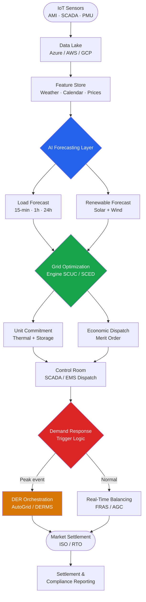

### Workflow 2 — Renewable Asset Lifecycle AI

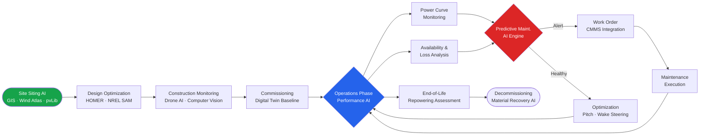

---

## Platform Deep Dives

### GE Vernova — GridOS & Asset Performance Management

{ width="700" }

GE Vernova's **GridOS** is described by the company as the first software portfolio purpose-built for grid orchestration. Launched fully in 2024, it spans:

- **GridOS Data Fabric** — federates decentralised data across transmission, distribution, IT, and OT systems into a unified grid-wide view
- **GridBeats** — a February 2024 portfolio of software-defined automation solutions that digitalises substations, manages grid zones autonomously, and integrates AI/ML-based protection and control
- **ThinkLabs AI** — GE Vernova's 2024 grid software startup focusing on AI-native grid applications, including real-time contingency analysis and DER forecasting
- **APM (Asset Performance Management)** — ML-based remaining useful life (RUL) estimation for wind turbines, gas turbines, and transformers, processing vibration, temperature, and SCADA streams

GE Vernova is ranked among the top three providers globally in the AI in energy market (alongside Schneider Electric and Siemens AG) by MarketsandMarkets (2024).

---

### Google DeepMind — Datacenter Cooling AI

Google DeepMind's reinforcement learning agent was first deployed on Google's data centre cooling systems in 2016 and has since been generalised to autonomous operation across the full data centre estate. Key results:

- **40% reduction** in cooling energy consumption
- **15% improvement** in overall PUE (Power Usage Effectiveness)
- The agent collects thousands of sensor readings every 5 minutes, feeds them through deep neural networks to predict the impact of various cooling adjustments, then issues optimal control actions (cooling tower fan speeds, chiller setpoints, pump rates) while respecting hard safety constraints

In 2024, DeepMind extended this work to a "safety-first" autonomous framework, allowing the AI to take direct control of datacenter systems without human approval for each action — a significant step toward fully autonomous industrial AI control.

---

### AutoGrid / Uplight — Demand Response at Utility Scale

AutoGrid was acquired by Uplight and merged its AI-driven DERMS with Uplight's utility engagement platform. AutoGrid Flex now manages over **60 GW** of distributed energy resources across utilities in North America, Europe, and Asia Pacific.

Key capabilities:

- AI-optimised demand response across all DER types and device classes
- FERC Order 2222-compliant DER aggregation and market participation
- Real-time load disaggregation — identifying appliance-level consumption from whole-home smart meter signals without sub-meters
- Predictive enrollment scoring — identifying customers most likely to respond to DR events using historical behaviour and household characteristics
- EV smart charging optimisation, coordinating charging across fleets and residential chargers to avoid peak coincidence

Uplight partners with over 80 utilities in North America, including Pacific Gas & Electric, Xcel Energy, and National Grid.

---

## ROI & Business Impact

| Use Case | Metric | Improvement | Source / Operator |
|---|---|---|---|
| Demand Response (DERMS) | Peak demand reduction per event | 15–25% | Uplight / AutoGrid utility case studies |
| Wind turbine predictive maintenance | Unplanned downtime reduction | 34% | Vattenfall Nordic fleet, 2024 |
| Wind turbine predictive maintenance | Annual maintenance cost saving | EUR 12M | Vattenfall, 2024 |
| AI renewable forecasting | Grid balancing cost reduction | EUR 87M/year | Terna TSO (Italy), 2024 |
| Renewable curtailment (AI dispatch) | Curtailment reduction | 9–21% | Multiple ISOs / IRENA 2024 |
| Building HVAC (BrainBox AI) | HVAC energy consumption | –25% average | BrainBox AI deployment studies |
| Datacenter cooling (DeepMind) | Cooling energy reduction | 40% | Google DeepMind |
| Grid fault detection (AI) | Outage duration reduction | 30–50% | IEA Energy and AI, 2025 |
| Load forecasting MAPE improvement | Forecast error vs. statistical | 15–30% | Applied Energy reviews |
| E.ON operational AI programme | Cumulative operational value | EUR 180M (2022–2025) | E.ON annual disclosures |
| AI-unlocked transmission headroom | Additional grid capacity | Up to 175 GW | IEA, 2025 |
| Carbon tracking (WattTime AER) | Automated carbon avoidance | Variable by grid mix | WattTime case studies |

---

## Sustainability, Regulation & Grid Standards

### Key Regulatory Frameworks

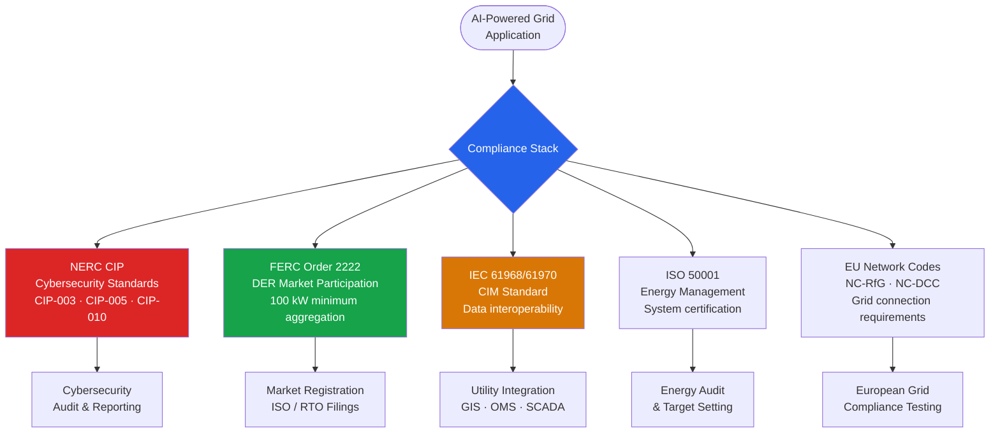

### Standards Overview

| Standard | Scope | AI Relevance |
|---|---|---|
| **NERC CIP** (CIP-003 to CIP-014) | North American bulk electric system cybersecurity | AI systems accessing OT/SCADA must meet access control and monitoring requirements; 2025 revisions expand DER requirements |
| **FERC Order 2222** | DER aggregation in US wholesale markets | AI-orchestrated DER aggregations as small as 100 kW can now bid into ISO/RTO markets |
| **IEC 61968 / 61970** | Common Information Model (CIM) for utilities | Defines the data model that AI applications must use to interoperate with utility SCADA, OMS, and GIS |
| **ISO 50001** | Energy management system standard | AI-driven BEMS can support and automate ISO 50001 energy performance improvement |
| **EU Network Codes (NC-RfG, NC-DCC)** | Grid connection requirements across EU | Renewable plants and storage with AI dispatch must comply with frequency response and reactive power requirements |
| **IEC 62351** | Power system cybersecurity | Encryption and authentication requirements for SCADA communications used by AI systems |

### AI and the IEA Net Zero 2050 Pathway

The IEA's Net Zero by 2050 scenario requires solar and wind to supply 70% of electricity by 2050, with grids carrying three times as much power as today. AI is indispensable to this pathway:

- **Grid flexibility** — AI optimises storage dispatch and demand response to accommodate 70%+ variable renewable penetration without curtailment
- **Transmission capacity** — AI dynamic line rating and topology optimisation could unlock 175 GW of hidden capacity in existing transmission infrastructure
- **Energy efficiency** — AI in buildings and industry reduces the total energy demand growth, making the 2050 target more achievable
- **Materials discovery** — Foundation AI models are accelerating discovery of next-generation battery chemistries, perovskite solar cells, and superconducting materials

### Carbon Credit Generation via Grid AI

WattTime and Electricity Maps (Tomorrow.io) provide the data infrastructure that underpins voluntary carbon markets and corporate net-zero commitments:

- **WattTime AER (Automated Emissions Reduction)** — smart devices (EV chargers, water heaters, batteries) shift loads to low-carbon windows automatically, generating verifiable carbon avoidance at scale
- **Electricity Maps** — 60+ countries of hourly grid carbon intensity data used by Microsoft, Google, and Stripe for 24/7 carbon-free energy matching and Scope 2 market-based accounting

---

## Getting Started

### For Utilities and Grid Operators

**Maturity Assessment Phases**


- **Phase 1 — Data Foundation:** AMI deployment, SCADA historian (OSIsoft PI / InfluxDB), data quality and governance, OT/IT integration via IEC CIM
- **Phase 2 — Descriptive Analytics:** Power BI / Grafana dashboards, basic anomaly alerting on historical data, energy loss benchmarking
- **Phase 3 — Predictive AI:** Start with 24-hour load forecasting (highest ROI, lowest OT risk). Pilot predictive maintenance on 2–3 transformer units. Use open-source NeuralForecast or Chronos for rapid validation
- **Phase 4 — Prescriptive & Autonomous:** Real-time DERMS dispatch, automated DR event management, closed-loop turbine pitch optimisation

**OT/IT Integration Challenges**
- SCADA data often locked in proprietary protocols (DNP3, Modbus, IEC 61850) — use OSIsoft PI, Inductive Automation Ignition, or Cisco IOx as a bridge layer
- Air-gapped OT networks require data diodes or secure historian replication before AI models can access live data
- Cybersecurity review under NERC CIP must precede any new external data pathway into the control network

### For Renewable Developers

**Free and Open-Source Tools to Start**

| Tool | Purpose | Cost |
|---|---|---|
| [pvlib-python](https://pvlib.readthedocs.io) | Solar PV performance modelling | Free / BSD |
| [NREL SAM](https://sam.nrel.gov) | Techno-economic analysis — wind, solar, storage | Free |
| [windpowerlib](https://windpowerlib.readthedocs.io) | Wind turbine and farm modelling | Free / MIT |
| [PyPSA](https://pypsa.org) | Network and storage optimisation | Free / MIT |
| [neuralforecast](https://nixtlaverse.nixtla.io/neuralforecast) | Neural forecasting — LSTM, NBEATS, PatchTST | Free / Apache 2.0 |
| [amazon/chronos-forecasting](https://github.com/amazon-science/chronos-forecasting) | Zero-shot load and generation forecasting | Free / Apache 2.0 |
| WattTime API (free tier) | Marginal emissions signal | Free (limited calls) |
| Electricity Maps Community API | Grid carbon intensity | Free (non-commercial) |

**Building a Forecasting Pipeline (30-day plan)**
1. **Week 1:** Export 2+ years of historical generation and met mast data; clean and resample to 15-minute intervals
2. **Week 2:** Run pvlib or windpowerlib physical model as a baseline; establish MAPE benchmark
3. **Week 3:** Train NeuralForecast NBEATS or NHiTS on historical data; compare against physical model
4. **Week 4:** Deploy Chronos zero-shot forecast; combine with ML model in an ensemble; connect to operations dashboard

### Open-Source vs. Commercial Platform Comparison

| Dimension | Open-Source (PyPSA, NeuralForecast, pvlib) | Commercial (GE Vernova, AutoGrid, ABB Genix) |
|---|---|---|
| Upfront cost | Free | $100k–$5M+/year licensing |
| Customisability | Full source access | Limited configuration |
| Support | Community / GitHub issues | 24/7 SLA, dedicated CSM |
| Integration | Manual — APIs, custom connectors | Pre-built utility system connectors |
| Regulatory acceptance | Requires validation | Often pre-certified for utility use |
| Time to value | 3–6 months (skilled team) | 6–18 months (vendor-led) |
| Data security | Self-hosted | Vendor cloud (SOC2, ISO 27001) |
| Best for | Research, startups, innovative utilities | Large IOUs, TSOs, regulated utilities |

---

## References

1. IEA (2025). *Energy and AI*. International Energy Agency, Paris. [https://www.iea.org/reports/energy-and-ai](https://www.iea.org/reports/energy-and-ai)

2. MarketsandMarkets (2024). *Artificial Intelligence in Energy Market — Global Forecast to 2030*. GlobeNewswire, December 2024. [https://www.globenewswire.com/news-release/2024/12/16/2997295/28124/en/AI-in-Energy-Market-Projected-to-Skyrocket-to-58.66-Billion-by-2030-with-a-CAGR-of-36.9.html](https://www.globenewswire.com/news-release/2024/12/16/2997295/28124/en/AI-in-Energy-Market-Projected-to-Skyrocket-to-58.66-Billion-by-2030-with-a-CAGR-of-36.9.html)

3. Ansari, B. et al. (2023). *A comprehensive review on deep learning approaches for short-term load forecasting*. Renewable and Sustainable Energy Reviews, 189. DOI: [10.1016/j.rser.2023.114031](https://doi.org/10.1016/j.rser.2023.114031)

4. Rasul, K. et al. (2024). *Chronos: Learning the Language of Time Series*. Amazon Science / arXiv:2403.07815. [https://arxiv.org/abs/2403.07815](https://arxiv.org/abs/2403.07815)

5. Woo, G. et al. (2024). *Unified Training of Universal Time Series Forecasting Transformers (Moirai)*. Salesforce AI Research / arXiv:2402.02592. [https://arxiv.org/abs/2402.02592](https://arxiv.org/abs/2402.02592)

6. Luo, D. et al. (2024). *Deep learning-driven hybrid model for short-term load forecasting and smart grid information management*. Scientific Reports, 14. DOI: [10.1038/s41598-024-63262-x](https://doi.org/10.1038/s41598-024-63262-x)

7. Google DeepMind (2016, updated 2024). *DeepMind AI Reduces Google Data Centre Cooling Bill by 40%*. [https://deepmind.google/blog/deepmind-ai-reduces-google-data-centre-cooling-bill-by-40/](https://deepmind.google/blog/deepmind-ai-reduces-google-data-centre-cooling-bill-by-40/)

8. Hong, T. et al. (2016). *Probabilistic energy forecasting: Global Energy Forecasting Competition 2014 and beyond*. International Journal of Forecasting, 32(3), 896–913. DOI: [10.1016/j.ijforecast.2016.02.001](https://doi.org/10.1016/j.ijforecast.2016.02.001)

9. IRENA (2024). *Renewable Power Generation Costs in 2023*. International Renewable Energy Agency, Abu Dhabi. [https://www.irena.org/Publications/2024/Sep/Renewable-Power-Generation-Costs-in-2023](https://www.irena.org/Publications/2024/Sep/Renewable-Power-Generation-Costs-in-2023)

10. US Department of Energy (2024). *AI for Energy: Opportunities for a Modern Grid and Clean Energy Economy*. DOE Report, Section 5.2g(i). [https://www.energy.gov/sites/default/files/2024-04/AI%20EO%20Report%20Section%205.2g(i)_043024.pdf](https://www.energy.gov/sites/default/files/2024-04/AI%20EO%20Report%20Section%205.2g(i)_043024.pdf)

11. FERC (2020). *Order No. 2222: Participation of Distributed Energy Resource Aggregations in Markets Operated by Regional Transmission Organizations and Independent System Operators*. Federal Energy Regulatory Commission. [https://www.ferc.gov/ferc-order-no-2222-explainer-facilitating-participation-electricity-markets-distributed-energy](https://www.ferc.gov/ferc-order-no-2222-explainer-facilitating-participation-electricity-markets-distributed-energy)

12. Abdelhamid, A. et al. (2025). *Emerging role of generative AI in renewable energy forecasting and system optimization*. Energy and AI. DOI: [10.1016/j.egyai.2025.100466](https://doi.org/10.1016/j.egyai.2025.100466)

13. Schmitt, P. et al. (2023). *pvlib iotools — Open-source Python functions for seamless access to solar irradiance data*. Solar Energy. DOI: [10.1016/j.solener.2023.112092](https://doi.org/10.1016/j.solener.2023.112092)

14. IEA (2023). *Net Zero by 2050 — A Roadmap for the Global Energy Sector*. International Energy Agency, Paris. [https://www.iea.org/reports/net-zero-by-2050](https://www.iea.org/reports/net-zero-by-2050)
