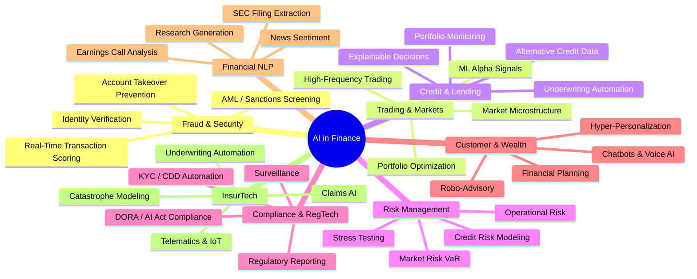
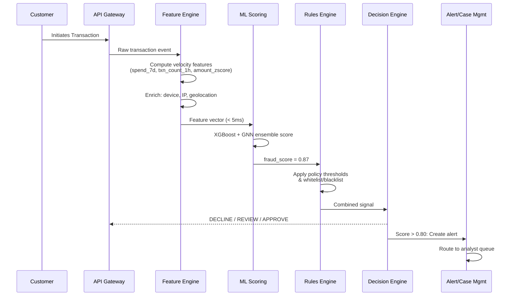
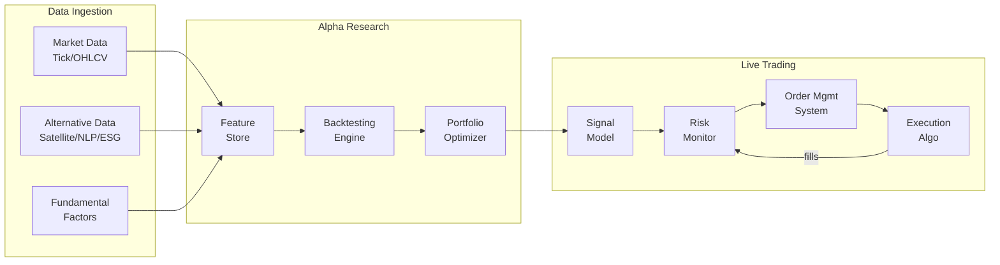
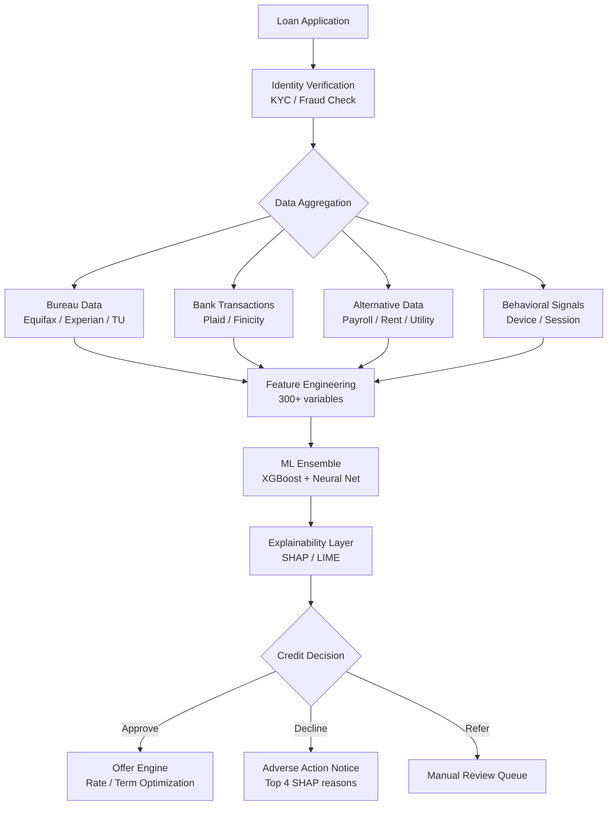
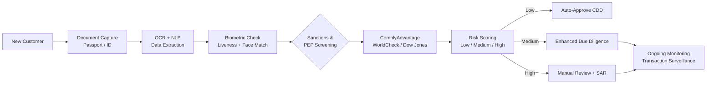
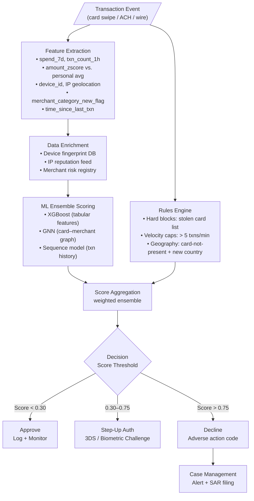
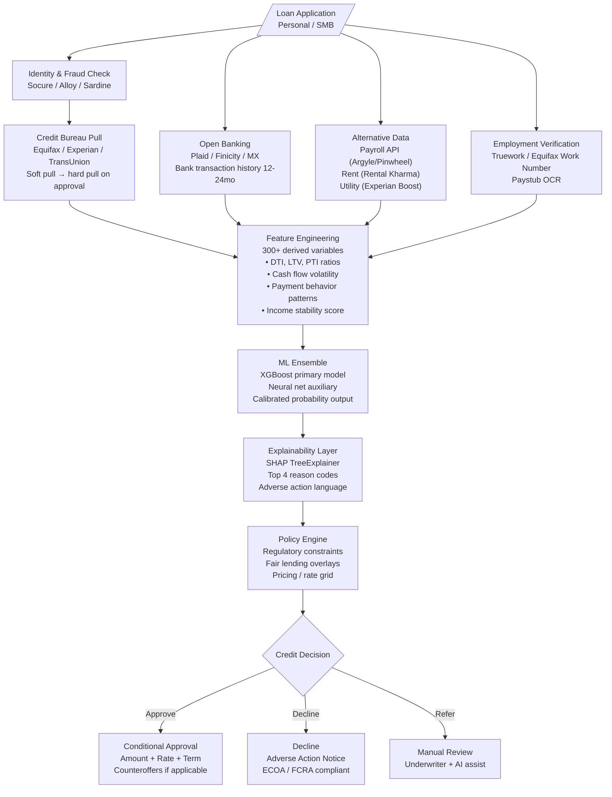
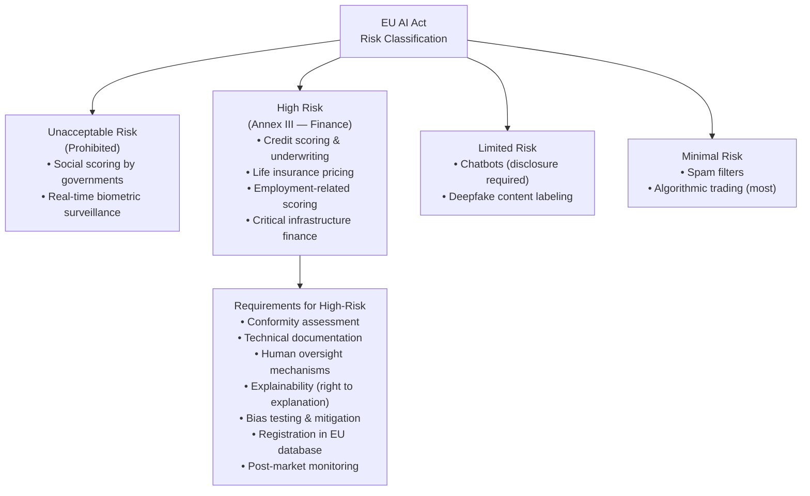
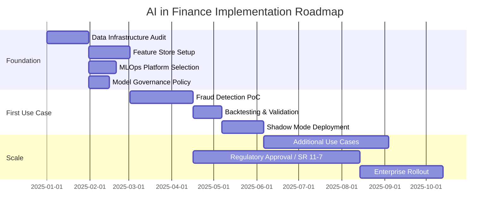

# AI in Finance & Banking


> "Artificial intelligence is not just a technology upgrade for banks — it is a fundamental rewiring of how financial risk is priced, fraud is stopped, capital is allocated, and customers are served." — IMF Global Financial Stability Report, 2023

---

## Overview

Artificial intelligence has moved from the research labs of quant hedge funds to the core infrastructure of global banks, payment networks, insurance carriers, and regulators. Every transaction processed by Visa or Mastercard passes through real-time ML fraud-scoring models. The majority of US equities volume is now generated by algorithmic strategies. Lenders from JPMorgan to Upstart are replacing FICO-centric scorecards with gradient-boosted and neural-network models that ingest hundreds of alternative data signals. And LLMs trained on financial corpora are beginning to automate tasks that once required armies of junior analysts.

### Market Size & Key Statistics

| Metric | Value | Source / Year |
|---|---|---|
| AI in banking market size (2024) | $19.9 billion | Grand View Research, 2024 |
| Projected market size (2030) | $64.0 billion | Grand View Research, 2024 |
| CAGR (2024–2030) | 21.8% | Grand View Research, 2024 |
| Annual fraud losses prevented by AI | $10+ billion | McKinsey, 2024 |
| Share of US equity volume from algo trading | ~70–75% | Tabb Group / NYSE data |
| Loan processing time reduction with AI | 50–80% faster | Upstart / McKinsey |
| AML false-positive reduction with AI | 30–60% | KPMG Financial Services |
| Cost savings from AI across banking (est. 2025) | $447 billion | Insider Intelligence |

### How AI Reshapes Every Layer of Finance



---

## Key AI Use Cases

### Fraud Detection & Anti-Money Laundering

Financial fraud costs the global economy over $5 trillion annually. AI-based fraud detection combines real-time transaction scoring, graph-based relationship analysis, and behavioral biometrics to identify suspicious activity orders of magnitude faster than rule-based systems.

**How it works — real-time fraud detection flow:**



**Key tools & platforms:**

| Tool | Vendor | Specialty |
|---|---|---|
| ARIC Risk Hub | Featurespace | Adaptive Behavioral Analytics |
| Sardine | Sardine.ai | Fraud + Compliance for fintechs |
| Sift | Sift Science | Account takeover, payment fraud |
| DataVisor | DataVisor | Unsupervised fraud clustering |
| ComplyAdvantage | ComplyAdvantage | AML / sanctions screening NLP |
| Actimize | NICE Systems | Enterprise financial crime |
| ThetaRay | ThetaRay | AML for correspondent banking |

**Real-world impact:**
- HSBC deployed Google Cloud's AML AI solution, reducing false positives by 60% and improving detection quality significantly (HSBC/Google Cloud, 2023).
- Mastercard's Decision Intelligence scores every transaction in under 50 milliseconds across 150+ billion transactions per year.

---

### Algorithmic & Quantitative Trading

Algorithmic trading now accounts for roughly 70–75% of US equities volume. Modern quant strategies span high-frequency market-making, statistical arbitrage, ML-driven factor models, and reinforcement-learning-based execution optimization.

**Quant trading system architecture:**



**Leading platforms & firms:**

| Platform | Type | Key Capability |
|---|---|---|
| QuantConnect (LEAN) | Open-source | Cloud backtesting, live trading, multi-asset |
| Alpaca | Brokerage API | Commission-free, paper trading, ML integration |
| Numerai | Crowdsourced hedge fund | Meta-model over community ML predictions |
| Two Sigma Venn | Factor analysis | Decompose returns into systematic factors |
| qlib (Microsoft) | Open-source research | Quant research platform, RL trading agents |
| Zipline-reloaded | Open-source | Backtest framework, community-maintained |
| QuantLib | Open-source | Derivatives pricing, yield curve modeling |

**Notable firms:** Two Sigma, Citadel Securities, Renaissance Technologies, D.E. Shaw, Man AHL — all run proprietary ML stacks with hundreds of PhD researchers building alpha signals from NLP, satellite imagery, credit card transaction data, and web-scraped alt data.

---

### Credit Scoring & Underwriting

Traditional FICO scores use five variables. Modern ML credit models ingest hundreds of signals — bank transaction patterns, rental payment history, utility payments, device behavior, and employment records from payroll APIs — while producing explainable outputs that satisfy fair-lending requirements.

**Credit underwriting pipeline:**



**AI-native lenders & tools:**

| Vendor | Focus | Key Differentiator |
|---|---|---|
| Upstart | Consumer loans | 1,600+ variables, ML since founding |
| Zest AI | B2B underwriting AI | Explainable ML, ECOA-compliant |
| Scienaptic | Credit decisioning | Pre-built bureau connectors |
| Deserve | Student / credit builder | ML with thin-file borrowers |
| Kabbage (now AmEx) | SMB lending | Cash-flow based ML underwriting |
| Nova Credit | Cross-border credit | International credit passport |

**Upstart results (2023 10-K):** 43% fewer defaults vs. traditional models at the same approval rate; 27% more approvals at the same default rate — demonstrating that ML outperforms FICO for both risk and inclusion.

---

### Risk Management

AI-augmented risk management moves beyond static VaR models to continuous stress testing, real-time exposure monitoring, and scenario simulation using deep learning.

**Tools by risk domain:**

| Tool | Provider | Domain |
|---|---|---|
| RiskMetrics / MSCI | MSCI | Market risk, factor models |
| Moody's Analytics | Moody's | Credit risk, stress testing |
| Palantir Foundry | Palantir | Enterprise risk data platform |
| BlackRock Aladdin | BlackRock | Portfolio & systemic risk |
| AxiomSL (Adenza) | Nasdaq | Regulatory capital reporting |
| Finastra Risk | Finastra | ALM, liquidity risk |
| Kamakura | SAS | Interest rate / credit risk |

---

### Regulatory Compliance (RegTech)

**KYC/AML automation pipeline:**



**Leading RegTech vendors:**

| Vendor | Capability |
|---|---|
| ComplyAdvantage | Real-time AML / sanctions NLP database |
| Onfido | AI-powered document + biometric identity |
| Socure | ID verification, synthetic fraud detection |
| Hummingbird | AML workflow automation |
| Napier AI | Transaction monitoring, rule replacement |
| Alloy | Decision orchestration for KYC/fraud |
| Chainalysis | Crypto AML / blockchain analytics |

---

### Robo-Advisory & Wealth Management

Robo-advisors have grown from curiosity to managing over $2.5 trillion in AUM globally. Modern platforms move beyond simple index ETF allocation to include tax-loss harvesting, direct indexing, goal-based optimization, and LLM-powered financial planning.

| Platform | AUM (approx.) | Key AI Feature |
|---|---|---|
| Betterment | $45B+ | Tax-loss harvesting, personalized portfolios |
| Wealthfront | $70B+ | Path financial planning, direct indexing |
| Schwab Intelligent Portfolios | $80B+ | Zero-fee robo with 50+ ETFs |
| Vanguard Digital Advisor | $300B+ AUM advice | Low-cost, human hybrid |
| TIFIN | B2B wealth AI | Personalization at scale for advisors |
| Merrill Guided Investing | BofA | AI-assisted advisor workflows |

---

### Financial NLP

NLP is now core infrastructure for every major financial institution. Use cases span real-time news sentiment for trading signals, earnings call summarization, SEC filing extraction, covenant monitoring in loan documents, and analyst report generation.

**Leading NLP tools for finance:**

| Tool | Provider | Primary Use |
|---|---|---|
| Bloomberg NLP / BQNT | Bloomberg | Proprietary NLP on Bloomberg data |
| Kensho | S&P Global | Event detection, research automation |
| Refinitiv Eikon AI | LSEG | News analytics, sentiment feeds |
| AlphaSense | AlphaSense | Enterprise search, earnings intelligence |
| Sentieo (now Alphasense) | AlphaSense | Document search, financial NLP |
| Visible Alpha | Visible Alpha | Consensus estimate extraction |
| Amenity Analytics | Amenity | Earnings call NLP signals |

---

### Insurance & InsurTech

| Use Case | Technology | Vendor Examples |
|---|---|---|
| Underwriting automation | Computer vision, ML | Cape Analytics, EagleView |
| Claims processing AI | NLP, image recognition | Tractable, Snapsheet |
| Fraud detection | Graph analytics, anomaly detection | Shift Technology, FRISS |
| Customer acquisition | Conversational AI | Lemonade, Hippo |
| Catastrophe modeling | Deep learning, simulation | Jupiter Intelligence, One Concern |
| Telematics / UBI | IoT + ML | Cambridge Mobile Telematics, Arity |

**Lemonade** uses AI for the entire customer journey — from policy purchase (90 seconds) to claims payment (as fast as 3 seconds), with Maya (underwriting bot) and Jim (claims bot) handling millions of interactions annually.

---

## Top AI Tools & Platforms


| Tool | Provider | Category | Key Feature | Open Source | Website |
|---|---|---|---|---|---|
| Bloomberg Terminal + BQNT | Bloomberg LP | Data + Analytics | BQuant Python research env, NLP on 300K+ news items/day | No | bloomberg.com |
| Palantir Foundry | Palantir | Data Platform | Ontology-based data ops, AI/ML deployment pipeline | No | palantir.com |
| Kensho | S&P Global | Financial AI | NLP event detection, earnings intelligence | No | kensho.com |
| Refinitiv Eikon / Workspace | LSEG | Data + Analytics | Sentiment feeds, news analytics, Python API | No | lseg.com |
| QuantConnect (LEAN) | QuantConnect | Algo Trading | Cloud backtesting, 25+ brokers, live trading | Yes (LEAN) | quantconnect.com |
| Alpaca | Alpaca Markets | Trading API | Commission-free, WebSocket streaming, paper trading | Partial | alpaca.markets |
| Featurespace ARIC | Featurespace | Fraud Detection | Adaptive Behavioral Analytics, real-time scoring | No | featurespace.com |
| Zest AI | Zest AI | Credit Underwriting | Explainable ML, ECOA compliance toolkit | No | zest.ai |
| ComplyAdvantage | ComplyAdvantage | AML / Compliance | Real-time sanctions/PEP screening, NLP | No | complyadvantage.com |
| Socure | Socure | Identity / KYC | ID+ platform, synthetic fraud ML | No | socure.com |
| Upstart | Upstart Holdings | Credit Scoring | 1,600+ variables, alternative credit ML | No | upstart.com |
| Two Sigma Venn | Two Sigma | Factor Analysis | Systematic factor decomposition of returns | No | venn.twosigma.com |
| SymphonyAI (ex-Ayasdi) | SymphonyAI | Enterprise AI | Topological data analysis, AML | No | symphonyai.com |
| C3.ai Financial Services | C3.ai | Enterprise AI | Pre-built ML apps, model monitoring | No | c3.ai |
| Temenos | Temenos | Core Banking AI | Embedded AI in T24 core, loan origination | No | temenos.com |
| FIS Modern Banking Platform | FIS | Core Banking | AI fraud, risk analytics across payments | No | fisglobal.com |
| Finastra | Finastra | Banking Software | Open banking, AI-assisted lending, treasury | No | finastra.com |
| Thought Machine Vault | Thought Machine | Core Banking | Cloud-native core, configurable smart contracts | No | thoughtmachine.net |
| AlphaSense | AlphaSense | Financial Research | Enterprise search, earnings NLP, AI summaries | No | alpha-sense.com |
| BlackRock Aladdin | BlackRock | Risk Analytics | Whole-portfolio risk OS, factor exposure | No | blackrock.com/aladdin |
| OpenBB Terminal | OpenBB | Research | Open-source Bloomberg alternative, LLM-powered | Yes | openbb.co |
| qlib | Microsoft Research | Quant Research | AI-oriented quant platform, RL agents | Yes | github.com/microsoft/qlib |
| FinRL | AI4Finance Foundation | Algo Trading | Deep RL for stock/crypto/portfolio trading | Yes | github.com/AI4Finance-Foundation/FinRL |

---

## HuggingFace & Open-Source Ecosystem

### Top Finance Models on HuggingFace

| Model | HF Hub | Parameters | Key Use Case | Downloads/Mo |
|---|---|---|---|---|
| FinBERT (ProsusAI) | `ProsusAI/finbert` | 110M (BERT-base) | Financial sentiment: positive/negative/neutral | ~4.6M |
| FinBERT (yiyanghkust) | `yiyanghkust/finbert-tone` | 110M | Tone classification on financial text | ~800K |
| BloombergGPT | Not publicly released | 50B | All finance NLP tasks (Bloomberg internal) | — |
| FinGPT (various) | `FinGPT/*` | 7B–13B (Llama/Falcon fine-tunes) | Financial advisory, sentiment, forecasting | ~200K |
| FLARE (The-FinAI) | `TheFinAI/flare-*` | Benchmark suite | Comprehensive finance NLP evaluation | — |
| FinMA | `ChanceFocus/finma-7b-nlp` | 7B | Multi-task financial instruction tuning | ~50K |
| Finance-LLM | `oliverwang15/FinGPT_ChatGLM2_Sentiment` | 6B | Chinese + English financial NLP | ~100K |
| SEC-BERT | `nlpaueb/sec-bert-base` | 110M | SEC filing classification / NER | ~300K |

> **BloombergGPT** (Wu et al., 2023) — a 50-billion-parameter LLM trained on a 363-billion-token finance corpus (FinPile) plus 345B general tokens. It outperforms comparably-sized general models on financial NLP benchmarks including FiQA SA, FPB, and Headline Classification, while remaining competitive on general benchmarks. arXiv: 2303.17564.

> **FinGPT** (Yang et al., 2023) — an open-source, democratized alternative to BloombergGPT. Uses lightweight LoRA fine-tuning of open-source base models (LLaMA-2, Falcon) on financial text from Reddit, Twitter, news, and SEC filings. GitHub: AI4Finance-Foundation/FinGPT (~14K stars).

### Top GitHub Repositories for Finance AI

| Repository | Organization | Stars (approx.) | Description |
|---|---|---|---|
| FinRL | AI4Finance-Foundation | ~10K | Deep RL framework for stock/forex/crypto trading |
| FinGPT | AI4Finance-Foundation | ~14K | Open-source LLM fine-tuning for finance |
| OpenBB Terminal | OpenBB | ~30K | Open-source investment research platform |
| qlib | Microsoft Research | ~15K | AI-oriented quant investment research platform |
| zipline-reloaded | Stefan Jansen | ~2K | Algorithmic backtesting, pandas-based |
| LEAN Engine | QuantConnect | ~9K | C# algo trading engine powering QuantConnect |
| backtrader | Daniel Rodriguez | ~13K | Python backtesting + live trading framework |
| PyPortfolioOpt | robertmartin8 | ~4K | Portfolio optimization: MVO, HRP, Black-Litterman |
| vectorbt | polakowo | ~4K | Fast backtesting using NumPy/Pandas |
| ta-lib | mrjbq7 | ~9K | Technical analysis library, 150+ indicators |

### Top Kaggle Competitions & Datasets

| Competition / Dataset | Entries | Key Metric | Data Size |
|---|---|---|---|
| IEEE-CIS Fraud Detection | ~6,400 teams | AUC-ROC | 590K transactions, 433 features |
| Credit Card Fraud Detection (ULB) | ~15K notebooks | Average Precision | 284K transactions, PCA features |
| Home Credit Default Risk | ~7,198 teams | AUC-ROC | 307K applicants, 120 features |
| Santander Customer Transaction | ~8,802 teams | AUC-ROC | 200K customers, 200 anon features |
| American Express Default Prediction | ~4,874 teams | Amex metric (normalized Gini) | 5.5M rows, 190 features |
| JPX Tokyo Stock Exchange Prediction | ~2,070 teams | Sharpe ratio | 2,000+ stocks, 2017–2022 |
| Jane Street Market Prediction | ~4,245 teams | Utility score | 500+ anonymized features |

### FinBERT Sentiment Analysis — Code Example

```python
from transformers import pipeline, AutoTokenizer, AutoModelForSequenceClassification
import torch

# Load FinBERT — 4.6M monthly downloads on HuggingFace
model_name = "ProsusAI/finbert"
tokenizer = AutoTokenizer.from_pretrained(model_name)
model = AutoModelForSequenceClassification.from_pretrained(model_name)

finbert = pipeline(
    "text-classification",
    model=model,
    tokenizer=tokenizer,
    device=0 if torch.cuda.is_available() else -1,
    top_k=None,
)

# Sample earnings call excerpts
sentences = [
    "Revenue grew 18% year-over-year driven by strong enterprise demand.",
    "We expect significant headwinds from rising interest rates next quarter.",
    "The Board declared a quarterly dividend of $0.42 per share.",
    "Loan losses in our consumer division exceeded internal stress scenarios.",
    "Operating leverage improved 340 basis points versus the prior year.",
]

print(f"{'Sentiment':<12} {'Confidence':<12} Text")
print("-" * 80)
for sent in sentences:
    results = finbert(sent[:512])[0]
    scores = {r["label"]: r["score"] for r in results}
    label = max(scores, key=scores.get)
    conf = scores[label]
    print(f"{label:<12} {conf:<12.3f} {sent[:55]}...")
```

**Output:**
```
Sentiment    Confidence   Text
--------------------------------------------------------------------------------
positive     0.962        Revenue grew 18% year-over-year driven by strong en...
negative     0.978        We expect significant headwinds from rising interest...
neutral      0.891        The Board declared a quarterly dividend of $0.42 per...
negative     0.987        Loan losses in our consumer division exceeded intern...
positive     0.944        Operating leverage improved 340 basis points versus ...
```

### FinGPT Financial Instruction Tuning — Code Example

```python
from transformers import AutoTokenizer, AutoModelForCausalLM
from peft import PeftModel
import torch

# Load FinGPT — LoRA fine-tuned LLaMA on financial instruction data
base_model = "meta-llama/Llama-2-7b-hf"
lora_weights = "FinGPT/fingpt-sentiment_llama2-7b_lora"

tokenizer = AutoTokenizer.from_pretrained(base_model)
model = AutoModelForCausalLM.from_pretrained(
    base_model,
    torch_dtype=torch.float16,
    device_map="auto",
)
model = PeftModel.from_pretrained(model, lora_weights)
model.eval()

prompt = """Instruction: What is the sentiment of this news?
Input: Goldman Sachs raises its 12-month S&P 500 target to 5,600, citing resilient
corporate earnings and easing inflation. The bank expects the Fed to cut rates twice
in the second half of 2024.
Answer: """

inputs = tokenizer(prompt, return_tensors="pt").to(model.device)
with torch.no_grad():
    outputs = model.generate(**inputs, max_new_tokens=32, temperature=0.1)
print(tokenizer.decode(outputs[0], skip_special_tokens=True))
```

---

## Best End-to-End AI Workflows

### Workflow 1: Real-Time Fraud Detection Pipeline



### Workflow 2: AI-Powered Credit Underwriting



---

## Platform Deep Dives

### Bloomberg Terminal + BQNT / AI

{ width="600" }

Bloomberg Terminal remains the gold standard for professional financial data, now enhanced with AI capabilities:

- **BQuant (BQNT):** Python-based research environment embedded in the Terminal. Access 300TB+ of Bloomberg data via `bdp()` / `bdh()` API calls, train models on proprietary data, and deploy signals without data leaving Bloomberg's infrastructure.
- **Bloomberg NLP:** Real-time news analytics on 300,000+ news items per day across 150,000+ sources. Sentiment scores, relevance scoring, and named-entity extraction in milliseconds.
- **Bloomberg AI (BAI):** Research summarization, earnings call analysis, regulatory document parsing. Trained on decades of Bloomberg's proprietary financial corpus.
- **Enterprise Data License (EDL):** Access Bloomberg data programmatically for ML pipelines outside the Terminal.
- **BloombergGPT:** 50B-parameter LLM trained on FinPile (363B financial tokens). Outperforms GPT-NeoX, OPT, BLOOM on FPB, FiQA-SA, Headline, NER, and RE financial benchmarks (Wu et al., 2023).

**Cost:** ~$27,000/year per Terminal seat. Enterprise data licenses vary by use case.

---

### Palantir Foundry

{ width="600" }

Palantir Foundry is the data operations platform of choice for large financial institutions managing complex, fragmented data estates:

- **Ontology Layer:** Define semantic objects (Trade, Counterparty, Obligation) that unify data across hundreds of source systems without a data warehouse rebuild.
- **Pipeline Builder:** Visual + code (Python/Spark/SQL) data transformation and enrichment pipelines with full lineage tracking.
- **AIP (AI Platform):** Deploy LLMs and ML models on top of the Ontology. JPMorgan's LOXM execution AI and risk workflows use Palantir infrastructure.
- **Model-to-Production:** One-click deployment of scikit-learn, XGBoost, or PyTorch models with automatic drift monitoring and audit trail.
- **Financial clients:** Multiple G-SIBs, sovereign wealth funds, insurance carriers. Estimated $500M+ in financial services ACV (2024).

---

### QuantConnect (LEAN Engine)

{ width="600" }

QuantConnect democratizes institutional-grade algorithmic trading through its open-source LEAN engine and cloud research environment:

- **LEAN Engine:** Open-source (Apache 2.0) C# backtesting and live trading engine. Supports equities, options, futures, forex, crypto across 25+ brokerages.
- **Research Environment:** Jupyter-based cloud notebooks with 25+ years of historical data. Python and C# support.
- **Alpha Streams:** Marketplace to license alpha signals to institutional buyers. Quant researchers earn royalties.
- **Live Trading:** Deploy strategies live via Interactive Brokers, Tradier, Coinbase, TD Ameritrade (Schwab), and others.
- **Community:** 220,000+ quant researchers. 100,000+ backtests run daily.

```python
# QuantConnect LEAN strategy example — Mean Reversion on SPY
from AlgorithmImports import *

class MeanReversionAlgorithm(QCAlgorithm):

    def Initialize(self):
        self.SetStartDate(2020, 1, 1)
        self.SetEndDate(2024, 12, 31)
        self.SetCash(100000)

        self.spy = self.AddEquity("SPY", Resolution.Daily).Symbol
        self.bb = self.BB("SPY", 20, 2, Resolution.Daily)  # Bollinger Bands
        self.rsi = self.RSI("SPY", 14, Resolution.Daily)    # RSI filter

    def OnData(self, data):
        if not (self.bb.IsReady and self.rsi.IsReady):
            return

        price = data[self.spy].Close

        if price < self.bb.LowerBand.Current.Value and self.rsi.Current.Value < 35:
            self.SetHoldings(self.spy, 1.0)   # Long on oversold

        elif price > self.bb.UpperBand.Current.Value and self.rsi.Current.Value > 65:
            self.Liquidate(self.spy)            # Exit on overbought
```

---

## ROI & Business Impact

| Use Case | Metric | Improvement | Institution / Source |
|---|---|---|---|
| Real-time fraud scoring | False positive rate | -60% reduction | HSBC / Google Cloud, 2023 |
| AML transaction monitoring | Investigation efficiency | 3x faster case closure | JPMC internal, 2022 |
| Credit underwriting (ML vs FICO) | Default rate at same approval | -43% fewer defaults | Upstart 10-K, 2023 |
| Credit underwriting (ML vs FICO) | Approval rate at same risk | +27% more approvals | Upstart 10-K, 2023 |
| Loan processing automation | Time-to-decision | 50–80% faster | McKinsey, 2024 |
| Earnings call summarization (LLM) | Analyst time per document | -70% time savings | AlphaSense customer data, 2023 |
| Document review (contracts) | Accuracy vs. manual | +95% extraction accuracy | JPMC COIN platform |
| Robo-advisory | Cost per managed account | -85% vs. human advisor | Betterment / Wealthfront benchmarks |
| Regulatory reporting (AI-assisted) | Filing error rate | -40% reduction | Deloitte RegTech study, 2023 |
| Customer service (chatbots) | Cost per interaction | -60% cost reduction | Erica (Bank of America), 2023 |
| Portfolio optimization | Sharpe ratio improvement | +0.2–0.4 Sharpe | Two Sigma / AQR research |
| Insurance claims (Tractable AI) | Time to estimate | 4 minutes vs. days | Tractable case studies, 2023 |

---

## Regulatory & Ethical Framework

### SR 11-7: The Foundational US Model Risk Regulation

The Federal Reserve's SR 11-7 guidance (2011, updated guidance 2021) establishes the gold standard for model risk management (MRM) in US banking. Key requirements:

- **Model inventory:** Every model (statistical, ML, or rule-based) used for decision-making must be inventoried, documented, and validated.
- **Independent validation:** Model developers cannot validate their own models. Banks must maintain independent MRM teams or use third-party validators.
- **Ongoing monitoring:** All production models require ongoing performance monitoring, including data drift detection, stability metrics (PSI), and outcome analysis.
- **Conceptual soundness:** Validators must understand the mathematical and conceptual basis of ML models — not just their outputs.

### EU AI Act: Finance is "High Risk"

The EU AI Act (entered into force August 2024, full application August 2026) classifies several financial AI applications as **high-risk** under Annex III:



**High-risk financial AI requirements:**

1. **Conformity assessment** before deployment — technical documentation, testing results.
2. **Fundamental rights impact assessment** for public bodies (and encouraged for private).
3. **Logging and audit trails** — decisions must be traceable.
4. **Human oversight** — ability to override, correct, and override automated decisions.
5. **Explainability** — individuals subject to automated credit/insurance decisions have a right to explanation.

### US Fair Lending: ECOA & FCRA

The Equal Credit Opportunity Act (ECOA) and Fair Credit Reporting Act (FCRA) impose specific requirements on credit AI:

- **Adverse Action Notices:** When credit is denied, lenders must provide the "principal reasons" — typically top 4 factors. SHAP values are now routinely used to generate these notices.
- **Disparate Impact Testing:** Even facially neutral variables (zip code, device type) can create disparate impact on protected classes. Regulators expect ongoing fairness testing.
- **Model Explainability:** The CFPB has signaled that "black box" models that cannot produce adverse action reasons may violate ECOA — regardless of accuracy.

### DORA: Digital Operational Resilience Act

DORA (EU, applicable January 2025) imposes strict requirements on financial institutions' use of third-party AI and technology:

- All critical third-party AI providers (including cloud AI services) must be registered and subject to ICT risk assessments.
- Financial entities must conduct operational resilience testing including AI failure scenarios.
- Concentration risk: regulators may restrict over-dependence on a single AI provider.

### Other Key Regulations

| Regulation | Jurisdiction | Impact on AI |
|---|---|---|
| MiFID II / MiFIR | EU | Algo trading registration, kill switches, audit trails |
| Basel III / FRTB | Global | Internal model approaches for VaR require backtesting |
| GDPR | EU | Right to explanation for automated decisions (Art. 22) |
| CCPA / CPRA | California | Consumer rights over automated profiling |
| CRD VI / CRR III | EU | Model risk management for IRB credit models |
| OCC Guidance (2021) | US | Third-party AI risk, concentration concerns |
| NY DFS Part 500 | New York | Cybersecurity + AI governance for NY-regulated entities |

---

## Getting Started: Implementation Framework

### Phase 1: Foundation (Months 1–3)



### Build vs. Buy Decision Framework

| Factor | Build In-House | Buy / Vendor |
|---|---|---|
| Proprietary data advantage | Strong reason to build | — |
| Regulatory explainability needed | Build or open-source | Ensure vendor provides |
| Speed to value | Slower (6–18 months) | Faster (weeks–months) |
| Ongoing customization | Full control | Vendor roadmap dependency |
| Team ML capability | Requires PhD/ML engineers | Lower bar |
| Data leaves your perimeter | Stays in-house | Risk: review vendor data policy |
| Cost (5-year TCO) | High upfront, lower ongoing | Lower upfront, higher SaaS fees |

### Essential Data Infrastructure

For production financial AI, you need:

1. **Feature Store** (Feast, Hopsworks, Tecton) — share features between training and real-time inference, prevent look-ahead bias, enforce point-in-time correctness.
2. **Data Warehouse** (Snowflake, BigQuery, Databricks) — centralize structured financial data with governance.
3. **Streaming Platform** (Apache Kafka, Flink) — real-time transaction processing for fraud detection (< 100ms latency).
4. **Model Registry** (MLflow, W&B, SageMaker) — version models, track experiments, manage deployment.
5. **Monitoring** (Evidently AI, Arize, WhyLabs) — drift detection, PSI monitoring, fairness dashboards.
6. **Explainability** (SHAP, LIME, InterpretML) — required for SR 11-7, ECOA adverse actions, AI Act.

### Model Governance Checklist

- [ ] Model inventory entry created with owner, purpose, risk tier
- [ ] Training data documented with lineage and bias assessment
- [ ] Independent validation completed (not by model developer)
- [ ] Backtesting / holdout performance documented
- [ ] Stress testing on crisis periods (2008, 2020, sector shocks)
- [ ] Fairness testing across protected classes (ECOA/FCRA)
- [ ] Explainability mechanism validated (SHAP reason codes tested)
- [ ] Production monitoring thresholds set (PSI, KS, Gini degradation alerts)
- [ ] Kill switch / override mechanism documented and tested
- [ ] Regulatory approval obtained if required (SR 11-7 high-risk models)
- [ ] Annual re-validation scheduled

---

## References

1. **Wu, S. et al. (2023).** BloombergGPT: A Large Language Model for Finance. *arXiv preprint*. [https://arxiv.org/abs/2303.17564](https://arxiv.org/abs/2303.17564)

2. **Araci, D. (2019).** FinBERT: Financial Sentiment Analysis with Pre-trained Language Models. *arXiv preprint*. [https://arxiv.org/abs/1908.10063](https://arxiv.org/abs/1908.10063)

3. **Yang, H. et al. (2023).** FinGPT: Open-Source Financial Large Language Models. *arXiv preprint*. [https://arxiv.org/abs/2306.06031](https://arxiv.org/abs/2306.06031)

4. **Liu, X. et al. (2023).** FLARE: A Comprehensive Benchmark for Financial NLP. *arXiv preprint*. [https://arxiv.org/abs/2306.12462](https://arxiv.org/abs/2306.12462)

5. **Financial Stability Board (2022).** Artificial Intelligence and Machine Learning in Financial Services. FSB Report. [https://www.fsb.org/2022/10/fintech-and-market-structure-in-financial-services/](https://www.fsb.org/2022/10/fintech-and-market-structure-in-financial-services/)

6. **Bank for International Settlements (2023).** The adoption of AI in central banking and finance. BIS Working Paper No. 1130. [https://www.bis.org/publ/work1130.htm](https://www.bis.org/publ/work1130.htm)

7. **IMF (2023).** Artificial Intelligence and the Future of Finance. *Global Financial Stability Report*. IMF. [https://www.imf.org/en/Publications/GFSR](https://www.imf.org/en/Publications/GFSR)

8. **European Central Bank (2023).** Machine learning for economics and finance. ECB Working Paper No. 2826. [https://www.ecb.europa.eu/pub/pdf/scpwps/ecb.wp2826~f96b72db44.en.pdf](https://www.ecb.europa.eu/pub/pdf/scpwps/ecb.wp2826~f96b72db44.en.pdf)

9. **de Prado, M.L. (2018).** *Advances in Financial Machine Learning*. Wiley. ISBN: 978-1-119-48208-6. [https://www.wiley.com/en-us/Advances+in+Financial+Machine+Learning-p-9781119482086](https://www.wiley.com/en-us/Advances+in+Financial+Machine+Learning-p-9781119482086)

10. **Board of Governors of the Federal Reserve System (2011, updated 2021).** SR 11-7: Guidance on Model Risk Management. [https://www.federalreserve.gov/supervisionreg/srletters/sr1107.htm](https://www.federalreserve.gov/supervisionreg/srletters/sr1107.htm)

11. **European Commission (2024).** EU AI Act — Regulation (EU) 2024/1689. *Official Journal of the European Union*. [https://eur-lex.europa.eu/legal-content/EN/TXT/?uri=CELEX:32024R1689](https://eur-lex.europa.eu/legal-content/EN/TXT/?uri=CELEX:32024R1689)

12. **Athey, S. & Imbens, G.W. (2019).** Machine Learning Methods That Economists Should Know About. *Annual Review of Economics*, 11, 685–725. [https://doi.org/10.1146/annurev-economics-080217-053433](https://doi.org/10.1146/annurev-economics-080217-053433)

13. **Cao, L. (2022).** AI in Finance: Challenges, Techniques, and Opportunities. *ACM Computing Surveys*, 55(3), 1–38. [https://doi.org/10.1145/3502289](https://doi.org/10.1145/3502289)

14. **Fuster, A. et al. (2022).** Predictably Unequal? The Effects of Machine Learning on Credit Markets. *Journal of Finance*, 77(1), 5–47. [https://doi.org/10.1111/jofi.13090](https://doi.org/10.1111/jofi.13090)

15. **McKinsey & Company (2024).** The next frontier of customer engagement: AI-enabled customer service. McKinsey Global Institute. [https://www.mckinsey.com/capabilities/operations/our-insights/the-next-frontier-of-customer-engagement-ai-enabled-customer-service](https://www.mckinsey.com/capabilities/operations/our-insights/the-next-frontier-of-customer-engagement-ai-enabled-customer-service)
