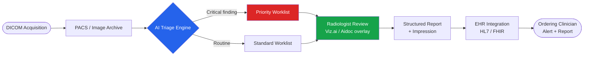
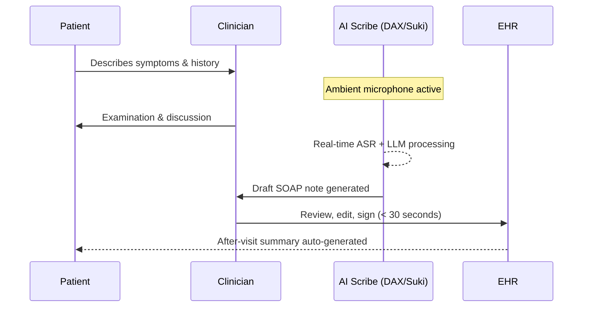
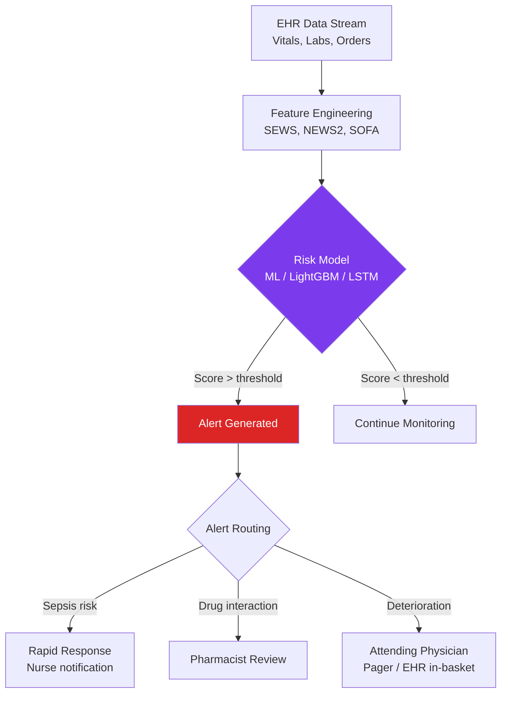
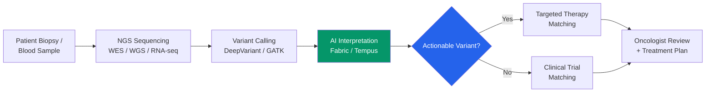
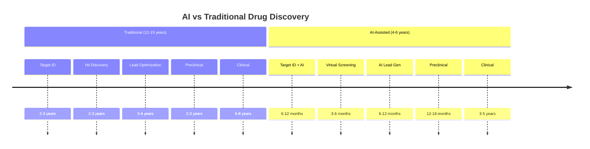
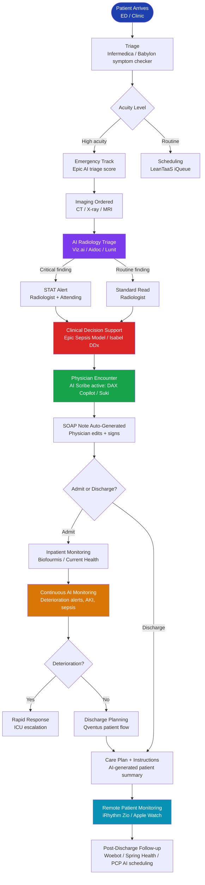
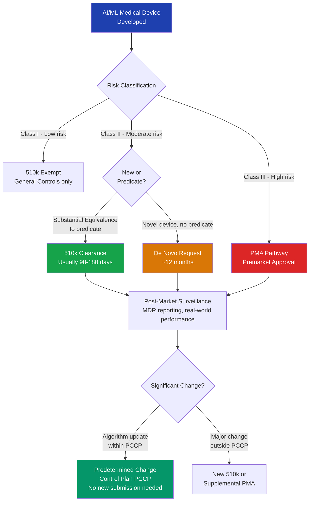
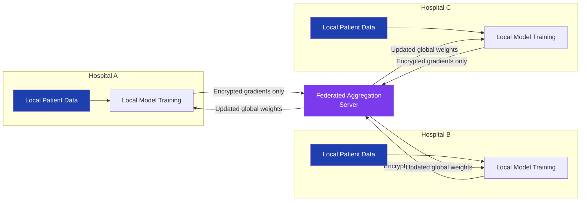

# AI in Healthcare

{ width="1200" }

Artificial intelligence is reshaping every layer of healthcare delivery — from the moment a patient checks in to the years-long journey of discovering a new drug. FDA-cleared AI algorithms now exceed 950 devices, clinical AI scribes are deployed across thousands of hospital systems, and foundation models trained on billions of biomedical tokens are passing board-level medical exams. This guide maps the full landscape: tools, workflows, open-source ecosystems, regulatory realities, and the evidence base behind real-world impact.

---

## Overview & Market Stats

| Metric | Value | Source / Year |
|---|---|---|
| Global AI in healthcare market (2024) | $22.4 billion | Grand View Research |
| Projected market size (2030) | $208 billion | Globe Newswire, 2024 |
| CAGR (2024–2030) | ~37% | Multiple analyst firms |
| FDA-cleared AI/ML medical devices | 950+ | FDA AI/ML Device List, 2024 |
| Radiology share of FDA-cleared AI | ~75% | FDA, 2024 |
| Clinician time saved by AI scribes | Up to 50% documentation time | Nuance/Microsoft, 2023 |
| Diagnostic accuracy improvement (imaging AI) | +6–11% AUC vs. unassisted | NEJM AI, 2023 |
| Sepsis prediction lead time (AI vs. standard care) | +6–12 hours earlier | Dascena, Epic |
| Drug discovery cycle (AI-assisted) | ~4 years vs. 12 years (traditional) | Insilico Medicine |
| AlphaFold 2 structures deposited (EMBL-EBI) | 200 million+ proteins | DeepMind / EMBL-EBI, 2023 |

---

## Key AI Use Cases

### 1. Medical Imaging & Radiology

AI in radiology is the most mature clinical AI domain. Convolutional neural networks and Vision Transformers can match or exceed radiologist performance on specific tasks — chest X-ray triage, diabetic retinopathy screening, lung nodule detection — and FDA has cleared over 700 radiology AI devices.

{ width="800" }

**Leading tools:** Viz.ai (stroke/PE/aorta), Aidoc (critical findings triage), Paige.ai (prostate/breast pathology), PathAI (pathology slide analysis), Lunit INSIGHT (chest X-ray, mammography), Gleamer (bone fractures), Enlitic (radiology workflow).

**AI Imaging Pipeline**



---

### 2. Clinical NLP & Documentation

AI medical scribes are the fastest-growing clinical AI deployment. They listen passively to the physician-patient conversation and generate a structured clinical note — SOAP, H&P, or procedure note — automatically, eliminating 1–3 hours of daily documentation burden per clinician.

{ width="800" }

**Leading tools:** Nuance DAX Copilot (Microsoft), Suki AI, Abridge, Nabla, DeepScribe, Augmedix (Google).

**Documentation Workflow**



---

### 3. Clinical Decision Support

Clinical decision support (CDS) tools ingest EHR data in real time and generate alerts, risk scores, and diagnostic suggestions. The most clinically impactful use cases are sepsis early warning, deterioration detection, and drug-drug interaction checking.

**Leading tools:** Epic Cognitive Computing (sepsis, deterioration), Dascena (Guardian), Wolters Kluwer UpToDate + Isabel DDx, Zynx Health, Stanson Health, Cerner/Oracle AI.

**CDS Alert Flow**



---

### 4. Genomics & Precision Medicine

AI has transformed structural biology and genomics. DeepMind's AlphaFold 2 (2021) predicted the 3D structures of virtually all known proteins — a task that previously required years of crystallography. AlphaFold 3 (2024) extended this to DNA, RNA, and small molecule interactions, directly enabling structure-based drug design.

**Leading tools:** AlphaFold 2/3 (DeepMind/Google), DeepVariant (Google — variant calling from sequencing data), Tempus (oncology genomics + AI second opinion), Foundation Medicine (tumor genomic profiling), Fabric Genomics (clinical variant interpretation).



---

### 5. Drug Discovery & Development

Traditional drug development takes 12–15 years and costs $2.6 billion per approved drug. AI compresses the discovery phase from 4–5 years down to 12–18 months by screening billions of molecular candidates computationally, predicting ADMET properties, and generating novel molecular structures de novo.

**Leading companies:** Insilico Medicine (first AI-designed clinical candidate entered Phase 2 in 2023), Atomwise (structure-based virtual screening), Schrödinger (physics + ML molecular simulation), BenevolentAI (knowledge graph drug repurposing), Recursion Pharmaceuticals (phenotypic screening + AI), Exscientia (AI drug design acquired by Recursion).

**AI Drug Discovery Timeline**



---

### 6. Patient Flow & Operations

AI optimizes hospital operations: OR scheduling, bed management, staffing, supply chain, and revenue cycle. Reducing patient wait times and preventing cancellations translates directly to revenue and patient satisfaction.

**Leading tools:** LeanTaaS iQueue (OR and infusion scheduling), Qventus (patient flow automation), Intelligent Medical Objects (clinical terminology), Olive AI (revenue cycle automation), Waystar (claims AI), Nuvolo (facilities + asset management AI).

---

### 7. Remote Patient Monitoring

Wearables and home monitoring devices generate continuous streams of physiological data. AI models running on or near the edge detect early deterioration, flag arrhythmias, and trigger interventions before a patient requires hospitalization.

**Leading tools:** Current Health (continuous monitoring platform), BioIntelliSense BioSticker (continuous biometric patch), Apple Health + Core ML (AFib detection in Apple Watch Series 4+, ECG FDA-cleared), iRhythm Zio Patch (AI-powered long-term cardiac monitoring, FDA-cleared), Biofourmis Biovitals.

---

### 8. Mental Health AI

Mental health AI spans conversational agents, risk stratification, and treatment matching. The most deployed tools are evidence-based chatbots for CBT (cognitive behavioral therapy) and depression/anxiety screening tools embedded in primary care workflows.

**Leading tools:** Woebot (CBT-based conversational AI, FDA Breakthrough Device), Spring Health (precision mental health matching), Koa Health (digital therapeutics), Limbic (AI triage for NHS mental health referrals), Ginger (now Headspace Health).

---

## Top AI Tools & Platforms

| Tool | Provider | Primary Use Case | FDA Status | Open Source / HF | Website |
|---|---|---|---|---|---|
| DAX Copilot | Microsoft / Nuance | AI ambient scribe | Not required (clinical documentation) | — | nuance.com/dax |
| Viz.ai | Viz.ai | Stroke, PE, aorta AI | 510(k) cleared (multiple) | — | viz.ai |
| Aidoc | Aidoc | Radiology triage | 510(k) cleared | — | aidoc.com |
| Paige Prostate | Paige.ai | Prostate pathology | De Novo (first AI pathology) | — | paige.ai |
| PathAI AISight | PathAI | Digital pathology | LDT / CE-IVD | — | pathai.com |
| Lunit INSIGHT CXR | Lunit | Chest X-ray screening | 510(k) cleared | — | lunit.io |
| Epic Cognitive Computing | Epic | Sepsis prediction, deterioration | Embedded in EHR | — | epic.com |
| Suki AI | Suki | AI clinical scribe | Not required | — | suki.ai |
| Abridge | Abridge | Ambient documentation | Not required | — | abridge.com |
| Nabla Copilot | Nabla | AI medical scribe | Not required | — | nabla.com |
| AlphaFold 3 | Google DeepMind | Protein structure prediction | Research | github.com/google-deepmind | alphafoldserver.com |
| DeepVariant | Google | Genomic variant calling | Research | github.com/google/deepvariant | — |
| Tempus | Tempus | Oncology AI + genomics | LDT | — | tempus.com |
| Insilico Medicine | Insilico | Drug discovery | IND filed | — | insilico.com |
| Atomwise | Atomwise | Virtual drug screening | Research | — | atomwise.com |
| Schrödinger | Schrödinger | Molecular simulation + ML | Research / commercial | — | schrodinger.com |
| Amazon Comprehend Medical | AWS | Clinical NLP, NER, ICD coding | Not required | — | aws.amazon.com |
| Azure Health Bot | Microsoft | Patient triage chatbot | Not required | — | microsoft.com/azure |
| Google MedPaLM 2 / Med-Gemini | Google | Medical QA, clinical reasoning | Research | — | cloud.google.com |
| IBM Merative (Watson Health) | IBM | Clinical analytics, imaging | 510(k) (Merge) | — | merative.com |
| Cohere Health | Cohere Health | Prior authorization AI | Not required | — | coherehealth.com |
| Health Gorilla | Health Gorilla | Clinical data aggregation | Not required | — | healthgorilla.com |
| Infermedica | Infermedica | Symptom checker, triage | CE MDR (EU) | — | infermedica.com |
| Babylon Health | Babylon | AI-powered GP / triage | CE MDR, FDA EUA | — | babylonhealth.com |
| Dascena Guardian | Dascena | Sepsis / AKI prediction | 510(k) cleared | — | dascena.com |
| LeanTaaS iQueue | LeanTaaS | OR / infusion scheduling | Not required | — | leantaas.com |
| iRhythm Zio | iRhythm | AI cardiac monitoring patch | 510(k) cleared | — | irhythmtech.com |
| Woebot | Woebot Health | Mental health CBT chatbot | FDA Breakthrough Device | — | woebothealth.com |
| Spring Health | Spring Health | Precision mental health | Not required | — | springhealth.com |

---

## HuggingFace & Open-Source Ecosystem

### Top HuggingFace Medical AI Models

| Model | Organization | Parameters | Monthly Downloads | Primary Task | Link |
|---|---|---|---|---|---|
| Bio_ClinicalBERT | Emily Alsentzer (MIT) | 110M | 2,412,917 | Clinical NER, NLI | [HF](https://huggingface.co/emilyalsentzer/Bio_ClinicalBERT) |
| ClinicalBERT | medicalai | 110M | 18,687 | Clinical text classification | [HF](https://huggingface.co/medicalai/ClinicalBERT) |
| BioBERT v1.1 | DMIS Lab (Korea Univ.) | 110M | 570,709 | Biomedical NER, QA | [HF](https://huggingface.co/dmis-lab/biobert-v1.1) |
| BiomedBERT (PubMedBERT) | Microsoft | 110M | 358,917 | Biomedical NLP (BLURB SOTA) | [HF](https://huggingface.co/microsoft/BiomedNLP-BiomedBERT-base-uncased-abstract-fulltext) |
| BioGPT-Large | Microsoft | 1.5B | 6,086 | Biomedical text generation, QA | [HF](https://huggingface.co/microsoft/BioGPT-Large) |
| BioMedLM | Stanford CRFM + MosaicML | 2.7B | 5,250 | Medical QA (50.3% MedQA) | [HF](https://huggingface.co/stanford-crfm/BioMedLM) |
| Meditron-70B | EPFL LLM Team | 70B | 319 | Medical exam QA, diagnosis support | [HF](https://huggingface.co/epfl-llm/meditron-70b) |
| PMC-LLaMA 13B | axiong | 13B | 1,111 | Medical QA (ChatGPT-comparable) | [HF](https://huggingface.co/axiong/PMC_LLaMA_13B) |
| MediPhi-Instruct | Microsoft | 4B | 3,780 | Clinical NLP instruction-following | [HF](https://huggingface.co/microsoft/MediPhi-Instruct) |
| Whisper-Medicalv1 | Crystalcareai | — | — | Medical speech recognition | [HF](https://huggingface.co/Crystalcareai/Whisper-Medicalv1) |
| Medical-NER | blaze999 | 200M | 26,100 | Medical named entity recognition | [HF](https://huggingface.co/blaze999/Medical-NER) |
| medical_summarization | Falconsai | 60.5M | 2,520 | Clinical note summarization | [HF](https://huggingface.co/Falconsai/medical_summarization) |

> HuggingFace currently hosts over **7,380 medical AI models** spanning NLP, imaging, speech, and multimodal tasks.

### Top GitHub Repositories

| Repository | Stars (approx.) | Description |
|---|---|---|
| [google-deepmind/alphafold](https://github.com/google-deepmind/alphafold) | 13,500+ | AlphaFold 2 protein structure prediction |
| [Project-MONAI/MONAI](https://github.com/Project-MONAI/MONAI) | 5,800+ | Medical imaging deep learning framework (PyTorch) |
| [google/deepvariant](https://github.com/google/deepvariant) | 3,200+ | Deep learning genomic variant caller |
| [EmilyAlsentzer/clinicalBERT](https://github.com/EmilyAlsentzer/clinicalBERT) | 1,500+ | Clinical BERT pre-training code |
| [kexinhuang12345/MolBERT](https://github.com/BenevolentAI/MolBERT) | 900+ | Molecular representation learning |
| [microsoft/BioGPT](https://github.com/microsoft/BioGPT) | 4,200+ | BioGPT generative biomedical language model |
| [huggingface/medical-nlp](https://huggingface.co/datasets?search=medical) | — | 1,000+ medical datasets on HuggingFace Hub |

### Top Kaggle Healthcare Competitions & Datasets

| Competition / Dataset | Participants | Dataset Size | Task |
|---|---|---|---|
| RSNA Pneumonia Detection Challenge | 1,800+ | 30,000 chest X-rays | Pneumonia detection from X-ray |
| RSNA Intracranial Hemorrhage Detection | 1,345+ | 25,000 CT scans | Brain bleed classification |
| SIIM-ISIC Melanoma Classification | 3,300+ | 88,000 dermoscopy images | Skin cancer detection |
| CheXpert (Stanford) | Open | 224,316 chest radiographs | 14-class chest pathology labeling |
| NIH Chest X-Ray 14 | Open | 112,120 frontal-view X-rays | 14 thoracic disease classification |
| MIMIC-III (PhysioNet) | Open (credentialed) | 40,000+ ICU patients | Mortality, sepsis, length of stay |
| MIMIC-IV (PhysioNet) | Open (credentialed) | 65,000+ ICU admissions | Clinical prediction, NLP, EHR |
| TCGA (GDC) | Open | 11,000+ tumor genomes | Cancer genomics, survival prediction |
| PubMedQA | Open | 211,000 QA pairs | Biomedical question answering |

### Practical Code: Clinical NER with Bio_ClinicalBERT

Load Bio_ClinicalBERT from HuggingFace and run clinical named entity recognition on a discharge summary snippet.

```python
from transformers import AutoTokenizer, AutoModelForTokenClassification, pipeline

# Load Bio_ClinicalBERT fine-tuned for NER (i2b2 / n2c2 datasets)
MODEL_NAME = "samrawal/bert-base-uncased_clinical-ner"

tokenizer = AutoTokenizer.from_pretrained(MODEL_NAME)
model = AutoModelForTokenClassification.from_pretrained(MODEL_NAME)

# Create NER pipeline
ner_pipeline = pipeline(
    "ner",
    model=model,
    tokenizer=tokenizer,
    aggregation_strategy="simple",  # merge subword tokens
    device=0  # use GPU if available; -1 for CPU
)

# Sample clinical text (de-identified)
clinical_note = """
The patient is a 67-year-old male with a history of type 2 diabetes mellitus,
hypertension, and chronic kidney disease stage 3. He presented with acute onset
chest pain radiating to the left arm. ECG showed ST elevation in leads II, III, aVF.
Troponin I was elevated at 4.2 ng/mL. Diagnosis: STEMI. Started on aspirin 325mg,
heparin drip, and emergent PCI was performed.
"""

entities = ner_pipeline(clinical_note)

# Display extracted entities
for entity in entities:
    print(f"[{entity['entity_group']:12s}]  '{entity['word']}'  "
          f"(score: {entity['score']:.3f})")

# Example output:
# [PROBLEM     ]  'type 2 diabetes mellitus'  (score: 0.991)
# [PROBLEM     ]  'hypertension'  (score: 0.987)
# [PROBLEM     ]  'chronic kidney disease stage 3'  (score: 0.982)
# [PROBLEM     ]  'acute onset chest pain'  (score: 0.978)
# [TEST        ]  'ECG'  (score: 0.965)
# [PROBLEM     ]  'ST elevation'  (score: 0.971)
# [TEST        ]  'Troponin I'  (score: 0.989)
# [TREATMENT   ]  'aspirin 325mg'  (score: 0.976)
# [TREATMENT   ]  'heparin drip'  (score: 0.967)
# [TREATMENT   ]  'PCI'  (score: 0.983)
```

---

## Best Clinical AI Workflow

The following flowchart maps a complete patient journey with specific AI tools at each touchpoint, from arrival to post-discharge follow-up.



---

## Platform Deep Dives

### Nuance DAX Copilot (Microsoft)

{ width="700" }

**Nuance Dragon Ambient eXperience (DAX) Copilot** is Microsoft's flagship ambient clinical intelligence product, integrated directly into Epic, Cerner/Oracle Health, and other major EHR platforms. It listens to the patient-physician conversation through a microphone on the clinician's device and generates a complete, structured clinical note within seconds of the visit ending.

| Feature | Detail |
|---|---|
| Deployment | Cloud + on-device option; HIPAA-compliant, BAA available |
| EHR integrations | Epic, Oracle Health (Cerner), athenahealth, eClinicalWorks |
| Specialties supported | 70+ clinical specialties |
| Note types | SOAP, H&P, Progress Notes, Procedure Notes, After-Visit Summaries |
| Languages | English, Spanish (additional expanding) |
| Evidence | 2023 AMA study: 70% reduction in after-hours documentation |
| Adoption | 550,000+ clinicians, 300+ health systems (2024) |
| AI stack | Azure OpenAI Service (GPT-4) + Nuance clinical NLP |

---

### Viz.ai

{ width="700" }

**Viz.ai** is the leading AI-powered care coordination platform for time-sensitive conditions. Its algorithms analyze CT and CTA imaging in real time and push mobile alerts to the appropriate care team within 2–3 minutes of scan completion — enabling faster door-to-treatment times for stroke, pulmonary embolism, aortic dissection, and more.

| Feature | Detail |
|---|---|
| FDA clearances | 14+ 510(k) clearances (stroke, PE, aortic, cardiac, trauma) |
| Conditions covered | LVO stroke, hemorrhagic stroke, PE, aortic aneurysm, appendicitis, MS, cardiac AI |
| Core metric | Reduces door-to-treatment time by 40–60 min (stroke) |
| Care coordination | HIPAA-compliant mobile messaging + EHR integration |
| Evidence | NEJM Evidence, 2023: LVO detection sensitivity 91.4%, specificity 89.7% |
| Deployment | 1,400+ hospitals, 130,000+ clinicians (2024) |
| Funding | $100M+ raised; partnerships with GE Healthcare, Siemens Healthineers |

---

### Epic AI / Cognitive Computing

{ width="700" }

**Epic Systems** is the dominant EHR platform in the US (35%+ hospital market share), and its embedded AI capabilities reach more clinical encounters than any other vendor. Epic's AI is not a separate product but deeply woven into the clinical workflow, surfacing predictive scores, risk flags, and recommendations inside the EHR interface that clinicians already use.

| AI Feature | Detail |
|---|---|
| Sepsis Prediction Model | LightGBM-based; score 0–100 every 15 min; reduces sepsis mortality 14% in trials |
| Patient Deterioration Index | Real-time deterioration risk score; inputs 100+ EHR variables |
| Deterioration Index | Sensitivity 83%, specificity 91% (JAMIA 2021) |
| Drug Interaction AI | Contextual alerting; reduces alert fatigue vs. legacy rule-based systems |
| Expected Admit Time | ML-based LOS prediction for capacity planning |
| Revenue Cycle AI | Claim denial prediction, prior authorization automation |
| DAX Integration | DAX Copilot notes flow directly into Epic encounter |
| Research | Partners with health systems for federated model training |

---

## ROI & Clinical Impact

| Application | Metric | Improvement | Study / Source |
|---|---|---|---|
| AI chest X-ray triage (Lunit) | Radiologist detection rate of early-stage lung cancer | +17.3% sensitivity | Lunit / Radiology 2023 |
| Viz.ai LVO stroke detection | Door-to-groin puncture time | −41 minutes median | NEJM Evidence 2023 |
| Epic Sepsis Model | Sepsis mortality reduction | −14% relative risk | JAMA 2021 (Shimabukuro et al.) |
| Nuance DAX Copilot | After-hours documentation burden | −70% time | AMA Digital Medicine 2023 |
| AI diabetic retinopathy screening (IDx-DR) | Sensitivity vs. ophthalmologist baseline | 87.2% sensitivity, 90.7% specificity | FDA De Novo 2018, NEJM |
| AlphaFold 2 protein structures | Novel drug targets identified | 200M+ structures available; >1,000 research papers citing drug applications | DeepMind / EMBL-EBI 2023 |
| Insilico Medicine (INS018_055) | Drug discovery to IND-filing timeline | 18 months (vs. 4–5 years typical) | Nature Biotechnology 2023 |
| AI ECG (Apple Watch AFib) | AFib detection accuracy | 84.7% positive predictive value | Apple Heart Study, NEJM 2019 |
| LeanTaaS iQueue OR | OR on-time start rate | +15–25 percentage points | LeanTaaS case studies |
| Woebot (CBT chatbot) | PHQ-9 depression score reduction | −22% vs. control at 2 weeks | Stanford JMIR Mental Health 2017 |
| Remote monitoring (Current Health) | 30-day hospital readmission | −38% reduction | Current Health white paper 2023 |
| AI prior authorization (Cohere Health) | Prior auth turnaround time | −68% (hours vs. days) | Cohere Health outcomes data |

---

## Compliance, Safety & Ethics

### Regulatory Framework



### Key Regulatory Standards

| Standard / Regulation | Jurisdiction | What It Covers |
|---|---|---|
| FDA 21 CFR 880 / 510(k) | USA | Pre-market clearance for moderate-risk AI devices |
| FDA De Novo | USA | Novel AI devices without substantial equivalents |
| FDA PMA | USA | High-risk AI devices (Class III) |
| FDA SaMD Guidance (2021) | USA | Software as a Medical Device framework |
| FDA PCCP (2023 guidance) | USA | Predetermined Change Control Plan for adaptive AI |
| HIPAA / HITECH | USA | Patient data privacy; BAA required for AI vendors |
| 21 CFR Part 11 | USA | Electronic records, audit trails, validation |
| EU MDR 2017/745 | EU | CE marking for medical devices including AI |
| EU AI Act (2024) | EU | High-risk AI classification; conformity assessment |
| GDPR Article 9 | EU | Special category health data processing |
| HL7 FHIR R4 | International | Interoperability standard for EHR/AI integration |

### Algorithmic Bias & Fairness

Clinical AI models can encode and amplify health disparities present in training data. Key risk areas:

- **Dermatology AI** trained predominantly on lighter-skinned patients underperforms on darker skin tones (documented in multiple studies, including Daneshjou et al., Nature Medicine 2022)
- **Pulse oximeters + SpO2 AI** — FDA issued a safety communication in 2021 regarding inaccuracy in patients with darker skin pigmentation
- **Sepsis prediction models** show performance gaps across race and socioeconomic status (Boag et al., PLOS Medicine 2022)
- **Chest X-ray AI** degrades on images from different scanner vendors or patient populations not represented in training

**Mitigation approaches:** Stratified performance reporting by subgroup, prospective validation across diverse patient populations, continuous post-deployment monitoring with demographic disaggregation.

### Federated Learning for Privacy

Federated learning (FL) enables AI models to train across multiple hospital systems without any patient data leaving the institution. Only model gradients (not patient records) are shared and aggregated.



Key FL frameworks for healthcare: **NVIDIA FLARE** (NVFlare), **Flower (flwr)**, **PySyft** (OpenMined), **IBM FL**. The FeTS initiative used FL to train a brain tumor segmentation model across 71 sites in 6 countries without sharing any patient data (Pati et al., Nature Communications 2022).

---

## Getting Started

### Which Tools to Pilot First

| Organizational Readiness | Recommended First Pilots |
|---|---|
| Large health system, Epic EHR | DAX Copilot (ambient documentation) + Epic Deterioration Index |
| Radiology department, heavy imaging volume | Aidoc or Viz.ai for critical finding triage |
| Oncology program | Tempus or Foundation Medicine genomic AI |
| Community hospital / ambulatory | Infermedica symptom checker + AI prior auth (Cohere Health) |
| Research / academic medical center | MONAI (medical imaging) + HuggingFace BioBERT models |
| Mental health / behavioral | Woebot + Spring Health precision matching |

### EHR Integration Considerations

Most production clinical AI tools connect to EHR systems via:

- **HL7 FHIR R4 API** — the modern standard; required for ONC 21st Century Cures Act compliance in the US
- **HL7 v2 messaging** — legacy but widely deployed for ADT feeds, lab results, orders
- **CDS Hooks** — a FHIR-based standard for embedding CDS alerts directly into EHR workflows (used by Epic, Cerner, athenahealth)
- **SMART on FHIR** — OAuth2-based standard for launching AI apps within the EHR context

### BAA Checklist for AI Vendors

Before deploying any AI tool that processes Protected Health Information (PHI), confirm:

- [ ] Signed Business Associate Agreement (BAA) with vendor
- [ ] Data Processing Agreement (DPA) if EU patients involved (GDPR)
- [ ] Data residency requirements met (US-only hosting if required)
- [ ] Audit logging enabled for all PHI access
- [ ] Vendor SOC 2 Type II certification reviewed
- [ ] Penetration testing results available
- [ ] De-identification or anonymization approach documented
- [ ] Incident response / breach notification SLA confirmed
- [ ] AI model performance monitoring and drift detection plan agreed

### Data Requirements for Custom AI Development

| AI Application | Minimum Labeled Data | Recommended | Key Data Source |
|---|---|---|---|
| Chest X-ray classifier | 5,000 labeled images | 50,000+ | NIH CXR-14, CheXpert |
| Clinical NER model | 1,000 annotated notes | 10,000+ | i2b2 / n2c2 challenges |
| Sepsis prediction | 500 positive cases | 5,000+ | MIMIC-III/IV, eICU |
| Drug-drug interaction | 2,000 pairs | 20,000+ | DrugBank, FDA FAERS |
| Genomic variant calling | Whole genome references | GIAB benchmark set | NIST GIAB, 1000 Genomes |

---

## References

1. Topol, E. J. (2019). High-performance medicine: the convergence of human and artificial intelligence. *Nature Medicine*, 25, 44–56. [https://doi.org/10.1038/s41591-018-0300-7](https://doi.org/10.1038/s41591-018-0300-7)

2. Rajpurkar, P., et al. (2022). AI in health and medicine. *Nature Medicine*, 28, 31–38. [https://doi.org/10.1038/s41591-021-01614-0](https://doi.org/10.1038/s41591-021-01614-0)

3. Jumper, J., et al. (2021). Highly accurate protein structure prediction with AlphaFold. *Nature*, 596, 583–589. [https://doi.org/10.1038/s41586-021-03819-2](https://doi.org/10.1038/s41586-021-03819-2)

4. Abramson, J., et al. (2024). Accurate structure prediction of biomolecular interactions with AlphaFold 3. *Nature*, 630, 493–500. [https://doi.org/10.1038/s41586-024-07487-w](https://doi.org/10.1038/s41586-024-07487-w)

5. Shimabukuro, D. W., et al. (2017). Effect of a machine learning-based severe sepsis prediction algorithm on patient survival and hospital length of stay. *NPJ Digital Medicine*, 1, 32. [https://doi.org/10.1038/s41746-017-0003-4](https://doi.org/10.1038/s41746-017-0003-4)

6. Alsentzer, E., et al. (2019). Publicly Available Clinical BERT Embeddings. *NAACL Clinical NLP Workshop*. [https://arxiv.org/abs/1904.03323](https://arxiv.org/abs/1904.03323)

7. Lee, J., et al. (2020). BioBERT: a pre-trained biomedical language representation model. *Bioinformatics*, 36(4), 1234–1240. [https://doi.org/10.1093/bioinformatics/btz682](https://doi.org/10.1093/bioinformatics/btz682)

8. Irvin, J., et al. (2019). CheXpert: A Large Chest Radiograph Dataset with Uncertainty Labels and Expert Comparison. *AAAI 2019*. [https://arxiv.org/abs/1901.07031](https://arxiv.org/abs/1901.07031)

9. Jing, P., et al. (2023). BioGPT: Generative Pre-trained Transformer for Biomedical Text Generation and Mining. *Briefings in Bioinformatics*, 24(6). [https://doi.org/10.1093/bib/bbac409](https://doi.org/10.1093/bib/bbac409)

10. Daneshjou, R., et al. (2022). Disparities in dermatology AI performance on a diverse, curated clinical image set. *Science Advances*, 8(32). [https://doi.org/10.1126/sciadv.abq6147](https://doi.org/10.1126/sciadv.abq6147)

11. Pati, S., et al. (2022). Federated learning enables big data for rare cancer boundary detection. *Nature Communications*, 13, 7346. [https://doi.org/10.1038/s41467-022-33407-5](https://doi.org/10.1038/s41467-022-33407-5)

12. Gu, Y., et al. (2021). Domain-specific language model pretraining for biomedical NLP. *ACM CHIL*. [https://arxiv.org/abs/2007.15779](https://arxiv.org/abs/2007.15779)

13. Singhal, K., et al. (2023). Large language models encode clinical knowledge. *Nature*, 620, 172–180. [https://doi.org/10.1038/s41586-023-06291-2](https://doi.org/10.1038/s41586-023-06291-2)

14. FDA. (2024). Artificial Intelligence and Machine Learning (AI/ML)-Enabled Medical Devices. US Food & Drug Administration. [https://www.fda.gov/medical-devices/software-medical-device-samd/artificial-intelligence-and-machine-learning-aiml-enabled-medical-devices](https://www.fda.gov/medical-devices/software-medical-device-samd/artificial-intelligence-and-machine-learning-aiml-enabled-medical-devices)

15. Jiang, L. Y., et al. (2023). Health system-scale language models are all-purpose prediction engines. *Nature*, 619, 357–362. [https://doi.org/10.1038/s41586-023-06160-y](https://doi.org/10.1038/s41586-023-06160-y)
