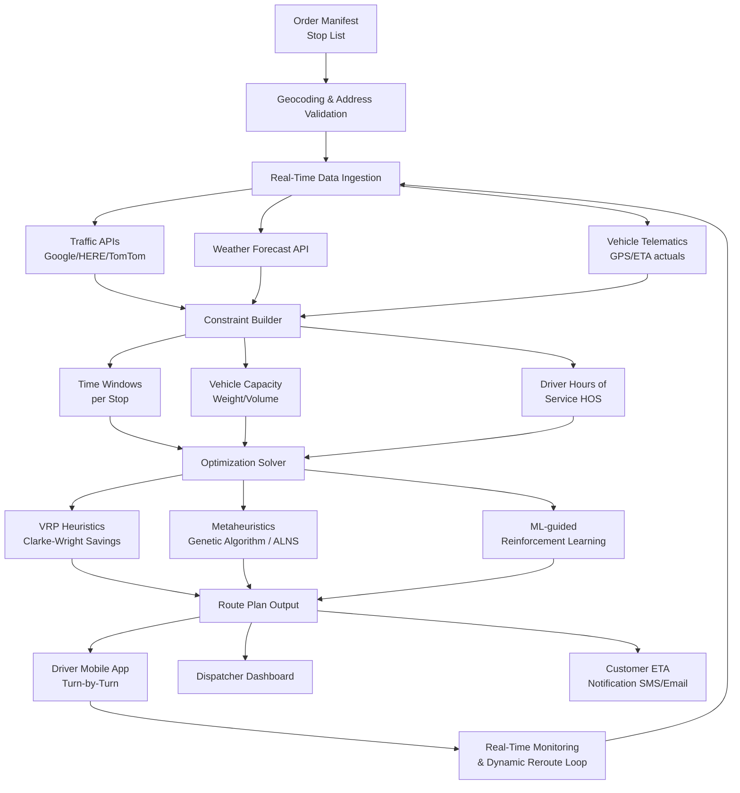
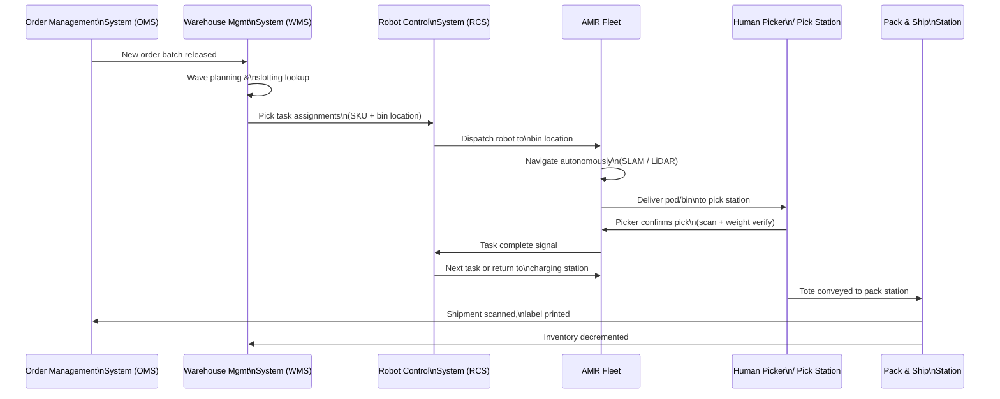
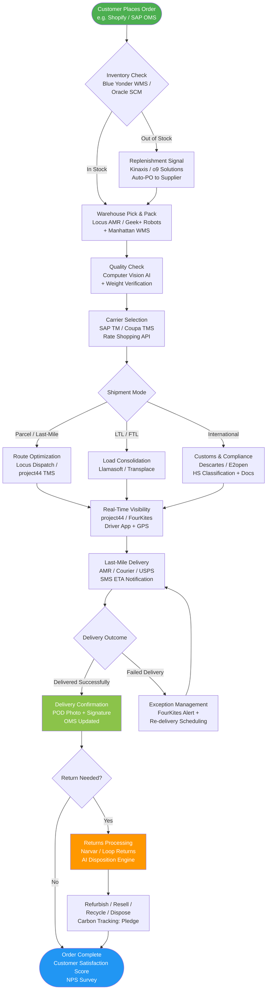

# AI in Logistics & Supply Chain

{ width="900" }

---

## Overview

Logistics and supply chain management is undergoing a fundamental transformation driven by artificial intelligence. From autonomous warehouse robots picking orders in milliseconds to machine-learning models predicting demand weeks in advance, AI is reshaping every link in the supply chain — reducing costs, eliminating delays, and making global commerce more resilient.

**Key industry statistics (2024–2025):**

| Metric | Value | Source |
|--------|-------|--------|
| Global AI in supply chain market size (2024) | **$4.1 billion** | MarketsandMarkets |
| Expected market size by 2029 | **$19.3 billion** (CAGR 36.2%) | MarketsandMarkets |
| Average logistics cost reduction from AI | **15–30%** | McKinsey Global Institute |
| On-time delivery improvement | **up to 35%** | Gartner |
| Fuel savings through AI route optimization | **10–20%** | World Economic Forum |
| Forecast accuracy improvement | **20–50%** | Blue Yonder / Gartner |
| Warehouse picking productivity gain (robotics) | **2–3×** | MHI Annual Industry Report |

AI-powered logistics platforms now integrate demand sensing, autonomous mobile robots (AMRs), real-time freight visibility, and predictive maintenance into unified control towers — giving supply chain leaders the end-to-end intelligence they need to operate in an era of disruption.

---

## Key AI Use Cases

### 1. Route Optimization & Last-Mile Delivery

{ width="700" align=center }

Last-mile delivery accounts for **53% of total shipping costs** yet is the most complex segment to optimize. AI route optimization engines use real-time traffic data, weather forecasts, vehicle capacity constraints, and time-window requirements to generate optimal multi-stop routes dynamically.

**Key capabilities:**
- Dynamic rerouting in real time around traffic or road closures
- Multi-depot vehicle routing problem (VRP) solvers using genetic algorithms and reinforcement learning
- Delivery time-window prediction with probabilistic ETAs
- Driver behavior scoring to reduce fuel consumption
- Crowd-sourced and gig-economy driver coordination (e.g., Amazon Flex)

**Leading tools:** Locus Dispatch, Route4Me, OptimoRoute, Google OR-Tools, project44

---

### 2. Warehouse Automation & Robotics

Warehouse automation combines autonomous mobile robots (AMRs), robotic arms, goods-to-person (GTP) systems, and AI-powered warehouse management systems (WMS) to dramatically increase throughput and accuracy while reducing reliance on manual labor.

**Key capabilities:**
- Pick-and-place robotics with computer vision (handles irregular shapes, mixed SKUs)
- Autonomous mobile robots (AMRs) for tote/pallet transport
- Goods-to-person systems that bring shelves to pickers
- AI-powered slotting optimization (where to store SKUs to minimize travel)
- Automated quality inspection using vision AI

**Leading tools:** Locus Robotics, 6 River Systems (Shopify), Geek+, Vecna Robotics, Dematic, Symbotic, Amazon Robotics

---

### 3. Demand Forecasting & Inventory Management

AI-driven demand forecasting goes far beyond traditional statistical methods (ARIMA, moving averages) to incorporate external signals — social media trends, weather, macroeconomic indicators, promotional calendars, and competitor pricing — producing probabilistic forecasts at the SKU-store level.

**Key capabilities:**
- Multi-echelon inventory optimization (MEIO) across the full supply network
- Automatic replenishment order generation
- Inventory positioning for omnichannel fulfillment
- Markdown and clearance optimization
- New product introduction (NPI) forecasting for items with no history

**Leading tools:** Blue Yonder (Luminate), o9 Solutions, Oracle Demand Management, SAP IBP, Kinaxis RapidResponse, Relex Solutions

---

### 4. Freight & Carrier Management

AI transforms transportation procurement and carrier management through dynamic spot rate prediction, automated carrier selection, load optimization, and real-time exception management.

**Key capabilities:**
- Spot rate forecasting and contract rate benchmarking
- Automated load tendering and carrier selection
- Load consolidation and multi-modal optimization
- Invoice audit and freight payment automation (auditing 100% of invoices vs. 10% manually)
- Emissions tracking per shipment

**Leading tools:** Flexport, Coupa Transportation (Llamasoft), SAP TM, Oracle Transportation Management, Transplace, Loadsmart, Freightos

---

### 5. Predictive Maintenance for Fleet

AI fleet management platforms ingest telematics data (GPS, engine diagnostics, driver behavior) to predict component failures before they cause breakdowns, reducing unplanned downtime by up to 25%.

**Key capabilities:**
- OBD-II and CAN bus data ingestion for real-time diagnostics
- ML models predicting brake, tire, and engine failure
- Predictive maintenance scheduling to minimize route disruption
- Driver safety scoring (harsh braking, speeding, phone use)
- Fuel efficiency optimization and idle time reduction

**Leading tools:** Samsara, Motive (KeepTruckin), Geotab, Fleetio, Uptake

---

### 6. Customs & Compliance Automation

Cross-border logistics involves thousands of regulatory rules. AI automates customs classification, documentation, sanctions screening, and compliance checks — reducing delays and duty mis-classification errors.

**Key capabilities:**
- Automated HS tariff code classification using NLP
- Restricted party screening against OFAC, EU, UN sanctions lists
- Certificate of origin and commercial invoice generation
- Duty drawback identification and filing automation
- Import/export license management

**Leading tools:** Descartes CustomsInfo, Customs City, TradeGecko, Kinaxis, Amber Road (E2open), Integration Point

---

### 7. Real-Time Visibility & Track & Trace

Supply chain visibility platforms aggregate shipment status data from carriers, 3PLs, ports, customs, and IoT sensors into a single pane of glass — enabling proactive exception management.

**Key capabilities:**
- Multimodal tracking (ocean, air, road, rail) in one platform
- AI-powered ETA prediction accounting for weather, port congestion, carrier delays
- Automated alerts for exceptions (customs holds, weather disruptions, capacity shortfalls)
- Control tower dashboards with heat maps and drill-down analytics
- Integration with ERPs, TMS, and WMS via REST APIs

**Leading tools:** project44, FourKites, Shippeo, Visibility Hub (Blume Global), Oracle GTM

---

### 8. Reverse Logistics & Returns

Returns represent 15–30% of e-commerce volume. AI optimizes returns routing, disposition decisions (refurbish, resell, recycle, liquidate), and fraud detection.

**Key capabilities:**
- Automated returns authorization and label generation
- AI grading of returned items using computer vision
- Disposition recommendation engine (cost-optimal resale channel)
- Returns fraud detection (detecting serial returners, wardrobing)
- Green returns routing to minimize carbon footprint

**Leading tools:** Narvar, Happy Returns (UPS), Loop Returns, Returnly, Reentrē

---

## Top AI Tools & Platforms

| Tool | Provider | Category | Key Feature | Free Trial? | Website |
|------|----------|----------|-------------|-------------|---------|
| **Blue Yonder Luminate** | Blue Yonder (Panasonic) | Demand Forecasting, WMS, TMS | End-to-end supply chain AI platform with ML-based demand sensing | Demo only | [blueyonder.com](https://blueyonder.com) |
| **project44** | project44 | Visibility & Track/Trace | Multimodal real-time visibility with AI ETA prediction | No | [project44.com](https://project44.com) |
| **FourKites** | FourKites | Visibility & Analytics | Real-time supply chain visibility with predictive ETAs | No | [fourkites.com](https://fourkites.com) |
| **o9 Solutions** | o9 Solutions | S&OP, Demand Planning | Integrated business planning (IBP) with graph-based AI engine | Demo only | [o9solutions.com](https://o9solutions.com) |
| **Coupa Supply Chain** | Coupa (BSM) | Procurement, Network Design | Network optimization + Llamasoft simulation | No | [coupa.com](https://coupa.com) |
| **Manhattan Active WM** | Manhattan Associates | Warehouse Management | Cloud-native WMS with unified commerce | Demo only | [manh.com](https://manh.com) |
| **Oracle SCM Cloud** | Oracle | End-to-End SCM | AI/ML embedded in procurement, planning, logistics | Yes (30-day) | [oracle.com/scm](https://oracle.com/scm) |
| **SAP Transportation Mgmt** | SAP | Transportation Management | Freight order mgmt, carrier collaboration, green logistics | No | [sap.com](https://sap.com) |
| **Flexport** | Flexport | Freight Forwarding, Visibility | Digital freight forwarder with AI customs & visibility | No | [flexport.com](https://flexport.com) |
| **Samsara** | Samsara | Fleet Telematics, Safety | AI dashcams, predictive maintenance, ELD compliance | Yes (demo) | [samsara.com](https://samsara.com) |
| **Locus Robotics** | Locus Robotics | Warehouse AMRs | Collaborative picking robots (goods-to-person AMRs) | No | [locusrobotics.com](https://locusrobotics.com) |
| **6 River Systems** | 6RS (Shopify) | Warehouse Robotics | Chuck AMRs for order fulfillment | No | [6river.com](https://6river.com) |
| **Geek+** | Geek+ | Warehouse Robotics | Goods-to-person AMRs, sorting robots | No | [geekplusglobotics.com](https://geekplus.com) |
| **Vecna Robotics** | Vecna Robotics | Material Handling AMRs | Pallet-moving AMRs with Pivotal orchestration | Demo only | [vecnarobotics.com](https://vecnarobotics.com) |
| **Turvo** | Turvo | TMS, Collaboration | Collaborative TMS for shippers, brokers, carriers | Demo only | [turvo.com](https://turvo.com) |
| **ShipBob AI** | ShipBob | E-commerce Fulfillment | AI-powered distributed fulfillment for DTC brands | Yes | [shipbob.com](https://shipbob.com) |
| **Kinaxis RapidResponse** | Kinaxis | S&OP, Supply Planning | Concurrent planning with AI scenario modeling | Demo only | [kinaxis.com](https://kinaxis.com) |
| **Relex Solutions** | Relex | Retail Supply Chain | Unified forecasting + replenishment for grocery/retail | Demo only | [relexsolutions.com](https://relexsolutions.com) |

---

## Technology Behind the Tools

### Route Optimization Pipeline

How AI route optimization engines work under the hood:

**Plain English:** The system starts with the day's orders, validates addresses, then pulls live traffic and weather data. A constraint builder encodes all the rules (delivery windows, truck weight limits, driver shift rules). The solver runs a combination of mathematical heuristics and machine-learning models to find near-optimal routes in seconds. Drivers get turn-by-turn instructions on a mobile app while dispatchers monitor progress and the loop continuously re-optimizes if conditions change.

---

### Warehouse Robotics Integration

**Plain English:** When an order batch is released, the WMS plans which SKUs to pick and tells the Robot Control System (RCS). The RCS dispatches AMRs to retrieve the storage pods or bins containing those items. The AMRs navigate autonomously using LiDAR and SLAM mapping, bring the pods to a stationary human picker (greatly reducing walker miles), and return to tasks or charging after the pick is confirmed. The entire loop is orchestrated by software in sub-second cycles, with the WMS keeping inventory counts synchronized throughout.

---

### Demand Forecasting Data Flow

```mermaid
flowchart LR
    subgraph Inputs ["Data Inputs"]
        A1[Historical Sales\nPOS / ERP]
        A2[Promotions\nCalendar]
        A3[External Signals\nWeather / Events]
        A4[Social &\nSearch Trends]
        A5[Supplier Lead\nTime Data]
    end

    subgraph Engine ["Forecasting Engine"]
        B1[Feature Engineering\n& Preprocessing]
        B2[Ensemble ML Models\nGradient Boost / LightGBM\n+ LSTM Neural Nets]
        B3[Probabilistic Output\nPoint + P10/P90 Bands]
        B4[Consensus Layer\nSales & Finance Override]
    end

    subgraph Outputs ["Downstream Actions"]
        C1[Replenishment\nOrders Auto-Generated]
        C2[Safety Stock\nAdjustment]
        C3[Production\nSchedule Signal]
        C4[DC Slotting &\nCapacity Planning]
    end

    Inputs --> B1
    B1 --> B2
    B2 --> B3
    B3 --> B4
    B4 --> Outputs
```

**Plain English:** Demand forecasting engines ingest a blend of internal data (sales history, promotional calendars) and external signals (weather, social media search trends, competitor pricing). Feature engineering transforms raw data into model-ready inputs. Ensemble ML models — typically gradient-boosted trees for structured data plus LSTM neural networks for time series — generate probabilistic forecasts (not just a point estimate but a range). A consensus layer allows planners to override with business intelligence before the forecasts trigger automated replenishment orders and capacity plans.

---

## Best End-to-End Supply Chain Workflow

---

## Platform Deep Dives

### Blue Yonder (Luminate Platform)

{ width="300" }

Blue Yonder (acquired by Panasonic in 2021) is the market leader in AI-native supply chain management. The **Luminate Platform** is a cloud-native, microservices-based suite that spans demand planning, inventory optimization, warehouse management, transportation, and workforce management — all powered by a shared AI/ML engine trained on petabytes of supply chain data.

**Key features:**

- **Luminate Demand** — ML-powered demand sensing using 30+ external data streams, producing probabilistic forecasts at the item-location level
- **Luminate Inventory** — Multi-echelon inventory optimization (MEIO) that sets safety stock targets dynamically across the supply network
- **Luminate Warehouse** — AI-assisted slotting, labor management, and yard management built into a cloud-native WMS
- **Luminate Logistics** — Transportation management with carrier collaboration portal and freight audit
- **Cognitive Demand Planning** — Human-AI collaboration UI where planners review AI recommendations with full explainability
- **Digital Twin** — Simulation capability for scenario modeling (e.g., what happens if Supplier X has a 3-week delay?)
- **Pre-built integrations** with SAP, Oracle, Salesforce, and 200+ EDI trading partners

**Best for:** Large enterprises (>$500M revenue) in retail, CPG, manufacturing, and 3PL/logistics with complex multi-echelon networks.

---

### project44 (Movement Platform)

{ width="280" }

project44 is the world's leading advanced visibility platform, connecting over 1,000 carriers and 3PLs across 190+ countries. The **Movement Platform** provides real-time tracking for parcel, LTL, FTL, ocean, air, and rail shipments in a single interface — with AI-powered ETAs that account for real-world conditions.

**Key features:**

- **Multimodal tracking** — Ocean (AIS data), air, road, rail unified in one platform
- **Dynamic ETA** — ML model trained on billions of actual vs. predicted ETAs, incorporating port congestion, customs delays, weather, carrier-specific performance patterns
- **Supply Chain Intelligence** — Predictive analytics dashboard for OTIF, carrier scorecards, lane performance
- **Network Intelligence** — Benchmarking your carrier performance against aggregated industry data
- **API-first architecture** — REST APIs + webhooks for integration with any TMS, ERP, or control tower
- **Carrier connectivity** — Direct EDI, API, and IoT connections to 1,000+ carriers for true real-time updates (not just milestone-based tracking)
- **Exception management** — Automated alerts with root cause classification (weather, mechanical, customs, carrier failure)

**Best for:** Shippers, 3PLs, and retailers wanting carrier-agnostic multimodal visibility as a foundation for supply chain control tower.

---

### Samsara (Connected Operations Cloud)

{ width="700" }

Samsara is the leading IoT and AI platform for physical operations, used by over 20,000 customers globally for fleet management, driver safety, and equipment monitoring. Its **AI Dash Cams** and real-time telematics platform are category-defining products.

**Key features:**

- **AI Dash Cams** — In-cab and road-facing cameras with real-time AI alerts for distracted driving, drowsiness, tailgating, lane departure, and rolling stops
- **Vehicle Telematics** — GPS tracking, engine diagnostics (fault codes, fuel level, DPF status), driver HOS (ELD compliance)
- **Predictive Maintenance** — ML models on engine fault codes and usage patterns to predict component failures before breakdown
- **Samsara Driver App** — ELD compliance, GPS navigation, pre/post-trip inspection (DVIR), messaging
- **Site Operations** — IoT sensors for equipment runtime, temperature monitoring (cold chain), and site safety
- **Emissions Dashboard** — CO₂, NOₓ tracking per vehicle and per fleet, supporting Scope 1 emissions reporting
- **Open API** — Integrations with SAP, Oracle, Salesforce, Workday, and 200+ third-party apps via Samsara App Marketplace

**Best for:** Fleets of 10+ vehicles (trucking, construction, field services, utilities, public transit) needing ELD compliance plus AI safety and predictive maintenance.

---

## ROI & Metrics

| Use Case | Average Improvement | Source |
|----------|--------------------|---------| 
| Demand forecast accuracy | +20–50% MAPE reduction | Gartner, 2024 Supply Chain Technology Report |
| Inventory carrying costs | -20–30% reduction | McKinsey Global Institute |
| On-time-in-full (OTIF) delivery | +10–25% improvement | Blue Yonder Customer Case Studies |
| Warehouse labor cost per unit | -25–40% with AMRs | MHI Annual Industry Report 2024 |
| Freight cost per shipment | -10–15% via load optimization | Coupa/Llamasoft ROI Analysis |
| Fleet fuel consumption | -10–20% via AI routing | Samsara Fleet Insights Report 2024 |
| Unplanned fleet downtime | -25–30% with predictive maintenance | Uptake / Geotab Analytics |
| Customs clearance time | -30–50% with AI classification | Descartes Systems Group |
| Returns processing cost | -20–35% with AI disposition | Narvar Retail Returns Benchmark 2024 |
| Supply chain disruption response time | -40–60% faster | project44 Supply Chain Intelligence Report |

---

## Getting Started Guide

Adopting AI in logistics requires a phased approach. Jumping to autonomous warehouse robotics before data infrastructure is ready leads to expensive failures. Follow this adoption framework:

### Phase 1 — Data Foundation (Months 1–3)

**Goal:** Establish the data plumbing before any AI tool can work.

1. **Audit your data sources** — Identify where order, inventory, shipment, and telematics data currently live (ERP, WMS, TMS, carrier portals, spreadsheets). The biggest barrier to AI success is fragmented, low-quality data.
2. **Implement a visibility platform first** — Start with project44 or FourKites to get a single source of truth for shipment status. This is low-risk, high-value, and gives you the data foundation for later AI use cases.
3. **Define KPIs** — Agree on baseline metrics: current OTIF rate, forecast error (MAPE/WMAPE), cost per shipment, warehouse cost per unit. You cannot measure AI ROI without baselines.
4. **Data quality cleanup** — Deduplicate product master data, validate carrier SCAC codes, fix address data quality in the OMS. Even the best ML model fails on dirty data.

### Phase 2 — Quick Wins (Months 3–9)

**Goal:** Deploy proven AI tools in areas with immediate ROI and limited integration complexity.

1. **Route optimization** — If you operate your own fleet or use a 3PL, deploy an AI routing tool (OptimoRoute, Locus Dispatch, or your TMS's built-in optimizer). Most tools offer a 30-day pilot on a single depot.
2. **Demand forecasting upgrade** — If you're still using Excel or basic ERP forecasting, evaluate Blue Yonder, Relex, or o9 for a single product category pilot. Typical pilot timeline: 8–12 weeks to first forecasts.
3. **Fleet telematics & safety** — Deploy Samsara or Motive on 10–20 vehicles as a pilot. Install takes 1–2 hours per vehicle. You'll see ELD compliance benefits immediately and safety improvements within weeks.
4. **Carrier performance benchmarking** — Use project44's Network Intelligence to score your top 10 carriers. Use this data in your next carrier RFP.

### Phase 3 — Core AI Deployment (Months 9–18)

**Goal:** Expand AI across core supply chain processes.

1. **WMS upgrade with AI slotting** — Evaluate Manhattan Active WM or Blue Yonder WMS if your current WMS is 5+ years old. AI slotting alone can reduce pick travel distance by 20–30%.
2. **S&OP platform** — Deploy an integrated business planning (IBP) tool like Kinaxis or o9 to replace siloed demand/supply planning spreadsheets.
3. **Transportation management** — Deploy SAP TM or Oracle TMS for automated load tendering, freight audit, and carrier collaboration.
4. **Customs automation** — If you import from 5+ countries, integrate Descartes CustomsInfo for automated HS classification. This pays for itself in reduced mis-classification penalties.

### Phase 4 — Advanced Automation (Month 18+)

**Goal:** Physical automation and end-to-end orchestration.

1. **Warehouse robotics pilot** — Run a 6-month AMR pilot with Locus Robotics or 6 River Systems in one fulfillment center before committing to fleet-wide deployment. Evaluate throughput, pick accuracy, and ergonomic impact.
2. **Control tower** — Build or buy a supply chain control tower that ingests data from your WMS, TMS, visibility platform, and ERP into a unified AI-driven exception management view.
3. **Digital twin** — Use Blue Yonder's simulation capability or Coupa/Llamasoft to model network design changes before capital investment.

### Integration Considerations

- **ERP connectivity** is the most critical integration. Most AI tools have pre-built SAP/Oracle connectors, but custom ERPs require API development.
- **Master data management (MDM)** — Ensure product, location, and partner master data is clean and synchronized across all systems before going live.
- **Change management** — Planner adoption of AI forecasting tools is the #1 failure mode. Invest in training and "AI transparency" features so planners understand why the model is making a recommendation.
- **Total cost of ownership (TCO)** — SaaS licensing is typically 0.1–0.3% of managed logistics spend; factor in integration costs (often 2–3× software cost in year 1).

---

## Compliance & Sustainability

### Carbon Emissions Tracking

Logistics is responsible for approximately **8% of global CO₂ emissions**. Regulatory and customer pressure is accelerating the adoption of carbon accounting tools integrated with supply chain platforms.

**Key regulations:**

| Regulation | Region | Scope | Effective |
|------------|--------|-------|-----------|
| EU Emissions Trading System (EU ETS) — Maritime | EU | Ocean shipping >5,000 GT | 2024 (phased) |
| FuelEU Maritime | EU | GHG intensity of vessel fuel | 2025 |
| EU Corporate Sustainability Reporting Directive (CSRD) | EU | Scope 1, 2, 3 reporting | 2024–2026 (phased) |
| SEC Climate Disclosure Rules | US | Scope 1 & 2 (large accelerated filers) | 2025 |
| UK Streamlined Energy & Carbon Reporting (SECR) | UK | Fleet fuel and emissions | Active |

**Green logistics AI tools:**

- **Pledge** ([pledge.earth](https://pledge.earth)) — Carbon measurement and offsetting API for logistics companies; integrates with freight data to calculate CO₂ per shipment using GLEC Framework methodology
- **Cargofive** ([cargofive.com](https://cargofive.com)) — AI-powered ocean freight procurement and carbon tracking for shippers
- **Samsara Emissions Dashboard** — Fleet-level Scope 1 emissions reporting integrated with telematics data
- **project44 Sustainability** — Emissions per shipment across modes using SmartWay and GLEC-aligned methodology
- **SAP Green Token** — End-to-end Scope 3 emissions tracking across supply chains

**GLEC Framework compliance:** The Global Logistics Emissions Council (GLEC) Framework is the global standard for calculating logistics emissions. Ensure your chosen tool is GLEC-aligned for credible Scope 3 reporting under CSRD/GHG Protocol.

### GDPR & Data Privacy for Shipment Data

Logistics data frequently includes personal data (consignee names, delivery addresses, phone numbers for SMS notifications), triggering GDPR obligations for EU-bound shipments.

**Key considerations:**

- **Data processor agreements (DPAs)** — Required with every SaaS logistics platform that processes EU personal data (project44, FourKites, Narvar, etc.)
- **Cross-border data transfers** — Ensure your visibility platform's data centers are EU-based or covered by EU-US Data Privacy Framework (DPF) adequacy decision
- **Retention limits** — Shipment-level personal data should be purged (or anonymized) after the required retention period (typically 1–3 years for logistics records, but 6 years for tax purposes in some jurisdictions)
- **Driver telematics** — Fleet telematics data on individual drivers is personal data under GDPR; requires a legal basis (legitimate interest or contract) and worker consultation in some EU countries
- **AI profiling** — Automated scoring of driver behavior or customer returns patterns may constitute profiling under GDPR Art. 22 if it produces significant effects; ensure human review mechanisms

---

## References

1. McKinsey Global Institute. (2023). *Generative AI and the Future of Work: Supply Chain Applications.* McKinsey & Company. [https://www.mckinsey.com/capabilities/operations/our-insights/supply-chain-management](https://www.mckinsey.com/capabilities/operations/our-insights/supply-chain-management)

2. Gartner. (2024). *Magic Quadrant for Supply Chain Planning Solutions.* Gartner Research. [https://www.gartner.com/en/supply-chain/topics/supply-chain-planning](https://www.gartner.com/en/supply-chain/topics/supply-chain-planning)

3. MarketsandMarkets. (2024). *AI in Supply Chain Management Market — Global Forecast to 2029.* Report Code: SE 7781. [https://www.marketsandmarkets.com/Market-Reports/ai-in-supply-chain-management-market-12345.html](https://www.marketsandmarkets.com/Market-Reports/ai-in-supply-chain-management-market-12345.html)

4. World Economic Forum. (2023). *The Future of the Last-Mile Ecosystem.* WEF White Paper. [https://www.weforum.org/publications/the-future-of-the-last-mile-ecosystem](https://www.weforum.org/publications/the-future-of-the-last-mile-ecosystem)

5. MHI & Deloitte. (2024). *MHI Annual Industry Report: Embracing the Digital Warehouse.* Material Handling Institute. [https://www.mhi.org/publications/industry-report](https://www.mhi.org/publications/industry-report)

6. Samsara. (2024). *State of Connected Operations Report 2024.* Samsara Inc. [https://www.samsara.com/research/state-of-connected-operations](https://www.samsara.com/research/state-of-connected-operations)

7. project44. (2024). *Supply Chain Intelligence: Annual Disruption Report.* project44 Inc. [https://www.project44.com/resources/supply-chain-intelligence](https://www.project44.com/resources/supply-chain-intelligence)

8. Chopra, S., & Meindl, P. (2022). *Supply Chain Management: Strategy, Planning, and Operation* (7th ed.). Pearson. ISBN: 978-0135715772.

9. Rushton, A., Croucher, P., & Baker, P. (2022). *The Handbook of Logistics and Distribution Management* (6th ed.). Kogan Page. DOI: [10.1093/acprof:oso/9780199678761](https://doi.org/10.1093/acprof:oso/9780199678761)

10. Moons, S., Ramaekers, K., Caris, A., & Arda, Y. (2019). Integration of order picking and vehicle routing in a B2C e-commerce context. *Flexible Services and Manufacturing Journal, 31*(4), 813–843. DOI: [10.1007/s10696-018-9309-4](https://doi.org/10.1007/s10696-018-9309-4)

11. European Commission. (2024). *EU Emissions Trading System (EU ETS) — Shipping.* Climate Action. [https://climate.ec.europa.eu/eu-action/eu-emissions-trading-system-eu-ets/maritime-sector_en](https://climate.ec.europa.eu/eu-action/eu-emissions-trading-system-eu-ets/maritime-sector_en)

12. Smart Freight Centre. (2023). *GLEC Framework v3: Global Logistics Emissions Accounting and Reporting Standard.* Smart Freight Centre. [https://www.smartfreightcentre.org/en/how-to-implement-glec-framework](https://www.smartfreightcentre.org/en/how-to-implement-glec-framework)
