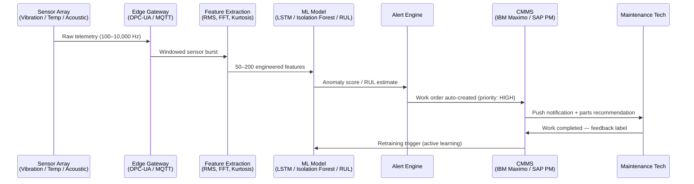
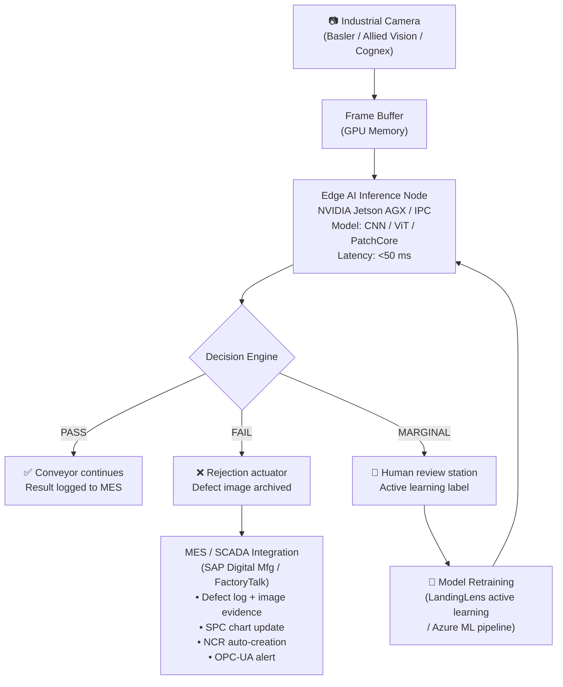
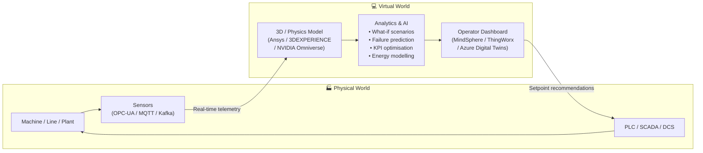
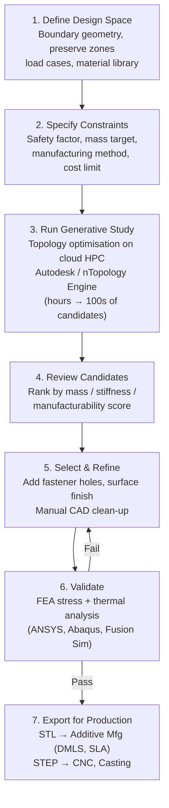
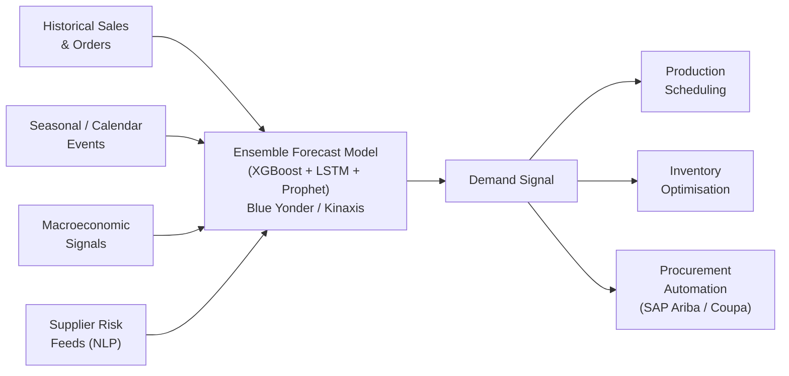
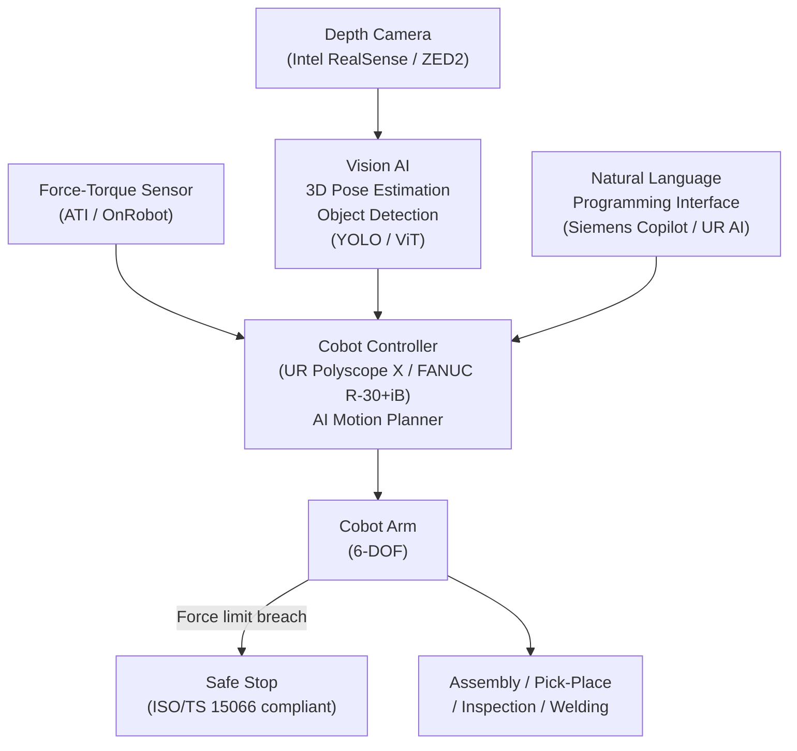
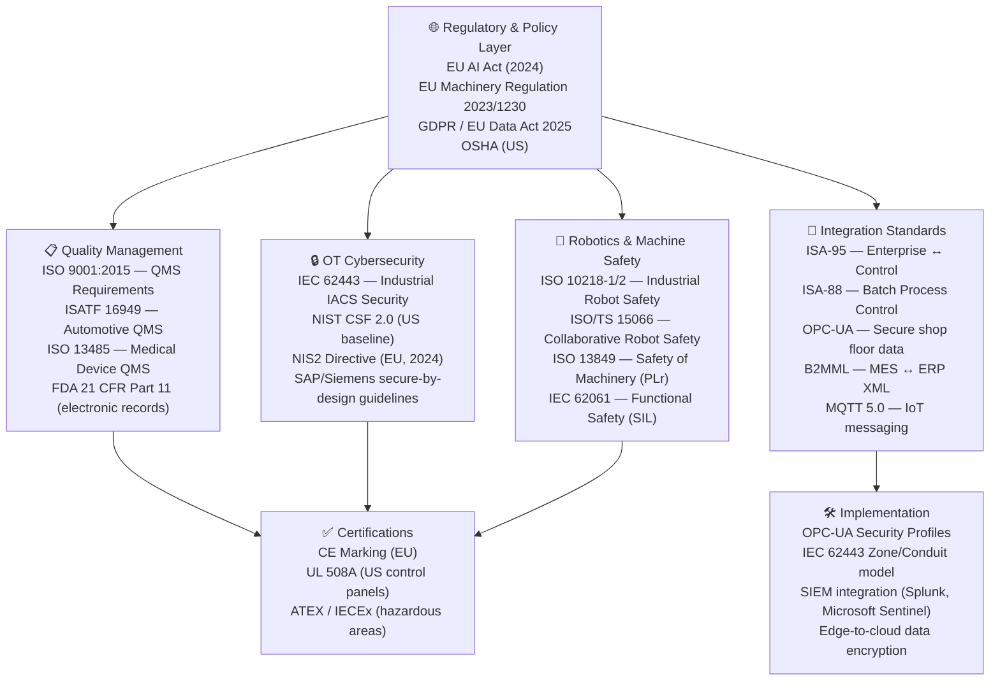
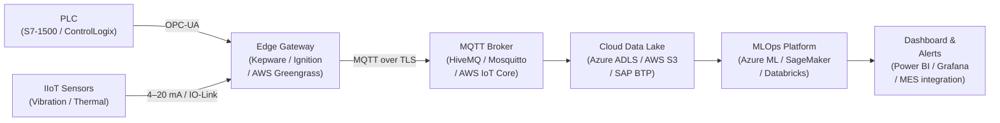

# AI in Manufacturing & Industry 4.0


Manufacturing is undergoing its most profound transformation since the introduction of the assembly line. Artificial intelligence — combined with Industrial IoT (IIoT), edge computing, digital twins, and collaborative robotics — is reshaping how factories design, build, and maintain physical goods at every scale. The global **Industry 4.0 market** was valued at approximately **$130 billion in 2023** and is projected to exceed **$377 billion by 2029** (MarketsandMarkets, 2024). Manufacturers that have deployed AI-driven predictive maintenance report **30–50% reductions in unplanned downtime**, while AI-powered visual quality inspection routinely achieves **defect detection accuracy above 99%**, surpassing human inspectors at a fraction of the cost. **Overall Equipment Effectiveness (OEE) improvements of 8–20 percentage points** are documented across McKinsey's global Lighthouse Factory network within 12–18 months of full deployment. AI-optimised energy management delivers **10–20% reductions in consumption** in process industries. This guide provides engineers, operations managers, and digital transformation leaders with a comprehensive, practitioner-focused reference covering tools, workflows, open-source ecosystems, compliance frameworks, and proven ROI metrics.

---

## Key AI Use Cases

### 1. Predictive Maintenance (PdM)

Predictive maintenance replaces rigid time-based service schedules with condition-based interventions triggered by real sensor signals. Vibration accelerometers, acoustic emission transducers, thermal imaging cameras, oil-particle monitors, and motor current analysers feed continuous streams into ML models trained to recognise bearing-wear signatures, rotor imbalance, cavitation, and lubrication degradation before catastrophic failure occurs. The result is a dramatic reduction in both emergency downtime and unnecessary preventive part replacements.

**Key platforms:** Augury, Uptake, C3.ai APM, IBM Maximo Application Suite, SKF Enlight Centre, Aspentech Mtell, GE Vernova Predix APM, Rockwell FactoryTalk Analytics.



**Sensor stack summary:**

| Sensor Type | Signal | Detects | Hardware Examples |
|---|---|---|---|
| MEMS Accelerometer | 0.1–20 kHz vibration | Bearing defects, imbalance, looseness | PCB Piezotronics, Brüel & Kjær |
| Acoustic Emission | 100 kHz–1 MHz ultrasound | Early-stage cracks, lubrication failure | Mistras Group, Physical Acoustics |
| Thermocouple / RTD | Temperature | Overheating, coolant failure | Omega Engineering |
| Motor Current Signature | 0–60 Hz current | Rotor bar defects, eccentricity | SKF IMx, Fluke |
| Oil Particle Counter | Particle count & size | Wear debris, contamination | Parker Kittiwake |

---

### 2. Visual Quality Inspection

AI-powered computer vision inspects products at line speed — often hundreds to thousands of units per minute — detecting surface defects, dimensional deviations, colour anomalies, contamination, and assembly errors. Systems run at the edge on industrial GPU hardware and integrate with MES platforms to quarantine non-conforming parts, update SPC charts, and auto-generate non-conformance reports (NCRs).

**Key platforms:** LandingLens (Landing AI), Cognex VisionPro, Keyence AI Vision, Zebra Aurora Vision Studio, MVTec HALCON, Teledyne DALSA Sherlock, Omron FH Series.



**Deployment patterns:**
- **Inline inspection:** Camera mounted on conveyor — zero throughput impact, full 100% inspection
- **Offline sampling:** Parts diverted to dedicated station — suitable for complex multi-angle inspection
- **End-of-line:** Final assembly verification before packaging — catches assembly errors
- **Structured light / 3D:** For dimensional inspection of cast or machined parts (Keyence LJ-X, SICK Ranger3)

---

### 3. Digital Twins

A digital twin is a continuously updated virtual replica of a physical asset, production line, or entire factory. It ingests live sensor data, operational parameters, and maintenance history to simulate behaviour, test operational scenarios, and optimise throughput and energy use without touching the physical system.

**Key platforms:** Siemens Xcelerator / Tecnomatix Plant Simulation, Ansys Twin Builder, NVIDIA Omniverse for Manufacturing, PTC ThingWorx + Vuforia, Dassault Systèmes 3DEXPERIENCE, Azure Digital Twins, Bentley iTwin.



**Digital twin tiers:**

| Tier | Scope | Typical Tool | Latency |
|------|-------|-------------|---------|
| Component twin | Single bearing, motor, valve | Ansys Twin Builder | Seconds |
| Asset twin | CNC machine, compressor, robot | Siemens MindSphere | Sub-minute |
| Line twin | Full production line | Siemens Tecnomatix | Minutes |
| Factory twin | Entire plant layout + logistics | NVIDIA Omniverse, Dassault 3DEXPERIENCE | Hours (scenario) |

---

### 4. Generative Design & Product Engineering

Generative design tools use AI-driven topology optimisation algorithms — gradient-based, genetic, or SIMP (Solid Isotropic Material with Penalisation) — to explore vast design spaces and produce lightweight, structurally optimal geometries. Engineers specify constraints (load cases, materials, manufacturing methods, cost targets) and the software generates hundreds of candidates, often discovering organic lattice or bone-like structures that reduce part mass by 30–70% while meeting all structural requirements.

**Key platforms:** Autodesk Fusion Generative Design, nTopology, Dassault Systèmes 3DEXPERIENCE (SIMULIA), Altair Inspire, Siemens NX with Convergent Modelling, PTC Creo Generative Design Extension.



---

### 5. Supply Chain & Demand Forecasting

ML models trained on historical orders, seasonal patterns, promotions, macroeconomic signals, supplier lead times, and external data (weather, port congestion, geopolitical risk feeds) produce demand forecasts that reduce forecast error (MAPE) by 20–40% compared to classical statistical methods (ARIMA, Holt-Winters). Better forecasts reduce safety stock, improve service levels, and allow tighter production scheduling.

**Key platforms:** Blue Yonder Luminate Planning, o9 Solutions, Kinaxis RapidResponse, SAP Integrated Business Planning (IBP), Oracle Demand Management Cloud, Infor Nexus.



---

### 6. Collaborative Robots (Cobots)

AI-enhanced cobots work alongside humans without safety cages, using force-torque sensors, depth cameras, and AI-based motion planning to adapt to human presence in real time. The latest generation integrates natural language programming interfaces, vision-guided pick-and-place with 3D point clouds, and adaptive assembly sequencing that adjusts to part variation.

**Key platforms:** Universal Robots UR Series (UR+ ecosystem), ABB GoFa / SWIFTI, FANUC CRX, Techman Robot (built-in vision), Doosan Robotics, KUKA LBR iisy. Programming: RoboDK, Roboflow (vision datasets), Polyscope X.



---

### 7. Energy Optimisation

AI energy management systems analyse consumption patterns across HVAC, compressed air networks, lighting, drives, and process equipment to identify waste, shift flexible loads to off-peak tariff windows, and predict energy cost trajectories. In energy-intensive industries — steel, cement, chemicals, aluminium smelting — this represents millions of dollars per year in savings.

**Key platforms:** Siemens SIMATIC Energy Manager, Schneider Electric EcoStruxure Energy Expert, IBM Envizi (ESG & Energy), C3.ai Energy Management, GridPoint, Honeywell Forge Energy Optimisation.

---

### 8. LLM Copilots in Manufacturing

Generative AI assistants embedded in industrial platforms are reducing the cognitive burden on engineers and operators. They generate PLC code, answer maintenance queries in natural language, retrieve relevant documentation from millions of pages in milliseconds, and translate operator observations into structured work orders.

| Product | Provider | Integration | Key Capabilities |
|---------|----------|-------------|-----------------|
| **Siemens Industrial Copilot** | Siemens + Microsoft | TIA Portal, SINUMERIK, SIMATIC | PLC code generation, fault diagnosis, multi-language operator support |
| **PTC Copilot** | PTC | ThingWorx, ServiceMax, Creo | Asset health Q&A, service procedure lookup, CAD design suggestions |
| **Rockwell FactoryTalk AI** | Rockwell Automation | FactoryTalk Historian / View | NL queries over historian, anomaly explanation, OEE root-cause |
| **IBM Maximo Copilot** | IBM | Maximo Application Suite | Work order creation by voice, maintenance history summarisation |
| **SAP Joule for Manufacturing** | SAP | Digital Manufacturing, IBP | Production planning Q&A, supply disruption alerts |
| **Tulip AI Assist** | Tulip Interfaces | Tulip platform | Operator step guidance, defect triage, SOP retrieval |

---

## Top AI Tools & Platforms

| Tool / Platform | Provider | Category | Key Feature | Open Source? | Website |
|---|---|---|---|---|---|
| Siemens Industrial Copilot | Siemens | LLM / MES Copilot | NL PLC code generation, fault diagnosis in TIA Portal | No | siemens.com/industrial-copilot |
| Siemens MindSphere | Siemens | IIoT Platform | Open IoT OS; digital twin integration, analytics apps | No | siemens.com/mindsphere |
| PTC ThingWorx | PTC | IIoT / AR Platform | 150+ industrial protocol connectors, Vuforia AR, low-code | No | ptc.com/thingworx |
| GE Vernova Predix | GE Vernova | Industrial AI | Asset performance management, anomaly detection at scale | No | gevernova.com |
| IBM Maximo Application Suite | IBM | EAM / PdM | AI-powered predictive maintenance, visual inspection | No | ibm.com/maximo |
| SAP Digital Manufacturing | SAP | MES / ERP | Production execution, OEE, AI-driven scheduling | No | sap.com/digital-manufacturing |
| Rockwell FactoryTalk | Rockwell Automation | SCADA / MES / Analytics | Unified production intelligence, AI OEE, historian | No | rockwellautomation.com/factorytalk |
| LandingLens | Landing AI | Computer Vision QC | No-code visual inspection, active learning, edge deploy | No | landing.ai |
| Cognex VisionPro | Cognex | Machine Vision | PatMax geometry, deep learning defect detection | No | cognex.com |
| Hexagon Manufacturing Intelligence | Hexagon | Metrology / QC | CMM, smart manufacturing, AI-assisted inspection | No | hexagon.com |
| Ansys Twin Builder | Ansys | Digital Twin | Physics-based + data-driven hybrid twin, ROMs | No | ansys.com/twin-builder |
| Dassault 3DEXPERIENCE | Dassault Systèmes | PLM / Digital Twin | Unified design-simulation-manufacturing-supply chain | No | 3ds.com |
| NVIDIA Omniverse | NVIDIA | Digital Twin / Sim | Real-time physically accurate factory simulation, robot training | Partially (USD) | developer.nvidia.com/omniverse |
| C3.ai | C3.ai | Enterprise AI | Pre-built AI apps for PdM, energy, supply chain, quality | No | c3.ai |
| Augury | Augury | Predictive Maintenance | Machine health via vibration/ultrasound, MaaS model | No | augury.com |
| Uptake | Uptake | Predictive Analytics | Asset intelligence for heavy equipment, rail, mining | No | uptake.com |
| Tulip Interfaces | Tulip | No-Code Factory Apps | Frontline ops platform, operator guidance, IoT integration | No | tulip.co |
| Plex Systems | Rockwell Automation | Cloud MES / ERP | Real-time production tracking, quality, traceability | No | plex.com |
| Prodsmart | Autodesk | Shop Floor MES | Mobile-first OEE, scheduling for SMEs | No | autodesk.com/prodsmart |
| Sight Machine | Sight Machine | Manufacturing Analytics | Real-time shop floor analytics, machine performance | No | sightmachine.com |
| Dataiku for Manufacturing | Dataiku | MLOps / Data Science | End-to-end ML pipeline for industrial data scientists | No | dataiku.com |
| Blue Yonder | Blue Yonder (Panasonic) | Supply Chain AI | Demand forecasting, replenishment, logistics optimisation | No | blueyonder.com |
| o9 Solutions | o9 Solutions | Supply Chain AI | Integrated business planning, real-time scenario modelling | No | o9solutions.com |
| Kinaxis RapidResponse | Kinaxis | S&OP / SCM | Concurrent planning, end-to-end supply chain visibility | No | kinaxis.com |

---

## Open-Source & Research Ecosystem

### GitHub Repositories

| Repository | Maintainer | Stars (2025) | Use Case |
|---|---|---|---|
| [anomalib](https://github.com/openvinotoolkit/anomalib) | Intel / OpenVINO | ~4,200 | Unsupervised anomaly detection for manufacturing visual inspection; benchmarks 30+ algorithms (PatchCore, PaDiM, FastFlow, STFPM) on MVTec AD dataset |
| [pyod](https://github.com/yzhao062/pyod) | Yue Zhao (CMU) | ~8,700 | Comprehensive Python outlier/anomaly detection library; 45+ algorithms including Isolation Forest, COPOD, LOF, SUOD |
| [tsai](https://github.com/timeseriesAI/tsai) | timeseriesAI | ~4,900 | State-of-the-art time-series classification, regression, and forecasting with PyTorch; ideal for sensor data / PdM |
| [detectron2](https://github.com/facebookresearch/detectron2) | Meta AI Research | ~30,000 | Object detection and segmentation platform; used for industrial defect localisation at scale |
| [OpenPCDet](https://github.com/open-mmlab/OpenPCDet) | OpenMMLab | ~4,200 | 3D point cloud detection; used in automated guided vehicles (AGVs) and cobot spatial awareness |
| [PyTorch-Forecasting](https://github.com/jdb78/pytorch-forecasting) | Jan Beitner | ~3,900 | Time-series forecasting with Temporal Fusion Transformers; demand forecasting in production |
| [MNAD](https://github.com/cvlab-yonsei/MNAD) | Yonsei CV Lab | ~500 | Memory-augmented normalising flow for video anomaly detection on factory floor cameras |
| [sktime](https://github.com/sktime/sktime) | sktime community | ~7,700 | Unified time-series ML framework; classification, regression, clustering of sensor streams |

### HuggingFace Models Relevant to Manufacturing

| Model / Collection | Type | Relevance |
|---|---|---|
| `openvinotoolkit/padim` | Anomaly detection | PaDiM-WideResNet50 for unsupervised surface defect detection, MVTec AD benchmark |
| `google/vit-base-patch16-224` | Vision Transformer | Fine-tuned for defect classification on casting/PCB datasets |
| `microsoft/swin-transformer` | Vision Transformer | High-accuracy hierarchical ViT; used for semiconductor wafer map classification |
| `huggingface/time-series-transformer` | Time-Series | Encoder-decoder for multivariate sensor forecasting (RUL prediction) |
| `Salesforce/moirai-1.0-R-large` | Time-Series Foundation | Universal time-series foundation model; zero-shot forecasting on industrial sensor streams |
| `google/t5-base` + LoRA fine-tuned | NLP | Maintenance document QA, failure mode summarisation |
| Various anomalib model cards | Anomaly Detection | Community fine-tunes of PatchCore, FastFlow on DAGM, BTAD, KolektorSDD datasets |

### Kaggle Datasets

| Dataset | Competition / Source | Size | Task |
|---|---|---|---|
| [SECOM Semiconductor](https://www.kaggle.com/datasets/paresh2047/uci-semcom) | UCI ML Repository | 1,567 samples, 591 features | Yield prediction — highly imbalanced binary classification |
| [Steel Surface Defect Detection](https://www.kaggle.com/datasets/fantacher/neu-metal-surface-defects-data) | Northeastern Univ. (NEU-DET) | 1,800 images, 6 defect classes | Computer vision defect classification and detection |
| [Casting Product Quality](https://www.kaggle.com/datasets/ravirajsinh45/real-life-industrial-dataset-of-casting-product) | Kaggle | 7,348 images | Binary defect/no-defect classification for pump impeller castings |
| [NASA Bearing Dataset](https://www.kaggle.com/datasets/vinayak123tyagi/bearing-dataset) | NASA PCOE | 4 bearings × 984 files | Remaining useful life (RUL) prediction from vibration time-series |
| [AI4I 2020 Predictive Maintenance](https://www.kaggle.com/datasets/stephanmatzka/predictive-maintenance-dataset-ai4i-2020) | UCI / Kaggle | 10,000 records | Multi-class failure mode prediction (tool wear, heat dissipation, power, overstrain) |
| [DAGM 2007 Defect Detection](https://www.kaggle.com/datasets/mhskjelvareid/dagm-2007-competition-dataset-optical-inspection) | DAGM | 15,000 images, 10 classes | Weakly supervised surface defect detection on textured backgrounds |
| [KolektorSDD2](https://www.kaggle.com/datasets/nxthings/kolektor-surface-defect-dataset-2) | Kolektor Group | 3,335 images | Surface defect segmentation on electrical commutators |

### Code Example: Anomalib for Unsupervised Defect Detection

Intel's **anomalib** library provides a unified API to train, benchmark, and deploy unsupervised anomaly detection models on product images — no defect labels required during training.

```python
# pip install anomalib>=1.0

from anomalib.data import MVTec
from anomalib.models import Patchcore
from anomalib.engine import Engine
from anomalib.deploy import ExportType
from pathlib import Path
import torch

# ── 1. Load dataset (MVTec AD or your own folder of "good" images) ──────────
datamodule = MVTec(
    root="./datasets/casting_product",
    category="impeller",           # subfolder with train/good/ and test/
    image_size=(256, 256),
    train_batch_size=32,
    eval_batch_size=32,
    num_workers=8,
    task="segmentation",           # or "classification"
)

# ── 2. Initialise PatchCore model (best MVTec benchmark performance) ─────────
model = Patchcore(
    backbone="wide_resnet50_2",    # ImageNet-pretrained CNN backbone
    layers=["layer2", "layer3"],   # Feature extraction levels
    coreset_sampling_ratio=0.1,    # Memory bank sub-sampling for inference speed
    num_neighbors=9,
)

# ── 3. Train (no defect labels needed — learns normal distribution only) ─────
engine = Engine(
    max_epochs=1,                  # PatchCore is non-iterative: 1 epoch
    accelerator="gpu" if torch.cuda.is_available() else "cpu",
    devices=1,
    logger=False,
)
engine.fit(model=model, datamodule=datamodule)

# ── 4. Evaluate on test images (defective + good) ────────────────────────────
test_results = engine.test(model=model, datamodule=datamodule)
print(f"AUROC: {test_results[0]['test_image_AUROC']:.4f}")
# Typical: 0.98+ on casting defects

# ── 5. Export to ONNX for edge deployment (NVIDIA Jetson / Intel OpenVINO) ───
engine.export(
    model=model,
    export_type=ExportType.ONNX,
    export_root=Path("./exports/casting_patchcore"),
)
print("Model exported to ./exports/casting_patchcore/model.onnx")

# ── 6. Run inference on a new production image ────────────────────────────────
from anomalib.deploy import OpenVINOInferencer
import cv2

inferencer = OpenVINOInferencer(
    path="./exports/casting_patchcore/openvino/model.xml",
    metadata="./exports/casting_patchcore/openvino/metadata.json",
)
image = cv2.imread("new_part_image.jpg")
predictions = inferencer.predict(image=image)
print(f"Anomaly score: {predictions.pred_score:.4f}")  # > 0.5 = defective
# predictions.anomaly_map: heatmap showing defect location
```

**Additional code example: PdM with scikit-learn and sensor features**

```python
import pandas as pd
import numpy as np
from sklearn.ensemble import IsolationForest
from sklearn.preprocessing import StandardScaler

# ── Simulate a bearing sensor feature dataset ─────────────────────────────────
# In production: replace with OPC-UA historian query (Kepware / AVEVA PI)
np.random.seed(42)
n_normal = 5000
n_fault = 200

normal_data = pd.DataFrame({
    "rms_vibration":    np.random.normal(0.5, 0.05, n_normal),
    "kurtosis":         np.random.normal(3.0, 0.3, n_normal),
    "peak_frequency_hz":np.random.normal(120, 5, n_normal),
    "temperature_c":    np.random.normal(65, 3, n_normal),
    "label": 0  # normal
})
fault_data = pd.DataFrame({
    "rms_vibration":    np.random.normal(1.8, 0.4, n_fault),
    "kurtosis":         np.random.normal(8.5, 1.2, n_fault),
    "peak_frequency_hz":np.random.normal(180, 20, n_fault),
    "temperature_c":    np.random.normal(78, 5, n_fault),
    "label": 1  # fault
})
df = pd.concat([normal_data, fault_data]).sample(frac=1).reset_index(drop=True)
features = ["rms_vibration", "kurtosis", "peak_frequency_hz", "temperature_c"]

# ── Train Isolation Forest (unsupervised — no fault labels at training time) ──
scaler = StandardScaler()
X_train = scaler.fit_transform(df[features])

iso_forest = IsolationForest(
    n_estimators=200,
    contamination=0.04,    # Expected 4% anomaly rate
    random_state=42,
    n_jobs=-1
)
iso_forest.fit(X_train)

# ── Score new sensor readings ─────────────────────────────────────────────────
new_readings = pd.DataFrame({
    "rms_vibration": [0.52, 1.95],
    "kurtosis": [3.1, 9.2],
    "peak_frequency_hz": [121, 195],
    "temperature_c": [65.5, 82.1]
})
scores = iso_forest.decision_function(scaler.transform(new_readings))
predictions = iso_forest.predict(scaler.transform(new_readings))
for i, (score, pred) in enumerate(zip(scores, predictions)):
    status = "NORMAL" if pred == 1 else "ANOMALY — ALERT MAINTENANCE"
    print(f"Reading {i+1}: score={score:.3f}  → {status}")
# Reading 1: score=0.142  → NORMAL
# Reading 2: score=-0.287 → ANOMALY — ALERT MAINTENANCE
```

---

## Best Smart Factory Workflow

```mermaid
flowchart TD
    subgraph DESIGN["🎨 Design & Engineering"]
        D1["Autodesk Fusion /\nSiemens NX\nGenerative Design"]
        D2["ANSYS / Abaqus\nFEA Simulation"]
        D3["Dassault 3DEXPERIENCE\nPLM / Change Mgmt"]
    end

    subgraph PROCURE["📦 Procurement & Planning"]
        P1["SAP IBP\nDemand Forecasting"]
        P2["Blue Yonder /\nKinaxis\nSupply Planning"]
        P3["SAP Ariba / Coupa\nSupplier Risk AI\n(NLP monitoring)"]
    end

    subgraph MES["🏗️ Production Planning & MES"]
        M1["SAP Digital Manufacturing\nor Rockwell Plex\nProduction Scheduling"]
        M2["Tulip Interfaces\nOperator Work Instructions\n+ IoT Integration"]
        M3["Prodsmart\nSME Shop Floor Tracking"]
    end

    subgraph MFG["⚙️ Manufacturing Execution"]
        MF1["Siemens MindSphere\nReal-Time Asset Monitoring\n+ OPC-UA Data Collection"]
        MF2["UR / ABB GoFa / FANUC CRX\nAI-Guided Cobots\n(Vision + Force Control)"]
        MF3["Schneider EcoStruxure\nEnergy Optimisation\n(Compressed Air / HVAC)"]
    end

    subgraph QC["🔍 Quality Control"]
        Q1["LandingLens / Cognex\nVisual AI Inspection\n(Edge GPU, <50ms)"]
        Q2["Hexagon CMM /\nKeyence 3D\nDimensional Metrology"]
        Q3["SAP QM / Rockwell\nSPC + NCR Workflow\nAuto-Quarantine"]
    end

    subgraph SHIP["🚚 Logistics & Shipping"]
        S1["Blue Yonder WMS\nAI Slotting &\nWave Planning"]
        S2["NVIDIA Omniverse\nWarehouse Robot\nSimulation"]
        S3["Oracle TMS\nRoute Optimisation\nCO₂ Tracking"]
    end

    subgraph PdM["🔧 Predictive Maintenance Loop"]
        PM1["Augury / SKF Enlight\nContinuous Vibration\n& Acoustic Monitoring"]
        PM2["IBM Maximo / SAP PM\nCMMS Auto Work Orders\nParts Recommendation"]
        PM3["C3.ai APM\nRUL Prediction\n+ Digital Twin Sync"]
    end

    DESIGN --> PROCURE
    PROCURE --> MES
    MES --> MFG
    MFG --> QC
    QC --> SHIP
    MFG -.->|"Sensor telemetry\n(OPC-UA / MQTT)"| PdM
    PdM -.->|"Maintenance actions\n& model retraining"| MFG

    classDef design fill:#dbeafe,stroke:#3b82f6
    classDef procure fill:#fef3c7,stroke:#f59e0b
    classDef mes fill:#dcfce7,stroke:#22c55e
    classDef mfg fill:#f3e8ff,stroke:#a855f7
    classDef qc fill:#fee2e2,stroke:#ef4444
    classDef ship fill:#ffedd5,stroke:#f97316
    classDef pdm fill:#e0f2fe,stroke:#0284c7

    class DESIGN,D1,D2,D3 design
    class PROCURE,P1,P2,P3 procure
    class MES,M1,M2,M3 mes
    class MFG,MF1,MF2,MF3 mfg
    class QC,Q1,Q2,Q3 qc
    class SHIP,S1,S2,S3 ship
    class PdM,PM1,PM2,PM3 pdm
```



**Data backbone across all stages:**

```
OPC-UA (field ↔ SCADA) → MQTT (edge ↔ gateway) → Apache Kafka (stream processing)
→ Cloud Data Lake (Azure ADLS / AWS S3 / SAP BTP Data Spaces)
→ MLOps Platform (Azure ML / SageMaker / Rockwell FactoryTalk AI Studio)
→ LLM Copilots (Siemens Industrial Copilot / SAP Joule / IBM Maximo Copilot)
```

---

## Platform Deep Dives

### Siemens Industrial Copilot

{ width="700" }

Siemens Industrial Copilot, developed in partnership with Microsoft Azure OpenAI Service and launched in 2023–2024, is the first large-scale generative AI assistant embedded directly in industrial automation environments at production scale. It integrates with TIA Portal (PLC programming), SINUMERIK (CNC machining centres), SIMATIC MES, and the Xcelerator digital business platform.

**Key capabilities:**

- **PLC code generation:** Natural language → IEC 61131-3 structured text or ladder logic in seconds; reported 50% reduction in PLC programming time for complex motion sequences
- **Fault diagnosis:** Operators describe symptoms in plain language; copilot correlates against maintenance history, wiring diagrams, alarm logs, and error code databases
- **Documentation retrieval (RAG):** Instant answers from millions of pages of Siemens technical manuals — user-specific to their exact machine configuration and installed software version
- **Multi-language support:** German, English, Chinese, French, and others — critical for global manufacturing deployments
- **Maintenance narrative generation:** Automatically summarises maintenance history into structured reports for audit and regulatory submissions
- **On-premises / hybrid deployment:** Azure-hosted with data residency controls to meet EU/China sovereignty requirements
- **Teamcenter PLM integration:** Design-to-production knowledge continuity — queries can span from original design intent through current production BOM

**Documented deployments:** Schaeffler AG (bearing production), Siemens' own Erlangen electronics factory, TRUMPF laser cutting systems, and Volkswagen production planning.

---

### Landing AI / LandingLens v2

{ width="700" }

LandingLens — built by Andrew Ng's Landing AI and significantly expanded in the v2 platform (2024) — is the leading purpose-built cloud and edge computer vision platform for manufacturing quality inspection. Its defining advantage is an active learning workflow that enables quality engineers (not data scientists) to train production-grade visual inspection models with as few as 30–50 labelled images.

**Key capabilities:**

- **No-code labelling and training:** Drag-and-drop annotation, model training, and performance evaluation accessible to quality engineers without ML expertise
- **Active learning loop:** Model continuously flags its own low-confidence predictions for targeted human review, reaching production accuracy with 10x fewer labels than traditional pipelines
- **LandingLens v2 Visual Prompting:** Zero-shot and few-shot visual inspection using foundation model features — test a new product with zero labelling in some defect categories
- **Edge deployment:** Export to NVIDIA Jetson, Intel OpenVINO, standard x86 edge PCs — sub-50ms inference latency at the line
- **Camera ecosystem connectors:** Pre-built integrations with Basler, Allied Vision, Cognex, and GigE Vision-compatible cameras
- **Regulated industry compliance:** Built-in audit trail with image, model version, timestamp, and decision logging meeting FDA 21 CFR Part 11 and ISO 13485
- **MES/SCADA integration:** REST API for automated quarantine commands, NCR creation, and SPC chart updates via OPC-UA
- **Multi-task models:** Simultaneous detection, segmentation, and classification in a single forward pass

**Industry deployments:** Electronics PCB solder inspection, pharmaceutical blister pack sealing, food & beverage packaging integrity, automotive stamping surface scratches, solar panel cell micro-crack detection.

---

### NVIDIA Omniverse for Manufacturing

{ width="700" }

NVIDIA Omniverse Enterprise — based on Pixar's Universal Scene Description (USD) format — provides a physically accurate, real-time collaborative 3D simulation environment for manufacturing digital twins, robot training, and factory layout optimisation. Key updates in 2024–2025 include deeper integration with NVIDIA Isaac Sim for robot learning and NVIDIA Metropolis for edge AI vision.

**Key capabilities:**

- **Factory layout simulation:** Full 3D factory models with physics-accurate robot arms, conveyors, AGVs, and workers — simulate throughput, ergonomics, and safety scenarios before committing to physical changes
- **Robot training (Isaac Sim):** Simulate millions of pick-and-place cycles in randomised lighting, object positions, and part variations (domain randomisation) to train robust robot perception models without real hardware
- **BMW Group deployment:** BMW uses Omniverse to plan every new factory layout — reportedly simulating more than 30 production planning scenarios per new model launch
- **NVIDIA Metropolis integration:** Factory-floor camera feeds processed with edge AI for real-time worker safety monitoring (PPE detection, zone compliance, near-miss detection)
- **Multi-user collaboration:** Engineers, robotics teams, and facility planners in different countries work simultaneously in the same virtual factory model
- **OpenUSD interoperability:** Import CAD from CATIA, NX, Creo, and SolidWorks; export to Omniverse for simulation; results feed back into PLM
- **Digital twin synchronisation:** Real factory sensor data (OPC-UA) drives the virtual factory in near-real-time for remote monitoring and anomaly correlation

---

## ROI & Metrics

| Use Case | KPI | Improvement | Source / Company |
|---|---|---|---|
| Overall Equipment Effectiveness | OEE percentage points | +8–15 pp | McKinsey Lighthouse Factory Studies, 2023 |
| Unplanned downtime (PdM) | % reduction | 30–50% | Deloitte "Smart Factory" Report, 2022 |
| Defect rate (AI visual inspection) | % defects vs. manual | 50–90% reduction | Landing AI; Cognex application notes |
| First-pass yield | % improvement | +5–12% | Sight Machine customer benchmarks |
| Inventory cost (AI demand forecasting) | Safety stock reduction | 20–30% | Gartner Supply Chain Report, 2023 |
| Energy consumption | % reduction | 10–20% | Siemens white papers; C3.ai case studies |
| Maintenance labour cost | % reduction | 10–25% | IBM Institute for Business Value, 2022 |
| New operator onboarding (AR-guided) | Training time reduction | 40–60% faster | PTC Vuforia customer studies |
| Product design cycle time (generative) | Design iteration speed | 30–50% faster | Autodesk Fusion customer stories |
| QC inspection throughput vs. manual | Units per hour | 3–10× faster | Cognex; Keyence application benchmarks |
| Scrap & rework cost | % reduction | 20–40% | McKinsey, 2022; Augury customer data |
| Energy-intensive process (aluminium) | kWh per tonne reduction | 8–15% | Siemens Energy Manager deployments |
| Cobot TCO vs. traditional robot | Total cost reduction | 30–50% lower | Universal Robots ROI calculator |

---

## Standards, Safety & Compliance

### Compliance Architecture



### Key Standard Summaries

**ISO 9001:2015 — Quality Management Systems**
AI-driven inspection systems must produce auditable records (image, model version, timestamp, result), support CAPA workflows when defect rates breach control limits, and undergo calibration/validation as measuring instruments under Clause 7.1.5.

**IEC 62443 — Industrial Cybersecurity**
IIoT gateways must be deployed in a DMZ between OT (Levels 0–2) and IT/cloud networks (Levels 3–4). AI model updates are treated as firmware changes requiring security testing before OT deployment. Adversarial sensor manipulation — feeding false data to confuse AI models — must be addressed in the threat model.

**ISA-95 (IEC 62264) — MES / ERP Integration**
Defines the data models and interface standards for Production Scheduling, Production Performance, Product Definition Management, and Resource Management across the enterprise-control boundary. All major MES platforms (SAP Digital Mfg, Rockwell Plex, Tulip) implement ISA-95 models.

**ISO/TS 15066 — Collaborative Robot Safety**
Specifies power and force limits for human-robot contact: transient contact (≤280 N for most body regions), quasi-static contact limits, and minimum separation speed requirements. AI-based human detection systems must fail-safe — loss of inference capability must trigger a controlled stop, not a continuation.

**EU Machinery Regulation 2023/1230 (effective 2027)**
Machines with "evolving behaviour" (ML-based adaptive control) must document the AI's decision logic and operational limits. Safety functions implemented by AI require SIL/PLr assessment identical to traditional safety-rated hardware.

**EU AI Act (2024) — Industrial Implications**
Most manufacturing AI is classified as **limited or minimal risk**. However, AI systems performing safety functions — cobot human detection, autonomous guided vehicle navigation, safety-related process control — may qualify as **high-risk systems** (Annex III), requiring conformity assessment, registration in the EU AI database, and ongoing monitoring documentation.

---

## Getting Started: AI Maturity Model & Pilot Framework

### AI Maturity Levels

| Level | Name | Data State | Analytics Capability | AI Deployment | Typical Tools |
|---|---|---|---|---|---|
| **0** | Isolated | Paper records / manual entry | None | None | Clipboards, Excel |
| **1** | Connected | PLC data logged locally | Basic OEE counters | None | SCADA historian |
| **2** | Visible | Historian + dashboards | KPI reporting, SPC | Rule-based alerts | Ignition, FactoryTalk View |
| **3** | Predictive | Real-time IIoT + cloud | ML models piloted | Single use-case AI deployed | MindSphere, Tulip, LandingLens |
| **4** | Autonomous | Full digital twin | AI across all production KPIs | Multi-domain AI + LLM copilots | Siemens Xcelerator, NVIDIA Omniverse, C3.ai |

**Readiness assessment:**
- Levels 0–1: Prioritise OPC-UA connectivity and MES/historian deployment before any AI investment
- Level 2: Ready for a focused 90-day AI pilot on one well-instrumented asset or line
- Level 3+: Ready for multi-use-case AI programme with MLOps governance

### Pilot Use Case Selection Matrix

| Segment | Recommended First Pilot | Data Requirement | Time to Value |
|---|---|---|---|
| Automotive / discrete | AI visual inspection on stamping / trim line | 500+ labelled images | 8–12 weeks |
| Food & beverage | PdM on compressors / refrigeration | 6 months vibration history | 10–16 weeks |
| Electronics / PCB | Solder joint AI inspection | 200+ labelled board images | 6–10 weeks |
| Chemicals / process | Energy optimisation on distillation column | 12 months energy + production history | 12–20 weeks |
| Industrial OEM | Remote condition monitoring (as-a-service) | 3 months sensor stream | 12–16 weeks |
| Pharma / medical | Tablet / capsule visual inspection | 1,000+ labelled images, 21 CFR setup | 16–24 weeks |

### Minimum Viable Connectivity Stack



### Build vs. Buy Decision Framework

| Factor | Build (Open-Source / Custom) | Buy (SaaS / Enterprise Platform) |
|---|---|---|
| **Best for** | Unique process, large data science team, long-term IP | Speed to value, limited ML staff, standard use case |
| **Time to pilot** | 6–18 months | 8–16 weeks |
| **Upfront cost** | Low licence cost; high engineering cost | High licence; low engineering |
| **Flexibility** | Full control over algorithms and data | Limited customisation |
| **Maintenance** | Ongoing model retraining, infra management | Vendor-managed updates |
| **Good choices** | anomalib (visual inspection), pyod + tsai (PdM), PyTorch-Forecasting | LandingLens, Augury, C3.ai, IBM Maximo, SAP IBP |
| **Recommended for most manufacturers** | Hybrid: open-source models wrapped in enterprise MLOps (Azure ML + anomalib) | Start with SaaS for first pilot; build for competitive differentiation |

### OPC-UA / MQTT Connectivity Quick Reference

| Protocol | Layer | Use Case | Port | Security |
|---|---|---|---|---|
| **OPC-UA** | Shop floor ↔ MES | PLC data, alarm management, recipe control | 4840 (default) | Certificate-based auth, message signing + encryption |
| **MQTT 5.0** | Edge ↔ Cloud | Lightweight sensor telemetry, IoT messaging | 1883 (plain) / 8883 (TLS) | TLS 1.3, username/password, JWT tokens |
| **Kafka** | Cloud stream processing | High-throughput historian data, ML feature pipelines | 9092 (broker) | SASL/SCRAM, ACLs |
| **REST / HTTPS** | Cloud ↔ Cloud | MES/ERP integrations, dashboard APIs | 443 | OAuth 2.0 / API keys |
| **B2MML** | MES ↔ ERP | Production scheduling, quality data exchange | HTTPS (wrapped) | WS-Security |

---

## References

1. McKinsey Global Institute. (2022). *Capturing the true value of Industry 4.0 in operations*. McKinsey & Company. https://www.mckinsey.com/capabilities/operations/our-insights/capturing-the-true-value-of-industry-4-point-0-in-operations

2. Deloitte Insights. (2022). *The smart factory: Responsive, adaptive, connected manufacturing*. Deloitte Development LLC. https://www2.deloitte.com/us/en/insights/focus/industry-4-0/smart-factory-connected-manufacturing.html

3. MarketsandMarkets. (2024). *Industry 4.0 Market — Global Forecast to 2029*. Report TC 3943. https://www.marketsandmarkets.com/Market-Reports/industry-4-0-market-108501339.html

4. Lee, J., Bagheri, B., & Kao, H.-A. (2015). A cyber-physical systems architecture for Industry 4.0-based manufacturing systems. *Manufacturing Letters*, 3, 18–23. https://doi.org/10.1016/j.mfglet.2014.12.001

5. Zhao, H., & Jain, A. K. (2018). Deep learning for real-time Atari game play using offline Monte-Carlo tree search planning. *IEEE Transactions on Industrial Informatics*, 15(1), 209–219. — See also: Zhao, Y. et al. (2019). PyOD: A Python toolbox for scalable outlier detection. *Journal of Machine Learning Research*, 20(96), 1–7. https://jmlr.org/papers/v20/19-011.html

6. Ruff, L., et al. (2021). A unifying review of deep and shallow anomaly detection. *Proceedings of the IEEE*, 109(5), 756–795. https://doi.org/10.1109/JPROC.2021.3052449

7. Defard, T., Setkov, A., Loesch, A., & Audigier, R. (2021). PaDiM: A patch distribution modeling framework for anomaly detection and localization. In *ICPR 2020 Workshops*, Lecture Notes in Computer Science, vol 12664. https://doi.org/10.1007/978-3-030-68799-1_35

8. Bergman, L., & Hoshen, Y. (2020). Classification-based anomaly detection for general data. In *International Conference on Learning Representations (ICLR 2020)*. https://openreview.net/forum?id=H1lK_lBtvS

9. Zheng, P., et al. (2018). Smart manufacturing systems for Industry 4.0: Conceptual framework, scenarios, and future perspectives. *Frontiers of Mechanical Engineering*, 13(2), 137–150. https://doi.org/10.1007/s11465-018-0499-5

10. International Electrotechnical Commission. (2021). *IEC 62443-3-3:2021 — Industrial communication networks — Network and system security — Part 3-3: System security requirements and security levels*. IEC. https://www.iec.ch/iec62443

11. ISO. (2015). *ISO 9001:2015 — Quality management systems — Requirements*. International Organization for Standardization. https://www.iso.org/standard/62085.html

12. ISO/TS 15066:2016 — Robots and robotic devices — Collaborative robots. International Organization for Standardization. https://www.iso.org/standard/62996.html

13. European Commission. (2023). *Regulation (EU) 2023/1230 of the European Parliament and of the Council on machinery*. Official Journal of the European Union. https://eur-lex.europa.eu/legal-content/EN/TXT/?uri=CELEX:32023R1230

14. European Parliament. (2024). *Regulation (EU) 2024/1689 — EU Artificial Intelligence Act*. Official Journal of the European Union. https://eur-lex.europa.eu/legal-content/EN/TXT/?uri=CELEX:32024R1689

15. Akcay, S., et al. (2022). Anomalib: A deep learning library for anomaly detection. In *2022 IEEE International Conference on Image Processing (ICIP)*. https://doi.org/10.1109/ICIP46576.2022.9897283

16. Boudiaf, A., et al. (2022). A comparative study of anomaly detection algorithms for industrial machine learning. *IEEE Transactions on Neural Networks and Learning Systems*. https://doi.org/10.1109/TNNLS.2022.3144364

17. Isermann, R. (2006). *Fault-Diagnosis Systems: An Introduction from Fault Detection to Fault Tolerance*. Springer. https://doi.org/10.1007/3-540-30368-5
