# AI in Real Estate & PropTech

{ width="1200" }

Artificial intelligence is fundamentally rewriting the rules of how property is bought, sold, valued, managed, and developed. From neural networks that estimate home values to millisecond precision, to generative AI that stages empty apartments in seconds, to IoT-driven building systems that learn occupancy patterns and cut energy bills by double-digit percentages — PropTech AI has arrived at scale. This guide maps the full landscape: tools, workflows, open-source ecosystems, regulatory realities, and the evidence base behind real-world impact.

---

## Overview & Market Stats

| Metric | Value | Source / Year |
|---|---|---|
| Global PropTech market size (2024) | $41.8 billion | Precedence Research, 2024 |
| Projected PropTech market (2034) | $140.7 billion | Precedence Research, 2024 |
| PropTech CAGR (2025–2034) | 11.8% | Precedence Research |
| Global AI in real estate market (2024) | $2.9 billion | Market.us Research, 2024 |
| AI in real estate projected (2033) | $41.5 billion | Market.us Research, CAGR 30.5% |
| AI-powered PropTech funding (2024) | $3.2 billion raised | CRETI / HL PropTech Review, 2025 |
| Zillow Zestimate median error (on-market) | 1.74% | Zillow Research, 2024 |
| Zillow Zestimate median error (off-market) | 7.20% | Zillow Research, 2024 |
| Agents using AI reporting time savings | 85% | NAR Technology Survey, 2025 |
| Compass agents weekly hours saved via AI | 15–20 hours/week | Compass / Inman, 2024 |
| Transaction time-to-close reduction (AI) | 25–30% | BusinessPlusAI Research, 2024 |
| Agent transactions increase (AI users) | 35–45% more annually | BusinessPlusAI Research, 2024 |
| Smart building energy reduction (OpenBlue) | 10–12% | Johnson Controls Sustainability Report, 2024 |
| Companies increasing RE tech budgets for AI | 87% | JLL Research, 2024 |
| McKinsey AI value creation in RE | $110–180 billion annually | McKinsey, 2024 |

---

## Key AI Use Cases

### 1. Automated Valuation Models (AVMs)

Automated Valuation Models are the backbone of modern real estate intelligence. Machine learning models ingest thousands of property attributes — from tax records and MLS feeds to satellite imagery and school district ratings — to produce instant, statistically-grounded price estimates. Zillow's neural Zestimate reduced off-market error rates from 13.6% (2006) to 7.2% (2024), a 47% improvement driven by deep learning on richer data streams.

**Leading tools:** Zillow Zestimate, Redfin Estimate, HouseCanary, CoreLogic AVM Suite, Black Knight Collateral Analytics, ATTOM Data Solutions, Quantarium, Clear Capital, Veros Real Estate Solutions.

**AVM Data Pipeline**

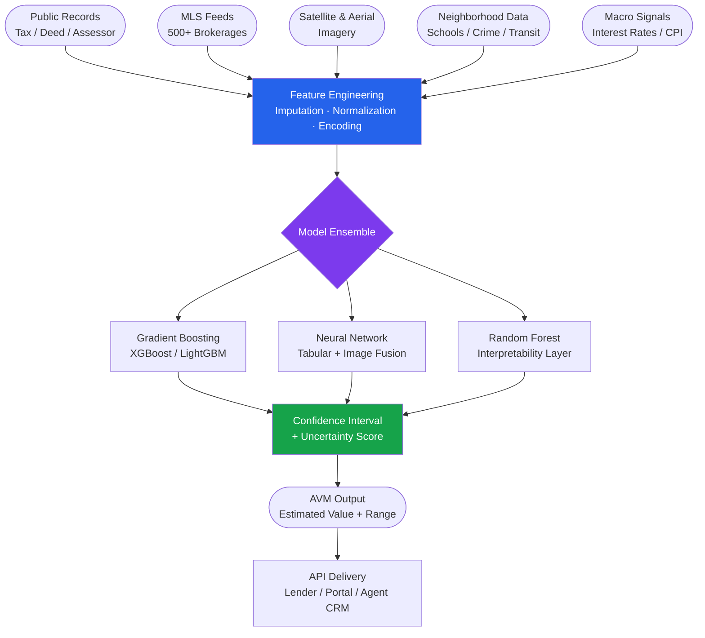

---

### 2. AI-Powered Property Search & Matching

Modern property platforms have moved beyond keyword filters to semantic search engines that understand intent. NLP models parse natural language queries ("a quiet 2BR near good schools with a yard") and translate them into ranked feature vectors. Computer vision models analyze listing photos to extract room quality, natural light, and staging quality scores. Recommendation engines trained on millions of user interactions surface listings buyers did not know to search for.

**Leading tools:** Compass AI, Homesnap, Trulia, Realtor.com AI, Beycome, REX Homes, Redfin AI search, Opendoor, Flyhomes, Ribbon.

**AI Buyer-Listing Matching Workflow**

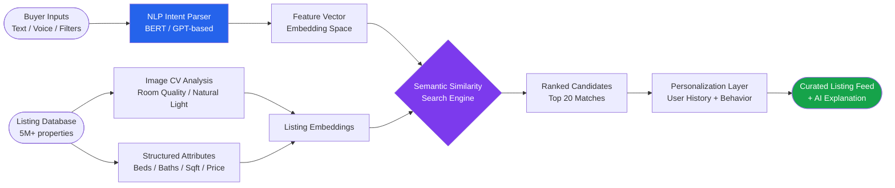

---

### 3. Predictive Investment Analytics

Commercial and residential real estate investors use AI to score deals before visiting a single property. Platforms aggregate sub-market rent growth trends, cap rate compression forecasts, demographic migration data, and permit activity to produce deal-level IRR projections and market-timing signals. JLL's acquisition of Skyline AI brought institutional-grade deep learning to commercial underwriting at scale.

**Leading tools:** Skyline AI (JLL), Reonomy, Enodo (multifamily ML underwriting), Cherre (data aggregation), HouseCanary Analytics, CoStar AI, CompStak, Quantarium, GeoPhy, Essen Analytics.

**Investor Deal Scoring Pipeline**

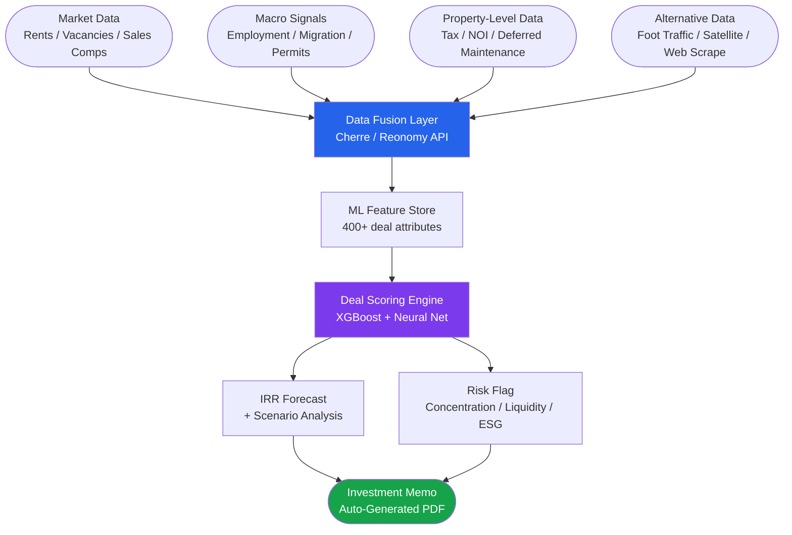

---

### 4. Smart Building Management (IoT + AI)

Intelligent building platforms fuse sensor streams — HVAC thermostats, occupancy sensors, BMS controllers, smart meters, elevator diagnostics — with ML models that predict load, detect anomalies, and schedule maintenance before failures occur. Johnson Controls OpenBlue, Siemens Desigo CC, and Honeywell Forge represent the three dominant enterprise platforms.

{ width="800" }

**Leading tools:** Johnson Controls OpenBlue, Siemens Desigo CC, Honeywell Forge, IBM TRIRIGA, Facilio, Willow Digital Twin, Enlighted (Siemens), Mapped, Cohesion, BuildingIQ.

**Smart Building AI Loop**

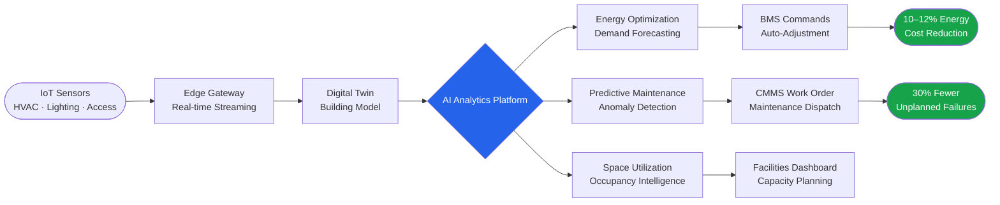

---

### 5. Lease & Contract AI

Commercial real estate portfolios routinely hold thousands of leases containing hundreds of clauses each. AI document intelligence platforms use NLP to extract critical data points — rent escalation schedules, HVAC obligations, holdover provisions, co-tenancy clauses, expiration dates — in minutes rather than weeks of paralegal review.

**Leading tools:** Kira Systems (Litera), Prophia, LeaseLock, LeaseQuery AI, Esusu, Leverton (DFKI), Imbrex, Occupier, VTS (View the Space), ProLease.

**AI Lease Abstraction Workflow**

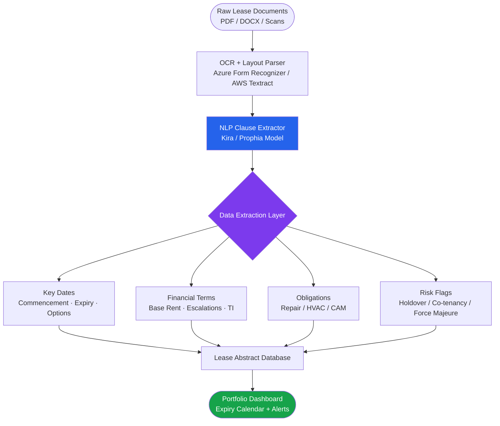

---

### 6. Virtual Tours & AI Staging

Matterport's 2024 releases represent a step-change in property visualization AI. The Property Intelligence suite generates automatic floor plan measurements, ceiling heights, and square footage from a single 3D scan. The AI De-Furnish tool digitally empties a room in one click, and Project Genesis uses generative AI to re-stage it in any interior design style.

**Leading tools:** Matterport AI, Virtual Staging AI, REimagineHome, Styldod, Zillow 3D Home, BoxBrownie, RoOomy, Render Atelier, Haiku AI, Archistar.

**Virtual Tour + AI Staging Pipeline**

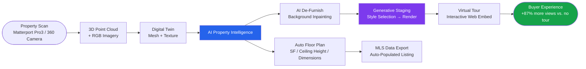

---

### 7. Property Management Automation

AI is transforming the landlord-tenant relationship. Platforms like AppFolio now deploy agentic AI that triages maintenance requests, dispatches vendors, updates residents automatically, and qualifies leasing leads with natural language chat available 24/7. Rent optimization models analyze vacancy rates, comparable rents, and seasonal demand to recommend pricing weekly.

**Leading tools:** AppFolio AI, Buildium, Yardi Voyager AI, ResMan, Knock CRM, Entrata, RealPage Revenue Management, Funnel Leasing, EliseAI, Lessen.

**AI Property Management Loop**

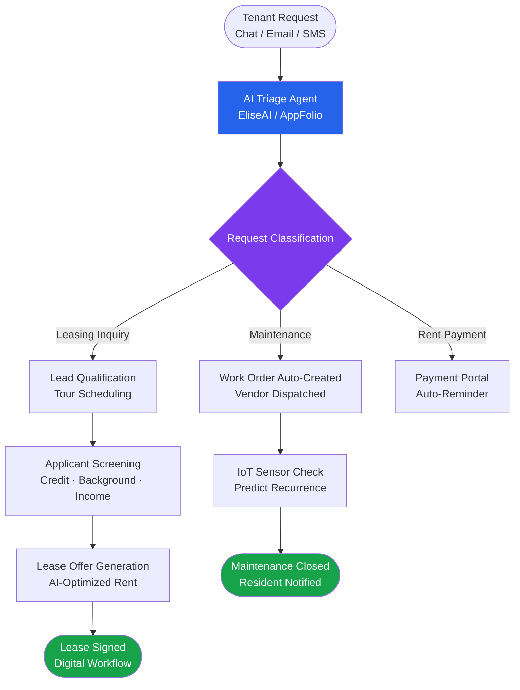

---

### 8. Construction & Development AI

AI is entering the earliest stages of real estate development — site selection, feasibility modeling, design optimization, and construction monitoring. Computer vision models analyze drone footage to track construction progress against schedules. Generative design tools like TestFit produce building massing scenarios in seconds.

**Leading tools:** Procore AI, PlanGrid (Autodesk Construction Cloud), TestFit, Delve (Sidewalk Labs / Alphabet), Reconstruct, Alice Technologies, Egnyte, Versatile (formerly Versatile Natures), Built Robotics, Doxel.

**AI-Driven Development Workflow**

```mermaid
flowchart LR
    A([Site Identification\nGIS + Zoning API]) --> B[Feasibility AI\nTestFit / Delve]
    B --> C[Massing Scenarios\n100s in seconds]
    C --> D[Pro Forma Optimization\nROI / Density / Setbacks]
    D --> E[Design Development\nAutodesk AI + BIM]
    E --> F[Construction Monitoring\nDrone + CV Progress Tracking]
    F --> G[Schedule Deviation Alert\nReconstruct / Procore AI]
    G --> H[Handover + Digital Twin\nMatterport Scan-to-BIM]
    H --> I([Asset Operations\nSmart Building Platform])

    style B fill:#2563eb,color:#fff
    style F fill:#7c3aed,color:#fff
    style I fill:#16a34a,color:#fff
```

---

## Top AI Tools & Platforms

| Tool | Provider | Category | Key Feature | Free Tier? | Website |
|---|---|---|---|---|---|
| Zestimate | Zillow | AVM / Valuation | Neural network home valuation, 1.74% on-market error | Yes (consumer) | zillow.com |
| Redfin Estimate | Redfin | AVM / Valuation | MLS-integrated AVM, updated daily for active listings | Yes (consumer) | redfin.com |
| HouseCanary | HouseCanary | AVM / Analytics | API-first AVM + market forecast, 90-day price trend | Paid API | housecanary.com |
| CoreLogic AVM | CoreLogic | AVM / Data | 99.9% property coverage, lender-grade confidence scores | Enterprise | corelogic.com |
| ATTOM Data | ATTOM | Property Data | 155M+ US properties, deed + tax + MLS aggregation | Paid API | attomdata.com |
| Compass AI | Compass | Agent Tools | Voice-activated AI, auto CRM, listing presentations | Agents only | compass.com |
| Reonomy | Reonomy (CoStar) | Commercial Intel | 360° commercial property ownership + debt graph | Paid | reonomy.com |
| Skyline AI (JLL) | JLL | Investment Analytics | Deep learning deal scoring for multifamily/CRE | Enterprise | jll.com |
| Enodo | Enodo | Multifamily AI | ML rent, expense, and market trend underwriting | Demo | enodoscore.com |
| Cherre | Cherre | Data Aggregation | Enterprise real estate data fabric, API + analytics | Enterprise | cherre.com |
| CoStar AI | CoStar Group | CRE Research | AI-powered comp search, market analytics, LoopNet | Paid | costar.com |
| Matterport AI | Matterport | Virtual Tours | 3D digital twin, AI floor plan, generative staging | Free (1 space) | matterport.com |
| Virtual Staging AI | Virtual Staging AI | AI Staging | Photo-to-staged listing in seconds, 25+ styles | Pay per render | virtualstagingai.app |
| REimagineHome | REimagineHome | AI Staging | Room redesign, virtual staging, declutter | Freemium | reimaginehome.ai |
| Opendoor | Opendoor | iBuying | AI instant offer engine, 500+ valuation signals | N/A (offer based) | opendoor.com |
| Offerpad | Offerpad | iBuying | AI-powered cash offer, flexible closing dates | N/A | offerpad.com |
| Roofstock | Roofstock | Investment | AI-scored single-family rental marketplace | Free browse | roofstock.com |
| Johnson Controls OpenBlue | Johnson Controls | Smart Building | AI energy optimization, 10–12% cost reduction | Enterprise | johnsoncontrols.com |
| Honeywell Forge | Honeywell | Smart Building | IoT + ML HVAC/lighting optimization | Enterprise | honeywell.com |
| Siemens Desigo CC | Siemens | Smart Building | Integrated building management, AI anomaly detection | Enterprise | siemens.com |
| IBM TRIRIGA | IBM | Workplace Mgmt | AI-powered facilities, space, and lease management | Enterprise | ibm.com |
| AppFolio AI | AppFolio | Property Mgmt | Agentic AI maintenance triage, AI leasing assistant | Paid (per unit) | appfolio.com |
| Yardi Voyager AI | Yardi Systems | Property Mgmt | Enterprise property management, 450+ integrations | Enterprise | yardi.com |
| Buildium | RealPage | Property Mgmt | AI tenant screening, automated accounting | From $58/mo | buildium.com |
| Kira Systems | Litera | Lease AI | 90%+ clause extraction accuracy for CRE portfolios | Enterprise | litera.com |
| Prophia | Prophia | Lease AI | AI lease abstraction, portfolio risk intelligence | Paid | prophia.com |
| Procore AI | Procore | Construction | AI project insights, document analysis, safety | Paid | procore.com |
| TestFit | TestFit | Development | Generative building design, massing optimization | Paid | testfit.io |
| Reconstruct | Reconstruct | Construction | AI progress monitoring via 360° photos, schedule alignment | Paid | reconstruct.ai |
| CINC AI | CINC | Agent CRM | AI lead conversion, predictive follow-up scoring | Paid | cincpro.com |
| BoomTown | BoomTown | Agent CRM | AI lead routing, automated nurture sequences | Paid | boomtownroi.com |
| kvCORE | Inside Real Estate | Agent Platform | AI-powered IDX websites, smart CRM, market reports | Paid | insiderealestate.com |
| EliseAI | EliseAI | Leasing AI | 24/7 AI leasing assistant, SMS/email/chat, tour scheduling | Paid | eliseai.com |
| Landis | Landis | Rent-to-Own AI | AI credit coaching + rent-to-own path for buyers | Agent referral | landis.com |
| Belong Home | Belong | Property Mgmt | AI-backed rent guarantee, tenant matching | Paid | belonghome.com |

---

## Open-Source & Research Ecosystem

### GitHub Repositories

| Repository | Stars | Description | Language |
|---|---|---|---|
| [PENGZhaoqing/HousePricing](https://github.com/PENGZhaoqing/HousePricing) | ~430 | Interactive housing price visualization and prediction dashboard | JavaScript |
| [mryuan0428/House-price-prediction](https://github.com/mryuan0428/House-price-prediction) | ~248 | Web scraping + scikit-learn regression + Keras neural net pipeline | Python |
| [zebangeth/rent-or-buy.homes](https://github.com/zebangeth/rent-or-buy.homes) | ~226 | Full-stack rent vs. buy economics calculator | TypeScript |
| [Shreyas3108/house-price-prediction](https://github.com/Shreyas3108/house-price-prediction) | ~140 | Linear regression + GBR on Ames Iowa dataset | Python |
| [agrawal-priyank/machine-learning-regression](https://github.com/agrawal-priyank/machine-learning-regression) | ~95 | Ridge, Lasso, KNN regression with housing datasets | Jupyter |
| [dongguabubai/Kaggle-House-Prices](https://github.com/dongguabubai/Kaggle-House-Prices-Advanced-Regression-Techniques) | ~70 | Ames Iowa 79-feature Kaggle competition solution | Python |
| [MYoussef885/House_Price_Prediction](https://github.com/MYoussef885/House_Price_Prediction) | ~60 | End-to-end XGBoost + SHAP solution | Python |

### HuggingFace Models & Datasets

| Asset | Type | Description | Downloads |
|---|---|---|---|
| [zillow/real_estate_v1](https://huggingface.co/datasets/zillow/real_estate_v1) | Dataset | Zillow synthetic dialog dataset generated with GPT-4o for RE assistants | ~5,000+ |
| [andupets/real-estate-image-classification](https://huggingface.co/andupets/real-estate-image-classification) | Model | Fine-tuned CLIP for zero-shot room type classification | ~3,000+ |
| [VictorOntiveros/real-estate-assistant](https://huggingface.co/VictorOntiveros/real-estate-assistant) | Model | Mistral-7B fine-tuned RAG assistant for property Q&A | ~2,000+ |
| [Binaryy/multimodal-real-estate-search](https://huggingface.co/datasets/Binaryy/multimodal-real-estate-search) | Dataset | Image + text pairs for multimodal property search | ~1,500+ |
| [divarofficial/real_estate_ads](https://huggingface.co/datasets/divarofficial/real_estate_ads) | Dataset | Persian real estate classified ads for NLP training | ~4,000+ |
| [jyotsna2411/real-estate-chatbot](https://huggingface.co/datasets/jyotsna2411/real-estate-chatbot) | Dataset | QA pairs for real estate conversational AI | ~800+ |

### Kaggle Datasets & Competitions

| Dataset / Competition | Teams / Downloads | Description |
|---|---|---|
| [House Prices: Advanced Regression Techniques](https://www.kaggle.com/competitions/house-prices-advanced-regression-techniques) | 4,700+ teams | Ames Iowa dataset, 79 features, gold-standard ML benchmark |
| [Zillow Prize: Zestimate](https://www.kaggle.com/c/zillow-prize-1) | 3,800+ teams | $1M competition to improve Zillow's Zestimate algorithm |
| [King County House Sales](https://www.kaggle.com/datasets/harlfoxem/housesalesprediction) | 500K+ downloads | Seattle metro 21,000+ home sales with 21 features |
| [NYC Property Sales](https://www.kaggle.com/datasets/new-york-city/nyc-property-sales) | 200K+ downloads | New York City rolling 12-month property sale records |
| [Melbourne Housing Market](https://www.kaggle.com/datasets/dansbecker/melbourne-housing-snapshot) | 300K+ downloads | Melbourne suburb-level housing with auction results |
| [Airbnb Open Data](https://www.kaggle.com/datasets/arianazmoudeh/airbnbopendata) | 150K+ downloads | NYC Airbnb listings for short-term rental AI projects |

### Code: XGBoost AVM with SHAP Feature Importance

```python
import pandas as pd
import xgboost as xgb
import shap
from sklearn.model_selection import train_test_split
from sklearn.metrics import mean_absolute_percentage_error

# Load Ames Iowa or similar dataset
df = pd.read_csv("house_prices.csv")

# Core real estate features
features = [
    "GrLivArea",        # Above-grade living area (sqft)
    "OverallQual",      # Overall material & finish quality (1-10)
    "GarageArea",       # Garage size in sqft
    "TotalBsmtSF",      # Total basement sqft
    "YearBuilt",        # Original construction year
    "Neighborhood",     # Location (label-encoded)
    "FullBath",         # Full bathrooms above grade
    "BedroomAbvGr",     # Bedrooms above grade
    "LotArea",          # Lot size in sqft
    "SchoolRating",     # Elementary school rating (1-10, if available)
]

X = df[features]
y = df["SalePrice"]

# Encode categorical neighborhood feature
X = pd.get_dummies(X, columns=["Neighborhood"])

X_train, X_test, y_train, y_test = train_test_split(
    X, y, test_size=0.2, random_state=42
)

# Train XGBoost AVM
model = xgb.XGBRegressor(
    n_estimators=500,
    max_depth=6,
    learning_rate=0.05,
    subsample=0.8,
    colsample_bytree=0.8,
    random_state=42,
    n_jobs=-1,
)
model.fit(X_train, y_train, eval_set=[(X_test, y_test)], verbose=False)

# Evaluate
y_pred = model.predict(X_test)
mape = mean_absolute_percentage_error(y_test, y_pred)
print(f"MAPE: {mape:.2%}")   # Typically 5-8% on Ames dataset

# SHAP Feature Importance
explainer = shap.Explainer(model)
shap_values = explainer(X_test)
shap.plots.bar(shap_values, max_display=10)   # OverallQual & GrLivArea dominate
```

---

## Best End-to-End AI Workflows

### Home Buyer Journey

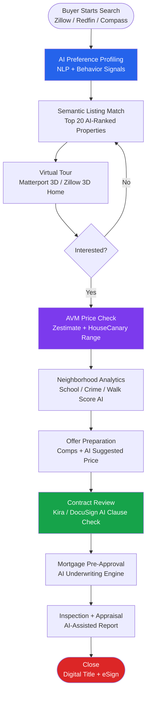

### Property Investor Workflow

```mermaid
flowchart LR
    A([Market Scan\nReonomy / CoStar AI]) --> B[Deal Sourcing\nOff-Market + On-Market Alerts]
    B --> C[AI Deal Scoring\nSkyline AI / Enodo IRR Model]
    C --> D{Score Threshold\nMet?}
    D -->|No| B
    D -->|Yes| E[Due Diligence\nCherre Data Pull + Rent Comps]
    E --> F[Lease Abstraction\nKira / Prophia Portfolio Review]
    F --> G[Financing Stack\nAI Lender Matching]
    G --> H[Acquisition Close\nAI Contract + Title Review]
    H --> I[Smart Building Onboarding\nOpenBlue / Honeywell Forge]
    I --> J[Operations AI\nAppFolio / Yardi Voyager]
    J --> K[Rent Optimization\nRealPage Revenue Mgmt]
    K --> L{Exit Timing\nAI Market Signal}
    L -->|Hold| J
    L -->|Sell| M([Disposition\nAVM Price + Broker AI])

    style C fill:#2563eb,color:#fff
    style I fill:#7c3aed,color:#fff
    style K fill:#16a34a,color:#fff
```

---

## Platform Deep Dives

### Zillow Zestimate + Neural AI

{ width="600" }

Zillow's Neural Zestimate represents the most widely consumed AVM in the world, with estimates displayed on 100+ million homes. The architecture ingests data from county assessor records, direct MLS feeds from hundreds of brokerages, satellite imagery, and user-submitted updates. The model is a deep neural network that jointly processes tabular property attributes and image features, with a separate confidence scoring head that widens the estimate range for properties with sparse recent sales.

**Key technical details:**
- Architecture: Multi-tower neural network (structured data + image embeddings)
- Training data: Tens of millions of historical US home sales
- Update frequency: Daily for on-market properties; weekly for off-market
- Accuracy (2024): Median error 1.74% (on-market), 7.20% (off-market)
- Historical improvement: 15-year reduction from 13.6% to 7.2% off-market error
- Data sources: 500+ MLS feeds, county records, user updates, satellite imagery

The 2021 launch of the Neural Zestimate, built on PyTorch, delivered a 15% relative error reduction versus the prior ensemble model and enabled real-time updates as listing photos changed.

---

### Compass AI

Compass AI is the most agent-facing AI platform in residential real estate, serving 30,000+ agents across the US. The 2024 platform release introduced a voice-activated AI assistant that allows agents to draft client emails, update CRM contacts, create listing presentations, manage transaction timelines, and send Compass One invitations entirely by voice — without touching a screen.

**Key features:**
- Voice-to-CRM: Dictate updates, the AI structures and saves them
- Listing presentation AI: Auto-generates branded market analysis and visuals
- Client matching: Semantic property collections updated in real-time
- Transaction timeline AI: Milestone tracking with automated reminders
- Agent productivity: 15–20 hours/week saved per agent (Inman, 2024)
- Market insight generator: Natural language queries on local MLS data

Compass also offers Compass One, a client-facing portal where buyers and sellers receive AI-curated listing updates, search analytics, and market reports — increasing client engagement and referral rates.

---

### Matterport AI + Digital Twin

Matterport's 2024 platform releases mark a generational leap from 3D tour creation to full AI property intelligence. The Pro3 camera or any 360° device creates a spatial data file (Matterport's proprietary `.matterport` format) from which an array of AI services derive structured property data.

**2024 AI capabilities:**
- **Property Intelligence**: Auto-calculates room dimensions, ceiling heights, total SF, and exports to MLS
- **AI De-Furnish**: Single-click removal of all furniture using background inpainting models
- **Project Genesis (Generative AI)**: Re-stages empty rooms in selected interior design styles
- **Schematic Floor Plans**: RICS-standard color floor plans with branding, 5 languages, furniture toggle
- **Merge Tool**: Multi-team scanning of large buildings, automated stitching
- **Digital Twin APIs**: BIM/IFC export for integration with Autodesk, Revit, and construction platforms

Matterport reports that listings with 3D tours receive 87% more views, sell faster, and attract buyers from further distances, reducing wasted physical showings by up to 40%.

---

## ROI & Business Impact

| Use Case | Key Metric | Improvement | Source |
|---|---|---|---|
| AVM (Zillow Neural Zestimate) | Median error rate (off-market) | 47% reduction over 15 years (13.6% → 7.2%) | Zillow Research, 2024 |
| AI property matching | Lead qualification accuracy | +30–40% improvement | BusinessPlusAI, 2024 |
| AI in agent workflow | Weekly hours saved | 15–20 hours/week per agent | Compass / Inman, 2024 |
| AI agent transaction volume | Annual deals closed | +35–45% more vs. non-AI peers | BusinessPlusAI, 2024 |
| Time-to-close (AI-assisted) | Transaction cycle length | 25–30% reduction | BusinessPlusAI, 2024 |
| 3D virtual tours (Matterport) | Listing view volume | +87% vs. photo-only listings | Matterport, 2024 |
| Smart building energy (OpenBlue) | Energy costs | 10–12% reduction per site | Johnson Controls, 2024 |
| AI lease abstraction | Contract review time | 80–90% time reduction vs. manual | Kira Systems, 2024 |
| Predictive maintenance (IoT AI) | Unplanned equipment failures | 30% reduction | JLL Research, 2024 |
| AI tenant screening | Screening turnaround | 75% faster vs. manual review | AppFolio, NAR 2025 |
| Commercial AI investment analytics | Deal underwriting time | 70–90% time savings | JLL / Skyline AI |
| iBuying AI (Opendoor) | Days to offer | Under 24 hours vs. 30+ days traditional | Opendoor, 2024 |
| AI rent optimization (RealPage) | Revenue per unit | 3–7% uplift in stabilized portfolios | RealPage Research |
| AI construction monitoring | Schedule overrun detection | 40% earlier identification | Reconstruct, 2024 |

---

## Ethics, Privacy & Compliance

### Fair Housing & Algorithmic Bias

The Fair Housing Act of 1968 prohibits discrimination in housing based on race, color, national origin, religion, sex, familial status, and disability. AI systems operating in real estate face serious scrutiny for perpetuating or amplifying historical discriminatory patterns through "algorithmic redlining."

**Key risk areas:**
- **AVM training data bias**: Models trained on historical sales data can embed the effects of past redlining, undervaluing properties in Black and Hispanic neighborhoods compared to equivalent white neighborhoods
- **Tenant screening algorithms**: Systems using credit scores, eviction records, and income ratios can have disparate impacts on protected classes when data reflects prior discrimination
- **Mortgage underwriting AI**: The Massachusetts AG settled a $2.5M fair lending case in 2025 against an AI underwriting model that produced unlawful disparate impact based on race and immigration status
- **National Fair Housing Alliance (NFHA) data**: 32,321 housing discrimination complaints were filed nationwide in 2024

### Compliance Workflow

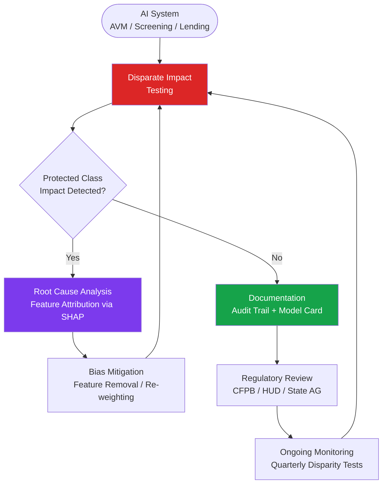

### Key Regulatory Frameworks

| Regulation / Framework | Applies To | Key Requirement |
|---|---|---|
| Fair Housing Act (FHA) | All residential real estate AI | No disparate impact on protected classes |
| Equal Credit Opportunity Act (ECOA) | Mortgage AI / underwriting | Adverse action explanations required |
| CFPB AI Guidance (2023) | Lending algorithms | Explainability + fairness testing |
| PAVE Action Plan (HUD) | Appraisal / AVM | AVMs must comply with anti-discrimination laws |
| GDPR (EU) | EU property platforms | Right to explanation for automated decisions |
| CCPA (California) | CA real estate AI | Consumer data access, deletion, opt-out rights |
| FAA Regulations Part 107 | Drone property imaging | Operator certification, airspace authorization |
| RICS Valuation Standards | AVM accuracy disclosure | Transparency on AVM confidence intervals |

### AVM Transparency Best Practices

- Always disclose confidence intervals alongside point estimates
- Provide data freshness dates (when were comps last updated)
- Offer appeal mechanisms for consumers who believe their AVM is inaccurate
- Log all model versions deployed, enabling retrospective audits
- Conduct quarterly disparate impact testing across zip codes and demographics

---

## Getting Started

### For Real Estate Agents

**Free tools to start immediately:**

1. **Zillow API** (free tier): Access Zestimates, property data, and market trends. Endpoint: `https://api.bridgedataoutput.com/api/v2/zestimates`
2. **Redfin Data Center**: Free market trend CSVs for 400+ metros, updated weekly
3. **Walk Score API**: Free tier for property walkability, transit, and bike scores
4. **ChatGPT / Claude**: Immediate productivity gains — listing descriptions, offer letters, market summaries
5. **Canva AI**: AI-generated listing marketing materials and social posts

**CRM AI Integrations to evaluate:**

```python
# Example: Fetch property data from ATTOM API
import requests

headers = {"apikey": "YOUR_ATTOM_API_KEY", "Accept": "application/json"}
params = {"address": "123 Main St", "zipcode": "90210"}

response = requests.get(
    "https://api.gateway.attomdata.com/propertyapi/v1.0.0/property/detail",
    headers=headers,
    params=params,
)
data = response.json()
print(data["property"][0]["building"]["summary"]["bldgType"])
```

### For Property Investors

**Essential data sources:**
- **Reonomy / CoStar**: Commercial property ownership, debt, and transaction history
- **HouseCanary API**: AVM + 90-day forecast for single-family rental underwriting
- **Cherre**: Enterprise real estate data integration platform

**Building a deal-scoring pipeline:**

```python
import pandas as pd
from sklearn.ensemble import GradientBoostingRegressor
from sklearn.preprocessing import StandardScaler

# Deal scoring features
deal_features = [
    "cap_rate", "price_per_unit", "occupancy_rate",
    "rent_growth_1yr", "submarket_vacancy", "walk_score",
    "school_rating", "days_on_market", "noi_per_sf",
    "price_to_rent_ratio", "permit_activity_score"
]

# Load historical deal data (use Reonomy/CoStar exports)
df = pd.read_csv("historical_deals.csv")
X = df[deal_features]
y = df["irr_realized"]  # Actual IRR achieved post-exit

scaler = StandardScaler()
X_scaled = scaler.fit_transform(X)

model = GradientBoostingRegressor(n_estimators=300, max_depth=4, random_state=42)
model.fit(X_scaled, y)

# Score a new deal
new_deal = pd.DataFrame([{
    "cap_rate": 5.2, "price_per_unit": 185000, "occupancy_rate": 0.94,
    "rent_growth_1yr": 0.08, "submarket_vacancy": 0.05, "walk_score": 72,
    "school_rating": 7.5, "days_on_market": 14, "noi_per_sf": 18.5,
    "price_to_rent_ratio": 18.2, "permit_activity_score": 0.65
}])
predicted_irr = model.predict(scaler.transform(new_deal))
print(f"Predicted IRR: {predicted_irr[0]:.1%}")
```

### Property Manager Platform Comparison

| Feature | AppFolio AI | Yardi Voyager | Buildium |
|---|---|---|---|
| Best for | 50–5,000 units | 1,000+ units (enterprise) | 1–5,000 units |
| AI leasing assistant | EliseAI integrated | Yardi Leasing Hub | Basic automation |
| Tenant screening | 9.1/10 (G2) | 7.8/10 (G2) | 8.2/10 (G2) |
| Maintenance AI | Agentic triage + dispatch | Work order automation | Standard workflow |
| Accounting depth | Strong | Best-in-class (450+ integrations) | Good for SMB |
| Mobile app | Excellent | Improving | Good |
| Pricing | From $1.49/unit/mo | Custom enterprise | From $58/mo |
| API / Integrations | AppFolio Stack | Yardi Marketplace | Buildium Marketplace |
| AI rent optimization | Basic | RealPage Revenue Mgmt add-on | Via third-party |
| Learning curve | Low-medium | High | Low |

---

## References

1. Zillow Research. (2024). *Zestimate Accuracy and Methodology*. Zillow, Inc. Retrieved from https://www.zillow.com/zestimate/

2. Zillow Tech Hub. (2021). *Building the Neural Zestimate*. Retrieved from https://www.zillow.com/tech/building-the-neural-zestimate/

3. Precedence Research. (2024). *PropTech Market Size, Share, and Trends 2025 to 2034*. Retrieved from https://www.precedenceresearch.com/proptech-market

4. Market.us Research. (2024). *AI in Real Estate Market Size, Trends, CAGR of 30.5%*. Retrieved from https://market.us/report/ai-in-real-estate-market/

5. McKinsey & Company. (2024). *Generative AI Can Change Real Estate, But the Industry Must Change to Reap the Benefits*. McKinsey Global Institute. Retrieved from https://www.mckinsey.com/industries/real-estate/our-insights/generative-ai-can-change-real-estate-but-the-industry-must-change-to-reap-the-benefits

6. National Association of Realtors. (2025). *REALTORS® Embrace AI, Digital Tools to Enhance Client Service: 2025 Technology Survey*. NAR Research Group. Retrieved from https://www.nar.realtor/newsroom/realtors-embrace-ai-digital-tools-to-enhance-client-service-nar-survey-finds

7. JLL Research. (2024). *Artificial Intelligence — Implications for Real Estate*. Jones Lang LaSalle. Retrieved from https://www.jll.com/en-us/insights/artificial-intelligence-and-its-implications-for-real-estate

8. Johnson Controls. (2024). *New Study Finds Johnson Controls OpenBlue Smart Building Platform Drives Efficiency and Cost Savings for Customers*. Press release. Retrieved from https://www.johnsoncontrols.com/media-center/news/press-releases/2025/04/16/

9. Matterport. (2024). *Matterport Fall 2024 Release: Insights Meets Imagination*. Matterport, Inc. Retrieved from https://matterport.com/blog/matterports-fall-2024-release-insights-meets-imagination

10. Wheaton, W. C., & Xu, C. (2024). *Using AI to Improve Price Transparency in Real Estate Valuation*. SSRN Working Paper. https://doi.org/10.2139/ssrn.5056315

11. Rodriguez-Serrano, J. A. (2024). *Prototype-Based Learning for Real Estate Valuation: A Machine Learning Model That Explains Prices*. Annals of Operations Research. SSRN: https://papers.ssrn.com/sol3/papers.cfm?abstract_id=4695079

12. Antipov, E. A., & Pokryshevskaya, E. B. (2023). *Automated Real Estate Valuation with Machine Learning Models Using Property Descriptions*. Expert Systems with Applications. https://doi.org/10.1016/j.eswa.2022.119147

13. Grover, A., & Singh, A. (2023). *The Use of Machine Learning in Real Estate Research*. Land, 12(4), 740. https://doi.org/10.3390/land12040740

14. MDPI Information. (2024). *Artificial Intelligence and Real Estate Valuation: The Design and Implementation of a Multimodal Model*. Information, 16(12), 1049. https://doi.org/10.3390/info16121049

15. California Law Review. (2023). *A Home for Digital Equity: Algorithmic Redlining and Property Technology*. California Law Review. Retrieved from https://www.californialawreview.org/print/a-home-digital-equity

16. National Fair Housing Alliance. (2025). *2025 Fair Housing Trends Report*. NFHA. Retrieved from https://nationalfairhousing.org/new-fair-housing-trends-report-finds-pervasive-discrimination

17. HL Group. (2025). *2024 PropTech Year in Review: Annual Market Update*. Houlihan Lokey PropTech Research. Retrieved from https://cdn.hl.com/pdf/2025/proptech-2024-annual-market-update-march-2025.pdf
